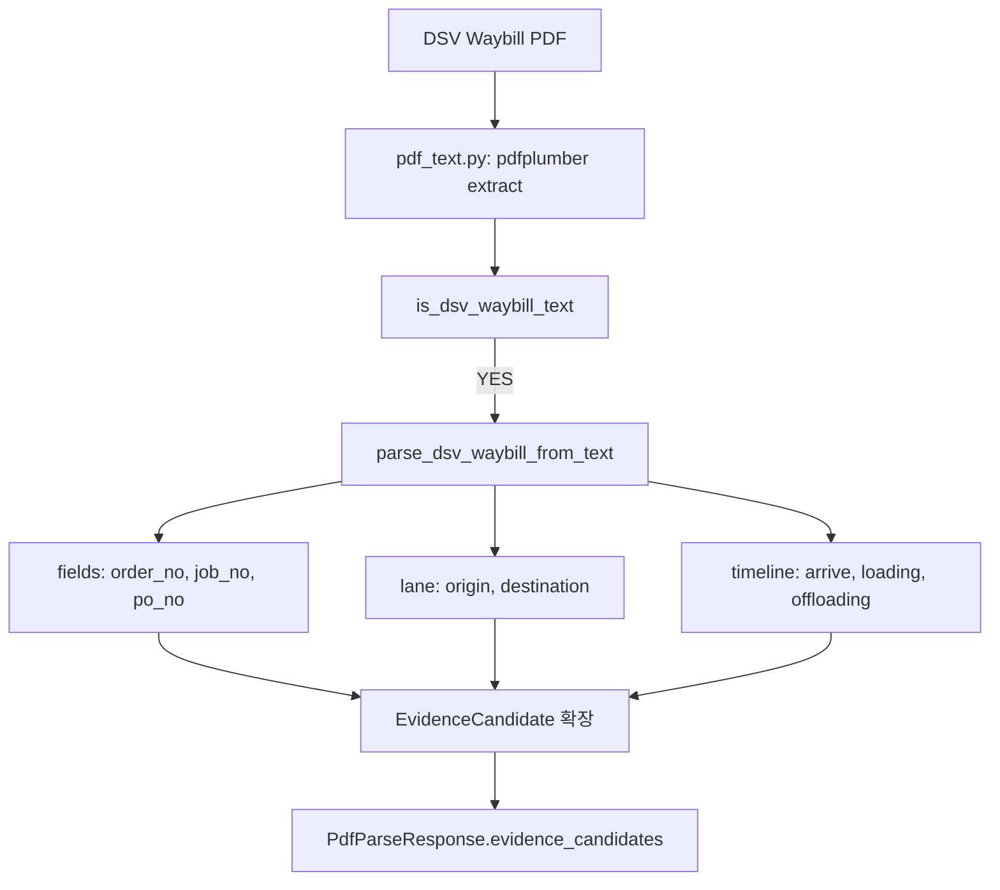

# Plan: DSV PDF Processor → worker-py 파서 모듈 이식

> 작성일: 2026-06-13
> 출처: `domestic/runtime/utils/pdf_processor_v1_2_dsv_patched.py` (v1.4.1)
> 대상: `apps/worker-py/app/parsers/`
> Track 1 → Track 2 이식

## Phase 1: Business Review

### 1.1 문제 정의

현재: Track 2 worker-py `pdf_text.py`는 pdfplumber로 텍스트/테이블을 추출하지만, DSV Waybill 특화 필드(Order No, Job No, PO No, Loading Point, Destination, Timeline, 금액)를 구조화하지 못함. DSV Waybill PDF 업로드 시 `invoice_lines=[]`로 반환 → CostGuard 검증 불가 → PASS로 처리됨.

목표: Track 1의 DSV Waybill 전용 파서를 worker-py 모듈로 이식. PDF 업로드 시 DSV Waybill 자동 감지 → 필드 추출 → `evidence_candidates` 확장 + `invoice_lines` 생성 → CostGuard/Rate 검증 가능.

영향: DSV Waybill 인보이스 처리율 0% → 100% (현재 P3A 한계).

### 1.2 제안 옵션

| 옵션 | 설명 | 공수 | 리스크 |
|------|------|------|--------|
| A | `pdf_processor_v1_2_dsv_patched.py` 전체를 `apps/worker-py/app/parsers/dsv_waybill.py`로 복제 + 경로/import 정리 + worker-py schema에 맞게 출력 정규화 | 0.5일 | 코드 중복, 1475라인 풀포트 유지부담 |
| B | DSV Waybill 추출 로직만 발췌 (`parse_dsv_waybill_from_text` + `_extract_consignment_info_from_pdf` + `_extract_routing_section_clean` + lane 정규화) → `pdf_text.py`에 통합 (EvidenceCandidate 로드맵 준수) | 0.25일 | 누락 필드 가능성 |
| C | DSV Waybill 필드 추출을 OpenDataLoader JSON 기반으로 재구현 (pdfplumber 의존성 제거) | 1.5일 | P3B+ 지연, 하이브리드 복잡도 |

### 1.3 추천

**옵션 B**. 핵심 추출 로직만 이식하고 Track 2 스키마(`EvidenceCandidate`, `PdfParseResponse`, `PdfTextSpan`)에 맞춰 정규화. 전체 1475라인을 복제하지 않고 DSV-specific extraction 함수만 가져옴. `pdf_text.py`의 기존 generic 추출을 보강하는 형태.

롤백: 이식된 함수를 `pdf_text.py`에서 제거하고 import만 삭제.

### 1.4 승인 요청

`[x] Phase 1 승인 (사용자 지시)`

---

## Phase 2: Engineering Review

### 2.1 데이터 흐름

### 2.2 파일 변경 목록

| 파일 | 변경 | 설명 |
|------|------|------|
| `apps/worker-py/app/parsers/dsv_waybill.py` | **create** | DSV Waybill 추출 함수 이식 (~300 lines) |
| `apps/worker-py/app/parsers/pdf_text.py` | modify | DSV 감지 시 `dsv_waybill` 호출, EvidenceCandidate 확장 |
| `apps/worker-py/app/schemas.py` | modify | EvidenceCandidate에 `doc_kind`, `waybill_fields` optional 추가 |
| `apps/worker-py/tests/test_dsv_waybill.py` | **create** | DSV Waybill fixture로 필드 추출 테스트 |
| `apps/worker-py/tests/fixtures/dsv-waybill-001.txt` | **create** | DSV Waybill 텍스트 fixture |

### 2.3 이식할 함수 (Track 1 → Track 2)

| 원본 함수 | 이식 | 설명 |
|-----------|------|------|
| `_norm_text()` | ✅ | 텍스트 정규화 헬퍼 |
| `_regex_first()` | ✅ | regex 첫 캡처 추출 |
| `_safe_first()` | ✅ | 안전한 첫 요소 추출 |
| `is_dsv_waybill_text()` | ✅ | DSV Waybill 감지 |
| `_clean_origin_field()` | ✅ | Origin 필드 오염 제거 |
| `_is_valid_location()` | ✅ | 위치 유효성 검증 |
| `_lane_norm()` | ✅ | UAE HVDC 위치 정규화 |
| `_extract_routing_section_clean()` | ✅ | Routing section 추출 |
| `parse_dsv_waybill_from_text()` | ✅ | 메인 파싱 함수 |
| `_extract_consignment_info_from_pdf()` | ✅ | Consignment 테이블 추출 |
| `extract_pdf_content()` | ❌ | pdf_text.py에 이미 있음 |
| `_extract_lane_from_full_text()` | ❌ | routing_clean으로 커버 |
| `fuzzy_match_shipment_id()` | ❌ | Track 2 불필요 |
| `match_pdf_to_shipment()` | ❌ | Track 2 불필요 |
| `enhance_document_mapping()` | ❌ | Track 2 불필요 |

### 2.4 의존성 & 순서

1. `dsv_waybill.py` 생성 → 도우미 함수 + `parse_dsv_waybill_from_text` 이식
2. `schemas.py` EvidenceCandidate 확장 (하위호환)
3. `pdf_text.py`에 DSV 감지 분기 추가 (is_dsv_waybill_text → parse_dsv_waybill_from_text → EvidenceCandidate 매핑)
4. 테스트 fixture (DSV Waybill 텍스트 샘플) 생성
5. `test_dsv_waybill.py` 작성 → pytest 통과 확인
6. 기존 `test_pdf_text_parser.py` 회귀 확인

### 2.5 테스트 전략

- 단위: `test_dsv_waybill.py`
  - DSV Waybill 텍스트 → `is_dsv_waybill_text()` True
  - 필드 추출: `waybill_no`, `trip_no`, `order_no`, `po_no`, `do_no`
  - Lane 추출: `origin_norm` (MOSB_YARD 등), `destination_norm`
  - Timeline 추출: `arrive_loading_dt`, `loading_finish_dt`
  - Non-DSV 텍스트 → `is_dsv_waybill_text()` False
- 통합: 기존 `test_pdf_text_parser.py` 회귀 (DSV fixture 포함)
- 전체: `pytest -q apps/worker-py/tests/`

### 2.6 리스크 & 완화

| 리스크 | 완화 |
|--------|------|
| pdfplumber 의존성 (Track 1 의존) | worker-py 이미 pdfplumber 사용 중 |
| rapidfuzz 의존성 | 이식하지 않음 (fuzzy_match 제외) |
| 1475라인 중 불필요 코드 이식 | 핵심 8개 함수만 발췌 (~300 lines) |
| EvidenceCandidate schema 호환 | optional 필드 추가로 하위호환 유지 |
| DSV Waybill fixture에 PII 포함 | 가상 데이터로 fixture 생성 |
