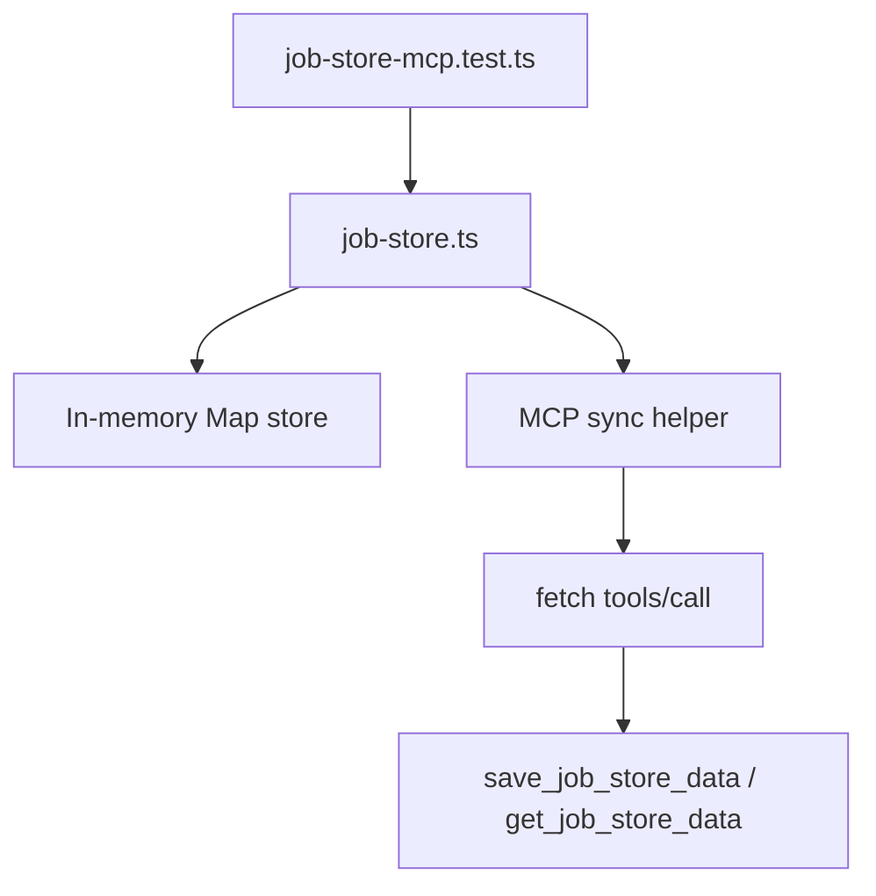

# Job Store MCP Test Fix Plan

## Phase 1: Business Review

### 1.1 문제 정의

현재 상태: `apps/web`의 `npm test`에서 `tests/job-store-mcp.test.ts` 2개가 실패한다.

목표 상태: `createJobStore()`가 MCP sync 테스트 계약을 만족해 Web App 테스트 실패 2개를 제거한다.

영향 범위:

- 현재 실패: Web App test 2개 실패.
- 기대 개선: Web App test 결과를 최소 `job-store-mcp.test.ts` 2/2 통과로 복구.
- 직접 변경 후보: `apps/web/src/lib/job-store.ts`.
- 직접 검증 명령: `npm test -- tests/job-store-mcp.test.ts`, 이후 `npm test`.

### 1.2 제안 옵션

| 옵션 | 설명 | 공수(일) | 리스크 | 비용(AED) |
|------|------|---------:|--------|----------:|
| A | `job-store.ts`에 MCP sync 호출을 최소 구현한다. `createJob`는 `save_job_store_data`, `getJob`는 `get_job_store_data`를 호출하고 실패 시 기존 in-memory store를 fallback으로 유지한다. | 0.25 | 낮음. 테스트 계약에 가장 직접 대응한다. | 0 |
| B | 테스트를 현재 in-memory 구현에 맞게 수정한다. MCP sync 기대를 제거하거나 optional로 낮춘다. | 0.1 | 높음. SWARM 산출물의 MCP sync 의도를 후퇴시킨다. | 0 |
| C | 별도 `mcp-job-store-client.ts` 모듈을 만들고 `job-store.ts`가 의존하게 분리한다. | 0.5 | 중간. 구조는 깔끔하지만 이번 2개 실패에는 과하다. | 0 |

### 1.3 추천 & 근거

추천: 옵션 A.

이유:

- 실패한 두 테스트의 기대값이 명확하다.
- 공유 모듈 변경은 `job-store.ts` 한 파일로 제한할 수 있다.
- MCP가 실패해도 기존 in-memory fallback을 유지하면 기존 88개 통과 테스트를 깨뜨릴 가능성이 낮다.

롤백 전략: `job-store.ts`의 MCP sync helper 추가분만 되돌리면 기존 in-memory 동작으로 복귀한다.

### 1.4 승인 요청

- [ ] Phase 1 승인

승인됨: 2026-06-13.

## Phase 2: Engineering Review

### 2.1 Mermaid 다이어그램

### 2.2 파일 변경 목록

| 파일 | 변경 유형 | 설명 |
|------|----------|------|
| `apps/web/src/lib/job-store.ts` | modify | `createJob` 저장 후 `save_job_store_data` MCP sync 호출을 추가한다. `getJob` local miss 시 `get_job_store_data` MCP 조회 fallback을 추가한다. |
| `apps/web/tests/job-store-mcp.test.ts` | none | 기존 실패 테스트를 그대로 검증 기준으로 사용한다. |

### 2.3 의존성 & 순서

1. `job-store.ts`에 MCP helper를 추가한다.
2. MCP sync 실행 조건은 `JOB_STORE_MCP_URL`, `CF_MCP_BASE_URL`, 또는 mock된 `fetch`가 있을 때로 제한한다.
3. 일반 in-memory 테스트에서는 env가 없고 native fetch이면 MCP sync를 건너뛴다.
4. MCP sync 실패는 job 생성/조회 기본 동작을 깨뜨리지 않는다.

### 2.4 테스트 전략

- 단위 테스트: `npm test -- tests/job-store-mcp.test.ts`
- 회귀 테스트: `npm test -- tests/job-store.test.ts`
- 전체 확인: `npm run typecheck`, 이후 가능하면 `npm test`

### 2.5 리스크 & 완화

- 호환성 리스크: native fetch가 relative URL을 받을 수 없다. 완화: native fetch일 때는 env가 없으면 MCP sync를 실행하지 않는다.
- 안정성 리스크: MCP 장애가 job 생성 실패로 전파될 수 있다. 완화: sync 실패는 catch 후 fallback한다.
- 테스트 리스크: 전체 Web test는 기존 OOM/2-failure 이력이 있다. 완화: 대상 테스트와 핵심 회귀 테스트를 먼저 통과시킨 뒤 전체 테스트를 재확인한다.
