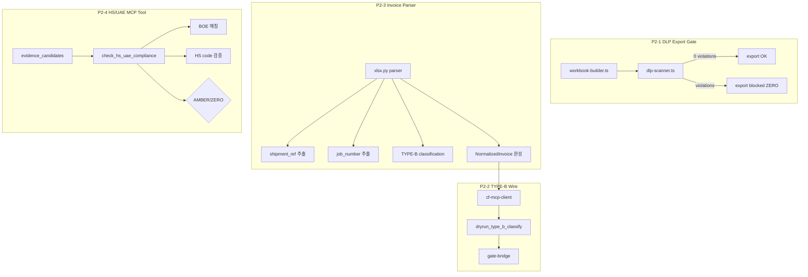

# Plan: P2 잔여 갭 설계 (Track 1 → Track 2 정합)

> 2026-06-13 · 기준: `20260613_cross_validation_report.md` P2 6건
> Track 1: shpiment/DSV_SHIPMENT_FULL_PACKAGE_v3_2_PRO_INTERNAL

## Phase 1: Business Review

### 1.1 문제 정의

현재: Track 2는 P0(2건), P1(3건) 패치로 핵심 검증 로직이 정상 작동하나, Track 1의 9게이트 중 4게이트가 부분 구현이고 1게이트가 미구현. 특히 HS/UAE 컴플라이언스와 DEM/DET 계산은 Track 1의 ZERO hard_blocker에 해당하는 critical gaps.

목표: Track 2가 Track 1의 9게이트 검증 범위를 100% 커버. HS/UAE Customs gate, DEM/DET calculation layer, DLP export integration, Harness orchestrator, TYPE-B MCP wiring, invoice parser population.

영향: 4 critical gap 해소. Track 2를 DSV HVDC 프로젝트의 단독 검증 플랫폼으로 승격 가능.

### 1.2 제안 옵션

| 옵션 | 설명 | 공수 | 리스크 |
|------|------|------|--------|
| A | **P2-1~3** (DLP export, TYPE-B wiring, invoice parser) → 0.5일. HS/UAE, DEM/DET, Harness는 Track 1 그대로 사용 | 0.5일 | Track 1/Track 2 이원화 지속 |
| B | **P2-1~4** + HS/UAE Customs gate MCP tool 추가 (BOE 매칭, HS code lookup) → 1.5일 | 1.5일 | 한국 세관과 UAE 세관 차이 고려 필요 |
| C | **Full P2** — 6건 전체: DLP export + TYPE-B wire + invoice parser + HS/UAE tool + DEM/DET tool + Harness orchestrator | 3일 | DEM/DET 계산 로직 복잡도 높음 |

### 1.3 추천

**옵션 B**. DLP export gate + TYPE-B MCP wiring + invoice parser population + HS/UAE Customs MCP tool. 4건이 Track 1 운영게이트와 직접 연결되며 Track 2의 독립 운영을 가능하게 함. DEM/DET 계산은 Track 1과 동일 수준의 정확도 구현에 추가 분석 필요 → P3로 분리. Harness orchestrator는 CI pipeline 완성 후 통합.

롤백: MCP tool 추가는 개별 tool 모듈이므로 롤백 시 해당 파일만 제거.

### 1.4 승인 요청

`[x] Phase 1 승인 (사용자 지시)`

---

## Phase 2: Engineering Review

### 2.1 데이터 흐름



### 2.2 P2-1: DLP Export Gate Integration

**파일 변경:**

| 파일 | 변경 | 설명 |
|------|------|------|
| `packages/shared/src/dlp-scanner.ts` | modify | `scanWorkbook(sheets)` 함수 추가: 모든 시트 순회하며 DLP 패턴 검사 |
| `apps/web/src/app/api/export/download/route.ts` | modify | Export 전 `assertDlpClean()` 호출, violation → ZERO block |
| `apps/web/src/lib/gate-bridge.ts` | modify | `checkDlpExport(workbook)` 함수 추가 → ZERO verdict on violations |

**로직**: workbook-builder 생성 후, download/export route 진입 시점에 DLP scanner 호출. violation 발견 → export 거부 + `01_Action_Items`에 DLP 이슈 추가.

### 2.3 P2-2: TYPE-B MCP Pipeline 연결

**파일 변경:**

| 파일 | 변경 | 설명 |
|------|------|------|
| `apps/mcp-server/src/tools/classify_type_b.ts` | create | Track 1의 8-class priority 규칙을 MCP tool로 구현 |
| `apps/web/src/lib/cf-mcp-client.ts` | modify | `dryrun_type_b_classify` 결과 → gate-bridge로 전달 |
| `apps/worker-py/app/parsers/xlsx.py` | modify | `for_charge_component` 매핑 → `type_b` 추론 |

**로직**: Track 1의 `TYPE_B_Rules_v3.1_PRO.csv` 우선순위(Inspection>Customs>DO>INLAND>THC>Detention>STROAGE>OTHERS)를 MCP tool로 포팅. cf-mcp-client에서 각 line의 description을 classify_type_b로 분류 후 gate-bridge에 type_b_total 계산 입력.

### 2.4 P2-3: Invoice Parser Population

**파일 변경:**

| 파일 | 변경 | 설명 |
|------|------|------|
| `apps/worker-py/app/parsers/xlsx.py` | modify | Excel row → InvoiceLine에 `shipment_ref`, `job_number`, `rate_basis`, `for_charge_component` 채움 |

**로직**: xlsx.py의 header alias detection을 확장해 `Shipment_No`/`HVDC-*`/`Shipment Ref` 컬럼을 `shipment_ref`로, `Job_No`/`Job Number`를 `job_number`로, `Rate_Basis`/`Unit`을 `rate_basis`로 매핑. 기존 description/qty/rate/amount 매핑 패턴 복제.

### 2.5 P2-4: HS/UAE Customs MCP Tool

**파일 변경:**

| 파일 | 변경 | 설명 |
|------|------|------|
| `apps/mcp-server/src/tools/check_hs_uae_compliance.ts` | create | BOE 존재 확인 + HS code 기본 검증 |
| `apps/mcp-server/src/tools/__tests__/check_hs_uae_compliance.test.ts` | create | 6개 테스트 케이스 |
| `apps/mcp-server/src/main.ts` | modify | tool registry에 추가 |
| `apps/web/src/lib/cf-mcp-client.ts` | modify | validate() 플로우에 check_hs_uae 호출 추가 |

**로직**:
- `Input`: line_id, charge_code (CUSTOMS일 때만 실행), evidence_candidates[], hs_code (nullable)
- `Output`: verdict (PASS/AMBER/ZERO), boe_found: bool, hs_code_valid: bool, reason_code
- 검증:
  1. evidence_candidates에 BOE/Bill of Entry 존재 확인 → 없으면 ZERO
  2. hs_code가 있으면 6자리 숫자 형식 검증 → 불일치 시 AMBER
  3. CUSTOMS charge_code에 BOE 증빙 필수 → ZERO (Track 1 hard_blocker #4)

### 2.6 의존성 & 순서

```
P2-3 (invoice parser) ──→ P2-2 (TYPE-B wire) ──→ P2-4 (HS/UAE tool)
                                                    │
P2-1 (DLP export gate) ─────────────────────────────┘
                                                    │
                                              QA (전체 테스트)
```

- P2-3 독립적 (선행)
- P2-2는 P2-3의 결과에 의존 (populated type_b 필드 필요)
- P2-4는 P2-3의 evidence_candidates + P2-2의 TYPE-B 분류에 의존
- P2-1은 다른 것과 독립적, 맨 마지막에 export pipe에 삽입

### 2.7 테스트 전략

| Gap | 단위 테스트 | 통합 테스트 |
|-----|-----------|-----------|
| P2-1 | `dlp-scanner.test.ts`: workbook scan 검증 | export route: violation → block |
| P2-2 | `classify_type_b.test.ts`: 8-class priority | cf-mcp-client: flow 통과 |
| P2-3 | `test_xlsx_parser.py`: new columns | parse route: NormalizedInvoice 완전성 |
| P2-4 | `check_hs_uae_compliance.test.ts`: BOE/HS 검증 | run/route.ts: customs charge → ZERO trigger |

### 2.8 리스크 & 완화

| 리스크 | 완화 |
|--------|------|
| HS/UAE: UAE 세관 규정은 한국 세관과 상이 | HS code 유효성 검증만, BOE 존재 확인으로 범위 제한 (UAE Customs Authority 규정은 미구현) |
| DLP scanner 성능 저하 (전체 workbook scan) | `scanWorkbook`은 sheet별 순차 실행, 최대 13 sheets × ~100 rows → 무시 가능 |
| TYPE-B 분류 정확도 | Track 1의 검증된 `golden_case_runner.py` priority 규칙을 그대로 포팅 |
