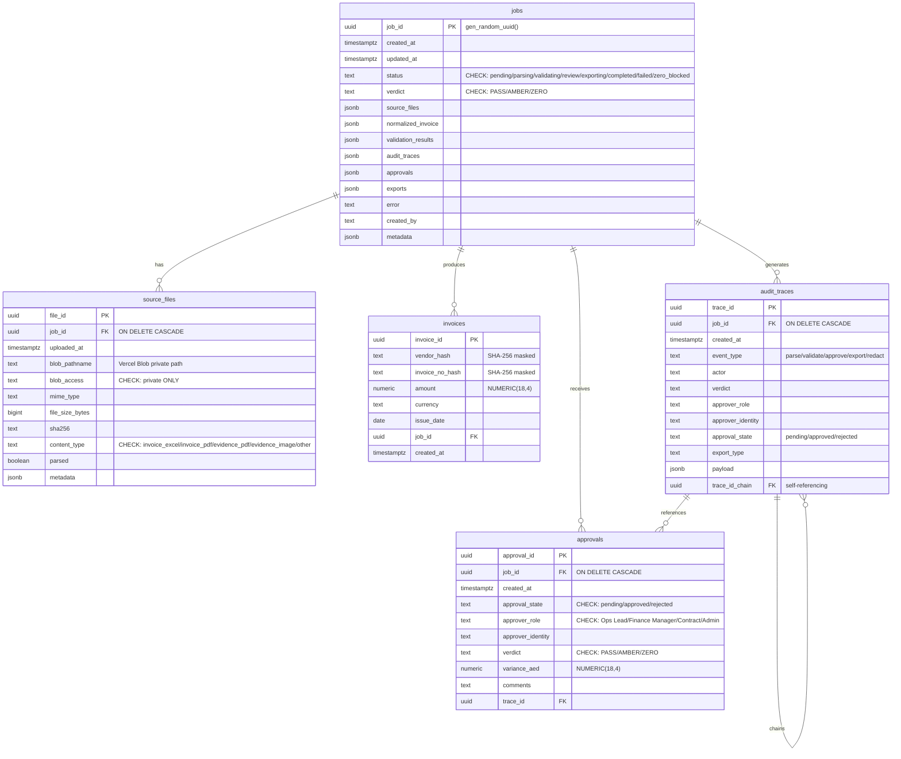
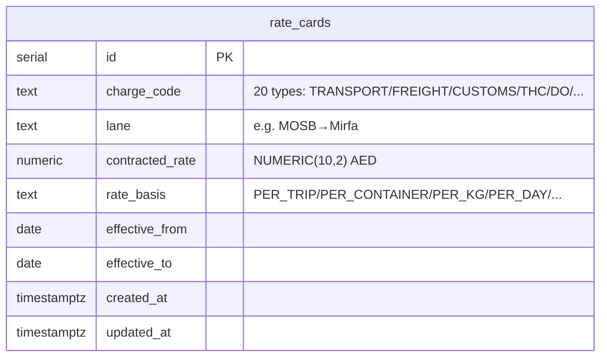

# Database Schema & Data Model — SWARM SCOUT Report
**Date**: 2026-06-14 | **Agent**: SCOUT (DB/Schema) | **Project**: SCT_ONTOLOGY

---

## 1. Database Environment Map

The project operates **3 separate database contexts** with no data synchronization:

| Context | DB Type | Connection | Migrations | Consumer |
|---------|---------|------------|------------|----------|
| **D1** (MCP_AUDIT_DB) | Cloudflare D1 (SQLite) | `wrangler.toml` binding | `migrations/` (0008-0010) | MCP Server (Cloudflare Worker) |
| **Worker-PY PG** | Neon Postgres 16+ | `DATABASE_URL` env | `apps/worker-py/migrations/0001_initial.sql` | FastAPI worker (Python) |
| **MCP Server PG** | Postgres (same `DATABASE_URL`) | `DATABASE_URL` env | `apps/mcp-server/db/migrate-rate-cards.sql` | MCP Server tools (direct pg) |

---

## 2. Entity-Relationship Diagrams

### 2.1 Worker-PY Postgres (Primary Operational Schema)


### 2.2 D1 Schema (MCP Server — Latest Version via 0009+0010)
```mermaid
erDiagram
    jobs ||--o{ source_files : "has"
    jobs ||--o{ audit_traces : "generates"
    jobs ||--o{ gate_results : "produces"
    jobs ||--o{ normalized_invoices : "stores"
    jobs ||--o{ validation_results : "produces"
    jobs ||--o{ approval_records : "receives"
    jobs ||--o{ invoices : "deduplicates"

    jobs {
        text job_id PK
        text status "DEFAULT CREATED"
        text verdict
        text created_by
        timestamptz created_at
        timestamptz updated_at
        text rule_version
        text parser_version
    }

    source_files {
        bigserial id PK
        text job_id FK "ON DELETE CASCADE"
        text file_id
        text original_filename
        text file_type
        text mime_type
        bigint size_bytes
        text sha256
        text blob_ref
        text blob_url
        text parser_status "DEFAULT PENDING"
        text uploaded_by
        timestamptz uploaded_at
    }

    audit_traces {
        bigserial id PK
        text trace_id UNIQUE
        text job_id FK "ON DELETE CASCADE"
        text step
        text input_ref
        text output_ref
        timestamptz timestamp
        text rule_version
        text source_hash
        text calculation_hash
        integer latency_ms
        text was_derived_from
        text attributed_to
    }

    gate_results {
        bigserial id PK
        text job_id FK "ON DELETE CASCADE" UNIQUE
        text verdict
        jsonb result_json
        timestamptz created_at
    }

    normalized_invoices {
        bigserial id PK
        text job_id FK "ON DELETE CASCADE" UNIQUE
        jsonb invoice_json
        timestamptz created_at
    }

    validation_results {
        bigserial id PK
        text job_id FK "ON DELETE CASCADE" UNIQUE
        jsonb validation_json
        timestamptz created_at
    }

    approval_records {
        bigserial id PK
        text job_id FK "ON DELETE CASCADE" UNIQUE
        jsonb approval_json
        timestamptz created_at
    }

    fx_policies {
        text fx_policy_id PK
        text from_currency
        text to_currency
        double_precision fx_rate
        date rate_date
        date valid_from
        date valid_to
        text approved_by
        text proof_hash
    }

    invoices {
        text invoice_id PK
        text job_id
        text vendor_hash "SHA-256"
        text invoice_no_hash "SHA-256"
        numeric amount "NUMERIC(18,2)"
        text currency
        date issue_date
        timestamptz created_at
    }
```

### 2.3 MCP Server PG (rate_cards only)


---

## 3. Schema Issues — Prioritized

### P0 — Data Loss / Breaking Risk

| ID | Issue | Location | Impact |
|----|-------|----------|--------|
| **P0-1** | `0008 → 0009` drops `human_gate_triggers` and `export_records` tables | migrations/0009 | If D1 was running v0008 and then applies 0009, these tables silently remain (IF NOT EXISTS) but their schema is frozen — no CASCADE, no JSONB, no TIMESTAMPTZ. The new MCP tools may expect columns that don't exist. |
| **P0-2** | D1 `invoices.amount` is `NUMERIC(18,2)` but worker-py `invoices.amount` is `NUMERIC(18,4)` | 0010 vs 0001_initial | Different precision across databases. Values like 0.0125 AED get rounded to 0.01 in D1 but preserved in PG. Duplicate detection may produce false negatives/positives. |
| **P0-3** | `0008` column `wasDerivedFrom`/`attributedTo` (camelCase) renamed to `was_derived_from`/`attributed_to` (snake_case) in 0009 | Both in audit_traces | If any code queries 0008-style column names, it will fail on 0009 schema. No migration to rename. |

### P1 — Performance / Consistency

| ID | Issue | Location | Impact |
|----|-------|----------|--------|
| **P1-1** | MCP tool contract in `packages/contracts/validation.schema.ts` lists 11 tools; actual `tools/index.ts` has 14 tools | contracts vs mcp-server | `check_hs_uae_compliance`, `classify_type_b`, `check_dem_det` are missing from the contract — schema validation tests won't cover them. |
| **P1-2** | `rate_cards` lacks compound index `(charge_code, lane)` — the primary query pattern in `check_rate_card.ts` | migrate-rate-cards.sql:32-34 | Full table scan for `WHERE charge_code = $1 AND lane = $2`. With 250+ rows this is marginal but will degrade as rate data grows. |
| **P1-3** | `check_fx_policy.ts` queries `fx_policies` table by `(from_currency, to_currency)` but index exists only on D1 0009, not on 0008 | D1 schema versions | 0008 `fx_policies` has NO indexes at all. |
| **P1-4** | Worker-py `audit_traces` and `approvals` written by middleware but D1 has separate `audit_traces` and `approval_records` — no synchronization | Both databases | Same job may have audit records in one DB but not the other. Compliance audit will show gaps. |
| **P1-5** | D1 `source_files` in 0009 has `file_id TEXT` + `id BIGSERIAL PK` — dual identifiers | 0009 | Code may use `file_id` (UUID) or `id` (serial) depending on which migration was applied. 0008 uses only `file_id TEXT PK`. |

### P2 — Cleanup / Hygiene

| ID | Issue | Location | Impact |
|----|-------|----------|--------|
| **P2-1** | No CHECK constraints on `currency` columns in any DB — allows any string | All invoices tables | Zod/Pydantic enforce AED/USD only but DB doesn't. Bad data can enter via direct SQL. |
| **P2-2** | `rate_cards.charge_code`, `lane`, `rate_basis` are TEXT with no CHECK — any value accepted | migrate-rate-cards.sql | Seed data uses 20 known charge codes but DB allows garbage. |
| **P2-3** | `packages/contracts/validation.schema.ts` VerdictSchema includes `FAILED` but DB CHECK constraints don't | contracts vs migrations | `FAILED` verdict accepted by API layer but rejected at DB insert. |
| **P2-4** | Worker-py `audit_traces` has `event_type` TEXT without CHECK — middleware writes 'parse', 'validate', 'approve', 'export', 'redact', 'upload', 'other' | 0001_initial.sql | No DB-level enforcement of valid event types. |
| **P2-5** | No down-migration scripts for D1 migrations (0008/0009/0010) | migrations/ | Rollback impossible without manual SQL. Only worker-py has `.down.sql`. |
| **P2-6** | `0008` migration creates `normalized_invoices` with TEXT columns for JSON (`invoice_header`, `invoice_lines`, `evidence_candidates`) — 0009 switches to `invoice_json JSONB` | Both | Column semantics changed completely between versions. No data migration path. |

---

## 4. Migration Drift — Code Expects Columns Not in Schema

| Drift | Code Location | Expected | Schema Reality |
|-------|---------------|----------|----------------|
| **D-1** | `check_duplicate_invoice.ts:98` | `SELECT invoice_id, job_id, vendor_hash, invoice_no_hash, amount, currency, issue_date, created_at FROM invoices WHERE vendor_hash = $1 AND invoice_no_hash = $2` | D1 0010 has these exactly. Worker-py 0001_initial has them but `invoice_id` is UUID vs TEXT. **If MCP server connects to worker-py PG**, the query still works (column names match). |
| **D-2** | `check_rate_card.ts:32` | `SELECT contracted_rate FROM rate_cards WHERE charge_code = $1 [AND lane = $2] LIMIT 1` | `migrate-rate-cards.sql` has this column. But this table is in MCP Server PG, not D1. If MCP server is configured with D1, this table doesn't exist. |
| **D-3** | `audit_log.py:131-134` | `INSERT INTO audit_traces (trace_id, job_id, event_type, actor, verdict, approver_role, approver_identity, approval_state, export_type, payload)` | Worker-py 0001_initial has all these columns ✓. But adds `trace_id_chain` (nullable) — not referenced by middleware. |
| **D-4** | `audit_log.py:185-188` | `INSERT INTO approvals (job_id, approval_state, approver_role, approver_identity, verdict, variance_aed, comments, trace_id)` | Worker-py 0001_initial has all these columns ✓. Uses `approval_id UUID DEFAULT gen_random_uuid()` — not supplied by code, relies on DB default. |
| **D-5** | `check_fx_policy.ts` — hardcoded AED/USD peg of 3.6725 | No DB query | Tool doesn't query `fx_policies` table at all — returns AMBER for all FX pairs. The `fx_policies` table exists but is unused by this tool. |

---

## 5. Missing Entities

| Entity | Referenced By | Why Missing Matters | Recommendation |
|--------|---------------|---------------------|----------------|
| **shipments** | `ShipmentMatchRow.shipment_ref`, `InvoiceLine.shipment_ref` | No referential integrity; shipment numbers can't be validated | Add `shipments` table with at minimum: shipment_id, bl_number, vessel_name, eta, etd |
| **vendors** | `InvoiceHeader.vendor`, `DuplicateCheckRow.vendor_hash` | Vendor names are hashed, losing ability to do vendor-level analytics | Add `vendors` table (vendor_id, vendor_name_encrypted, contract_ref) |
| **contracts** | `rate_cards` (implicit), `check_contract_validity` tool | Rate cards have no parent contract; can't trace which rates belong to which contract | Add `contracts` table (contract_id, vendor_id, valid_from, valid_to) |
| **BL (Bill of Lading)** | `ShipmentMatchRow.bl_number` | BL numbers referenced but never validated | Add to `shipments` table or separate `bills_of_lading` |
| **DO (Delivery Order)** | `ShipmentMatchRow.do_number` | DO numbers referenced but never validated | Add to shipments or separate table |
| **PO (Purchase Order)** | `ShipmentMatchRow.po_number` | PO numbers referenced but never validated | Add `purchase_orders` table |
| **charge_lines** | `rate_cards` + `InvoiceLine.for_charge_component` | Charge codes exist in rate cards but no master charge code definition | Add `charge_codes` reference table |

---

## 6. Index Recommendations

### D1 (migrations/0009+) — Missing Indexes

```sql
-- Status-based job filtering (dashboard queries)
CREATE INDEX IF NOT EXISTS idx_jobs_status ON jobs (status);

-- Time-range queries for recent jobs
CREATE INDEX IF NOT EXISTS idx_jobs_created_at ON jobs (created_at DESC);

-- Audit trail time-series queries
CREATE INDEX IF NOT EXISTS idx_audit_traces_created_at ON audit_traces (timestamp DESC);

-- Compound index for audit event-type + time queries
CREATE INDEX IF NOT EXISTS idx_audit_traces_type_time ON audit_traces (step, timestamp DESC);

-- vendor+invoice lookup used by check_duplicate_invoice (already exists in 0010) ✓
```

### MCP Server PG (rate_cards) — Missing Indexes

```sql
-- Primary query pattern in check_rate_card.ts
CREATE INDEX IF NOT EXISTS idx_rate_cards_charge_lane ON rate_cards (charge_code, lane);

-- Lookup by date range for contract validity checks
CREATE INDEX IF NOT EXISTS idx_rate_cards_validity ON rate_cards (effective_from, effective_to) 
    WHERE effective_from IS NOT NULL;
```

### Worker-PY PG — Already Comprehensive
Worker-py 0001_initial already has strong index coverage: `idx_jobs_status`, `idx_jobs_created_at`, `idx_source_files_job_id`, `idx_source_files_sha256`, `idx_invoices_vendor`, `idx_invoices_issue_date`, `idx_audit_traces_job_id`, `idx_audit_traces_event_type`, `idx_audit_traces_created_at`, `idx_approvals_job_id`, `idx_approvals_state`. No additions needed.

---

## 7. PII Compliance Gaps

### Against SECURITY_PRIVACY.md Data Classification

| Level | Entity | Expected Handling | Current Reality | Gap |
|-------|--------|-------------------|-----------------|-----|
| **P2** | Contract rates (250 rows in `seed-rate-cards.sql`) | "Do not commit or expose to prompts" | **Committed to repo** in plaintext SQL file | **HIGH** — The seed file itself is a P2 leak. All 250 rates with vendor lane details are in git history. |
| **P2** | `rate_cards.contracted_rate` | Should be encrypted at rest or access-controlled | Stored as plaintext NUMERIC in DB | **MEDIUM** — At-rest encryption missing. Anyone with DB access can read all contract rates. |
| **P2** | `fx_policies.fx_rate` | Same as rates | Stored as plaintext DOUBLE PRECISION | **LOW** — Single rate value, less sensitive than 250 line-item rates |
| **P2** | Vendor identities (`InvoiceHeader.vendor`) | Hashed only | ✅ `vendor_hash` = SHA-256. Original never stored. | **PASS** |
| **P2** | Invoice numbers | Hashed only | ✅ `invoice_no_hash` = SHA-256. Original never stored. | **PASS** |
| **P2** | BL numbers, container numbers in `ShipmentMatchRow` | Should be masked | Present in Pydantic model but only in-memory during export; not persisted to DB | **LOW** — Transient PII, acceptable |
| **P1** | `audit_traces.payload` (worker-py) | May contain request body hashes | ✅ Body SHA-256 stored, not raw body | **PASS** |
| **P1** | `source_files.original_filename` (D1 0009) | May contain PII in filenames | Stored as TEXT in DB | **LOW** — Filename may reveal vendor/client names. Consider hashing or storing only extension. |

### Specific PII Actions Required

1. **URGENT**: Remove or `.gitignore` `seed-rate-cards.sql` from the repo — it contains 250 contracted rates (P2). Move to a secrets manager or encrypted store.
2. **HIGH**: Add column-level encryption for `rate_cards.contracted_rate` or use pgcrypto.
3. **MEDIUM**: Add CHECK constraint on `rate_cards.charge_code` to prevent invalid charge code insertion.
4. **LOW**: Consider hashing `source_files.original_filename` in D1 schema.

---

## 8. Cross-Layer Type Consistency (SQL ↔ Zod ↔ Pydantic)

| Field | SQL (D1) | SQL (Worker-PY) | Zod (contracts) | Pydantic (schemas.py) | Consistent? |
|-------|----------|-----------------|-----------------|----------------------|-------------|
| `amount` | `NUMERIC(18,2)` | `NUMERIC(18,4)` | `z.number()` | `float` | ❌ Precision differs (18,2 vs 18,4) |
| `currency` | `TEXT` | `TEXT` | `z.enum(['AED','USD'])` | `Literal['AED','USD']` | ⚠️ DB lacks CHECK |
| `verdict` | `TEXT` | `TEXT CHECK(PASS/AMBER/ZERO)` | `z.enum(['PASS','AMBER','ZERO','FAILED'])` | `str` (DecisionRow) | ❌ Zod has FAILED; DB doesn't |
| `rate_basis` | `TEXT` | N/A | `z.enum([8 values])` | `Literal[8 values]` | ⚠️ DB lacks CHECK |
| `numeric_integrity_status` | N/A | N/A | `z.enum(['PASS','AMBER'])` | `Literal['PASS','AMBER']` | ✅ |
| `rate_source_candidate` | N/A | N/A | `z.enum([4 values])` | `Literal[4 values]` | ✅ |
| `parser_confidence` | `REAL` (0008) | N/A | `z.number().min(0).max(1)` | `float(ge=0,le=1)` | ✅ |
| `fx_rate` | `DOUBLE PRECISION` (0009) / `REAL` (0008) | N/A | N/A | N/A | ⚠️ REAL vs DOUBLE across D1 versions |

---

## 9. Summary Scorecard

| Dimension | Score | Notes |
|-----------|-------|-------|
| Schema Completeness | **6/10** | Core invoice audit covered. Missing: shipments, contracts, vendors, BL/DO/PO |
| Index Strategy | **7/10** (Worker-PY), **4/10** (D1) | Worker-PY is well-indexed. D1 is missing job/status/time indexes |
| Migration Hygiene | **4/10** | 0008→0009 is a rewrite, not migration. No downs for D1. Column name drift |
| Data Type Consistency | **6/10** | Currency/Verdict lack DB constraints. Amount precision differs. Zod has FAILED but DB doesn't |
| PII Compliance | **5/10** | Hashes for vendor/invoice_no are good. But 250 rates committed to repo is a P2 violation |
| Cross-DB Sync | **2/10** | D1 and worker-py PG are entirely independent — no replication, no shared identity |

**Overall**: `5.0/10` — Functional but needs P0 fixes before production audit use.

---

## 10. Recommended Action Sequence

1. **P0-1 (IMMEDIATE)**: Decide whether D1 runs 0008 OR 0009 — remove the unused migration to prevent accidental application
2. **P0-2 (IMMEDIATE)**: Align `amount` precision to `NUMERIC(18,2)` in worker-py or `NUMERIC(18,4)` in D1
3. **PII (THIS WEEK)**: Remove `seed-rate-cards.sql` from repo; store rates encrypted
4. **P1-1**: Add `check_hs_uae_compliance`, `classify_type_b`, `check_dem_det` to `packages/contracts/validation.schema.ts`
5. **P1-2**: Add compound index `(charge_code, lane)` on `rate_cards`
6. **P2-3**: Add `FAILED` to DB verdict CHECK constraints, or remove from Zod
7. **P1-4**: Document the split-DB strategy and consider adding a sync job ID column
