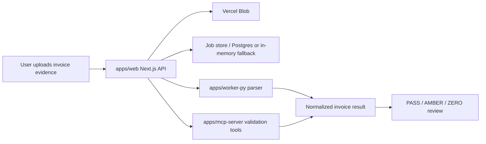

# User Guide

## User Guide

This guide describes the verified local workflow for the `invoice_sct` invoice audit platform.

## Quick Start

Use the repository root for workspace-level commands.

```powershell
pnpm install
pnpm --filter @invoice-audit/web typecheck
pnpm --filter @invoice-audit/web test -- --run
```

Run the web app locally from `apps/web`.

```powershell
cd apps/web
pnpm dev
```

Run the Python worker tests from `apps/worker-py`.

```powershell
cd apps/worker-py
python -m pytest tests/ -q
```

## Developer Workflow

Use this loop for web, worker, or MCP changes:

```text
inspect current git diff -> update focused tests -> implement -> run targeted tests -> run typecheck -> review git status
```

Common verification commands:

| Area | Command |
| --- | --- |
| Web typecheck | `pnpm --filter @invoice-audit/web typecheck` |
| Web tests | `pnpm --filter @invoice-audit/web test -- --run` |
| NotebookLM callback tests | `cd apps/web && npx vitest run tests/api-notebooklm-ingest-summary.test.ts` |
| MCP server tests | `pnpm --filter @invoice-audit/mcp-server test -- --run` |
| Worker tests | `cd apps/worker-py && python -m pytest tests/ -q` |
| Root docs verify | `python C:\Users\jichu\.agents\skills\root-docs-batch-update\scripts\root_docs_batch_update.py verify --repo . --report .codex/root-docs-write.json` |

## Operational Flow



## NotebookLM Worker Gate

The NotebookLM path is a first-pass helper and not the source of truth.

Expected flow:

```text
PDF source -> MarkItDown MCP -> markdown -> NotebookLM add_source(type=text)
-> ask_question JSON-only prompt -> worker parses summary -> HMAC callback
-> web callback gate -> parser-compatible adapter -> manual-review rules
```

Key local verification:

```powershell
cd apps/web
npx vitest run tests/api-notebooklm-ingest-summary.test.ts

cd ..\worker-py
python -m pytest tests/test_notebooklm_extractor.py tests/test_notebooklm_mcp_client.py tests/test_notebooklm_orchestrator.py -q
python -m pytest tests/test_notebooklm_route.py -q
```

Live smoke verification after setting the required MCP/callback environment variables:

```powershell
cd apps/worker-py
python scripts/notebooklm_live_smoke.py --job-id <job_id> --blob-url <pdf_blob_url> --notebook-id <optional_notebook_id>
```

Required environment variables for the worker NotebookLM path:

| Variable | Purpose |
| --- | --- |
| `MARKITDOWN_MCP_URL` | MarkItDown MCP endpoint used by the worker. |
| `NOTEBOOKLM_MCP_URL` | NotebookLM MCP streamable HTTP endpoint. |
| `WEB_CALLBACK_URL` | Vercel callback endpoint, usually `/api/notebooklm/ingest-summary`. |
| `NOTEBOOKLM_CALLBACK_SECRET` | HMAC secret for worker-to-web callback verification. |
| `NOTEBOOKLM_DEFAULT_NOTEBOOK_ID` | Optional default NotebookLM notebook id. |

Latest pushed evidence:

| Commit | Meaning |
| --- | --- |
| `83d96d2` | Added the NotebookLM worker gate implementation. |
| `c674724` | Refreshed root docs for the NotebookLM worker gate. |
| `fb16a92` | Removed DLP references from the AGENTS patch. |

Latest local verification snapshot (updated 2026-06-17):

| Check | Result |
| --- | --- |
| Current full web tests | `pnpm --dir apps/web test` -> 367 passed |
| Current full worker tests | `cd apps/worker-py && python -m pytest tests/ -q` -> 211 passed |
| Current MCP server tests | `pnpm --dir apps/mcp-server test` -> 186 passed |
| NotebookLM worker tests | `python -m pytest -q -o addopts='' tests/test_notebooklm_extractor.py tests/test_notebooklm_mcp_client.py tests/test_notebooklm_orchestrator.py` -> 25 passed |
| NotebookLM worker route tests | `python -m pytest -q -o addopts='' tests/test_notebooklm_route.py` -> 3 passed |
| Re-run pipeline tests | `pnpm --dir apps/web exec vitest run tests/re-run-pipeline.test.ts tests/api-audit-re-run.test.ts tests/api-audit-re-run-status.test.ts` -> 14 passed |
| Web typecheck | `pnpm --dir apps/web typecheck` -> pass |

## Web Audit Workflow

1. Upload invoice and evidence files through the web app.
2. Create or inspect the audit job.
3. Run parser and validation tools.
4. Review `PASS`, `AMBER`, or `ZERO` status.
5. Use manual review for low-confidence NotebookLM summaries, parser failures, or high-impact field mismatches.

The callback gate rejects invalid HMAC signatures and source hash mismatches when configured.

2026-06-16: `gs://` Vision OCR fallback added (flag `VISION_FALLBACK_ENABLED`, default off). It runs
web→worker `/v1/vision/start` fire-and-forget for `gs://` PDF evidence only and never changes the audit
verdict. Signed GCS uploads use `/api/files/create-upload-url` (`gcs-upload.ts`, flag-gated). Parsed
source spans persist in the `parse_source_data` table (migration `0013`) feeding workbook
`90_Source_Data`, with a self-heal fallback so a missing table never blocks the final Excel.

2026-06-17: Vision OCR approval-gated flow (`POST /api/audit/approve { enable_vision: true }`,
per-job, default OFF) + `POST /api/audit/vision-status` polling. On COLLECTED with new
content, the route auto-triggers a re-run. Manual 1-click re-run is `POST /api/audit/re-run`;
polling is `POST /api/audit/re-run-status`. The re-run pipeline
(`apps/web/src/lib/re-run-pipeline.ts`) is fire-and-forget: re-validate via Cf MCP, then
re-export the 13-sheet workbook via worker `/v1/export`. Idempotent on
`(job_id, trigger, pdf_sha256)`. Migration `0018` (Vision state) and `0019` (re-run state) added
to `migrations/`.

## Troubleshooting

| Symptom | Check |
| --- | --- |
| NotebookLM callback returns `401` | Confirm `NOTEBOOKLM_CALLBACK_SECRET` and `X-NotebookLM-Signature` use the same raw body. |
| NotebookLM callback returns `409` | Confirm `source_sha256` or `source_hash` matches the stored source file hash. |
| Worker returns `NOTEBOOKLM_UNAVAILABLE` | Check MarkItDown MCP, NotebookLM MCP, and required worker environment variables. |
| Web tests use in-memory job store | This is expected when `DATABASE_URL` is unset in local tests. |
| Docs consistency fails on Mermaid | Ensure `docs/SYSTEM_ARCHITECTURE.md` and `docs/LAYOUT.md` include `mermaid` blocks beginning with `graph`. |

## Documentation Set

- `README.md` gives the top-level project overview.
- `docs/SYSTEM_ARCHITECTURE.md` describes system components and data flow.
- `docs/LAYOUT.md` maps directories and entrypoints.
- `docs/CHANGELOG.md` records verified current-state changes.
- `docs/GUIDE.md` provides operator and developer workflow guidance.
