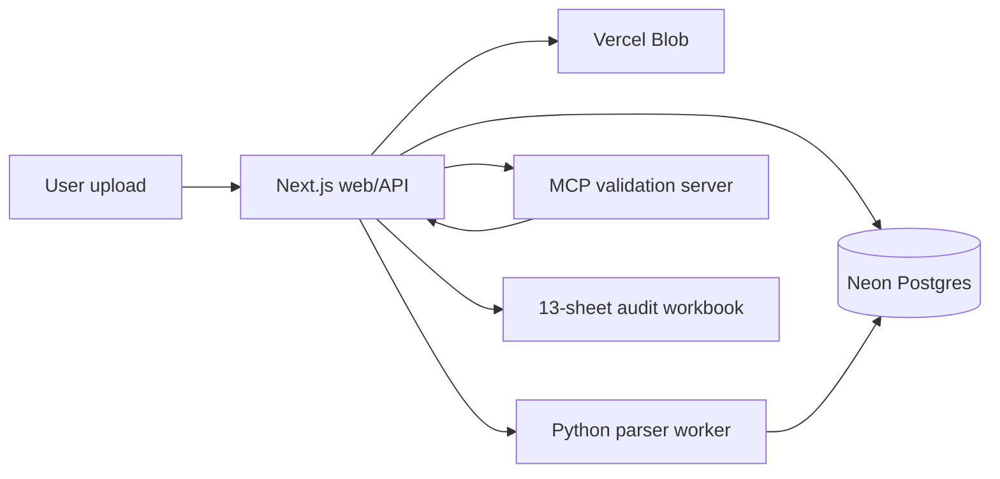
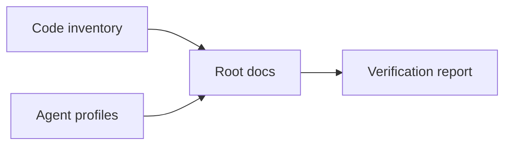

# SCT Invoice Audit Platform

HVDC invoice and shipment audit workspace for the Samsung C&T HVDC Abu Dhabi project.

This repository contains the Phase 1 invoice audit MVP and the supporting SCT ontology validation assets. The current runtime is a 3-part system:

- `apps/web`: Next.js app and API layer for upload, audit job orchestration, approval, and export.
- `apps/worker-py`: FastAPI parser/export worker for Excel, Markdown, text, PDF text, and OpenDataLoader PDF JSON.
- `apps/mcp-server`: TypeScript validation server with 14 audit tools (rate, evidence, duplicate, tax, FX, shipment, cost, TYPE-B classification, HS/UAE customs, DEM/DET, router, explanation builder).

Do not commit raw invoice files, raw contract rates, TRN, BOE, BL, container numbers, personal contact details, tokens, or original P2 evidence files.

## Current Status (2026-06-13)

Cross-validated against Track 1 (shpiment v3.2 PRO, 9-gate system). P0-P2 gaps resolved: 14 MCP tools, 368 tests (Worker 95, MCP 186, Web 107). Typecheck 0 errors.

The MVP has working local components for upload, job status, parser dispatch, validation traces, approval flow, 13-sheet workbook export, DSV Waybill field extraction, 3-way reconciliation, DLP export gate, HS/UAE customs compliance, and DEM/DET evidence checks.

Production deployment uses Vercel for the web app, Vercel Blob for file storage, and Neon Postgres through `DATABASE_URL` for persistence.

**Repo**: [github.com/macho715/invoice_sct](https://github.com/macho715/invoice_sct)
**Live**: [sct-ontology-invoice-audit.vercel.app](https://sct-ontology-invoice-audit-5ks96mt62-chas-projects-08028e73.vercel.app)

GitHub Actions release gates may be skipped when billing prevents CI execution. In that case, run the local checks listed below and record the result in the handoff or release notes.

## Repository Layout

```text
.
├── apps/
│   ├── web/                 # Next.js app, Vercel APIs, upload UI, audit UI
│   ├── worker-py/           # FastAPI parser and 13-sheet workbook exporter
│   └── mcp-server/          # TypeScript validation tools and schema tests
├── packages/
│   ├── contracts/           # Shared TypeScript schemas
│   └── shared/              # Hash and redaction helpers
├── migrations/              # Postgres schema migrations
├── scripts/                 # Audit, seed, deployment, and DLP helper scripts
├── docs/                    # Architecture, plan, operations, security, QA docs
├── .github/workflows/       # CI and deployment workflows
└── .env.example             # Local environment variable template
```

## Runtime Flow



## Main Web Routes

- `/`: app entry page.
- `/invoice-audit`: audit workspace.
- `/invoice-audit/upload`: upload invoice or evidence.
- `/invoice-audit/jobs/[jobId]`: job detail and review page.
- `/fx-policies`: FX policy view.

## Main API Routes

- `POST /api/files/ingest`: upload small input files.
- `POST /api/files/ingest/large`: large upload path.
- `POST /api/invoice-audit/run`: run parser and validation pipeline for a job.
- `GET /api/audit/status?job_id=...`: job status and last trace step.
- `GET /api/audit/trace?job_id=...`: audit trace list.
- `GET /api/audit/result?job_id=...`: audit result payload.
- `POST /api/audit/approve`: approval gate action.
- `POST /api/audit/export`: build export artifact.
- `GET /api/export/download`: download exported workbook.

## Environment

Copy the root template or the web app template before running locally.

```powershell
Copy-Item .env.example apps\web\.env.local
```

Required values:

- `DATABASE_URL`: Neon Postgres connection string. Use the pooled URL for Vercel.
- `BLOB_READ_WRITE_TOKEN`: Vercel Blob token. Use the private store token for private P2 uploads.
- `WORKER_URL`: parser worker URL. Local default is `http://localhost:8000`.
- `MCP_SERVER_URL`: validation server URL. Local default is `http://localhost:8080`.
- `NEXT_PUBLIC_APP_URL`: web app base URL. Local default is `http://localhost:3000`.

Never paste secret values into issues, docs, prompts, or logs.

## Local Development

Run the worker first, then the web app.

```powershell
cd apps\worker-py
python -m pip install -e ".[dev]"
python -m uvicorn app.main:app --port 8000
```

```powershell
cd apps\web
pnpm install
pnpm dev
```

Run the MCP validation server when testing validation tools directly.

```powershell
cd apps\mcp-server
pnpm install
pnpm dev
```

Open the local app at `http://localhost:3000`.

## Verification

Web app:

```powershell
pnpm --dir apps\web typecheck
pnpm --dir apps\web test
pnpm --dir apps\web build
```

Worker:

```powershell
cd apps\worker-py
python -m py_compile app\routes\parse.py
pytest -q
```

MCP server:

```powershell
cd apps\mcp-server
pnpm typecheck
pnpm test
pnpm build
```

Workbook contract:

```powershell
python apps\worker-py\scripts\workbook_contract_validate.py <workbook.xlsx>
```

## Audit Workbook Contract

Final exports must keep the 13-sheet contract in the exact order defined by project rules:

1. `00_Decision`
2. `01_Action_Items`
3. `02_Final_Recon`
4. `03_Header_Check`
5. `04_Line_View`
6. `05_Duplicate_Check`
7. `06_Rate_Check`
8. `07_Tax_FX_Check`
9. `08_Shipment_Match`
10. `90_Source_Data`
11. `91_Audit_Detail`
12. `92_Evidence_Issues`
13. `99_Manifest`

Do not rename, remove, reorder, or hide these sheets.

## Deployment Notes

The production path is:

1. Push code to GitHub.
2. Ensure Vercel project environment variables are set for Production, Preview, and Development.
3. Use private Vercel Blob storage for invoice and evidence files.
4. Use Neon pooled Postgres URL in `DATABASE_URL`.
5. Run `vercel --prod` after local verification.
6. Smoke test a production API route such as `/api/audit/status?job_id=<known-job-id>`.

If CI is unavailable because of GitHub billing, record the local verification commands and outputs before production redeploy.

## Security Rules

- Treat uploaded invoices, PDFs, Excel files, and evidence files as P2.
- Store P2 files in private Blob storage only.
- Use signed download URLs when the parser worker must fetch private files.
- Mask TRN, BOE, BL, container numbers, emails, phone numbers, raw rates, and tokens in logs and docs.
- Do not send raw P2 content to LLM prompts.
- Keep approval gates for AMBER and ZERO findings.

## Useful Docs

- `docs/SYSTEM_ARCHITECTURE.md`: architecture notes.
- `docs/LAYOUT.md`: repository layout notes.
- `docs/PLAN.md`: implementation plan.
- `docs/CHANGELOG.md`: documentation and project change history.
- `docs/SECURITY_PRIVACY.md`: security and privacy guidance.
- `apps/README.md`: app-level development notes.
- `apps/worker-py/README.md`: parser worker details.


## Codex Documentation Update — 2026-06-13T21:10:45.952547+00:00

**Update policy:** existing content above this section is preserved. This section was appended after scanning code, documentation, config, and agent profile files.

**Purpose:** This section summarizes the repository state for onboarding and operation.

### Evidence inventory

**Source/code files sampled:**
- `apps\mcp-server\db\migrate-rate-cards.sql`
- `apps\mcp-server\db\seed-rate-cards.sql`
- `apps\mcp-server\src\__tests__\router.test.ts`
- `apps\mcp-server\src\__tests__\schema-contract.test.ts`
- `apps\mcp-server\src\db.ts`
- `apps\mcp-server\src\main.ts`
- `apps\mcp-server\src\schemas\dlp-guard.ts`
- `apps\mcp-server\src\tools\__tests__\build_validation_explanation.test.ts`
- `apps\mcp-server\src\tools\__tests__\check_contract_validity.test.ts`
- `apps\mcp-server\src\tools\__tests__\check_cost_guard.test.ts`
- `apps\mcp-server\src\tools\__tests__\check_dem_det.test.ts`
- `apps\mcp-server\src\tools\__tests__\check_duplicate_invoice.test.ts`

**Documentation files sampled:**
- `.vercel\README.txt`
- `20260613_cross_validation_report.md`
- `20260613_dsv_waybill_port_plan.md`
- `20260613_job_store_mcp_fix_plan.md`
- `20260613_p2_gap_design.md`
- `README.md`
- `apps\README.md`
- `apps\graphify-out\GRAPH_REPORT.md`
- `apps\graphify-out\converted\sample-invoice_c70e590b.md`
- `apps\web\.vercel\README.txt`
- `apps\worker-py\README.md`
- `apps\worker-py\invoice_audit_parser.egg-info\SOURCES.txt`

**Config/build files sampled:**
- `.claude\settings.local.json`
- `.codex\root-docs-scan.json`
- `.codex\root-docs-write.json`
- `.github\dependabot.yml`
- `.github\workflows\codeql.yml`
- `.github\workflows\fly-worker-deploy.yml`
- `.github\workflows\python-worker-ci.yml`
- `.github\workflows\release-gate.yml`
- `.github\workflows\vercel-preview.yml`
- `.github\workflows\vercel-prod.yml`
- `.github\workflows\web-ci.yml`
- `.vercel\project.json`

**Agent profile files sampled:**
- No agent profile detected; this update records the absence explicitly.

### Mermaid graph



### Verification notes

- Append-only update generated by `root-docs-batch-update`.
- Code/config/doc/agent inventory counts: code=182, docs=108, config=451, agent_profiles=0.
- Follow-up verification should confirm that newly added text matches actual implementation paths listed above.


## Codex Documentation Update — 2026-06-14T09:41:25.480989+00:00

**Update policy:** existing content above this section is preserved. This section was appended after scanning code, documentation, config, and agent profile files.

**Purpose:** This section summarizes the repository state for onboarding and operation.

### Evidence inventory

**Source/code files sampled:**
- `apps\mcp-server\db\migrate-rate-cards.sql`
- `apps\mcp-server\db\seed-rate-cards.sql`
- `apps\mcp-server\src\__tests__\router.test.ts`
- `apps\mcp-server\src\__tests__\schema-contract.test.ts`
- `apps\mcp-server\src\db.ts`
- `apps\mcp-server\src\main.ts`
- `apps\mcp-server\src\schemas\dlp-guard.ts`
- `apps\mcp-server\src\telemetry.ts`
- `apps\mcp-server\src\tools\__tests__\build_validation_explanation.test.ts`
- `apps\mcp-server\src\tools\__tests__\check_contract_validity.test.ts`
- `apps\mcp-server\src\tools\__tests__\check_cost_guard.test.ts`
- `apps\mcp-server\src\tools\__tests__\check_dem_det.test.ts`

**Documentation files sampled:**
- `.hermes\plans\auto-20260614-013800.md`
- `.vercel\README.txt`
- `20260613_cross_validation_report.md`
- `20260613_dsv_waybill_port_plan.md`
- `20260613_job_store_mcp_fix_plan.md`
- `20260613_p2_gap_design.md`
- `20260614_api_inventory_design_audit_v1.md`
- `20260614_db_schema_swarm_scout.md`
- `20260614_documentation_audit_swarm_scout.md`
- `20260614_performance_optimization_plan_v1.md`
- `20260614_phase2_plan.md`
- `20260614_phase3_4_work_log.md`

**Config/build files sampled:**
- `.claude\settings.local.json`
- `.codex\root-docs-scan.json`
- `.codex\root-docs-write.json`
- `.github\dependabot.yml`
- `.github\workflows\_ts-checks.yml`
- `.github\workflows\codeql.yml`
- `.github\workflows\fly-mcp-server-deploy.yml`
- `.github\workflows\fly-worker-deploy.yml`
- `.github\workflows\python-worker-ci.yml`
- `.github\workflows\release-gate.yml`
- `.github\workflows\reliability.yml`
- `.github\workflows\secret-scan.yml`

**Agent profile files sampled:**
- No agent profile detected; this update records the absence explicitly.

### Mermaid graph


### Verification notes

- Append-only update generated by `root-docs-batch-update`.
- Code/config/doc/agent inventory counts: code=259, docs=157, config=520, agent_profiles=0.
- Follow-up verification should confirm that newly added text matches actual implementation paths listed above.
