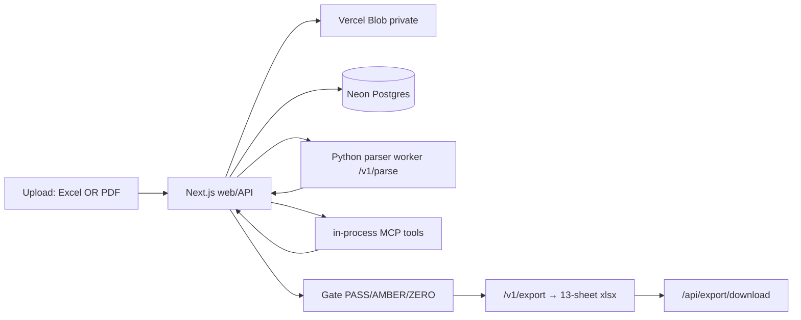
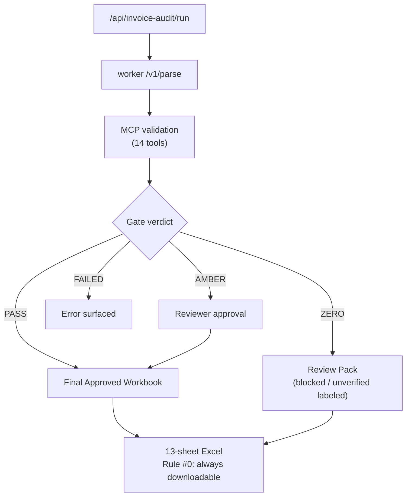
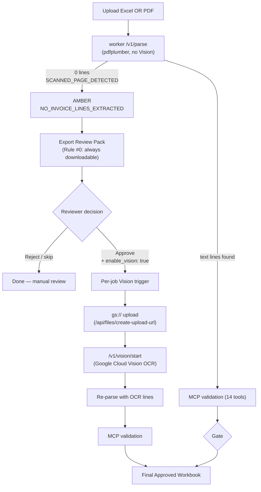
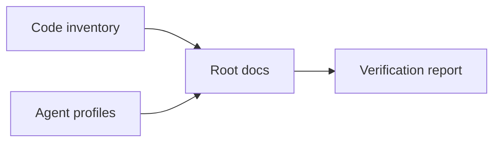

# SCT Invoice Audit Platform

Invoice and shipment audit workspace for Samsung C&T HVDC (ADNOC / DSV). Upload an
**Excel invoice or a PDF** → parse → validate → approve → download a **13-sheet Excel
audit pack**.

- **Repo**: [github.com/macho715/invoice_sct](https://github.com/macho715/invoice_sct)
- **Live**: [sct-ontology-invoice-audit.vercel.app](https://sct-ontology-invoice-audit.vercel.app)
- **Change history**: [CHANGELOG.md](./CHANGELOG.md)

---

## Rule #0 — OR Intake & Final Excel Guarantee

> The highest-priority behavior (see [`CLAUDE.md`](./CLAUDE.md) §0 and [`AGENTS.md`](./AGENTS.md)).
> On conflict with any gate or verdict, Rule #0 wins.

Uploading an **Excel invoice OR a PDF** — either one alone, or both — always produces a
downloadable final Excel (13-sheet audit pack). OR semantics, never AND:

- `xlsx` / `md` / `txt` present → it is the invoice source; PDFs are evidence.
- No structured doc → the first PDF becomes the invoice source; remaining PDFs are evidence.
- (2026-06-17) **Vision OCR — approval-gated (default OFF)**: scanned PDFs (pdfplumber 0-extract) are **not** auto-routed to Google Vision OCR. The first parse emits AMBER / `NO_INVOICE_LINES_EXTRACTED`; Vision is invoked **only after explicit reviewer approval** via `POST /api/audit/approve { enable_vision: true }` (per-job, not env flag). See [Vision OCR — Approval-Gated Flow](#vision-ocr--approval-gated-flow-2026-06-17).
- (2026-06-16) **Generic PDF line extraction**: non-DSV text-based PDFs now produce `invoice_lines` via table-row-first / text-line-fallback extraction (`extract_generic_invoice_lines`), so PDF-only uploads can reach real validation instead of a forced AMBER.
- (2026-06-16) A native-text **DSV SHPT PDF** is also parsed into **real `invoice_lines`**
- A PDF-only upload that still yields 0 structured lines (scanned / line-less PDF) is routed to
  **AMBER / REVIEW_REQUIRED** (`NO_INVOICE_LINES_EXTRACTED`) and still exports. A PDF-only upload
  is **never** rejected with 409.
- Verdict is **always** stamped in the workbook; blocked/unverified items are labeled, not withheld.

## Architecture

Three apps plus shared packages. Target role definition (2026-06-14):
[`docs/superpowers/specs/2026-06-14-final-role-definition-and-flow.md`](./docs/superpowers/specs/2026-06-14-final-role-definition-and-flow.md).

> **Actual operation (2026-06-16):** the production path is **direct-parse** — the web
> app calls the worker's `/v1/parse` (pdfplumber / DSV SHPT hybrid) and `/v1/export`
> (13-sheet workbook), then computes the verdict itself. So the worker does more than
> the spec's "orchestrator only" role (it parses and exports), and the spec's
> NotebookLM-centric flow is **flag-gated, off by default**. Verdict authority still
> lives in Vercel (`gate-bridge.ts`). The table below reflects this real behavior; see
> [`CLAUDE.md`](./CLAUDE.md) → *Architecture Status* for the tracked deviations.

| Layer | Role | Must not do |
| --- | --- | --- |
| **`apps/web`** (Next.js 15, Vercel) | Upload, audit orchestration, gate (PASS/AMBER/ZERO/FAILED), approval, 13-sheet workbook, NotebookLM callback receiver. **Final audit authority.** | Directly automate Chrome / NotebookLM. |
| **`apps/worker-py`** (FastAPI, Google Cloud Run) | Parse (`xlsx/md/txt/pdf/pdf_json` + DSV waybill); **DSV SHPT hybrid PDF parser** extracts real `invoice_lines` (doc-type + charge lines); PDF preflight + Google Vision OCR (flag-gated stub); 13-sheet export; MarkItDown→NotebookLM orchestration. | Produce the final business verdict. |
| **`apps/mcp-server`** (Hono, Google Cloud Run) | Standalone JSON-RPC MCP server for external clients (ChatGPT, Claude Desktop). Not called during the web audit flow. | — |

Shared packages: `packages/tools` (15 validation tools — single source of truth),
`packages/database` (Neon Postgres pool), `packages/contracts` (Zod schemas),
`packages/shared` (hash/redaction), `packages/telemetry` (OpenTelemetry).

Web app libraries (key): `apps/web/src/lib/upload-validation.ts` (shared client +
server-side upload validation — MIME / size / extension checks). Server routes
**must re-execute** the same checks before Blob upload or parser dispatch.

NotebookLM is a **helper/evidence** path, never the source of truth — parser results are
authoritative; parser-missing + NotebookLM-success is `AMBER` manual review.

## Runtime Flow



## Verdict Gate

Every upload flows through the gate; PASS/AMBER/ZERO all yield a downloadable
13-sheet Excel (Rule #0). Added 2026-06-16.



## Quick Start

```bash
pnpm install
pnpm --dir apps/web typecheck    # 0 errors
pnpm --dir apps/web test         # 367 tests
pnpm --dir apps/web build
```

## Local Development

Run the worker first, then the web app.

```bash
# Python worker (FastAPI)
cd apps/worker-py && python -m pip install -e ".[dev]"
python -m uvicorn app.main:app --port 8000

# Web app (Next.js) — separate shell
cd apps/web && pnpm dev          # http://localhost:3000

# MCP server (optional, for external clients) — separate shell
cd apps/mcp-server && pnpm dev   # http://localhost:8080
```

## Repository Layout

```text
.
├── apps/
│   ├── web/                 # Next.js app, Vercel APIs, upload + audit UI
│   ├── worker-py/           # FastAPI parser + 13-sheet workbook exporter
│   └── mcp-server/          # Hono JSON-RPC MCP server (external clients)
├── packages/
│   ├── tools/               # 14 MCP validation tools (single source of truth)
│   ├── database/            # Neon/Postgres pool singleton
│   ├── contracts/           # Shared Zod schemas
│   ├── shared/              # Hash and redaction helpers
│   └── telemetry/           # OpenTelemetry helpers
├── migrations/              # Postgres schema migrations (0008–0016)
├── docs/                    # Architecture, specs, plans, operations, security
├── .github/workflows/       # CI and deployment workflows
└── .env.example             # Local environment variable template
```

## Routes

**Web pages**

- `/` — entry · `/invoice-audit` — workspace · `/invoice-audit/upload` — upload
- `/invoice-audit/jobs/[jobId]` — job detail & review · `/fx-policies` — FX policy view

**Web API** (browser-facing routes are public via middleware; others require `API_SECRET_KEY`)

- `POST /api/files/ingest` · `POST /api/files/ingest/large` — upload (small / large)
- `POST /api/files/create-upload-url` · `POST /api/files/confirm` — GCS signed upload + confirm (dev-stub; flag-gated)

Upload form (`apps/web/src/components/upload-form.tsx`) calls
`upload-validation.ts` for client-side checks (MIME / size / extension).
- `POST /api/invoice-audit/run` — parse + validation pipeline. ⚠ *Note (2026-06-16):
  MIME / size / extension checks via `upload-validation.ts` are **client-side only**
  (`upload-form.tsx`). Neither the run route nor the GCS `create-upload-url` / `confirm`
  routes re-run them, so direct API or GCS callers can submit unsupported / oversized
  objects toward parser dispatch. Open follow-up: add server-side upload validation.*
- `GET /api/audit/status|trace|result?job_id=…` — job state
- `POST /api/audit/approve` — approval gate action
- `POST /api/audit/export` — build export artifact *(public — browser-initiated)*
- `GET /api/export/download?job_id=…` — stream the exported workbook *(public)*
- `POST /api/notebooklm/ingest-summary` — receive HMAC-signed NotebookLM summary
- `POST /api/fx-policy` — FX policy check
- `POST /mcp` — in-process MCP tools endpoint

**Worker** (`apps/worker-py`)

- `POST /v1/parse` — parse source files (aliases `/parse` deprecated, `/parse/pdf-json`). PDF inputs run the DSV SHPT hybrid parser → real `invoice_lines` (native-text PDFs).
- `POST /v1/export` — generate the 13-sheet workbook
- `POST /v1/notebooklm/run` — MarkItDown → NotebookLM first-pass orchestrator
- `POST /v1/preflight` — classify a PDF (text / scanned / encrypted) and recommend a route *(flag-gated)*
- `POST /v1/vision/start` · `POST /v1/vision/collect` — Google Vision async OCR start/collect *(stub until `VISION_ENABLED`)*. (2026-06-16) `/v1/vision/start` also backs the `gs://` Vision OCR fallback (web fire-and-forget, flag `VISION_FALLBACK_ENABLED`).

### DSV SHPT PDF parsing

(2026-06-16) Native-text PDF uploads are run through the **DSV SHPT hybrid parser**
(`apps/worker-py/app/parsers/dsv_pdf_hybrid.py`, ported in PR #35/#36). The `/v1/parse` PDF branch
reuses the already-parsed pdfplumber text spans + table candidates (no second pdfplumber pass),
classifies the document, and extracts charge lines into real `invoice_lines` with `type_b` and
`evidence_status`. Doc types: `CARRIER_RHS`, `PORT_ALLIED`, `AIRPORT_FEES`, `BOE_CUSTOMS`,
`DELIVERY_ORDER`. The worker only **parses** — the final PASS/AMBER/ZERO verdict is still computed in
Vercel (`gate-bridge.ts`). Scanned / line-less PDFs extract 0 lines and fall back to AMBER (Rule #0).
Scope: native-text only; OCR (Vision) for scanned PDFs is the flag-gated path below.

### DOMESTIC workflow (2026-06-16)

The upload form provides a **SHIPMENT / DOMESTIC** radio toggle that gates the entire pipeline:

| Aspect | SHIPMENT | DOMESTIC |
|--------|----------|----------|
| **Currency** | AED/USD (FX normalization) | KRW (fixed) |
| **Rate lookup** | `charge_code` in `rate_cards` | Composite lane key `origin\|\|destination\|\|vehicle\|\|unit` |
| **Validation** | All 14 MCP tools | Skips HS/UAE, shipment_match, fx_policy, dem_det |
| **Lane check** | N/A | `domestic_lane_check` (15th tool): distance bands, short-run (≤10km), fixed-cost suspect (≤2km), rate delta, risk score |
| **Verdict language** | English | Korean (국내물류팀 승인 필요, 단거리 운행 감지, etc.) |
| **Parser** | DSV SHPT hybrid | DSV waybill 5-layer lane extraction + xlsx domestic column aliases |
| **Rate DB** | `rate_cards` by charge_code | `rate_cards` by lane key (139 lanes from ApprovedLaneMap_ENHANCED.json, seed via `scripts/seed_domestic_rates.py`) |

Domestic invoices carry `origin`/`destination`/`vehicle`/`distance_km` fields parsed from
xlsx columns (Place of Loading, Vehicle Type, etc.) or extracted from DSV domestic waybill PDFs.
These feed into `check_rate_card` for contracted rate lookup and `domestic_lane_check` for
distance-band and rate-variance validation. Verdicts and action items are produced in Korean
for the 국내물류팀 review workflow.

### Extraction & Vision (approval-gated, default off)

A scaffolded extraction path lets scanned/low-text PDFs be routed through Google Vision OCR and
MarkItDown before validation. It is **off by default** and ships as stubs (the Vision client returns
`VISION_DISABLED` until `google-cloud-vision` is installed and `VISION_ENABLED=true`; GCS upload
routes return a local dev-stub URL). Extraction runs are tracked in the `extraction_artifacts` and
`extraction_comparisons` tables (migration `0012`), storing hashes/confidence only — never raw text.
Flags: `VISION_ENABLED` (default false), `MARKITDOWN_MCP_URL` (MarkItDown path), `NOTEBOOKLM_ENABLED`
(default false). With every flag off, the standard parse → validate → export path is unchanged.

(2026-06-17) **Vision OCR is now approval-gated, not flag-gated.** The web app **does not** call
`/v1/vision/start` automatically on first parse. After first parse returns
`NO_INVOICE_LINES_EXTRACTED` (scanned / line-less PDF), the reviewer decides whether to enable
Vision OCR for that specific job. Trigger: `POST /api/audit/approve { job_id, approval_scope: "AMBER_ACK" | "ZERO_APPROVED", acknowledgement_reason?: "...", enable_vision: true }` (auth via `x-user-role` / `x-user-id` headers). The previous `VISION_FALLBACK_ENABLED` env flag is **deprecated for
first-parse** and is retained only as a kill-switch. See [Vision OCR — Approval-Gated Flow
(2026-06-17)](#vision-ocr--approval-gated-flow-2026-06-17) for the full flow.

(2026-06-16) A `gs://` **Google Vision OCR fallback** (web→worker `/v1/vision/start`) is available for
`gs://` PDF evidence only. It is invoked **only** after reviewer approval (see above); the
fire-and-forget auto-trigger is removed. Signed GCS uploads go through
`/api/files/create-upload-url` (`gcs-upload.ts`, flag-gated). Parsed source spans are persisted in
the `parse_source_data` table (migration `0013`) and feed the workbook's `90_Source_Data` sheet; a
**self-heal** fallback ensures a missing table never blocks the final Excel (Rule #0).

## Environment

```bash
cp .env.example apps/web/.env.local
```

| Variable | Purpose |
| --- | --- |
| `DATABASE_URL` | Neon Postgres (pooled). Required in Vercel Prod/Preview — no in-memory fallback when `VERCEL=1`. |
| `BLOB_READ_WRITE_TOKEN` | Vercel Blob token (private store). `dev-stub*` enables local on-disk blob. |
| `API_SECRET_KEY` | Bearer secret enforced by middleware on non-public API routes. |
| `PARSER_WORKER_URL` / `WORKER_URL` | Parser/export worker base URL (local default `http://127.0.0.1:8000`). Run route allows only `localhost`, `127.0.0.1`, `.run.app` (Cloud Run), `.internal`, `.vercel.app` hosts. |
| `PARSER_WORKER_TOKEN` | Bearer token the web app sends to the worker. |
| `NEXT_PUBLIC_BASE_URL` | Web app base URL (local default `http://127.0.0.1:3000`). |
| `MARKITDOWN_MCP_URL` / `NOTEBOOKLM_MCP_URL` | NotebookLM helper path MCP endpoints. |
| `MARKITDOWN_MCP_USE_ID_TOKEN` | `true` → worker attaches a Cloud Run ID token when calling an IAM-protected MarkItDown MCP service (default off). |
| `WEB_CALLBACK_URL` / `NOTEBOOKLM_CALLBACK_SECRET` | Worker → web callback URL + HMAC secret. |
| `NOTEBOOKLM_DEFAULT_NOTEBOOK_ID` / `NOTEBOOKLM_ENABLED` | Optional NotebookLM notebook id / trigger flag (default off). |
| `VISION_ENABLED` / `GOOGLE_CLOUD_PROJECT` | Google Vision OCR path (default off; stub until enabled + `google-cloud-vision` installed). |
| `VISION_FALLBACK_ENABLED` | (2026-06-16) `gs://` Google Vision OCR fallback (web→worker `/v1/vision/start`). Default off. Fire-and-forget; never changes the audit verdict. For `gs://` PDF evidence only. |
| `GCS_OCR_BUCKET` | (2026-06-16) GCS bucket used by the `gs://` Vision OCR fallback. |
| `GCS_UPLOAD_ENABLED` | (2026-06-16) Flag gating the GCS signed upload path (`/api/files/create-upload-url`, `gcs-upload.ts`). Default off. |
| `GCS_SOURCE_BUCKET` / `GCS_EVIDENCE_BUCKET` | (2026-06-16) Target GCS bucket for signed uploads. **Required** when `GCS_UPLOAD_ENABLED=true` — `/api/files/create-upload-url` returns `STORAGE_AUTH_FAILED` if neither is set. |
| `GCS_CLIENT_EMAIL` / `GCS_PRIVATE_KEY` | (2026-06-16) Service-account credentials `gcs-upload.ts` uses to sign the upload URL. **Required** when `GCS_UPLOAD_ENABLED=true` — missing → `GCS_CONFIG_MISSING`. Keep `GCS_PRIVATE_KEY` out of logs/issues. |

Never paste secret values into issues, docs, prompts, or logs.

## Verification

Baseline (2026-06-15): **515 tests** — apps/web 167, apps/worker-py 162, apps/mcp-server 186.

Baseline (2026-06-17): **764 tests** — apps/web 367, apps/worker-py 211, apps/mcp-server 186.
Rule #0 verified end-to-end in prod: ingest → run → export → download yields a valid 13-sheet
xlsx, even for a ZERO verdict.

```bash
# Web
pnpm --dir apps/web typecheck && pnpm --dir apps/web test && pnpm --dir apps/web build
# Worker (needs openpyxl, pdfplumber, pytest-cov)
cd apps/worker-py && python -m pytest tests/ -q
# MCP server
pnpm --dir apps/mcp-server typecheck && pnpm --dir apps/mcp-server test
# Workbook contract
python apps/worker-py/scripts/workbook_contract_validate.py <workbook.xlsx>
# E2E (Playwright, runs from apps/web)
cd apps/web && pnpm exec playwright test e2e/invoice-audit.spec.ts
```

> **E2E scenarios** (current): upload happy path, upload validation reject,
> job lifecycle (status / trace / result), verdict gating, workbook export &
> 13-sheet contract assertion.

## 13-Sheet Workbook Contract

Final exports must keep these sheets in exact order — do not rename, remove, reorder, or hide:

`00_Decision` · `01_Action_Items` · `02_Final_Recon` · `03_Header_Check` · `04_Line_View`
· `05_Duplicate_Check` · `06_Rate_Check` · `07_Tax_FX_Check` · `08_Shipment_Match`
· `90_Source_Data` · `91_Audit_Detail` · `92_Evidence_Issues` · `99_Manifest`

The workbook's internal `99_Manifest` sheet records `pre_manifest_sha256`: the SHA256 of
the XLSX bytes before that manifest hash value is inserted. The `/v1/export` response
`manifest.sha256` remains the SHA256 of the final XLSX bytes returned to the caller. This
keeps the final API/download integrity hash exact while avoiding a self-referential hash
inside the OOXML package.

### Web (`apps/web`) → Vercel

> **CI baseline (app-workspace execution):** all `pnpm` / `playwright` /
> `build` steps in CI must run from the app directory (e.g. `pnpm --dir apps/web …`
> or `cd apps/web && pnpm …`). pnpm store cache key is `hashFiles('**/pnpm-lock.yaml')`
> with `cache-dependency-path: apps/web/pnpm-lock.yaml`.

1. Merge to `main` (PRs gated by CI: TS checks, Python CI, Playwright smoke, CodeQL, gitleaks).
2. Ensure Vercel env vars are set for Production, Preview, and Development.
3. Use private Vercel Blob storage for invoice/evidence files.
4. `DATABASE_URL` must be the Neon pooled URL in every Vercel env (`VERCEL=1` fails fast otherwise).
5. `vercel --prod` after local verification; the prod alias is `sct-ontology-invoice-audit.vercel.app`.
6. Smoke test: PDF-only upload → run → `/api/audit/export` → `/api/export/download` = valid 13-sheet xlsx.

### Worker + MCP server → Google Cloud Run

The worker (`apps/worker-py`) and the standalone MCP server (`apps/mcp-server`) deploy to
**Google Cloud Run** (Fly.io is decommissioned). See the full runbook:
[`docs/20260615_cloud-run-migration-runbook.md`](./docs/20260615_cloud-run-migration-runbook.md).

> **Status (2026-06-15):** the **worker is live in prod** on Cloud Run — project
> `dsv-invoice`, region `asia-northeast3`, service `hvdc-invoice-parser`, deployed
> `--allow-unauthenticated` (public; worker does no inbound token check). Vercel
> `PARSER_WORKER_URL` points at its `*.run.app` URL. mcp-server and markitdown-mcp
> are **not** deployed yet (the worker alone serves the audit flow). Actual URL,
> auth caveat, and the BuildKit Dockerfile fix are in runbook §11.

> **Update (2026-06-16):** `deploy-cloudrun.sh` must deploy with
> `--allow-unauthenticated`. The web calls `/v1/parse` and `/v1/export` with the
> `PARSER_WORKER_TOKEN` app bearer (not a Google IAM identity token), so the
> service needs the `allUsers → run.invoker` binding. Deploying with
> `--no-allow-unauthenticated` strips it and breaks prod with a Cloud Run HTML
> `401` on `/v1/parse`. Also keep the worker request schemas in sync with the web:
> the export row models (`LineViewRow`/`RateCheckRow`) use `extra='ignore'` so
> web-side rate_match enrichment fields don't cause a `422` / `EXPORT_FAILED`.
> Re-verified end-to-end after the fix (worker rev `00012`).

1. One-time: enable `run`, `cloudbuild`, `artifactregistry` APIs; connect billing on the GCP project.
2. Worker: `cd apps/worker-py && GCP_PROJECT=<proj> GCP_REGION=<region> ./deploy-cloudrun.sh` (`--port 8000`).
3. MCP server (only if external clients need it): `cd apps/mcp-server && … ./deploy-cloudrun.sh` (`--port 3000`).
4. MarkItDown MCP (optional helper path): `cd apps/markitdown-mcp && … ./deploy.sh`.
5. Point Vercel `PARSER_WORKER_URL` at the worker's `*.run.app` URL; the run-route allowlist accepts `.run.app`.

## Security

- Store uploaded files in **private** Blob storage only; the worker fetches private files via signed/server-side download.
- Do not send raw file content to LLM prompts.
- Keep approval gates for AMBER and ZERO findings.
- Treat NotebookLM output as first-pass evidence only — do not bypass parser / manual-review gates.

## Docs

> **Root-doc rule (always preserved in the repository root):** these six
> canonical documents must **always exist in the repo root** —
> [`README.md`](./README.md), [`SYSTEM_ARCHITECTURE.md`](./SYSTEM_ARCHITECTURE.md),
> [`LAYOUT.md`](./LAYOUT.md), [`CHANGELOG.md`](./CHANGELOG.md),
> [`CLAUDE.md`](./CLAUDE.md), [`AGENTS.md`](./AGENTS.md). Do not move, delete, or
> relocate them out of root. The `docs/` copies are mirrors/extended versions;
> the root copies are the canonical entry points.

- [`README.md`](./README.md) — this file (overview, runtime flow, routes, deploy)
- [`SYSTEM_ARCHITECTURE.md`](./SYSTEM_ARCHITECTURE.md) — system architecture (root canonical)
- [`LAYOUT.md`](./LAYOUT.md) — repository layout (root canonical)
- [`CHANGELOG.md`](./CHANGELOG.md) — full change history
- [`CLAUDE.md`](./CLAUDE.md) — project rules (Rule #0, architecture, constraints)
- [`AGENTS.md`](./AGENTS.md) — agent operating rules
- [`docs/superpowers/specs/2026-06-14-final-role-definition-and-flow.md`](./docs/superpowers/specs/2026-06-14-final-role-definition-and-flow.md) — canonical 3-layer role definition
- [`docs/SYSTEM_ARCHITECTURE.md`](./docs/SYSTEM_ARCHITECTURE.md) · [`docs/LAYOUT.md`](./docs/LAYOUT.md) · [`docs/GUIDE.md`](./docs/GUIDE.md) — mirrored/extended docs

## Vision OCR — Approval-Gated Flow (2026-06-17)

**Default: Vision OFF.** Google Cloud Vision OCR is **never** invoked automatically on first
parse. The reviewer/approver must explicitly enable Vision OCR for a job after reviewing the
AMBER / `NO_INVOICE_LINES_EXTRACTED` outcome. This keeps Vision costs and Google API
credential/quota usage under explicit human sign-off (결재후 ON).

### Flow



### Trigger

```http
POST /api/audit/approve
Content-Type: application/json
x-user-role: COST_CONTROL_LEAD | FINANCE_APPROVER | …
x-user-id: <user-id>

{
  "job_id": "<job-uuid>",
  "approval_scope": "AMBER_ACK",          // AMBER_ACK | ZERO_APPROVED
  "acknowledgement_reason": "scanned PDF — request OCR enrichment",  // required for AMBER_ACK
  "enable_vision": true                   // ← only true triggers Vision OCR for THIS job
}
```

- `enable_vision: false` (default) → standard AMBER Review Pack, **no Vision call**.
- `enable_vision: true` → enqueue Vision OCR for that job; poll
  `POST /api/audit/vision-status { job_id }` (or `GET ?job_id=…`) for
  `pending | queued | running | done | failed | skipped`.
- On `done` → re-parse with OCR lines → re-run validation gate → emit final 13-sheet Excel.

### What changed (2026-06-17)

| Area | Before | After |
|---|---|---|
| Vision trigger | env flag `VISION_FALLBACK_ENABLED` (default OFF) | per-job reviewer approval `enable_vision: true` |
| First parse | pdfplumber + auto Vision fallback (fire-and-forget) | pdfplumber only — Vision **never** auto-invoked |
| Cost / quota | billed whenever `VISION_FALLBACK_ENABLED=true` | billed only on explicit reviewer opt-in |
| Credential blast radius | any flip of the env flag | per-job, audit-logged via `01_Action_Items` |
| Rule #0 | AMBER exports valid; Vision enrichment async | unchanged — every job still produces a downloadable 13-sheet Excel |

### Operational notes

- The `VISION_FALLBACK_ENABLED` env flag is **deprecated for first-parse**. It is retained
  only as a kill-switch (set `false` to hard-disable the worker `/v1/vision/start` route).
- The `gs://` upload path (`/api/files/create-upload-url`) remains flag-gated by
  `GCS_UPLOAD_ENABLED` and required by `GCS_SOURCE_BUCKET` / `GCS_EVIDENCE_BUCKET` /
  `GCS_CLIENT_EMAIL` / `GCS_PRIVATE_KEY` — missing any of these returns
  `STORAGE_AUTH_FAILED` / `GCS_CONFIG_MISSING`.
- Vision OCR results are written to GCS (`GCS_OCR_BUCKET`) and re-ingested by the worker
  on `/v1/vision/collect`; `parse_source_data` row is upserted into the workbook
  `90_Source_Data` sheet with `provenance = "vision_ocr"`.
- Vision-triggered re-parse is **idempotent**: re-approving with `enable_vision: true`
  is a no-op when an OCR artifact already exists for the same `job_id + pdf_sha256`.

### Rationale

- Vision OCR uses billable Google Cloud Vision API quota + GCS storage — must be opt-in.
- Credential / quota issues (e.g. Google Vision API 결재/승인 지연) are isolated: pdfplumber
  path keeps working, and Vision is held until the credential is approved and a reviewer
  signs off.
- Reviewer can decide whether a scanned PDF is worth the cost, or whether to request a
  re-upload as a structured `.xlsx`.
- Rule #0 still holds: every job produces a downloadable 13-sheet Excel — with or without
  Vision enrichment.


## OCR → Variance Re-Compute + 1-Click Export Re-Run (2026-06-17)

When Google Vision OCR completes with new content (`page_count > 0` or
`evidence_candidate_count > 0`), the audit pipeline **automatically
re-runs** so the 13-sheet workbook reflects the OCR-augmented data
without manual re-approval. Reviewers can also trigger the same flow
manually.

### Endpoints

| Method | Path | Purpose |
|---|---|---|
| `POST` | `/api/audit/re-run` | 1-click manual trigger. Body: `{ job_id, triggered_by? }`. Returns the initial `ReRunRecord` immediately. |
| `POST` | `/api/audit/re-run-status` | Polling. Body: `{ job_id }`. Returns the full `ReRunRecord` + `ready_to_download: true` when `exported`. |
| `GET` | `/api/audit/re-run-status?job_id=…` | Same as POST, query-string form. |

### ReRunRecord shape

```jsonc
{
  "re_run_id": "rerun_abc123",
  "re_run_status": "pending | running | exported | failed",
  "re_run_trigger": "manual | vision_ocr_done",
  "re_run_triggered_by": "user@x | auto:vision-status",
  "re_run_pdf_sha256": "<sha256>",
  "re_run_vision_operation_name": "operations/op_xxx",
  "re_run_started_at": "ISO-8601 | null",
  "re_run_completed_at": "ISO-8601 | null",
  "re_run_error_code": "WORKER_CONFIG_MISSING | ... | null",
  "re_run_error_message": "<string> | null",
  "re_run_workbook_sha256": "<sha256> | null",
  "re_run_workbook_size_bytes": 12345 | null,
  "re_run_workbook_blob_url": "https://blob.vercel-storage.com/... | null",
  "re_run_prior_variance_aed": 100.00,
  "re_run_new_variance_aed": 25.00,
  "re_run_prior_verdict": "AMBER",
  "re_run_new_verdict": "PASS"
}
```

### Flow

```
[1] POST /api/audit/approve { enable_vision: true }       ← reviewer opts in
   └─► /v1/vision/start (worker, fire-and-forget)
[2] GET  /api/audit/vision-status                          ← poll until done
   └─► /v1/vision/collect (worker)
   └─► on COLLECTED + page_count|evidence_candidate_count > 0:
         triggerReRun({ trigger: 'vision_ocr_done' })     ← AUTO
[3] GET  /api/audit/re-run-status                          ← poll for export
   └─► pending → running → exported
   └─► ready_to_download: true when exported
[4] Download workbook at re_run_workbook_blob_url
```

Manual re-run is the same flow minus step 1+2: `POST /api/audit/re-run
{ job_id }` is sufficient when vision is already done.

### Idempotency

The re-run dedupe key is `(job_id, re_run_trigger, pdf_sha256)`:

| Existing record | Behavior |
|---|---|
| `exported` for same key | Return cached record, **no worker call** |
| `running` for same key | Return cached record, **no worker call** |
| Different `trigger` | Fresh record (auto + manual coexist) |
| Different `pdf_sha256` | Fresh record |

### Failure modes (Rule #0 — never block audit)

| Code | Meaning |
|---|---|
| `WORKER_CONFIG_MISSING` | `PARSER_WORKER_URL` / `PARSER_WORKER_TOKEN` not set |
| `RE_RUN_VALIDATE_FAILED` | Cf MCP `validate()` threw |
| `EXPORT_REQUEST_FAILED` | Worker `/v1/export` fetch threw |
| `EXPORT_FAILED` | Worker `/v1/export` returned non-2xx |
| `RE_RUN_UNEXPECTED` | Orchestrator unexpected throw (safety net) |

The original (pre-OCR) 13-sheet workbook remains the deliverable. The
`failed` record surfaces `re_run_error_code` / `re_run_error_message`
for the UI to display.

### Storage

Postgres: 17 new columns on `jobs` table via
`migrations/0019_jobs_re_run.sql` + 2 indexes
(`idx_jobs_re_run_status`, `idx_jobs_re_run_pdf_sha256`).
The PG adapter self-heals `undefined_column` (42703) by running
`ALTER TABLE jobs ADD COLUMN IF NOT EXISTS` for any missing column.
In-memory adapter keeps a parallel `Map` for tests / local dev.

### Why this matters

검수 → export 무결성 마감. Before: a reviewer who approved before OCR
had to re-approve after OCR to see the augmented workbook. After:
OCR completion kicks off the re-run automatically, the workbook
self-heals, and the reviewer's download reflects OCR-augmented data
without any extra click. Manual `/api/audit/re-run` is provided for
the "I changed something in the job" case.

## Codex Documentation Update — 2026-06-15T17:51:50.268914+00:00

**Update policy:** existing content above this section is preserved. This section was appended after scanning code, documentation, config, and agent profile files.

**Purpose:** This section summarizes the repository state for onboarding and operation.

### Evidence inventory

**Source/code files sampled:**
- `apps\markitdown-mcp\deploy.sh`
- `apps\mcp-server\db\migrate-rate-cards.sql`
- `apps\mcp-server\db\seed-rate-cards.sql`
- `apps\mcp-server\deploy-cloudrun.sh`
- `apps\mcp-server\src\__tests__\router.test.ts`
- `apps\mcp-server\src\__tests__\schema-contract.test.ts`
- `apps\mcp-server\src\db.ts`
- `apps\mcp-server\src\main.ts`
- `apps\mcp-server\src\schemas\dlp-guard.ts`
- `apps\mcp-server\src\telemetry.ts`
- `apps\mcp-server\src\tools\__tests__\build_validation_explanation.test.ts`
- `apps\mcp-server\src\tools\__tests__\check_contract_validity.test.ts`

**Documentation files sampled:**
- `.hermes\plans\auto-20260614-013800.md`
- `.vercel\README.txt`
- `20260615_AUTOPILOT_REVIEW_MarkItDown_GoogleVision_통합_v1.md`
- `20260615_VisionFallback_Orchestration_구현작업서_v1.md`
- `20260615_google_vision_gcp_auth_worklog.md`
- `20260615_google_vision_pdf_parser_logic_guide.md`
- `20260615_구현작업서_MarkItDown_GoogleVision_통합_v1.md`
- `CHANGELOG.md`
- `CLAUDE.md`
- `GUIDE.md`
- `LAYOUT.md`
- `README.md`

**Config/build files sampled:**
- `.claude\settings.local.json`
- `.codex\root-docs-dryrun-latest.json`
- `.codex\root-docs-scan.json`
- `.codex\root-docs-write.json`
- `.github\dependabot.yml`
- `.github\workflows\codeql.yml`
- `.github\workflows\python-worker-ci.yml`
- `.github\workflows\release-gate.yml`
- `.github\workflows\reliability.yml`
- `.github\workflows\secret-scan.yml`
- `.github\workflows\vercel-prod.yml`
- `.github\workflows\web-ci.yml`

**Agent profile files sampled:**
- No agent profile detected; this update records the absence explicitly.

### Mermaid graph



### Verification notes

- Append-only update generated by `root-docs-batch-update`.
- Code/config/doc/agent inventory counts: code=290, docs=193, config=705, agent_profiles=0.
- Follow-up verification should confirm that newly added text matches actual implementation paths listed above.
