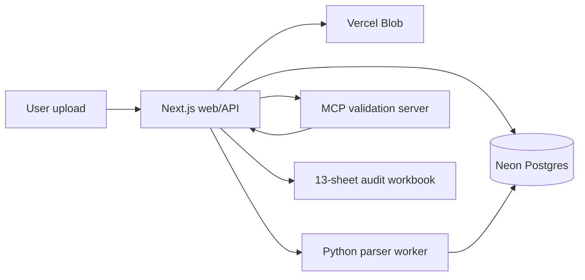
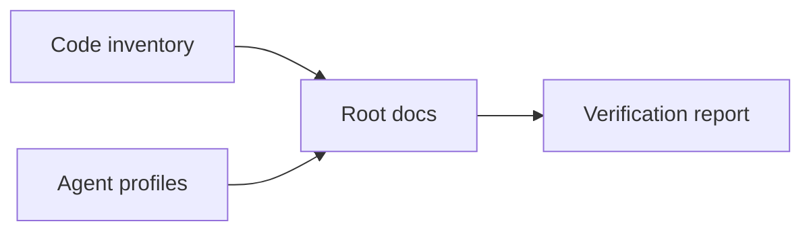

# NoteLM / Worker / Vercel Final Split

Verdict: this 3-layer split is the final target structure.

Reason: the failure points are separated into `NoteLM extraction`, `Worker MCP orchestration`, and `Vercel audit`, so retry, logging, and fallback behavior can be designed per layer.

Next action: lock each layer's responsibility and I/O contract. The Worker must call only the patched local NotebookLM MCP version.

Reference MCP projects:

- [notebooklm-mcp](https://github.com/PleasePrompto/notebooklm-mcp)
- [markitdown](https://github.com/mcp/microsoft/markitdown)

## 1. Final Role Definition

| Layer | Role | Must not do |
| --- | --- | --- |
| **NoteLM** | Verification field extraction agent. Reads Markdown source and extracts JSON candidate values for invoice validation. | Must not make the final audit verdict. |
| **Worker** | `MarkItDown -> NotebookLM -> JSON normalization -> Vercel callback` orchestrator. | Must not perform final amount or contract validation. |
| **Vercel** | Receive gate, existing parser adapter, final audit engine, Excel/JSON result generation. | Must not directly automate Chrome or NotebookLM. |

## 2. Final Flow

```text
User PDF upload
-> Vercel creates audit_job
-> Worker pulls job
-> MarkItDown MCP converts PDF to Markdown
-> Worker sends Markdown to NoteLM / NotebookLM
-> NoteLM extracts verification fields only
-> Worker normalizes NoteLM output
-> Vercel callback
-> Existing parser adapter compares extracted fields
-> Final audit engine produces PASS / WARN / FAIL
-> Excel / JSON / audit trace output
```

## 3. Core Design Principles

### 3.1 NoteLM Is an Extractor, Not a Judge

Treat NoteLM output as extraction evidence only.

```json
{
  "source": "notelm",
  "role": "field_extractor",
  "confidence": 0.87,
  "fields": {
    "invoice_no": "SCT-0019",
    "bl_no": "HBL123456",
    "boe_no": "BOE987654",
    "container_no": ["MSCU1234567"],
    "origin": "Khalifa Port",
    "destination": "DSV Warehouse",
    "charge_items": [
      {
        "description": "THC",
        "amount": 1750.00,
        "currency": "AED"
      }
    ]
  },
  "raw_answer": "...",
  "warnings": []
}
```

Only the Vercel audit engine may produce the final verdict.

## 4. Worker Contract

Worker input:

```json
{
  "job_id": "audit_20260614_001",
  "pdf_url": "https://blob.vercel-storage.com/invoice.pdf",
  "notebook_id": "invoice-audit-smoke-notebook",
  "callback_url": "https://your-vercel-app/api/worker/callback",
  "mode": "dry_run"
}
```

Worker callback:

```json
{
  "job_id": "audit_20260614_001",
  "status": "completed",
  "markitdown": {
    "ok": true,
    "markdown_chars": 18542,
    "markdown_sha256": "..."
  },
  "notelm": {
    "ok": true,
    "source_added": true,
    "question_ok": true,
    "json_parse_ok": true,
    "fields": {}
  },
  "trace": {
    "worker_version": "patched-notebooklm-mcp-local",
    "notebooklm_mcp_url": "http://127.0.0.1:3003/mcp",
    "markitdown_mcp_url": "http://127.0.0.1:3001/mcp"
  }
}
```

## 5. Vercel Final Audit Structure

```text
/api/upload
  -> file receive
  -> create audit_job
  -> return job_id

/api/worker/callback
  -> verify job_id
  -> validate worker payload schema
  -> save extracted fields
  -> run parser adapter
  -> run final audit engine
  -> generate result

/api/audit/:job_id
  -> return status/result
```

## 6. Failure Separation

| Failure | Location | Handling |
| --- | --- | --- |
| PDF to Markdown failed | Worker / MarkItDown | OCR fallback or ZERO |
| `add_source` timeout | Worker / NotebookLM MCP | Recheck patched local MCP |
| Broken NoteLM JSON | Worker | Retry + strict JSON repair |
| Parser adapter mismatch | Vercel | WARN/FAIL verdict |
| Contract rate mismatch | Vercel audit engine | Final FAIL or REVIEW |
| Callback failed | Vercel gateway | Job retry queue |

## 7. Locked Rules

```text
1. NoteLM extracts verification fields only.
2. Worker performs MCP orchestration only.
3. Only Vercel creates the final audit verdict.
4. Do not use NotebookLM MCP @latest; pin the patched local version.
5. Worker output must pass schema validation before entering the audit engine.
```

## 8. Recommended Next Implementation Units

```text
T001 worker callback schema addition
T002 fixed NoteLM extraction prompt
T003 Worker output normalizer
T004 connect notelm_fields input to Vercel parser adapter
T005 add evidence_trace to final audit engine
T006 smoke test: PDF -> MD -> NoteLM -> callback -> audit PASS
```

Conclusion: use this structure. Even if NotebookLM MCP is unstable, the Vercel audit engine remains independently protected, and only the Worker retry or replacement path needs to change.

# SCT Invoice Audit Platform

## Overview

Invoice and shipment audit workspace for SCT/DSV invoice verification.

This repository contains the Phase 1 invoice audit MVP and the supporting SCT ontology validation assets. The current runtime is a 3-part system:

- `apps/web`: Next.js app and API layer for upload, audit job orchestration, approval, and export.
- `apps/worker-py`: FastAPI parser/export worker for Excel, Markdown, text, PDF text, OpenDataLoader PDF JSON, and NotebookLM first-pass extraction orchestration.
- `apps/mcp-server`: TypeScript validation server with 14 audit tools (rate, evidence, duplicate, tax, FX, shipment, cost, TYPE-B classification, HS/UAE customs, DEM/DET, router, explanation builder).

Do not commit raw invoice files, raw contract rates, TRN, BOE, BL, container numbers, personal contact details, tokens, or original P2 evidence files.

## Current Status (2026-06-14)

Cross-validated against Track 1 (shpiment v3.2 PRO, 9-gate system). P0-P2 gaps resolved: 14 MCP tools, 368 tests (Worker 95, MCP 186, Web 107). Typecheck 0 errors.

The MVP has working local components for upload, job status, parser dispatch, validation traces, approval flow, 13-sheet workbook export, DSV Waybill field extraction, 3-way reconciliation, DLP export gate, HS/UAE customs compliance, and DEM/DET evidence checks.

NotebookLM first-pass extraction is implemented as a helper path, not as source of truth. The worker route `POST /v1/notebooklm/run` can fetch a source PDF, convert it through MarkItDown/NotebookLM MCP, parse JSON-only output, and send an HMAC-signed callback to `POST /api/notebooklm/ingest-summary`. Parser results remain authoritative; parser missing plus NotebookLM success is `AMBER` manual review.

Latest pushed evidence: `83d96d2` added the NotebookLM worker gate, `c674724` refreshed root docs, and `fb16a92` removed DLP references from the AGENTS patch. Current local verification recorded 123 worker tests passed, 12 NotebookLM web callback tests passed, web typecheck passed, and project documentation consistency passed. NotebookLM-focused worker verification adds MCP client coverage and passes 25 tests plus 3 route tests.

Production deployment uses Vercel for the web app, Vercel Blob for file storage, and Neon Postgres through `DATABASE_URL` for persistence.

**Repo**: [github.com/macho715/invoice_sct](https://github.com/macho715/invoice_sct)
**Live**: [sct-ontology-invoice-audit.vercel.app](https://sct-ontology-invoice-audit-5ks96mt62-chas-projects-08028e73.vercel.app)

GitHub Actions release gates may be skipped when billing prevents CI execution. In that case, run the local checks listed below and record the result in the handoff or release notes.

## Quick Start

Use the repository root for workspace-level commands.

```powershell
pnpm install
pnpm --filter @invoice-audit/web typecheck
pnpm --filter @invoice-audit/web test -- --run
```

Run the web app locally:

```powershell
cd apps\web
pnpm dev
```

Run the worker test suite:

```powershell
cd apps\worker-py
python -m pytest tests/ -q
```

## Repository Layout

```text
.
├── apps/
│   ├── web/                 # Next.js app, Vercel APIs, upload UI, audit UI
│   ├── worker-py/           # FastAPI parser and 13-sheet workbook exporter
│   └── mcp-server/          # TypeScript validation tools and schema tests
├── packages/
│   ├── contracts/           # Shared TypeScript schemas
│   └── shared/              # Hash and redaction helpers
├── migrations/              # Postgres schema migrations
├── scripts/                 # Audit, seed, deployment, and DLP helper scripts
├── docs/                    # Architecture, plan, operations, security, QA docs
├── .github/workflows/       # CI and deployment workflows
└── .env.example             # Local environment variable template
```

## Runtime Flow



NotebookLM helper path:

```text
PDF source -> MarkItDown MCP -> NotebookLM add_source(type=text)
-> ask_question JSON-only prompt -> worker parses summary
-> HMAC callback -> web trust gate -> parser-compatible review
```

## Main Web Routes

- `/`: app entry page.
- `/invoice-audit`: audit workspace.
- `/invoice-audit/upload`: upload invoice or evidence.
- `/invoice-audit/jobs/[jobId]`: job detail and review page.
- `/fx-policies`: FX policy view.

## Main API Routes

- `POST /api/files/ingest`: upload small input files.
- `POST /api/files/ingest/large`: large upload path.
- `POST /api/invoice-audit/run`: run parser and validation pipeline for a job.
- `GET /api/audit/status?job_id=...`: job status and last trace step.
- `GET /api/audit/trace?job_id=...`: audit trace list.
- `GET /api/audit/result?job_id=...`: audit result payload.
- `POST /api/audit/approve`: approval gate action.
- `POST /api/audit/export`: build export artifact.
- `GET /api/export/download`: download exported workbook.
- `POST /api/notebooklm/ingest-summary`: receive HMAC-signed NotebookLM first-pass summary.

## Worker Routes

- `POST /v1/parse`: parse source files through the Python worker.
- `POST /v1/export`: generate workbook exports.
- `POST /v1/notebooklm/run`: run the NotebookLM first-pass extraction worker pipeline.

## Environment

Copy the root template or the web app template before running locally.

```powershell
Copy-Item .env.example apps\web\.env.local
```

Required values:

- `DATABASE_URL`: Neon Postgres connection string. Use the pooled URL for Vercel.
- `BLOB_READ_WRITE_TOKEN`: Vercel Blob token. Use the private store token for private P2 uploads.
- `WORKER_URL`: parser worker URL. Local default is `http://localhost:8000`.
- `MCP_SERVER_URL`: validation server URL. Local default is `http://localhost:8080`.
- `NEXT_PUBLIC_APP_URL`: web app base URL. Local default is `http://localhost:3000`.
- `MARKITDOWN_MCP_URL`: MarkItDown MCP endpoint used by the NotebookLM worker path.
- `NOTEBOOKLM_MCP_URL`: NotebookLM MCP streamable HTTP endpoint.
- `WEB_CALLBACK_URL`: web callback endpoint for worker-to-web summary delivery.
- `NOTEBOOKLM_CALLBACK_SECRET`: HMAC secret used by worker callback signing and web callback verification.
- `NOTEBOOKLM_DEFAULT_NOTEBOOK_ID`: optional default NotebookLM notebook id.

Never paste secret values into issues, docs, prompts, or logs.

## Local Development

Run the worker first, then the web app.

```powershell
cd apps\worker-py
python -m pip install -e ".[dev]"
python -m uvicorn app.main:app --port 8000
```

```powershell
cd apps\web
pnpm install
pnpm dev
```

Run the MCP validation server when testing validation tools directly.

```powershell
cd apps\mcp-server
pnpm install
pnpm dev
```

Open the local app at `http://localhost:3000`.

## Verification

Command index for documentation consistency: `pnpm --filter @invoice-audit/web typecheck`, `pnpm --filter @invoice-audit/web test -- --run`, `pnpm --filter @invoice-audit/mcp-server test -- --run`, `cd apps/worker-py && python -m pytest tests/ -q`, `python -m pytest tests/ -q`, `python -m pytest -q -o addopts='' tests/test_notebooklm_route.py`.

Web app:

```powershell
pnpm --filter @invoice-audit/web typecheck
pnpm --filter @invoice-audit/web test -- --run
pnpm --filter @invoice-audit/web build
```

Worker:

```powershell
cd apps\worker-py
python -m pytest tests/ -q
```

MCP server:

```powershell
pnpm --filter @invoice-audit/mcp-server typecheck
pnpm --filter @invoice-audit/mcp-server test -- --run
pnpm --filter @invoice-audit/mcp-server build
```

NotebookLM focused checks:

```powershell
cd apps\web
npx vitest run tests/api-notebooklm-ingest-summary.test.ts

cd ..\worker-py
python -m pytest tests/test_notebooklm_extractor.py tests/test_notebooklm_mcp_client.py tests/test_notebooklm_orchestrator.py -q
python -m pytest tests/test_notebooklm_route.py -q
```

Live NotebookLM/MarkItDown smoke check after setting the required MCP/callback env vars:

```powershell
cd apps\worker-py
python scripts\notebooklm_live_smoke.py --job-id <job_id> --blob-url <pdf_blob_url> --notebook-id <optional_notebook_id>
```

Workbook contract:

```powershell
python apps\worker-py\scripts\workbook_contract_validate.py <workbook.xlsx>
```

## Audit Workbook Contract

Final exports must keep the 13-sheet contract in the exact order defined by project rules:

1. `00_Decision`
2. `01_Action_Items`
3. `02_Final_Recon`
4. `03_Header_Check`
5. `04_Line_View`
6. `05_Duplicate_Check`
7. `06_Rate_Check`
8. `07_Tax_FX_Check`
9. `08_Shipment_Match`
10. `90_Source_Data`
11. `91_Audit_Detail`
12. `92_Evidence_Issues`
13. `99_Manifest`

Do not rename, remove, reorder, or hide these sheets.

## Deployment Notes

The production path is:

1. Push code to GitHub.
2. Ensure Vercel project environment variables are set for Production, Preview, and Development.
3. Use private Vercel Blob storage for invoice and evidence files.
4. Use Neon pooled Postgres URL in `DATABASE_URL`.
5. Run `vercel --prod` after local verification.
6. Smoke test a production API route such as `/api/audit/status?job_id=<known-job-id>`.

If CI is unavailable because of GitHub billing, record the local verification commands and outputs before production redeploy.

## Security Rules

- Treat uploaded invoices, PDFs, Excel files, and evidence files as P2.
- Store P2 files in private Blob storage only.
- Use signed download URLs when the parser worker must fetch private files.
- Mask TRN, BOE, BL, container numbers, emails, phone numbers, raw rates, and tokens in logs and docs.
- Do not send raw P2 content to LLM prompts.
- Keep approval gates for AMBER and ZERO findings.
- Treat NotebookLM output as first-pass evidence only. Do not bypass parser/manual-review gates.

## Useful Docs

- `docs/SYSTEM_ARCHITECTURE.md`: architecture notes.
- `docs/LAYOUT.md`: repository layout notes.
- `docs/GUIDE.md`: operator and developer workflow guide.
- `plan.md`: active implementation plan.
- `plan-20260614-notelm-worker-gate.md`: NotebookLM worker gate implementation plan.
- `docs/CHANGELOG.md`: documentation and project change history.
- `docs/SECURITY_PRIVACY.md`: security and privacy guidance.
- `apps/README.md`: app-level development notes.
- `apps/worker-py/README.md`: parser worker details.


## Codex Documentation Update — 2026-06-13T21:10:45.952547+00:00

**Update policy:** existing content above this section is preserved. This section was appended after scanning code, documentation, config, and agent profile files.

**Purpose:** This section summarizes the repository state for onboarding and operation.

### Evidence inventory

**Source/code files sampled:**
- `apps\mcp-server\db\migrate-rate-cards.sql`
- `apps\mcp-server\db\seed-rate-cards.sql`
- `apps\mcp-server\src\__tests__\router.test.ts`
- `apps\mcp-server\src\__tests__\schema-contract.test.ts`
- `apps\mcp-server\src\db.ts`
- `apps\mcp-server\src\main.ts`
- `apps\mcp-server\src\schemas\dlp-guard.ts`
- `apps\mcp-server\src\tools\__tests__\build_validation_explanation.test.ts`
- `apps\mcp-server\src\tools\__tests__\check_contract_validity.test.ts`
- `apps\mcp-server\src\tools\__tests__\check_cost_guard.test.ts`
- `apps\mcp-server\src\tools\__tests__\check_dem_det.test.ts`
- `apps\mcp-server\src\tools\__tests__\check_duplicate_invoice.test.ts`

**Documentation files sampled:**
- `.vercel\README.txt`
- `20260613_cross_validation_report.md`
- `20260613_dsv_waybill_port_plan.md`
- `20260613_job_store_mcp_fix_plan.md`
- `20260613_p2_gap_design.md`
- `README.md`
- `apps\README.md`
- `apps\graphify-out\GRAPH_REPORT.md`
- `apps\graphify-out\converted\sample-invoice_c70e590b.md`
- `apps\web\.vercel\README.txt`
- `apps\worker-py\README.md`
- `apps\worker-py\invoice_audit_parser.egg-info\SOURCES.txt`

**Config/build files sampled:**
- `.claude\settings.local.json`
- `.codex\root-docs-scan.json`
- `.codex\root-docs-write.json`
- `.github\dependabot.yml`
- `.github\workflows\codeql.yml`
- `.github\workflows\fly-worker-deploy.yml`
- `.github\workflows\python-worker-ci.yml`
- `.github\workflows\release-gate.yml`
- `.github\workflows\vercel-preview.yml`
- `.github\workflows\vercel-prod.yml`
- `.github\workflows\web-ci.yml`
- `.vercel\project.json`

**Agent profile files sampled:**
- No agent profile detected; this update records the absence explicitly.

### Mermaid graph



### Verification notes

- Append-only update generated by `root-docs-batch-update`.
- Code/config/doc/agent inventory counts: code=182, docs=108, config=451, agent_profiles=0.
- Follow-up verification should confirm that newly added text matches actual implementation paths listed above.


## Codex Documentation Update — 2026-06-14T09:41:25.480989+00:00

**Update policy:** existing content above this section is preserved. This section was appended after scanning code, documentation, config, and agent profile files.

**Purpose:** This section summarizes the repository state for onboarding and operation.

### Evidence inventory

**Source/code files sampled:**
- `apps\mcp-server\db\migrate-rate-cards.sql`
- `apps\mcp-server\db\seed-rate-cards.sql`
- `apps\mcp-server\src\__tests__\router.test.ts`
- `apps\mcp-server\src\__tests__\schema-contract.test.ts`
- `apps\mcp-server\src\db.ts`
- `apps\mcp-server\src\main.ts`
- `apps\mcp-server\src\schemas\dlp-guard.ts`
- `apps\mcp-server\src\telemetry.ts`
- `apps\mcp-server\src\tools\__tests__\build_validation_explanation.test.ts`
- `apps\mcp-server\src\tools\__tests__\check_contract_validity.test.ts`
- `apps\mcp-server\src\tools\__tests__\check_cost_guard.test.ts`
- `apps\mcp-server\src\tools\__tests__\check_dem_det.test.ts`

**Documentation files sampled:**
- `.hermes\plans\auto-20260614-013800.md`
- `.vercel\README.txt`
- `20260613_cross_validation_report.md`
- `20260613_dsv_waybill_port_plan.md`
- `20260613_job_store_mcp_fix_plan.md`
- `20260613_p2_gap_design.md`
- `20260614_api_inventory_design_audit_v1.md`
- `20260614_db_schema_swarm_scout.md`
- `20260614_documentation_audit_swarm_scout.md`
- `20260614_performance_optimization_plan_v1.md`
- `20260614_phase2_plan.md`
- `20260614_phase3_4_work_log.md`

**Config/build files sampled:**
- `.claude\settings.local.json`
- `.codex\root-docs-scan.json`
- `.codex\root-docs-write.json`
- `.github\dependabot.yml`
- `.github\workflows\_ts-checks.yml`
- `.github\workflows\codeql.yml`
- `.github\workflows\fly-mcp-server-deploy.yml`
- `.github\workflows\fly-worker-deploy.yml`
- `.github\workflows\python-worker-ci.yml`
- `.github\workflows\release-gate.yml`
- `.github\workflows\reliability.yml`
- `.github\workflows\secret-scan.yml`

**Agent profile files sampled:**
- No agent profile detected; this update records the absence explicitly.

### Mermaid graph


### Verification notes

- Append-only update generated by `root-docs-batch-update`.
- Code/config/doc/agent inventory counts: code=259, docs=157, config=520, agent_profiles=0.
- Follow-up verification should confirm that newly added text matches actual implementation paths listed above.


## Codex Documentation Update — 2026-06-14T20:22:02.604306+00:00

**Update policy:** existing content above this section is preserved. This section was appended after scanning code, documentation, config, and agent profile files.

**Purpose:** This section summarizes the repository state for onboarding and operation.

### Evidence inventory

**Source/code files sampled:**
- `apps\mcp-server\db\migrate-rate-cards.sql`
- `apps\mcp-server\db\seed-rate-cards.sql`
- `apps\mcp-server\src\__tests__\router.test.ts`
- `apps\mcp-server\src\__tests__\schema-contract.test.ts`
- `apps\mcp-server\src\db.ts`
- `apps\mcp-server\src\main.ts`
- `apps\mcp-server\src\schemas\dlp-guard.ts`
- `apps\mcp-server\src\telemetry.ts`
- `apps\mcp-server\src\tools\__tests__\build_validation_explanation.test.ts`
- `apps\mcp-server\src\tools\__tests__\check_contract_validity.test.ts`
- `apps\mcp-server\src\tools\__tests__\check_cost_guard.test.ts`
- `apps\mcp-server\src\tools\__tests__\check_dem_det.test.ts`

**Documentation files sampled:**
- `.hermes\plans\auto-20260614-013800.md`
- `.vercel\README.txt`
- `20260613_cross_validation_report.md`
- `20260613_dsv_waybill_port_plan.md`
- `20260613_job_store_mcp_fix_plan.md`
- `20260613_p2_gap_design.md`
- `20260614_api_inventory_design_audit_v1.md`
- `20260614_db_schema_swarm_scout.md`
- `20260614_documentation_audit_swarm_scout.md`
- `20260614_performance_optimization_plan_v1.md`
- `20260614_phase2_plan.md`
- `20260614_phase3_4_work_log.md`

**Config/build files sampled:**
- `.claude\settings.local.json`
- `.codex\root-docs-dryrun-latest.json`
- `.codex\root-docs-scan.json`
- `.codex\root-docs-write.json`
- `.github\dependabot.yml`
- `.github\workflows\_ts-checks.yml`
- `.github\workflows\codeql.yml`
- `.github\workflows\fly-mcp-server-deploy.yml`
- `.github\workflows\fly-worker-deploy.yml`
- `.github\workflows\python-worker-ci.yml`
- `.github\workflows\release-gate.yml`
- `.github\workflows\reliability.yml`

**Agent profile files sampled:**
- No agent profile detected; this update records the absence explicitly.

### Mermaid graph


### Verification notes

- Append-only update generated by `root-docs-batch-update`.
- Code/config/doc/agent inventory counts: code=263, docs=164, config=526, agent_profiles=0.
- Follow-up verification should confirm that newly added text matches actual implementation paths listed above.
