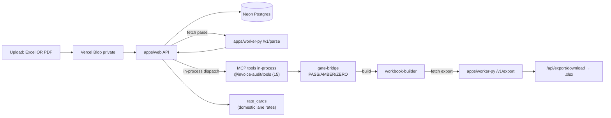
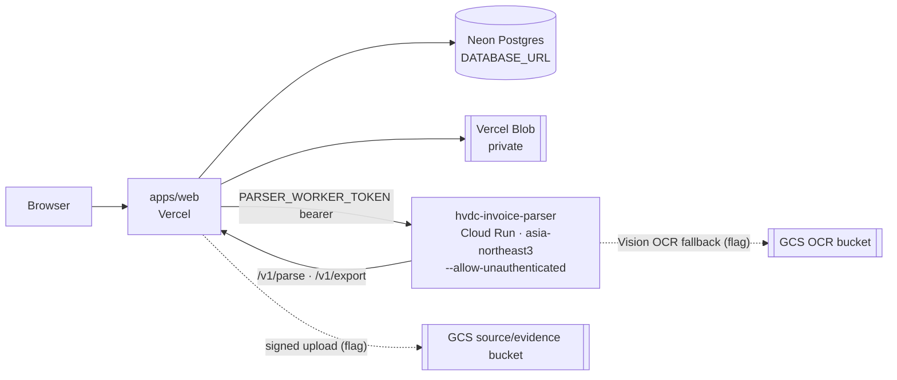

# System Architecture

## Overview

SCT Invoice Audit Platform — a 3-app architecture for HVDC invoice processing, cost-guard
validation, and approval-gate workflows in the Samsung C&T Abu Dhabi HVDC project.

The system turns an uploaded invoice/evidence set into parser-normalized lines, validation
findings, an approval verdict, and a 13-sheet Excel audit workbook. NotebookLM extraction is a
first-pass helper for review evidence only; the deterministic parser and audit gates remain
authoritative.

## Rule #0 — OR Intake & Final Excel Guarantee

> Highest-priority behavior (see [`CLAUDE.md`](./CLAUDE.md) §0). On conflict with any gate or
> verdict, Rule #0 wins.

Uploading an **Excel invoice OR a PDF** — either alone, or both — always produces a downloadable
13-sheet Excel audit pack. OR semantics, never AND:

- `xlsx`/`md`/`txt` present → it is the invoice source; PDFs are evidence.
- No structured doc → the first PDF becomes the invoice source; remaining PDFs are evidence.
- (2026-06-16) A native-text **DSV SHPT PDF** is parsed into **real `invoice_lines`** (doc-type +
  charge-line extraction), so PDF-only uploads can reach real validation instead of a forced AMBER.
- A PDF-only upload that still yields 0 lines (scanned / line-less PDF) routes to **AMBER /
  REVIEW_REQUIRED** (`NO_INVOICE_LINES_EXTRACTED`) and still exports — never rejected with 409.
- Verdict is always stamped in the workbook; blocked/unverified items are labeled, not withheld.

The intake decision lives in `apps/web/src/app/api/invoice-audit/run/route.ts`
(invoice-source selection + zero-lines guard).

## Components

| Component | Runtime | Host | Role |
|---|---|---|---|
| **apps/web** | Next.js 15 (App Router) | Vercel | Upload UI, audit workspace, API orchestration, gate + approval, workbook export dispatch, NotebookLM callback receiver. **Final audit authority.** |
| **apps/worker-py** | FastAPI (Python) | Google Cloud Run (**live in prod**: `dsv-invoice` / `asia-northeast3`, service `hvdc-invoice-parser`) | File parsing (xlsx/md/txt/pdf/pdf_json + DSV waybill; xlsx supports **DSV summary-matrix → charge-level line decomposition**; native-text **PDF runs the DSV SHPT hybrid parser → real `invoice_lines`**), PDF preflight + Google Vision OCR (flag-gated stub), 13-sheet workbook export, MarkItDown→NotebookLM orchestration |
| **apps/mcp-server** | Hono (TypeScript) | Google Cloud Run | Standalone MCP JSON-RPC server — 15 audit tools for external clients (ChatGPT, Claude Desktop). Not called during the web audit flow. |
| **packages/tools** | TypeScript (ESM) | — | **15 MCP validation tools — single source of truth**, shared by `apps/web` (in-process) and `apps/mcp-server` (JSON-RPC). Includes `domestic_lane_check` for domestic trucking lane/distance/short-run validation. |
| **packages/database** | TypeScript (ESM) | — | Postgres pool singleton (Neon) — shared by `apps/web` and `apps/mcp-server` |
| **packages/contracts** | TypeScript | — | Shared invoice, validation, and export Zod schemas |
| **packages/shared** | TypeScript | — | Hashing and redaction helpers |
| **packages/telemetry** | TypeScript | — | OpenTelemetry helpers, used by `apps/web` and `apps/mcp-server` |

## Data Flow



**Key routing decisions:**

- MCP validation for the web audit flow runs **in-process** inside `apps/web` (logic-identical
  port of the 15 tools the `validate()` flow calls). No network hop to `apps/mcp-server` during audit.
- `apps/mcp-server` is the **standalone** server for external clients (ChatGPT, Claude Desktop,
  Cursor) via JSON-RPC at `/mcp`.
- Parsing and export are always fetched from the Python worker.
- NotebookLM runs (flag-gated) call back into `apps/web` with an HMAC-signed summary.
- **DOMESTIC workflow** (2026-06-16): upload-form toggle sets `workflow_type` → worker parse
  extracts DSV waybill lane data → `check_rate_card` looks up `rate_cards` by composite lane key
  (origin||destination||vehicle||unit) → `domestic_lane_check` tool validates distance bands,
  short-run flags, rate variance → gate-bridge produces Korean action items. SHIPMENT-specific
  tools (HS/UAE, shipment_match, fx_policy, dem_det) are skipped for domestic.

## Database

| Store | Engine | Purpose | Binding |
|---|---|---|---|
| **Primary** | Neon Postgres | Job store, gate results, invoice lines, audit traces, rate cards (SHIPMENT charge codes + DOMESTIC lane keys with 139 ApprovedLaneMap entries), extraction artifacts/comparisons | `DATABASE_URL` |
| **Blob** | Vercel Blob (private) | Invoice/evidence file storage, export artifacts | `BLOB_READ_WRITE_TOKEN` |
| **Legacy** | Cloudflare D1 | Ontology WH-status projections — not used by invoice audit | `MCP_AUDIT_DB` |

In Vercel (`VERCEL=1`), `DATABASE_URL` is required — there is no in-memory job-store fallback in
production.

> **Updated: 2026-06-16** — New Postgres table `parse_source_data` (migration `0013`) holds the
> parser source rows that feed workbook sheet `90_Source_Data`. It is accessed via
> `getParseSourceData` / `setParseSourceData` in `apps/web/src/lib/job-store-pg.ts`.
> **Self-heal:** if the table is absent (`42P01`), the store degrades gracefully — reads return `[]`
> and writes create the table idempotently — so export and the Rule #0 download guarantee are never
> blocked by a missing table.

## Web / API Surface

### Pages (`apps/web/src/app/`)

| Path | Purpose |
|---|---|
| `/` | App entry page |
| `/invoice-audit` | Audit workspace |
| `/invoice-audit/upload` | Upload invoice + evidence |
| `/invoice-audit/jobs/[jobId]` | Job detail + review |
| `/fx-policies` | FX policy reference |

### API routes (`apps/web/src/app/api/`)

Browser-facing routes are public via middleware; all others require an `API_SECRET_KEY` Bearer token.

| Endpoint | Method | Purpose | Auth |
|---|---|---|---|
| `/api/files/ingest` | POST | Standard file upload | public |
| `/api/files/ingest/large` | POST | Large file upload path | public |
| `/api/files/create-upload-url` | POST | GCS signed upload URL (dev-stub; flag-gated) | public |
| `/api/files/confirm` | POST | Confirm uploaded file (sha256, gcs_uri) | public |
| `/api/invoice-audit/run` | POST | Run parser + validation pipeline | public |
| `/api/audit/status` | GET | Job status + last trace step | public |
| `/api/audit/trace` | GET | Audit trace records | public |
| `/api/audit/result` | GET | Audit result payload | public |
| `/api/audit/approve` | POST | Approval gate action | protected |
| `/api/audit/export` | POST | Build export artifact | public (browser-initiated) |
| `/api/export/download` | GET | Stream exported workbook | public |
| `/api/notebooklm/ingest-summary` | POST | Receive HMAC-signed NotebookLM summary | HMAC |
| `/api/fx-policy` | POST | FX policy check | public |
| `/mcp` | POST | In-process MCP tools endpoint | public |

> `/api/audit/export` and `/api/export/download` are public because the browser initiates the
> download directly. The export streams through the server (the private Blob `downloadUrl` 403s for
> anonymous navigation), satisfying the Rule #0 download guarantee.

## Worker Boundary (`apps/worker-py`)

> **Auth (Updated: 2026-06-16):** the Cloud Run service is deployed
> `--allow-unauthenticated` (`allUsers → run.invoker`) and protected at the
> **app layer** by the `PARSER_WORKER_TOKEN` bearer the web sends — not by Google
> IAM identity tokens. Deploying with `--no-allow-unauthenticated` strips the
> `allUsers` binding and breaks prod with a Cloud Run HTML 401 on `/v1/parse`.
> See `apps/worker-py/deploy-cloudrun.sh`. Request bodies on `/v1/parse` and
> `/v1/export` must stay schema-compatible with the web (`packages`/`apps/web`);
> the export row models use `extra='ignore'` to tolerate web-side enrichment fields.

| Endpoint | Method | Purpose |
|---|---|---|
| `/v1/parse` | POST | Parse uploaded file (xlsx/md/txt/pdf/pdf_json + DSV waybill). xlsx auto-detects the DSV summary-matrix layout (charge=column, shipment=row) and decomposes each non-empty charge cell into its own line (currency USD, `invoice_total` from the TOTAL AMOUNT (USD) row); falls back to the flat one-charge-per-row parser otherwise. **`pdf` runs the DSV SHPT hybrid parser → real `invoice_lines`** (doc-type + charge lines; reuses the pdfplumber text spans + table candidates, no 2nd pass). Aliases: `/parse` (deprecated), `/parse/pdf-json`. |
| `/v1/export` | POST | Build the 13-sheet audit workbook |
| `/v1/notebooklm/run` | POST | MarkItDown → NotebookLM first-pass orchestrator (callback to web) |
| `/v1/preflight` | POST | Classify a PDF (text/scanned/encrypted) → `recommended_route`, `requires_vision`, `requires_markitdown` *(flag-gated)* |
| `/v1/vision/start` | POST | Start Google Vision async OCR → `operation_name` (async, legacy) |
| `/v1/vision/collect` | POST | Collect Vision OCR result → `ocr_json_gcs_uri`, `page_count`, `confidence` (async, legacy) |
| `/v1/vision/run` | POST | **Sync OCR orchestrator** (start→poll→collect→normalize) → `VISION_RUN_COLLECTED` + `invoice_lines`/`evidence` *(prod operational 2026-06-17)* |
| `/health/ready` | GET | Readiness check (DB, blob, parser, memory) |
| `/health/live` | GET | Liveness check |

Vision routes register on the worker with no router prefix (`include_router(vision_router, prefix="")`);
each path already carries its own `/v1/` segment. Parse/export/notebooklm routers mount under `/v1`.

> **Updated: 2026-06-17** — Vision OCR operational in prod:
> - **Worker** serves `/v1/vision/run` (sync orchestrator), `/v1/vision/start` + `/v1/vision/collect` (async, legacy).
> - **Web run route**: sync `/v1/vision/run` replaces fire-and-forget. Scanned PDFs with `gs://` input → Vision OCR → evidence/lines merged before `cf.validate`.
> - **Generic PDF line extraction** (`extract_generic_invoice_lines`): non-DSV text PDFs produce `invoice_lines` (table-first, text-fallback).
> - **Worker `/health/ready`**: DB-optional graceful skip when `DATABASE_URL` unset (200, not 503).
>   **async Google Vision document-text-detection OCR fallback for `gs://` PDF evidence; OCR JSON is
>   written to GCS**, backed by `app/services/vision_client.py`, `vision_normalizer.py`, and
>   `v_vision_rules.py`.
> - **Web run route** (`apps/web/src/app/api/invoice-audit/run/route.ts`) triggers `/v1/vision/start`
>   for PDF evidence whose `blob_ref` is a `gs://` URI. It is flag-gated by `VISION_FALLBACK_ENABLED`
>   (default **OFF**), **fire-and-forget**, and **isolated** — it never changes the audit verdict.

**Worker = orchestrator only; Vercel = final audit + workbook.** Do not add final-verdict logic to
worker files. (2026-06-16, Phase 2.5 shipped via #35/#36) The `pdf` branch now runs the **DSV SHPT
hybrid parser** (`app/parsers/dsv_pdf_hybrid.py`) and returns **real `invoice_lines`** (doc-type
classification + charge-line extraction) — PDF-only intake reaches real validation rather than a
forced AMBER. Only scanned / line-less PDFs (0 lines extracted) still land in AMBER review. Note the
separate `pdf_json` branch still returns `invoice_lines=[]` (evidence candidates only). Parsing stays
in the worker; the final verdict remains in Vercel (`gate-bridge.ts`).

## Extraction & Vision (prod operational since 2026-06-17)

Scanned/low-text PDFs processed through Google Vision OCR (GCS upload path) and generic
PDF line extraction for text-based PDFs.
before validation. It is **off by default** and ships as stubs; with all flags off, the standard
parse → validate → export path is unchanged.

| Piece | Location | Status |
|---|---|---|
| PDF preflight | `apps/worker-py/app/routes/vision.py` (`/v1/preflight`) | Classifies text/scanned/encrypted, recommends route |
| Vision client | `apps/worker-py/app/services/vision_client.py` | Google Cloud Vision async document text detection. Prod operational (`VISION_ENABLED=true`, `DOCUMENT_TEXT_DETECTION`) |
| Vision normalizer | `apps/worker-py/app/services/vision_normalizer.py` | OCR JSON → EvidenceCandidate + invoice fields (hash-only) |
| GCS upload | `apps/web/src/app/api/files/create-upload-url` + `confirm` | **Dev-stub** local URL until GCS configured |
| Artifact tracking | `extraction_artifacts`, `extraction_comparisons` (migration `0012`) | Stores sha256/confidence/GCS URI only — never raw text |

**Flags (real env names):** `VISION_ENABLED` (default false), `GOOGLE_CLOUD_PROJECT`,
`MARKITDOWN_MCP_URL` (MarkItDown path), `NOTEBOOKLM_ENABLED` (default false). New worker deps:
`google-cloud-vision>=3.7`, `google-cloud-storage>=2.16`, `google-auth>=2.32`.

> **Updated: 2026-06-16** — GCS signed upload path: `apps/web/src/lib/gcs-upload.ts` plus the
> `/api/files/create-upload-url` route provide a **signed GCS upload target**, flag-gated by
> `isGcsUploadEnabled`. This feeds `gs://` evidence refs that the run route can hand to the Vision
> OCR fallback above. The web→worker Vision trigger is gated separately by `VISION_FALLBACK_ENABLED`.

## MCP Validation Tools

**Single source of truth:** `packages/tools/src/` (14 tools), imported by both `apps/web`
(in-process) and `apps/mcp-server` (JSON-RPC). No code duplication. During the web audit,
`apps/web/src/lib/cf-mcp-client.ts` orchestrates all **14** tools in-process — **fail-soft**: a
failing tool is recorded `SKIPPED`/`ERROR` in the trace and never blocks the pipeline (Rule #0).

`route_question`, `normalize_invoice_lines`, `check_duplicate_invoice`, `match_shipment_reference`,
`check_rate_card` (+ `check_rate_card_batch`), `check_contract_validity`, `check_evidence_required`,
`check_tax_vat`, `check_fx_policy`, `check_cost_guard`, `build_validation_explanation`,
`classify_type_b`, `check_hs_uae_compliance`, `check_dem_det`.

**Batch validation:** `check_rate_card_batch({checks: [{charge_code, lane, rate}, ...]})` collapses
N per-line calls into one query — significant latency reduction for high-volume invoices.

## Approval Gate Model

```
PASS   — All gates clear, ready for export
AMBER  — Warning findings, reviewer approval required (export still available per Rule #0)
ZERO   — Blocking findings, labeled in the workbook; Review Pack export still downloadable
FAILED — Fatal error (parser failure, missing data)
```

`gate-bridge.ts` enforces 3-way reconciliation: `Final Subtotal = Line_Audit = TYPE-B` (±0.01
tolerance). Per Rule #0, a final Excel is always produced; unverified/blocked items are labeled
inside the workbook rather than withheld.

## 13-Sheet Workbook Contract

Exact order — do not rename, remove, reorder, or hide:

`00_Decision` → `01_Action_Items` → `02_Final_Recon` → `03_Header_Check` → `04_Line_View` →
`05_Duplicate_Check` → `06_Rate_Check` → `07_Tax_FX_Check` → `08_Shipment_Match` →
`90_Source_Data` → `91_Audit_Detail` → `92_Evidence_Issues` → `99_Manifest`

Assembled by `apps/web/src/lib/workbook-builder.ts`; rendered to xlsx by the worker `/v1/export`.

> **Updated: 2026-06-16** — The worker `ExportRequest` now carries `manifest_entries`
> (`source_hash_status` → workbook sheet `99_Manifest`), so source-hash cross-check status is
> surfaced in the final manifest.

## Deployment

### Topology (Updated: 2026-06-16)



> The worker is publicly invokable at the IAM layer (`--allow-unauthenticated`)
> and protected by the `PARSER_WORKER_TOKEN` app bearer — see the Worker Boundary
> Auth note. Dashed edges are flag-gated paths (default off).

| App | Host | Status | Workflow |
|---|---|---|---|
| apps/web | Vercel | Live (`sct-ontology-invoice-audit.vercel.app`) | `.github/workflows/vercel-prod.yml` |
| apps/worker-py | Google Cloud Run | **Live** — `hvdc-invoice-parser` (`dsv-invoice`/`asia-northeast3`). ⚠ Deployed `--allow-unauthenticated`; the worker does **not** yet validate the `PARSER_WORKER_TOKEN` it receives — a known hardening gap (see Security). `PARSER_WORKER_URL` → its `*.run.app` URL. | `apps/worker-py/deploy-cloudrun.sh` |
| apps/mcp-server | Google Cloud Run | Not deployed yet (worker alone serves the audit flow) | `apps/mcp-server/deploy-cloudrun.sh` |

> Worker deploy detail (URL, public-auth caveat, the BuildKit Dockerfile fix):
> [`docs/20260615_cloud-run-migration-runbook.md`](./docs/20260615_cloud-run-migration-runbook.md) §11.

> **Updated: 2026-06-16** — Cloud Run worker revision context is current: service
> `hvdc-invoice-parser`, project `dsv-invoice`, region `asia-northeast3` (now also serving the Vision
> OCR fallback routes above).

CI: `web-ci.yml`, `python-worker-ci.yml`, `release-gate.yml`, `vercel-preview.yml`, `codeql.yml`,
`reliability.yml`, `secret-scan.yml`.

Production alias: `sct-ontology-invoice-audit.vercel.app`.

### Required Vercel environment variables (`apps/web`)

| Variable | Required | Purpose |
|---|---|---|
| `DATABASE_URL` | Yes | Neon Postgres (pooled). No in-memory fallback when `VERCEL=1`. |
| `BLOB_READ_WRITE_TOKEN` | Yes | Vercel Blob token (private store) for uploads, signed worker downloads, export artifacts. |
| `PARSER_WORKER_URL` or `WORKER_URL` | Yes | Worker base URL (`PARSER_WORKER_URL` precedence). Run route accepts only `localhost`, `127.0.0.1`, `.run.app`, `.internal`, `.vercel.app` hosts. |
| `PARSER_WORKER_TOKEN` | Yes | Bearer token `apps/web` sends to the worker. |
| `API_SECRET_KEY` | Yes | Bearer secret enforced by middleware on non-public API routes. |
| `WEB_CALLBACK_URL` / `NOTEBOOKLM_CALLBACK_SECRET` | If NotebookLM on | Worker→web callback URL + HMAC secret. |

Never store raw invoices, contract rates, TRN, BOE, BL, container numbers, personal data, or other
sensitive evidence in environment variables.

## Security

> DLP policy (2026-06-15): no new DLP module is added to the system; the prior P2 DLP ruleset was
> removed. The protections below are baseline handling rules, not a DLP gate.

- All invoice/evidence files → **private** Vercel Blob only. The worker fetches private files via
  signed/server-side download; exports stream through `/api/export/download`.
- Raw file content is never sent to LLM prompts.
- **Updated: 2026-06-16** — `packages/telemetry` now redacts span attributes via `src/redaction.ts`,
  so sensitive values are masked before OpenTelemetry export.
- Approval gates remain for AMBER and ZERO findings.
- **Content-Security-Policy** is set in `apps/web/next.config.js`:
  `default-src 'self'; script-src 'self' 'unsafe-inline'; style-src 'self' 'unsafe-inline';
  connect-src 'self' https://*.vercel-storage.com https://*.neon.tech; img-src 'self' data: blob:
  https:; frame-ancestors 'none'; font-src 'self'` — restricts XSS, framing, and outbound
  connections to Vercel Blob + Neon only.
- `.gitignore` excludes `**/private/**`, `**/DSV_SHIPMENT_FULL_PACKAGE_*/**`, and PII template
  patterns. Never commit secrets, raw rates, or P2 identifiers.
- ⚠ **Worker auth hardening (OPEN):** `apps/worker-py` is deployed `--allow-unauthenticated` and does
  **not** validate the `PARSER_WORKER_TOKEN` the web app sends; `/v1/parse` fetches a caller-supplied
  `blob_url` server-side (`_fetch_blob`). As-is this is a public parser/export service for private
  audit data plus an arbitrary-URL fetch (SSRF) surface. Before treating public exposure as
  acceptable: restrict the service to `apps/web` via Cloud Run IAM (ID-token, as done for
  `markitdown-mcp`) **or** enforce bearer-token validation in the worker, and constrain `blob_url` to
  the allowed private Blob host.

## Verification Baseline (2026-06-16)

| Component | Tests | Typecheck |
|---|---|---|
| apps/web | 331 | 0 errors |
| apps/worker-py | 209 | py_compile OK |
| **Total** | **540** | **0 errors** |

> Incl. sync Vision OCR tests, generic PDF line extraction, DSV SHPT hybrid, Vision OCR fallback.
> Prior baseline (2026-06-16): web 195, worker-py 195 = 390. (mcp-server 186 excluded, unchanged.)

## History

The platform originally ran as a single Cloudflare Worker serving the SCT ontology ChatGPT App with
D1-backed MCP tools, corpus search, and Decision Card widgets. That runtime was decommissioned and
replaced by the current `apps/web` + `apps/worker-py` + `apps/mcp-server` architecture; legacy D1
migrations `0001-0007` remain in the repo for reference only (current migrations `0008-0013` target
Neon Postgres). Full change history: [`CHANGELOG.md`](./CHANGELOG.md).
