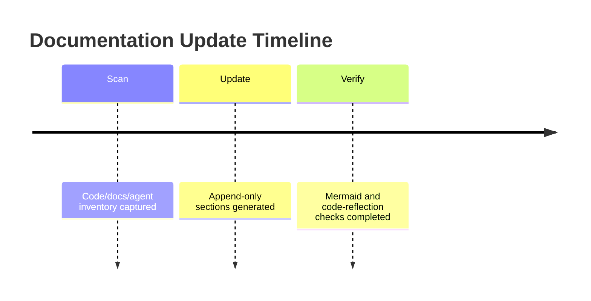

# Changelog

## Documented Current State - 2026-05-25

### Added

- Added synchronized project-doc-pipeline documents under `docs/` for architecture, layout, changelog, and guide coverage.
- Documented `get_hvdc_case_status` case-card behavior and warehouse status D1 projection commands.
- Documented Widget v10 operational behavior and focused widget troubleshooting.

### Changed

- Current documentation baseline now reflects Cloudflare Worker runtime, `ui://hvdc/answer-card-v10.html`, Case Status Card rendering, and WH status D1/SSOT workflow.
- The root historical docs remain in place for continuity, while `docs/SYSTEM_ARCHITECTURE.md`, `docs/LAYOUT.md`, and `docs/GUIDE.md` provide concise current-state docs.

### Fixed

- Documented the latest widget containment fix for Case Status Card tables and `canonicalEvents` horizontal scrolling inside the card.

### Verified

- `npm run worker:deploy` executed `npm run verify` before deployment.
- Verification baseline: 22 test files and 302 tests passed.
- Cloudflare Worker deployed at `https://hvdc-ontology-chatgpt-app.mscho715.workers.dev`.
- `/healthz` returned HTTP 200.
- `/mcp get_hvdc_case_status caseNo=207721` returned `WHCASE-207721`, `WARN`, `M100_FINAL_DELIVERED`, `canonicalEvents=6`, `caseCard=36`, and output template `ui://hvdc/answer-card-v10.html`.

## Codex Documentation Update — 2026-06-13T18:20:29.442785+00:00

**Update policy:** existing content above this section is preserved. This section was appended after scanning code, documentation, config, and agent profile files.

**Purpose:** This section records the documentation refresh event without altering earlier changelog entries.

### Evidence inventory

**Source/code files sampled:**
- `apps\mcp-server\src\__tests__\router.test.ts`
- `apps\mcp-server\src\__tests__\schema-contract.test.ts`
- `apps\mcp-server\src\db.ts`
- `apps\mcp-server\src\main.ts`
- `apps\mcp-server\src\schemas\dlp-guard.ts`
- `apps\mcp-server\src\tools\__tests__\build_validation_explanation.test.ts`
- `apps\mcp-server\src\tools\__tests__\check_contract_validity.test.ts`
- `apps\mcp-server\src\tools\__tests__\check_cost_guard.test.ts`
- `apps\mcp-server\src\tools\__tests__\check_duplicate_invoice.test.ts`
- `apps\mcp-server\src\tools\__tests__\check_evidence_required.test.ts`
- `apps\mcp-server\src\tools\__tests__\check_fx_policy.test.ts`
- `apps\mcp-server\src\tools\__tests__\check_rate_card.test.ts`

**Documentation files sampled:**
- `.vercel\README.txt`
- `20260613_job_store_mcp_fix_plan.md`
- `apps\README.md`
- `apps\graphify-out\GRAPH_REPORT.md`
- `apps\graphify-out\converted\sample-invoice_c70e590b.md`
- `apps\web\.vercel\README.txt`
- `apps\worker-py\README.md`
- `apps\worker-py\invoice_audit_parser.egg-info\SOURCES.txt`
- `apps\worker-py\invoice_audit_parser.egg-info\dependency_links.txt`
- `apps\worker-py\invoice_audit_parser.egg-info\requires.txt`
- `apps\worker-py\invoice_audit_parser.egg-info\top_level.txt`
- `docs\# 3-Way 교차검증 보고서 (graph × 개발 현황 보고서 × Invoice Audit Platform v1.00).md`

**Config/build files sampled:**
- `.codex\root-docs-scan.json`
- `.github\dependabot.yml`
- `.github\workflows\codeql.yml`
- `.github\workflows\fly-worker-deploy.yml`
- `.github\workflows\python-worker-ci.yml`
- `.github\workflows\release-gate.yml`
- `.github\workflows\vercel-preview.yml`
- `.github\workflows\vercel-prod.yml`
- `.github\workflows\web-ci.yml`
- `.vercel\project.json`
- `apps\graphify-out\graph.json`
- `apps\mcp-server\package-lock.json`

**Agent profile files sampled:**
- No agent profile detected; this update records the absence explicitly.

### Mermaid graph

### Verification notes

- Append-only update generated by `root-docs-batch-update`.
- Code/config/doc/agent inventory counts: code=171, docs=99, config=264, agent_profiles=0.
- Follow-up verification should confirm that newly added text matches actual implementation paths listed above.
