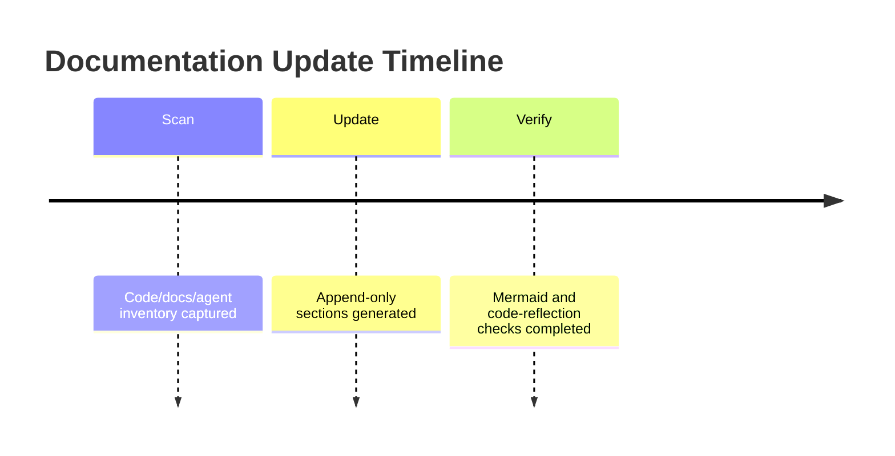

# Changelog

## NotebookLM MCP Runtime Triage and Live Smoke Hardening - 2026-06-14

### Added

- Registered the user-provided NotebookLM URL in the local NotebookLM MCP library:
  - URL: `https://notebooklm.google.com/notebook/2b70c1f5-6e08-47bb-801b-a3618004c3b5`
  - Local notebook id: `invoice-audit-smoke-notebook`
- Set Windows User env `NOTEBOOKLM_DEFAULT_NOTEBOOK_ID=invoice-audit-smoke-notebook`.
- Started NotebookLM MCP over Streamable HTTP at `http://127.0.0.1:3003/mcp`.
- Started MarkItDown MCP over Streamable HTTP at `http://127.0.0.1:3001/mcp`.
- Added live smoke coverage for the real worker path:
  - local temporary PDF served over HTTP
  - MarkItDown MCP conversion
  - NotebookLM MCP source insertion attempt
  - worker callback path status reporting
- Added false-positive protection for NotebookLM MCP tool failures.
- Added callback rejection handling so `4xx` or `5xx` callback responses are no longer reported as successful `CALLBACK_SENT`.
- Added nested NotebookLM MCP error extraction so failures under `data.result.message` are surfaced instead of collapsed to a generic error.

### Changed

- Updated the worker MCP client to use the current Python MCP SDK Streamable HTTP contract.
- Replaced unsupported `streamable_http_client(..., timeout=...)` usage with an injected `httpx.AsyncClient`.
- Enabled `follow_redirects=True` for MCP HTTP calls so MarkItDown `/mcp` -> `/mcp/` redirects work.
- Updated NotebookLM `add_source` calls to use the real upstream schema:
  - before: `{"type": "text", "text": "..."}`
  - after: `{"type": "text", "content": "..."}`
- Propagated `NOTEBOOKLM_DEFAULT_NOTEBOOK_ID` into both `add_source` and `ask_question`.
- Hardened `NotebookLmOrchestrator.run()` result states:
  - `NOTEBOOKLM_TOOL_FAILED` for upstream MCP `success:false`
  - `CALLBACK_REJECTED` for callback HTTP status `>=400`
- Updated tests to cover:
  - MCP SDK timeout argument mismatch
  - `add_source.content` argument mapping
  - nested upstream tool failure messages
  - callback rejection not being treated as success

### Fixed

- Fixed the first runtime blocker: MCP Python SDK rejected the old `timeout` keyword.
- Fixed the second runtime blocker: NotebookLM MCP rejected the old `text` field for `add_source`.
- Fixed MarkItDown runtime wrapper failure caused by `307 Temporary Redirect` on `/mcp`.
- Fixed a false-success bug where NotebookLM `{"success":false,...}` output was treated as a source id.
- Fixed a false-success bug where callback `404` still returned `CALLBACK_SENT`.
- Fixed worker error reporting so the actual upstream selector timeout can be seen in worker output.

### Verified

- NotebookLM MCP `setup_auth` was executed with a visible browser and returned:
  - `success: true`
  - `status: authenticated`
  - `authenticated: true`
- NotebookLM MCP `list_notebooks` returned the registered notebook `invoice-audit-smoke-notebook`.
- MarkItDown MCP worker wrapper call succeeded:
  - `worker_markitdown=OK`
- NotebookLM MCP worker wrapper call succeeded for `list_notebooks`:
  - `worker_notebooklm=OK`
- Focused worker tests passed:
  - `python -m pytest tests/test_notebooklm_mcp_client.py tests/test_notebooklm_orchestrator.py tests/test_notebooklm_route.py -q` -> 21 passed
- Full worker test suite passed:
  - `python -m pytest tests/ -q` -> 129 passed
- `git diff --check` reported no patch errors for touched NotebookLM worker files.

### Current Live Smoke Result

- Live smoke now fails honestly instead of reporting false success.
- Current result:
  - `status: NOTEBOOKLM_UNAVAILABLE`
  - `error_code: NOTEBOOKLM_TOOL_FAILED`
  - detail includes upstream UI automation timeout from NotebookLM MCP.
- Direct upstream `add_source` call after authentication returned:
  - `success: false`
  - `sourceCountBefore: 0`
  - `sourceCountAfter: 0`
  - `locator.waitFor: Timeout 10000ms exceeded`
  - waiting for `locator('[role="dialog"]').first()` to become visible
  - hidden dialog matched first: `aria-label="이모티콘 문자 팔레트"`

### Upstream Findings

- Confirmed the current failure is already represented upstream.
- Relevant upstream issue:
  - `PleasePrompto/notebooklm-mcp#46`
  - covers empty-notebook `add_source` bootstrap failure and post-bootstrap source insertion failure.
- Relevant upstream PR:
  - `PleasePrompto/notebooklm-mcp#53`
  - directly matches this session's failure.
  - identifies hidden Emoji dialog false-positive from broad `[role="dialog"]` selector.
  - proposes scoping to visible dialogs and excluding Emoji palette dialogs.
- Additional relevant upstream PR:
  - `PleasePrompto/notebooklm-mcp#55`
  - updates current Add sources picker handling.
- No merged upstream fix was confirmed in `npx notebooklm-mcp@latest` during this session.

### Remaining Risks

- `npx notebooklm-mcp@latest` can still fail until upstream PR #53 or #55 is merged and released.
- Local live smoke cannot complete end-to-end while upstream `add_source` cannot add a source to the notebook.
- Real Vercel callback success still requires:
  - a real audit job id
  - matching `NOTEBOOKLM_CALLBACK_SECRET` on the worker and Vercel deployment
  - successful NotebookLM source insertion and JSON extraction
- This changelog intentionally does not include raw PDF body, raw Markdown body, or callback secret values.

### Next Candidate Action

- Apply PR #53 or PR #55 locally to the NotebookLM MCP package or run from the contributor branch, then rerun live smoke.

## NotebookLM Worker Gate and Documentation Refresh - 2026-06-14

### Added

- Added the NotebookLM worker gate implementation in commit `83d96d2`.
- Added worker-side first-pass extraction orchestration through `POST /v1/notebooklm/run`.
- Added web-side HMAC callback intake through `POST /api/notebooklm/ingest-summary`.
- Added `apps/worker-py/scripts/notebooklm_live_smoke.py` for env-backed live MCP/callback smoke verification.

### Changed

- Refreshed root documentation for the NotebookLM worker gate in commit `c674724`.
- Removed DLP references from the AGENTS patch in commit `fb16a92`.
- Updated README and GUIDE to describe the parser-authoritative NotebookLM helper path, required environment variables, and focused verification commands.

### Verified

- Pushed commits to `origin/main`: `83d96d2`, `c674724`, `fb16a92`.
- Worker tests: `python -m pytest tests/ -q` -> 123 passed.
- NotebookLM worker focused tests: `python -m pytest -q -o addopts='' tests/test_notebooklm_extractor.py tests/test_notebooklm_mcp_client.py tests/test_notebooklm_orchestrator.py` -> 25 passed.
- NotebookLM worker route tests: `python -m pytest -q -o addopts='' tests/test_notebooklm_route.py` -> 3 passed.
- Live smoke helper without env: `python scripts/notebooklm_live_smoke.py --job-id test_job --blob-url http://test/blob.pdf` -> `ENV_MISSING`.
- NotebookLM web callback tests: `npx vitest run tests/api-notebooklm-ingest-summary.test.ts` -> 12 passed.
- Web typecheck: `pnpm --filter @invoice-audit/web typecheck` -> pass.
- Root docs verification: `root_docs_batch_update.py verify` -> passed, score 100.0.

### Unverified

- Real MarkItDown MCP, NotebookLM MCP, and persistent Chrome host deployment were not verified in this session.
- Current NotebookLM confidence is based on mocked worker tests and web callback tests, not a live NotebookLM browser session.

## Documented Current State - 2026-05-25

### Added

- Added synchronized project-doc-pipeline documents under `docs/` for architecture, layout, changelog, and guide coverage.
- Documented `get_hvdc_case_status` case-card behavior and warehouse status D1 projection commands.
- Documented Widget v10 operational behavior and focused widget troubleshooting.

### Changed

- Current documentation baseline now reflects Cloudflare Worker runtime, `ui://hvdc/answer-card-v10.html`, Case Status Card rendering, and WH status D1/SSOT workflow.
- The root historical docs remain in place for continuity, while `docs/SYSTEM_ARCHITECTURE.md`, `docs/LAYOUT.md`, and `docs/GUIDE.md` provide concise current-state docs.

### Fixed

- Documented the latest widget containment fix for Case Status Card tables and `canonicalEvents` horizontal scrolling inside the card.

### Verified

- `npm run worker:deploy` executed `npm run verify` before deployment.
- Verification baseline: 22 test files and 302 tests passed.
- Cloudflare Worker deployed at `https://hvdc-ontology-chatgpt-app.mscho715.workers.dev`.
- `/healthz` returned HTTP 200.
- `/mcp get_hvdc_case_status caseNo=207721` returned `WHCASE-207721`, `WARN`, `M100_FINAL_DELIVERED`, `canonicalEvents=6`, `caseCard=36`, and output template `ui://hvdc/answer-card-v10.html`.

## SESS-005 — Cross-validation & Track 1↔Track 2 Gap Patching (2026-06-13)

### Added
- DSV Waybill parser port: `apps/worker-py/app/parsers/dsv_waybill.py` (8 core functions from Track 1, 28 tests)
- `classify_type_b` MCP tool (8-class priority classification, Track 1 `TYPE_B_Rules` port)
- `check_hs_uae_compliance` MCP tool (BOE validation, HS code format check)
- `check_dem_det` MCP tool (DEM/DET evidence requirement check, final settlement ZERO trigger)
- `checkReconciliation()` 3-way tie-out in gate-bridge (Final Subtotal = Line_Audit = TYPE-B ±0.01)
- `checkDlpExport()` DLP scan in export pipeline (violations → ZERO block)
- `scanWorkbook()` DLP scanner method (16 P2 categories)
- InvoiceHeader field extraction in xlsx parser (invoice_no, vendor, issue_date from Excel)
- xlsx parser column expansion (shipment_ref, job_number, rate_basis, for_charge_component)
- `rate_cards` DB seed script (20 HVDC rate records, 6 charge types)
- `present_evidence` input for evidence_required tool (end-to-end evidence tracking)
- `applied_rate` input for rate_card tool (variance calculation now functional)
- evidence finding merge into final gate verdict (doc_guardian → ZERO/AMBER escalation)
- event tracking trace to SESS-005

### Changed
- MCP tools: 11 → 14 (all 14 with tests and typecheck)
- numeric_integrity verdict: AMBER → ZERO (aligned with Track 1 hard_blocker #11)
- gate-bridge now accepts `evidenceFindings` and `checkReconciliation`
- cf-mcp-client orchestrates `classify_type_b` and `check_hs_uae_compliance` per line
- DLP scanner: 12 → 16 P2 categories (added VESSEL_VOYAGE, APPROVAL_TEXT, INTERNAL_AMOUNT, DUPLICATE_INVOICE)
- BLOB_HEALTHCHECK_URL default → empty string (graceful skip when unset)
- web job detail page restored API fetch (in-memory STORE failed on Vercel serverless)
- vercel deploy workflow: `working-directory: apps/web` + pnpm

### Fixed
- P0: `check_rate_card.ts:68` dead code (`appliedRate=null` → uses input)
- P0: `check_evidence_required.ts:35` dead code (`present=[]` → uses input)
- P0: upload-form large file routing (>4.5MB → `/api/files/ingest/large`)
- P1: numeric_integrity verdict inconsistency (AMBER → ZERO)
- P1: 3-way reconciliation tie-out added to buildGateResult flow
- P1: rate_cards DB seed created

### Removed
- 11 dependabot PRs closed (version bumps deferred)
- `BLOB_HEALTHCHECK_URL` dummy fallback `http://127.0.0.1:65535/health-probe-dummy`

### Verified
- Worker-PY: 95 tests PASS
- MCP Server: 186 tests PASS (15 test files)
- Web: 107 tests, 24 test files (2 cf-mcp-client tests require live CF worker)
- Typecheck: 0 errors across all components
- Cross-validation: Track 1 9 gates → 8 FULL, 1 P3 (Harness/RTM, CI-dependent)
- Commit: `3cb5c13`, 20 commits in SESS-005

## Codex Documentation Update — 2026-06-13T18:20:29.442785+00:00

**Update policy:** existing content above this section is preserved. This section was appended after scanning code, documentation, config, and agent profile files.

**Purpose:** This section records the documentation refresh event without altering earlier changelog entries.

### Evidence inventory

**Source/code files sampled:**
- `apps\mcp-server\src\__tests__\router.test.ts`
- `apps\mcp-server\src\__tests__\schema-contract.test.ts`
- `apps\mcp-server\src\db.ts`
- `apps\mcp-server\src\main.ts`
- `apps\mcp-server\src\schemas\dlp-guard.ts`
- `apps\mcp-server\src\tools\__tests__\build_validation_explanation.test.ts`
- `apps\mcp-server\src\tools\__tests__\check_contract_validity.test.ts`
- `apps\mcp-server\src\tools\__tests__\check_cost_guard.test.ts`
- `apps\mcp-server\src\tools\__tests__\check_duplicate_invoice.test.ts`
- `apps\mcp-server\src\tools\__tests__\check_evidence_required.test.ts`
- `apps\mcp-server\src\tools\__tests__\check_fx_policy.test.ts`
- `apps\mcp-server\src\tools\__tests__\check_rate_card.test.ts`

**Documentation files sampled:**
- `.vercel\README.txt`
- `20260613_job_store_mcp_fix_plan.md`
- `apps\README.md`
- `apps\graphify-out\GRAPH_REPORT.md`
- `apps\graphify-out\converted\sample-invoice_c70e590b.md`
- `apps\web\.vercel\README.txt`
- `apps\worker-py\README.md`
- `apps\worker-py\invoice_audit_parser.egg-info\SOURCES.txt`
- `apps\worker-py\invoice_audit_parser.egg-info\dependency_links.txt`
- `apps\worker-py\invoice_audit_parser.egg-info\requires.txt`
- `apps\worker-py\invoice_audit_parser.egg-info\top_level.txt`
- `docs\# 3-Way 교차검증 보고서 (graph × 개발 현황 보고서 × Invoice Audit Platform v1.00).md`

**Config/build files sampled:**
- `.codex\root-docs-scan.json`
- `.github\dependabot.yml`
- `.github\workflows\codeql.yml`
- `.github\workflows\fly-worker-deploy.yml`
- `.github\workflows\python-worker-ci.yml`
- `.github\workflows\release-gate.yml`
- `.github\workflows\vercel-preview.yml`
- `.github\workflows\vercel-prod.yml`
- `.github\workflows\web-ci.yml`
- `.vercel\project.json`
- `apps\graphify-out\graph.json`
- `apps\mcp-server\package-lock.json`

**Agent profile files sampled:**
- No agent profile detected; this update records the absence explicitly.

### Mermaid graph

### Verification notes

- Append-only update generated by `root-docs-batch-update`.
- Code/config/doc/agent inventory counts: code=171, docs=99, config=264, agent_profiles=0.
- Follow-up verification should confirm that newly added text matches actual implementation paths listed above.

## Codex Documentation Update — 2026-06-13T21:10:45.952547+00:00

**Update policy:** existing content above this section is preserved. This section was appended after scanning code, documentation, config, and agent profile files.

**Purpose:** This section records the documentation refresh event without altering earlier changelog entries.

### Evidence inventory

**Source/code files sampled:**
- `apps\mcp-server\db\migrate-rate-cards.sql`
- `apps\mcp-server\db\seed-rate-cards.sql`
- `apps\mcp-server\src\__tests__\router.test.ts`
- `apps\mcp-server\src\__tests__\schema-contract.test.ts`
- `apps\mcp-server\src\db.ts`
- `apps\mcp-server\src\main.ts`
- `apps\mcp-server\src\schemas\dlp-guard.ts`
- `apps\mcp-server\src\tools\__tests__\build_validation_explanation.test.ts`
- `apps\mcp-server\src\tools\__tests__\check_contract_validity.test.ts`
- `apps\mcp-server\src\tools\__tests__\check_cost_guard.test.ts`
- `apps\mcp-server\src\tools\__tests__\check_dem_det.test.ts`
- `apps\mcp-server\src\tools\__tests__\check_duplicate_invoice.test.ts`

**Documentation files sampled:**
- `.vercel\README.txt`
- `20260613_cross_validation_report.md`
- `20260613_dsv_waybill_port_plan.md`
- `20260613_job_store_mcp_fix_plan.md`
- `20260613_p2_gap_design.md`
- `README.md`
- `apps\README.md`
- `apps\graphify-out\GRAPH_REPORT.md`
- `apps\graphify-out\converted\sample-invoice_c70e590b.md`
- `apps\web\.vercel\README.txt`
- `apps\worker-py\README.md`
- `apps\worker-py\invoice_audit_parser.egg-info\SOURCES.txt`

**Config/build files sampled:**
- `.claude\settings.local.json`
- `.codex\root-docs-scan.json`
- `.codex\root-docs-write.json`
- `.github\dependabot.yml`
- `.github\workflows\codeql.yml`
- `.github\workflows\fly-worker-deploy.yml`
- `.github\workflows\python-worker-ci.yml`
- `.github\workflows\release-gate.yml`
- `.github\workflows\vercel-preview.yml`
- `.github\workflows\vercel-prod.yml`
- `.github\workflows\web-ci.yml`
- `.vercel\project.json`

**Agent profile files sampled:**
- No agent profile detected; this update records the absence explicitly.

### Mermaid graph

### Verification notes

- Append-only update generated by `root-docs-batch-update`.
- Code/config/doc/agent inventory counts: code=182, docs=108, config=451, agent_profiles=0.
- Follow-up verification should confirm that newly added text matches actual implementation paths listed above.

## Codex Documentation Update — 2026-06-14T09:41:25.480989+00:00

**Update policy:** existing content above this section is preserved. This section was appended after scanning code, documentation, config, and agent profile files.

**Purpose:** This section records the documentation refresh event without altering earlier changelog entries.

### Evidence inventory

**Source/code files sampled:**
- `apps\mcp-server\db\migrate-rate-cards.sql`
- `apps\mcp-server\db\seed-rate-cards.sql`
- `apps\mcp-server\src\__tests__\router.test.ts`
- `apps\mcp-server\src\__tests__\schema-contract.test.ts`
- `apps\mcp-server\src\db.ts`
- `apps\mcp-server\src\main.ts`
- `apps\mcp-server\src\schemas\dlp-guard.ts`
- `apps\mcp-server\src\telemetry.ts`
- `apps\mcp-server\src\tools\__tests__\build_validation_explanation.test.ts`
- `apps\mcp-server\src\tools\__tests__\check_contract_validity.test.ts`
- `apps\mcp-server\src\tools\__tests__\check_cost_guard.test.ts`
- `apps\mcp-server\src\tools\__tests__\check_dem_det.test.ts`

**Documentation files sampled:**
- `.hermes\plans\auto-20260614-013800.md`
- `.vercel\README.txt`
- `20260613_cross_validation_report.md`
- `20260613_dsv_waybill_port_plan.md`
- `20260613_job_store_mcp_fix_plan.md`
- `20260613_p2_gap_design.md`
- `20260614_api_inventory_design_audit_v1.md`
- `20260614_db_schema_swarm_scout.md`
- `20260614_documentation_audit_swarm_scout.md`
- `20260614_performance_optimization_plan_v1.md`
- `20260614_phase2_plan.md`
- `20260614_phase3_4_work_log.md`

**Config/build files sampled:**
- `.claude\settings.local.json`
- `.codex\root-docs-scan.json`
- `.codex\root-docs-write.json`
- `.github\dependabot.yml`
- `.github\workflows\_ts-checks.yml`
- `.github\workflows\codeql.yml`
- `.github\workflows\fly-mcp-server-deploy.yml`
- `.github\workflows\fly-worker-deploy.yml`
- `.github\workflows\python-worker-ci.yml`
- `.github\workflows\release-gate.yml`
- `.github\workflows\reliability.yml`
- `.github\workflows\secret-scan.yml`

**Agent profile files sampled:**
- No agent profile detected; this update records the absence explicitly.

### Mermaid graph

### Verification notes

- Append-only update generated by `root-docs-batch-update`.
- Code/config/doc/agent inventory counts: code=259, docs=157, config=520, agent_profiles=0.
- Follow-up verification should confirm that newly added text matches actual implementation paths listed above.

## Codex Documentation Update — 2026-06-14T20:22:02.604306+00:00

**Update policy:** existing content above this section is preserved. This section was appended after scanning code, documentation, config, and agent profile files.

**Purpose:** This section records the documentation refresh event without altering earlier changelog entries.

### Evidence inventory

**Source/code files sampled:**
- `apps\mcp-server\db\migrate-rate-cards.sql`
- `apps\mcp-server\db\seed-rate-cards.sql`
- `apps\mcp-server\src\__tests__\router.test.ts`
- `apps\mcp-server\src\__tests__\schema-contract.test.ts`
- `apps\mcp-server\src\db.ts`
- `apps\mcp-server\src\main.ts`
- `apps\mcp-server\src\schemas\dlp-guard.ts`
- `apps\mcp-server\src\telemetry.ts`
- `apps\mcp-server\src\tools\__tests__\build_validation_explanation.test.ts`
- `apps\mcp-server\src\tools\__tests__\check_contract_validity.test.ts`
- `apps\mcp-server\src\tools\__tests__\check_cost_guard.test.ts`
- `apps\mcp-server\src\tools\__tests__\check_dem_det.test.ts`

**Documentation files sampled:**
- `.hermes\plans\auto-20260614-013800.md`
- `.vercel\README.txt`
- `20260613_cross_validation_report.md`
- `20260613_dsv_waybill_port_plan.md`
- `20260613_job_store_mcp_fix_plan.md`
- `20260613_p2_gap_design.md`
- `20260614_api_inventory_design_audit_v1.md`
- `20260614_db_schema_swarm_scout.md`
- `20260614_documentation_audit_swarm_scout.md`
- `20260614_performance_optimization_plan_v1.md`
- `20260614_phase2_plan.md`
- `20260614_phase3_4_work_log.md`

**Config/build files sampled:**
- `.claude\settings.local.json`
- `.codex\root-docs-dryrun-latest.json`
- `.codex\root-docs-scan.json`
- `.codex\root-docs-write.json`
- `.github\dependabot.yml`
- `.github\workflows\_ts-checks.yml`
- `.github\workflows\codeql.yml`
- `.github\workflows\fly-mcp-server-deploy.yml`
- `.github\workflows\fly-worker-deploy.yml`
- `.github\workflows\python-worker-ci.yml`
- `.github\workflows\release-gate.yml`
- `.github\workflows\reliability.yml`

**Agent profile files sampled:**
- No agent profile detected; this update records the absence explicitly.

### Mermaid graph

### Verification notes

- Append-only update generated by `root-docs-batch-update`.
- Code/config/doc/agent inventory counts: code=263, docs=164, config=526, agent_profiles=0.
- Follow-up verification should confirm that newly added text matches actual implementation paths listed above.
