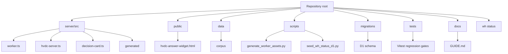
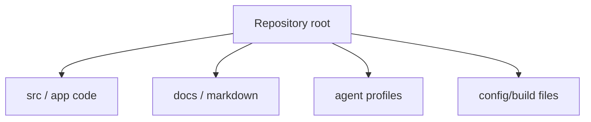

# Repository Layout

## Repository Layout

This repository keeps root-level operating docs for historical continuity and `docs/` project-doc-pipeline outputs for current synchronized documentation.

## Directory Responsibilities

| Path | Responsibility |
| --- | --- |
| `server/src/` | TypeScript runtime modules for Worker, MCP tools, answer generation, routing, Decision Card payloads, telemetry, and rate limiting. |
| `server/src/generated/` | Generated Worker assets. Do not hand-edit unless intentionally updating generated output. |
| `public/hvdc-answer-widget.html` | Source ChatGPT iframe widget HTML/CSS/JS. Regenerate Worker assets after editing. |
| `data/corpus/` | Approved ontology corpus documents used by runtime search. |
| `data/datasets/` | CSV dataset layer for Control Tower and D1 seed inputs. |
| `scripts/` | Asset generation, D1 seed/reconcile/rollback, source audit, deployment, and validation helpers. |
| `migrations/` | Cloudflare D1 schema migrations for audit, upload/write, Dual-MCP, Control Tower, and WH status case events. |
| `tests/` | Vitest regression coverage for descriptors, pipeline, widget, D1, identifier normalization, governance, and runtime behavior. |
| `docs/` | Current guide, QA/security/spec documents, traceability reports, plans, and generated pipeline docs. |
| `wh status/` | Source Excel workbook and warehouse status planning / ontology migration artifacts. |
| `.github/workflows/` | CI and HVDC verification workflows. |

## Entrypoints

| Entry point | Purpose |
| --- | --- |
| `server/src/worker.ts` | Cloudflare Worker entrypoint from `wrangler.toml`. |
| `server/src/index.ts` | Node fallback MCP server entrypoint for local/non-Worker use. |
| `server/src/claude-server.ts` | Claude-oriented remote/local MCP bridge support. |
| `server/src/hvdc-server.ts` | Shared MCP tool and resource factory. |
| `public/hvdc-answer-widget.html` | Source widget rendered through generated `widget-html.ts`. |

## Key Commands

| Command | Purpose |
| --- | --- |
| `npm run generate:worker-assets` | Rebuild generated corpus/sample/widget Worker assets. |
| `npm run dev` | Generate assets and start Wrangler dev. |
| `npm run typecheck` | Generate assets and run TypeScript typecheck. |
| `npm test` | Generate assets and run Vitest, excluding archived worktrees. |
| `npm run verify` | Typecheck, test, and Worker dry-run. |
| `npm run worker:deploy` | Run full verify and deploy to Cloudflare Workers. |
| `npm run verify:governance` | Run SCT governance reports, PII/NDA/source audits, syntax checks, and focused governance tests. |
| `npm run d1:seed-wh-status` | Seed warehouse status Excel projection to remote D1. |
| `npm run d1:reconcile-wh-status` | Reconcile warehouse status D1 projection. |

## Generated Files

- `server/src/generated/corpus-data.ts`
- `server/src/generated/sample-shipments.ts`
- `server/src/generated/widget-html.ts`

Regenerate these with `npm run generate:worker-assets` after changing corpus, sample data, or widget source.

## Codex Documentation Update — 2026-06-13T18:20:29.442785+00:00

**Update policy:** existing content above this section is preserved. This section was appended after scanning code, documentation, config, and agent profile files.

**Purpose:** This section maps the detected repository layout and documentation surface.

### Evidence inventory

**Source/code files sampled:**
- `apps\mcp-server\src\__tests__\router.test.ts`
- `apps\mcp-server\src\__tests__\schema-contract.test.ts`
- `apps\mcp-server\src\db.ts`
- `apps\mcp-server\src\main.ts`
- `apps\mcp-server\src\schemas\dlp-guard.ts`
- `apps\mcp-server\src\tools\__tests__\build_validation_explanation.test.ts`
- `apps\mcp-server\src\tools\__tests__\check_contract_validity.test.ts`
- `apps\mcp-server\src\tools\__tests__\check_cost_guard.test.ts`
- `apps\mcp-server\src\tools\__tests__\check_duplicate_invoice.test.ts`
- `apps\mcp-server\src\tools\__tests__\check_evidence_required.test.ts`
- `apps\mcp-server\src\tools\__tests__\check_fx_policy.test.ts`
- `apps\mcp-server\src\tools\__tests__\check_rate_card.test.ts`

**Documentation files sampled:**
- `.vercel\README.txt`
- `20260613_job_store_mcp_fix_plan.md`
- `apps\README.md`
- `apps\graphify-out\GRAPH_REPORT.md`
- `apps\graphify-out\converted\sample-invoice_c70e590b.md`
- `apps\web\.vercel\README.txt`
- `apps\worker-py\README.md`
- `apps\worker-py\invoice_audit_parser.egg-info\SOURCES.txt`
- `apps\worker-py\invoice_audit_parser.egg-info\dependency_links.txt`
- `apps\worker-py\invoice_audit_parser.egg-info\requires.txt`
- `apps\worker-py\invoice_audit_parser.egg-info\top_level.txt`
- `docs\# 3-Way 교차검증 보고서 (graph × 개발 현황 보고서 × Invoice Audit Platform v1.00).md`

**Config/build files sampled:**
- `.codex\root-docs-scan.json`
- `.github\dependabot.yml`
- `.github\workflows\codeql.yml`
- `.github\workflows\fly-worker-deploy.yml`
- `.github\workflows\python-worker-ci.yml`
- `.github\workflows\release-gate.yml`
- `.github\workflows\vercel-preview.yml`
- `.github\workflows\vercel-prod.yml`
- `.github\workflows\web-ci.yml`
- `.vercel\project.json`
- `apps\graphify-out\graph.json`
- `apps\mcp-server\package-lock.json`

**Agent profile files sampled:**
- No agent profile detected; this update records the absence explicitly.

### Mermaid graph

### Verification notes

- Append-only update generated by `root-docs-batch-update`.
- Code/config/doc/agent inventory counts: code=171, docs=99, config=264, agent_profiles=0.
- Follow-up verification should confirm that newly added text matches actual implementation paths listed above.
