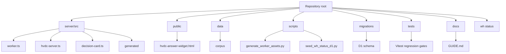
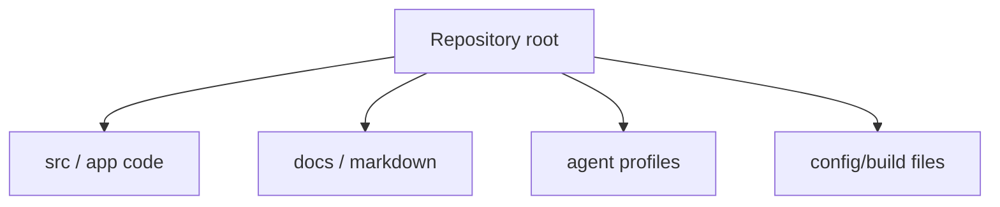
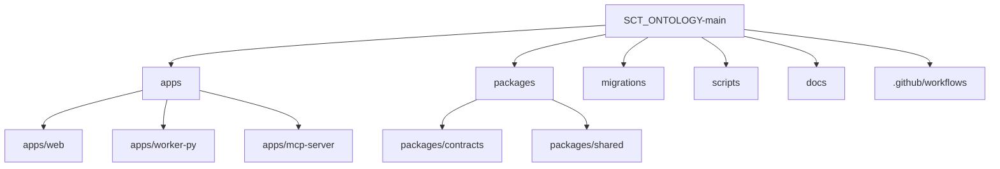

# Repository Layout

## Repository Layout

This repository keeps root-level operating docs for historical continuity and `docs/` project-doc-pipeline outputs for current synchronized documentation.

## Directory Responsibilities

| Path | Responsibility |
| --- | --- |
| `server/src/` | TypeScript runtime modules for Worker, MCP tools, answer generation, routing, Decision Card payloads, telemetry, and rate limiting. |
| `server/src/generated/` | Generated Worker assets. Do not hand-edit unless intentionally updating generated output. |
| `public/hvdc-answer-widget.html` | Source ChatGPT iframe widget HTML/CSS/JS. Regenerate Worker assets after editing. |
| `data/corpus/` | Approved ontology corpus documents used by runtime search. |
| `data/datasets/` | CSV dataset layer for Control Tower and D1 seed inputs. |
| `scripts/` | Asset generation, D1 seed/reconcile/rollback, source audit, deployment, and validation helpers. |
| `migrations/` | Cloudflare D1 schema migrations for audit, upload/write, Dual-MCP, Control Tower, and WH status case events. |
| `tests/` | Vitest regression coverage for descriptors, pipeline, widget, D1, identifier normalization, governance, and runtime behavior. |
| `docs/` | Current guide, QA/security/spec documents, traceability reports, plans, and generated pipeline docs. |
| `wh status/` | Source Excel workbook and warehouse status planning / ontology migration artifacts. |
| `.github/workflows/` | CI and HVDC verification workflows. |

## Entrypoints

| Entry point | Purpose |
| --- | --- |
| `server/src/worker.ts` | Cloudflare Worker entrypoint from `wrangler.toml`. |
| `server/src/index.ts` | Node fallback MCP server entrypoint for local/non-Worker use. |
| `server/src/claude-server.ts` | Claude-oriented remote/local MCP bridge support. |
| `server/src/hvdc-server.ts` | Shared MCP tool and resource factory. |
| `public/hvdc-answer-widget.html` | Source widget rendered through generated `widget-html.ts`. |

## Key Commands

| Command | Purpose |
| --- | --- |
| `npm run generate:worker-assets` | Rebuild generated corpus/sample/widget Worker assets. |
| `npm run dev` | Generate assets and start Wrangler dev. |
| `npm run typecheck` | Generate assets and run TypeScript typecheck. |
| `npm test` | Generate assets and run Vitest, excluding archived worktrees. |
| `npm run verify` | Typecheck, test, and Worker dry-run. |
| `npm run worker:deploy` | Run full verify and deploy to Cloudflare Workers. |
| `npm run verify:governance` | Run SCT governance reports, PII/NDA/source audits, syntax checks, and focused governance tests. |
| `npm run d1:seed-wh-status` | Seed warehouse status Excel projection to remote D1. |
| `npm run d1:reconcile-wh-status` | Reconcile warehouse status D1 projection. |

## Generated Files

- `server/src/generated/corpus-data.ts`
- `server/src/generated/sample-shipments.ts`
- `server/src/generated/widget-html.ts`

Regenerate these with `npm run generate:worker-assets` after changing corpus, sample data, or widget source.

## Codex Documentation Update — 2026-06-13T18:20:29.442785+00:00

**Update policy:** existing content above this section is preserved. This section was appended after scanning code, documentation, config, and agent profile files.

**Purpose:** This section maps the detected repository layout and documentation surface.

### Evidence inventory

**Source/code files sampled:**
- `apps\mcp-server\src\__tests__\router.test.ts`
- `apps\mcp-server\src\__tests__\schema-contract.test.ts`
- `apps\mcp-server\src\db.ts`
- `apps\mcp-server\src\main.ts`
- `apps\mcp-server\src\schemas\dlp-guard.ts`
- `apps\mcp-server\src\tools\__tests__\build_validation_explanation.test.ts`
- `apps\mcp-server\src\tools\__tests__\check_contract_validity.test.ts`
- `apps\mcp-server\src\tools\__tests__\check_cost_guard.test.ts`
- `apps\mcp-server\src\tools\__tests__\check_duplicate_invoice.test.ts`
- `apps\mcp-server\src\tools\__tests__\check_evidence_required.test.ts`
- `apps\mcp-server\src\tools\__tests__\check_fx_policy.test.ts`
- `apps\mcp-server\src\tools\__tests__\check_rate_card.test.ts`

**Documentation files sampled:**
- `.vercel\README.txt`
- `20260613_job_store_mcp_fix_plan.md`
- `apps\README.md`
- `apps\graphify-out\GRAPH_REPORT.md`
- `apps\graphify-out\converted\sample-invoice_c70e590b.md`
- `apps\web\.vercel\README.txt`
- `apps\worker-py\README.md`
- `apps\worker-py\invoice_audit_parser.egg-info\SOURCES.txt`
- `apps\worker-py\invoice_audit_parser.egg-info\dependency_links.txt`
- `apps\worker-py\invoice_audit_parser.egg-info\requires.txt`
- `apps\worker-py\invoice_audit_parser.egg-info\top_level.txt`
- `docs\# 3-Way 교차검증 보고서 (graph × 개발 현황 보고서 × Invoice Audit Platform v1.00).md`

**Config/build files sampled:**
- `.codex\root-docs-scan.json`
- `.github\dependabot.yml`
- `.github\workflows\codeql.yml`
- `.github\workflows\fly-worker-deploy.yml`
- `.github\workflows\python-worker-ci.yml`
- `.github\workflows\release-gate.yml`
- `.github\workflows\vercel-preview.yml`
- `.github\workflows\vercel-prod.yml`
- `.github\workflows\web-ci.yml`
- `.vercel\project.json`
- `apps\graphify-out\graph.json`
- `apps\mcp-server\package-lock.json`

**Agent profile files sampled:**
- No agent profile detected; this update records the absence explicitly.

### Mermaid graph

### Verification notes

- Append-only update generated by `root-docs-batch-update`.
- Code/config/doc/agent inventory counts: code=171, docs=99, config=264, agent_profiles=0.
- Follow-up verification should confirm that newly added text matches actual implementation paths listed above.

## Invoice Audit MVP Layout Addendum - 2026-06-13

This addendum records the current invoice audit MVP layout observed in the repository. It supplements the earlier Cloudflare ontology layout without deleting historical sections.

For invoice-audit development, this addendum is the current-state layout reference. Earlier Cloudflare ontology layout sections remain as historical context.

### Current Top-Level Layout

### Current Directory Responsibilities

| Path | Responsibility |
| --- | --- |
| `apps/web/` | Next.js web UI and API orchestration for invoice upload, audit job execution, approval, and export. |
| `apps/web/src/app/` | App Router pages and API route handlers. |
| `apps/web/src/lib/` | Job store, Blob access, parser client, validation helpers, gate helpers, and shared web runtime logic. |
| `apps/web/tests/` | Vitest coverage for API routes and web runtime helpers. |
| `apps/web/e2e/` | Playwright smoke tests. |
| `apps/worker-py/app/routes/` | FastAPI route handlers for parse, export, and health endpoints. |
| `apps/worker-py/app/parsers/` | Parsers for `xlsx`, `md`, `txt`, `pdf`, and `pdf_json`. |
| `apps/worker-py/app/exporters/` | 13-sheet audit workbook export logic. |
| `apps/worker-py/app/validators/` | Worker-side numeric integrity validation. |
| `apps/worker-py/tests/` | Pytest coverage and parser/export fixtures. |
| `apps/mcp-server/src/tools/` | Invoice validation tools and tool tests. |
| `apps/mcp-server/src/schemas/` | MCP server schema and DLP guard code. |
| `packages/contracts/` | Shared invoice, validation, and export schemas. |
| `packages/shared/` | Hashing and redaction helpers shared across runtimes. |
| `migrations/` | Postgres schema migrations for invoice audit persistence. |
| `scripts/` | Deployment, seeding, graph, DLP, and validation helper scripts. |
| `docs/` | Architecture, layout, plan, security, QA, operations, and traceability documents. |

### Current Web Pages

| Route | Source path | Purpose |
| --- | --- | --- |
| `/` | `apps/web/src/app/page.tsx` | App entry page. |
| `/invoice-audit` | `apps/web/src/app/invoice-audit/page.tsx` | Invoice audit workspace. |
| `/invoice-audit/upload` | `apps/web/src/app/invoice-audit/upload/page.tsx` | Invoice/evidence upload page. |
| `/invoice-audit/jobs/[jobId]` | `apps/web/src/app/invoice-audit/jobs/[jobId]/page.tsx` | Job detail and review page. |
| `/fx-policies` | `apps/web/src/app/fx-policies/page.tsx` | FX policy view. |

### Current API Route Files

| API route | Source path |
| --- | --- |
| `/api/files/ingest` | `apps/web/src/app/api/files/ingest/route.ts` |
| `/api/files/ingest/large` | `apps/web/src/app/api/files/ingest/large/route.ts` |
| `/api/invoice-audit/run` | `apps/web/src/app/api/invoice-audit/run/route.ts` |
| `/api/audit/status` | `apps/web/src/app/api/audit/status/route.ts` |
| `/api/audit/trace` | `apps/web/src/app/api/audit/trace/route.ts` |
| `/api/audit/result` | `apps/web/src/app/api/audit/result/route.ts` |
| `/api/audit/approve` | `apps/web/src/app/api/audit/approve/route.ts` |
| `/api/audit/export` | `apps/web/src/app/api/audit/export/route.ts` |
| `/api/export/download` | `apps/web/src/app/api/export/download/route.ts` |
| `/api/fx-policy` | `apps/web/src/app/api/fx-policy/route.ts` |
| `/mcp` | `apps/web/src/app/mcp/route.ts` |

### Current Validation Tool Files

The MCP validation tool set is under `apps/mcp-server/src/tools/`.

- `route_question.ts`
- `normalize_invoice_lines.ts`
- `check_duplicate_invoice.ts`
- `match_shipment_reference.ts`
- `check_rate_card.ts`
- `check_contract_validity.ts`
- `check_evidence_required.ts`
- `check_tax_vat.ts`
- `check_fx_policy.ts`
- `check_cost_guard.ts`
- `build_validation_explanation.ts`
- `classify_type_b.ts` (2026-06-13: Track 1 TYPE-B priority port)
- `check_hs_uae_compliance.ts` (2026-06-13: BOE + HS code validation)
- `check_dem_det.ts` (2026-06-13: DEM/DET evidence check)

Total: 14 tools.

### DSV Waybill Parser (2026-06-13)

- `apps/worker-py/app/parsers/dsv_waybill.py` — DSV Waybill field extraction (8 core functions, 28 tests)
- `apps/worker-py/tests/fixtures/dsv-waybill-001.txt` — DSV fixture
- `apps/worker-py/tests/test_dsv_waybill.py` — 28 DSV-specific tests

### SESS-005 Cross-Validation Artifacts

- `20260613_cross_validation_report.md` — Track 1 vs Track 2 gate coverage report
- `20260613_dsv_waybill_port_plan.md` — DSV parser port implementation plan
- `20260613_p2_gap_design.md` — P2 gap design document

### Local and Generated Files

These paths can appear during local execution or builds and should not be treated as source documentation targets:

- `apps/web/.next/`
- `apps/web/.dev-blob/` for local Blob fallback storage when private Blob credentials are not active.
- `apps/web/coverage/`
- `apps/web/test-results/`
- `apps/web/node_modules/`
- `apps/worker-py/.venv/`
- `apps/worker-py/.pytest_cache/`
- `apps/worker-py/**/__pycache__/`
- `apps/mcp-server/node_modules/`
- `apps/mcp-server/dist/`

Do not copy generated invoice text, signed URLs, Blob object keys, or private evidence contents from these directories into documentation.

Local fallback modes are for development only. Production layout assumes Neon/Postgres persistence through `DATABASE_URL` and private Vercel Blob storage through `BLOB_READ_WRITE_TOKEN`.

### Current Verification Commands

| Area | Command |
| --- | --- |
| Web typecheck | `pnpm --dir apps\web typecheck` |
| Web tests | `pnpm --dir apps\web test` |
| Web build | `pnpm --dir apps\web build` |
| Worker syntax smoke | `python -m py_compile apps\worker-py\app\routes\parse.py` |
| Worker tests | `cd apps\worker-py && pytest -q` |
| MCP typecheck | `cd apps\mcp-server && pnpm typecheck` |
| MCP tests | `cd apps\mcp-server && pnpm test` |
| MCP build | `cd apps\mcp-server && pnpm build` |
