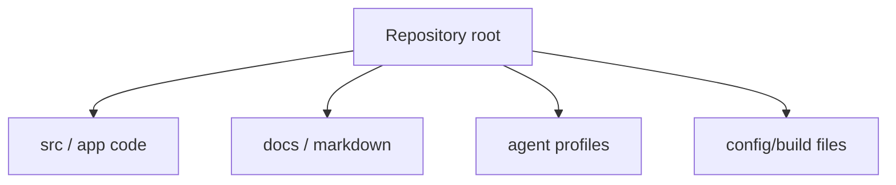

# Repository Layout

## Repository Layout

```
SCT_ONTOLOGY-main/
├── apps/
│   ├── web/                    # Next.js 15 frontend + API (Vercel)
│   │   ├── src/app/            # App Router pages + API route handlers
│   │   ├── src/app/api/        # 11 API routes (upload, audit, export, fx, mcp)
│   │   ├── src/lib/            # Job store, gate-bridge, MCP tools, parser client, blob, DLP
│   │   │   └── mcp/            # In-process MCP validation tools port
│   │   ├── tests/              # Vitest (23 files, 107 tests)
│   │   └── e2e/                # Playwright smoke tests
│   │
│   ├── worker-py/              # Python FastAPI parser/exporter (Fly.io)
│   │   ├── app/routes/         # /parse, /v1/export, /health
│   │   ├── app/parsers/        # xlsx, md, txt, pdf, pdf_json, DSV waybill
│   │   ├── app/middleware/     # Audit log middleware (FR-025)
│   │   ├── app/exporters/      # 13-sheet workbook export logic
│   │   └── tests/              # Pytest (95 tests)
│   │
│   └── mcp-server/             # Hono MCP validation server (Fly.io, standalone)
│       ├── src/tools/          # Re-exports 14 validation tools from @invoice-audit/tools
│       ├── src/schemas/        # DLP guard, validation schemas
│       └── db/                 # Rate card migrations + seeds
│
├── packages/
│   ├── tools/                  # @invoice-audit/tools — 14 MCP tools, single source of truth
│   │   └── src/                # route_question, normalize_invoice_lines, check_duplicate_invoice,
│   │                           #   match_shipment_reference, check_rate_card (+ batch),
│   │                           #   check_contract_validity, check_evidence_required,
│   │                           #   check_tax_vat, check_fx_policy, check_cost_guard,
│   │                           #   build_validation_explanation, classify_type_b,
│   │                           #   check_hs_uae_compliance, check_dem_det, types, index
│   ├── database/               # @invoice-audit/database — Postgres pool singleton (Neon)
│   │   └── src/index.ts        # Pool factory shared by web + mcp-server
│   ├── contracts/              # Shared Zod schemas (invoice, validation, export)
│   └── shared/                 # Hash, redaction, DLP helpers
│
├── migrations/                 # Neon Postgres DDL
│   ├── 0008_invoice_audit.sql
│   ├── 0009_job_store_persist.sql
│   └── 0010_invoices.sql
│
├── docs/                       # Architecture, layout, plan, security, QA, changelog
├── scripts/                    # 24 utility scripts (audit, seed, graph, DLP, deployment)
├── shpiment/                   # DSV shipment reference data (P2, gitignored)
├── domestic/                   # Korean domestic invoice runtime
│
├── .github/workflows/          # 8 CI/CD workflows
│   ├── codeql.yml
│   ├── fly-mcp-server-deploy.yml
│   ├── fly-worker-deploy.yml
│   ├── python-worker-ci.yml
│   ├── release-gate.yml
│   ├── vercel-preview.yml
│   ├── vercel-prod.yml
│   └── web-ci.yml
│
├── .env.example                # Environment variable template
├── pnpm-workspace.yaml         # pnpm workspace config
├── tsconfig.base.json          # Shared TypeScript config
└── README.md                   # Project overview + quick start
```

## Directory Responsibilities

| Path | Responsibility |
|---|---|
| `apps/web/` | Next.js web UI and API orchestration — upload, audit job lifecycle, approval gates, export dispatch |
| `apps/web/src/app/` | App Router pages and API route handlers |
| `apps/web/src/lib/` | Shared runtime logic: job store, gate-bridge, MCP tools (in-process), parser client, blob, DLP scanner, FX check, human gate, approval gate, export store, error codes, types |
| `apps/web/tests/` | Vitest coverage for API routes, gate logic, DLP, and runtime helpers |
| `apps/web/e2e/` | Playwright smoke tests |
| `apps/worker-py/app/routes/` | FastAPI route handlers for `/parse`, `/v1/export`, health endpoints |
| `apps/worker-py/app/parsers/` | File parsers: xlsx, md, txt, pdf (text), pdf_json (OpenDataLoader), DSV waybill |
| `apps/worker-py/app/exporters/` | 13-sheet contract-compliant audit workbook export |
| `apps/worker-py/tests/` | Pytest coverage with parser/export fixtures |
| `apps/mcp-server/src/tools/` | Re-exports 14 MCP validation tools from `@invoice-audit/tools` (per-tool tests) |
| `apps/mcp-server/src/schemas/` | DLP guard schema + validation contracts |
| `apps/mcp-server/db/` | Rate card DDL migrations + seed data |
| `packages/tools/src/` | **14 MCP validation tools — single source of truth** (shared by web + mcp-server) |
| `packages/database/src/index.ts` | Postgres pool singleton (Neon) shared by web + mcp-server |
| `packages/contracts/` | Shared invoice, validation, and export Zod schemas |
| `packages/shared/` | Hashing, redaction, and DLP helpers shared across TypeScript runtimes |
| `migrations/` | Neon Postgres schema migrations for invoice audit persistence |
| `scripts/` | 24 scripts: audit graphs, source/PII scans, D1 seed/reconcile, deployment, smoke tests, graph build, dataset generation, index drift checks |
| `docs/` | Architecture, layout, plan, security, QA, operations, and traceability documents |
| `.github/workflows/` | 8 CI/CD workflows covering web, worker, mcp-server, release gates, code scanning |

## Web Routes (apps/web/src/app/)

| Route | Source | Purpose |
|---|---|---|
| `/` | `page.tsx` | App entry |
| `/invoice-audit` | `invoice-audit/page.tsx` | Audit workspace |
| `/invoice-audit/upload` | `invoice-audit/upload/page.tsx` | Invoice/evidence upload |
| `/invoice-audit/jobs/[jobId]` | `invoice-audit/jobs/[jobId]/page.tsx` | Job detail + review |
| `/fx-policies` | `fx-policies/page.tsx` | FX policy reference |

## API Routes (apps/web/src/app/api/)

| Route | Source | Method |
|---|---|---|
| `/api/files/ingest` | `files/ingest/route.ts` | POST |
| `/api/files/ingest/large` | `files/ingest/large/route.ts` | POST |
| `/api/invoice-audit/run` | `invoice-audit/run/route.ts` | POST |
| `/api/audit/status` | `audit/status/route.ts` | GET |
| `/api/audit/trace` | `audit/trace/route.ts` | GET |
| `/api/audit/result` | `audit/result/route.ts` | GET |
| `/api/audit/approve` | `audit/approve/route.ts` | POST |
| `/api/audit/export` | `audit/export/route.ts` | POST |
| `/api/export/download` | `export/download/route.ts` | GET |
| `/api/fx-policy` | `fx-policy/route.ts` | POST |
| `/mcp` | `mcp/route.ts` | POST |

## MCP Validation Tools

**Canonical source:** `packages/tools/src/` — 14 tools as single source of truth, imported by both `apps/web` (in-process) and `apps/mcp-server` (JSON-RPC).

14 tools: `route_question`, `normalize_invoice_lines`, `check_duplicate_invoice`, `match_shipment_reference`, `check_rate_card` (with `check_rate_card_batch` for N-line batch queries), `check_contract_validity`, `check_evidence_required`, `check_tax_vat`, `check_fx_policy`, `check_cost_guard`, `build_validation_explanation`, `classify_type_b`, `check_hs_uae_compliance`, `check_dem_det`

`apps/mcp-server/src/tools/` re-exports the same 14 tools for JSON-RPC dispatch (no code duplication).

## Worker Routes (apps/worker-py/app/routes/)

| Route | Source | Purpose |
|---|---|---|
| `POST /parse` | `parse.py` | Parse uploaded file by type |
| `POST /v1/export` | `export.py` | Build 13-sheet audit workbook |
| `GET /health/ready` | `health.py` | Readiness check |
| `GET /health/live` | `health.py` | Liveness check |

## Local/Generated Directories (gitignored)

- `apps/web/.next/`, `.dev-blob/`, `coverage/`, `test-results/`, `node_modules/`
- `apps/worker-py/.venv/`, `.pytest_cache/`, `__pycache__/`
- `apps/mcp-server/node_modules/`, `dist/`
- `.vercel/`, `.codex/`, `.claude/`, `graphify-out/`

Do not copy generated invoice text, signed URLs, blob keys, or P2 evidence from these into documentation.

## Verification Commands

| Area | Command |
|---|---|
| Web typecheck | `pnpm --dir apps\web typecheck` |
| Web tests | `pnpm --dir apps\web test` |
| Web build | `pnpm --dir apps\web build` |
| Worker tests | `cd apps\worker-py && pytest -q` |
| Worker syntax | `python -m py_compile apps\worker-py\app\routes\parse.py` |
| MCP typecheck | `cd apps\mcp-server && pnpm typecheck` |
| MCP tests | `cd apps\mcp-server && pnpm test` |
| MCP build | `cd apps\mcp-server && pnpm build` |
| Workbook contract | `python apps\worker-py\scripts\workbook_contract_validate.py <wb.xlsx>` |

## Historical (Archived 2026-06-14)

Earlier versions of this repository ran a Cloudflare Worker (`server/src/worker.ts`) serving the SCT ontology ChatGPT App. That runtime and its associated directories are deleted:

- `server/src/` — Worker, MCP tools, answer pipeline, Decision Card, generated assets
- `public/` — ChatGPT iframe widget HTML
- `data/corpus/` — Ontology corpus documents
- `wh status/` — Warehouse status Excel projections
- `tests/` (root) — Vitest regression for ontology runtime
- `migrations/0001-0007_*.sql` — D1 schemas (kept for reference, superseded by Postgres)

The current layout reflects the invoice audit platform (Phase 1 MVP), which replaced the ontology app. See `docs/SYSTEM_ARCHITECTURE.md` for the full architecture.


## Codex Documentation Update — 2026-06-14T09:41:25.480989+00:00

**Update policy:** existing content above this section is preserved. This section was appended after scanning code, documentation, config, and agent profile files.

**Purpose:** This section maps the detected repository layout and documentation surface.

### Evidence inventory

**Source/code files sampled:**
- `apps\mcp-server\db\migrate-rate-cards.sql`
- `apps\mcp-server\db\seed-rate-cards.sql`
- `apps\mcp-server\src\__tests__\router.test.ts`
- `apps\mcp-server\src\__tests__\schema-contract.test.ts`
- `apps\mcp-server\src\db.ts`
- `apps\mcp-server\src\main.ts`
- `apps\mcp-server\src\schemas\dlp-guard.ts`
- `apps\mcp-server\src\telemetry.ts`
- `apps\mcp-server\src\tools\__tests__\build_validation_explanation.test.ts`
- `apps\mcp-server\src\tools\__tests__\check_contract_validity.test.ts`
- `apps\mcp-server\src\tools\__tests__\check_cost_guard.test.ts`
- `apps\mcp-server\src\tools\__tests__\check_dem_det.test.ts`

**Documentation files sampled:**
- `.hermes\plans\auto-20260614-013800.md`
- `.vercel\README.txt`
- `20260613_cross_validation_report.md`
- `20260613_dsv_waybill_port_plan.md`
- `20260613_job_store_mcp_fix_plan.md`
- `20260613_p2_gap_design.md`
- `20260614_api_inventory_design_audit_v1.md`
- `20260614_db_schema_swarm_scout.md`
- `20260614_documentation_audit_swarm_scout.md`
- `20260614_performance_optimization_plan_v1.md`
- `20260614_phase2_plan.md`
- `20260614_phase3_4_work_log.md`

**Config/build files sampled:**
- `.claude\settings.local.json`
- `.codex\root-docs-scan.json`
- `.codex\root-docs-write.json`
- `.github\dependabot.yml`
- `.github\workflows\_ts-checks.yml`
- `.github\workflows\codeql.yml`
- `.github\workflows\fly-mcp-server-deploy.yml`
- `.github\workflows\fly-worker-deploy.yml`
- `.github\workflows\python-worker-ci.yml`
- `.github\workflows\release-gate.yml`
- `.github\workflows\reliability.yml`
- `.github\workflows\secret-scan.yml`

**Agent profile files sampled:**
- No agent profile detected; this update records the absence explicitly.

### Mermaid graph



### Verification notes

- Append-only update generated by `root-docs-batch-update`.
- Code/config/doc/agent inventory counts: code=259, docs=157, config=520, agent_profiles=0.
- Follow-up verification should confirm that newly added text matches actual implementation paths listed above.
