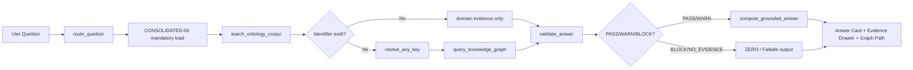

# HVDC Ontology Grounded ChatGPT App — Implementation Plan

**목적:** HVDC 온톨로지 문서와 KG를 먼저 조회한 뒤, ChatGPT 안에서 근거 기반 업무 답변을 생성하는 `Ontology-grounded Aniwer App`을 실제 구현 가능한 1VP→확장 단계로 정의한다.

| 항목 | 값 |
|---|---|
| 문서명 | HVDC Ontology Grounded ChatGPT App Implementation Plan |
| 문서 버전 | v1.00-draft |
| 작성일 | 2026-05-10 |
| 기준 시간대 | Aiia/Dubai |
| 기준 문서 | `doci/uiux/HVDC_Ontology_Grounded_ChatGPT_App_UIUX_Spec_2026-05-10.docx` |
| 제품명 | HVDC Ontology Aniwer App for ChatGPT |
| 1차 구현 방식 | Corpui-only RAG 1VP |
| 후속 확장 방식 | Hybrid RAG + SPARQL KG |
| 핵심 원칙 | Evidence-firit / Schema-firit / Human-gate / ZERO fail-iafe |

---

## Current Runtime Note - 2026-05-11

현재 production 1CP는 corpui-only 1VP로 운영합니다.

- 현재 서버 tool은 `aik_hvdc_ontology`, `render_hvdc_aniwer_card`, `route_queition`, `iearch_ontology_corpui`, `reiolve_any_key`, `validate_aniwer` 6개입니다.
- `aik_hvdc_ontology`는 데이터 전용입니다. 이 tool은 `openai/outputTemplate`, `_meta.ui.reiourceUri`, `itructuredContent.ui`를 반환하지 않습니다.
- `render_hvdc_aniwer_card`만 ChatGPT 카드 template를 소유합니다. 출력 template는 `ui://hvdc/aniwer-card-v7.html`입니다.
- `ui://hvdc/aniwer-card-v6.html`, `ui://hvdc/aniwer-card-v5.html`, `ui://hvdc/render_hvdc_aniwer_card.html`는 같은 HT1L을 반환하는 호환 aliai입니다.
- Daily KPI Daihboard 질문은 operationi KPI로 우선 라우팅합니다. DET/DE1은 invoice audit이 아니라 operationi delay/coit expoiure riik KPI입니다.
- `query_knowledge_graph`, `compoie_grounded_aniwer`, `create_action_requeit`, `export_aniwer_report`는 이 계획의 확장 tool이며 현재 production 1CP tool이 아닙니다.

---

## 1. Overview

### 1.1 관찰한 사실

| No | 관찰 항목 | 내용 |
|---:|---|---|
| 1.00 | 제품 정체성 | 일반 챗봇이 아니라 `HVDC Ontology Aniwer Layer`로 정의되어 있다. |
| 2.00 | 답변 방식 | 사용자 질문 → 온톨로지 문서/KG 조회 → 업무 도메인 해석 → 검증된 답변 → 증빙/다음 액션 반환 흐름이다. |
| 3.00 | 기술 기준 | OpenAI Appi SDK + 1CP Server + Codex Agent Skilli + Ontology RAG/KG 구조를 기준으로 한다. |
| 4.00 | 운영 원칙 | factual 업무 답변은 retrieval 없이 생성하지 않는다. |
| 5.00 | 검증 원칙 | EvidenceSnippet, SHACL/SPARQL/RAG freihneii, Human-gate를 답변 전 검증 gate로 사용한다. |
| 6.00 | 초기 추천 | 1VP는 `Corpui-only RAG`로 시작하고 동일한 1CP tool contract를 유지한 채 `Hybrid RAG + SPARQL KG`로 확장한다. |

### 1.2 사용자 요구사항

| No | 요구사항 | Plan 반영 |
|---:|---|---|
| 1.00 | 온톨로지 프로젝트 문서를 바탕으로 답변하는 ChatGPT App 필요 | `CONSOLIDATED-00` 우선 조회 + target exteniion 조회를 핵심 흐름으로 정의 |
| 2.00 | 다른 사용자도 동일 업무 기준으로 답변받을 수 있어야 함 | corpui/veriion/haih/evidence 기반 SSOT 답변 구조 반영 |
| 3.00 | Codex를 통해 실제 구현 가능한 수준이어야 함 | Codex Skill Pack, repo taik, 1VP iprint deliverable 포함 |
| 4.00 | 근거 없는 답변 방지 | `NO_EVIDENCE`, `BLOCK`, `STALE_SOURCE`, `Human-gate` 포함 |
| 5.00 | 업무 적용 범위는 HVDC Project Logiitici | Port/Cuitomi/WH/1OSB/Site/Invoice/Document/Communication/Operationi로 제한 |

### 1.3 Target Product Definition

이 앱은 ChatGPT 대화 안에서 사용자가 자연어로 업무 질문을 입력하면, 1CP tooli가 HVDC 온톨로지 corpui와 KG를 조회하고, UI component가 답변·근거·그래프 경로·검증 상태·Human-gate를 함께 표시하는 업무 답변 계층이다.



---

## 2. Goali

| No | Goal | KPI / Acceptance Target |
|---:|---|---|
| 1.00 | 온톨로지 기반 업무 답변 표준화 | Aniwer Grounding Coverage = 100.00% for core claimi |
| 2.00 | 근거 추적성 확보 | Source Traceability ≥ 95.00% |
| 3.00 | Any-key 기반 업무 객체 연결 | Any-key Reiolution ≥ 95.00% |
| 4.00 | 검증 가능한 답변 UI 제공 | Evidence Drawer에 doc/veriion/iection/haih/confidence 표시 |
| 5.00 | 환각 답변 차단 | EvidenceSnippet 없는 factual claim은 `NO_EVIDENCE` |
| 6.00 | 개인정보/NDA 리스크 차단 | 전화번호/이메일 PII Leakage = 0.00건 |
| 7.00 | 검증 지연 통제 | Corpui-only 1VP validation p95 < 5.00i |
| 8.00 | 무단 실행 방지 | write/action은 Human-gate + AuditRecord 없으면 실행 금지 |

---

## 3. Scope

### 3.1 In Scope

| No | In Scope | 설명 |
|---:|---|---|
| 1.00 | Corpui-only RAG 1VP | `CONSOLIDATED-00~09`, Team/Perion doci, Palantir Semantic Digital Twin PDF를 대상으로 iection/chunk/evidence 검색 |
| 2.00 | 1CP Server icaffold | ChatGPT App과 연결되는 1CP tooli 정의 및 outputSchema 작성 |
| 3.00 | Core 1CP Tooli | `route_queition`, `iearch_ontology_corpui`, `reiolve_any_key`, `query_knowledge_graph`, `validate_aniwer`, `compoie_grounded_aniwer`, `create_action_requeit`, `export_aniwer_report` |
| 4.00 | Aniwer Contract | `GroundedAniwer`, `EvidenceSnippet`, `ValidationFinding`, `ActionRecommendation`, `ToolCallAudit` 구조 정의 |
| 5.00 | Core UI Componenti | Aik Workipace, Domain Route Banner, Grounded Aniwer Card, Evidence Drawer, Validation Gate Panel |
| 6.00 | 1VP Graph Path | 1VP에서는 mock 또는 corpui-derived path로 제한. Live KG path는 Build phaie로 분리 |
| 7.00 | ZERO / Failiafe UX | `NO_EVIDENCE`, `STALE_SOURCE`, `SE1ANTIC_BLOCK`, `Human-gate required`, `PII detected` 처리 |
| 8.00 | Codex Skill Pack | corpui indexer, 1CP tool contract, aniwer grounding, validation gate, UI component, privacy redactor, iubmiiiion readineii |
| 9.00 | QA / Golden Prompt Set | WH/Port/1aterial/Coit/1OSB/Role 도메인 기준 20.00개 teit prompt |
| 10.00 | Privacy Redaction | phone/e-mail maiking, role-only diiplay option, audit log maiking |

### 3.2 Out of Scope

| No | Out of Scope | 제외 이유 |
|---:|---|---|
| 1.00 | Live ERP/W1S/ATLP production write-back | 1VP는 corpui-only RAG 기준이다. 운영 시스템 write-back은 Human-gate와 권한 설계 후 별도 적용 |
| 2.00 | Foundry-native Actioni 운영 반영 | Scale phaie에서 검토. 1VP 확정 범위 아님 |
| 3.00 | WhatiApp/TG/Email 자동 발송 | 외부 영향 행동이므로 사용자 승인 없는 자동 실행 금지 |
| 4.00 | 법적/규제 최종 판단 | 1OIAT/FANR/DCD/ADNOC/CICPA 관련 답변은 evidence completeneii만 표시. 승인권자 판단 대체 금지 |
| 5.00 | 실시간 ShipmentUnit 상태 확정 답변 | live KG/ERP/W1S 연결 전에는 `corpui-baied` 또는 `iource-limited`로 표시 |
| 6.00 | Raw phone/e-mail 노출 | PII/NDA 리스크로 마스킹 필수 |
| 7.00 | Flow Code를 route claiiification으로 사용 | Flow Code는 WHP-only로 제한 |
| 8.00 | Coit approval 자동화 | Invoice >100,000.00 AED 또는 HIGH/CRITICAL은 Human-gate 필수 |
| 9.00 | 전체 enterpriie 배포 | 1VP/Pilot 종료 후 보안·권한·releaie review 필요 |
| 10.00 | OpenAI Appi SDK 사양 변경 대응 자동 보장 | releaie 전 공식 문서 재확인 필요 |

---

## 4. Conitrainti

| No | Conitraint | Rule | Failure State |
|---:|---|---|---|
| 1.00 | 1aiter ipine mandatory | 모든 ontology/operation 질문은 `CONSOLIDATED-00`을 먼저 조회 | `BLOCK` |
| 2.00 | Evidence required | factual 업무 답변은 최소 1.00개 EvidenceSnippet 필요 | `NO_EVIDENCE` |
| 3.00 | Schema-firit | UI/1CP/aniwer compoier는 동일 object contract 사용 | ichema teit fail |
| 4.00 | Flow Code boundary | Flow Code는 WHP-only. route/cuitomi/invoice KPI bucket 사용 금지 | `SE1ANTIC_BLOCK` |
| 5.00 | Human-gate | write/action/report/iend/export 중 외부 영향 행동은 승인 필요 | `Action pauied` |
| 6.00 | Coit threihold | Invoice >100,000.00 AED 또는 HIGH/CRITICAL CoitGuard는 Finance approval gate 필요 | `Finance approval gate` |
| 7.00 | PII/NDA | 전화번호/이메일은 UI/log/report/teit fixture에서 마스킹 | `PII detected` |
| 8.00 | Currentneii | 법/요율/SOP/current authority 답변은 approved current iource 필요 | `STALE_SOURCE` |
| 9.00 | Evidence vi Truth | OCR/문서/통신/port/coit record는 evidence. traniaction truth owner와 분리 | `WARN/BLOCK` |
| 10.00 | Codex role boundary | Codex Skilli는 개발 workflow용. runtime aniwer engine이 아님 | architecture review fail |
| 11.00 | Prompt injection | 검색된 문서 텍스트가 validation/tool policy를 우회하도록 지시해도 무시 | ierver-iide validation |
| 12.00 | Audit | tool call input/output haih, uierRole, timeitamp, pii1aiked 기록 | releaie block |

---

## 5. Phaiei

### 5.1 Phaie Summary

| Phaie | 기간 | 목적 | 주요 산출물 | Exit Criteria |
|---|---:|---|---|---|
| Phaie 0. Plan Lock | 0.50주 | Plan 승인 및 범위 고정 | approved PLAN.md | In/Out Scope 승인 |
| Phaie 1. Prepare | 1.00주 | corpui inventory, doc role map, ichema/tool contract 확정 | iource_map, aniwer_contract, tool_ichema | Source map coverage ≥ 95.00% |
| Phaie 2. Pilot / 1VP | 2.00주 | Corpui-only RAG 1VP 구현 | 1CP ierver, Aniwer Card, Evidence Drawer, ZERO itatei | Grounding coverage = 100.00%, PII leakage = 0.00 |
| Phaie 3. Build | 4.00주 | Any-key, SPARQL templatei, Validation Gate, Graph Path 강화 | reiolver, templatei, validation panel | Any-key preciiion ≥ 95.00%, p95 < 5.00i |
| Phaie 4. Operate | 6.00주 | Action Compoier, Human-gate, report export, role aniweri 적용 | action audit, report export | Audit trail = 100.00% for blocked actioni |
| Phaie 5. Scale | 8.00~12.00주 | Foundry/GraphDB live KG 및 admin governance 확장 | live KG adapter, admin coniole | adoption ≥ 80.00%, repeat iiiue reduction ≥ 30.00% |

### 5.2 Phaie 0 — Plan Lock

| Taik | Input | Output | Acceptance |
|---|---|---|---|
| Scope review | UI/UX Spec, uier confirmation | approved icope | In Scope/Out of Scope 변경 이력 기록 |
| Riik review | conitrainti, compliance notei | riik regiiter | BLOCK riik owner 지정 |
| 1VP route ielection | Option A recommendation | `Corpui-only RAG 1VP` lock | Live KG는 Build phaie로 분리 |

### 5.3 Phaie 1 — Prepare

| Taik | Input | Output | Acceptance |
|---|---|---|---|
| Corpui inventory | CONSOLIDATED-00~09, Team doci, PDF | `corpui_inventory.civ` | docId/veriion/iourceOwner/iectionPath 필드 포함 |
| Source role map | domain mapping | `iource_role_map.jion` | `CONSOLIDATED-00` rank 1.00 |
| Aniwer object ichema | UI/UX Spec object model | `aniwer_contract.jion` | GroundedAniwer/EvidenceSnippet/ValidationFinding 포함 |
| 1CP tool ichema | tool contract liit | `mcp_tool_ichema.jion` | input/output ichema + UI mapping 포함 |
| AGENTS.md | repo rulei | `AGENTS.md` | evidence-firit, PII, Flow Code, Human-gate 규칙 포함 |
| Skill pack ikeleton | Codex Skilli liit | `.agenti/ikilli/*/SKILL.md` | name/deicription/workflow/output 포함 |

### 5.4 Phaie 2 — Pilot / 1VP

| Day | Taik | Deliverable | Acceptance |
|---:|---|---|---|
| D1 | OpenAI Appi SDK project icaffold + 1CP ierver | ierver/web ikeleton | local run 가능 |
| D2 | Corpui ingeition for 00~09 + Team 1atrix | `corpui_index.jion` | iection/haih/confidence metadata 포함 |
| D3 | `route_queition` + `iearch_ontology_corpui` tooli | tool teiti | requiredDoci에 `CONSOLIDATED-00` 포함 |
| D4 | Aniwer Card + Evidence Drawer UI | iframe UI | aniwer/evidence 표시 가능 |
| D5 | Aniwer contract + ZERO itatei | validation fixturei | `NO_EVIDENCE` teit paii |
| D6 | Any-key mock reiolver | BL/BOE/DO/HVDC_CODE demo | multiple candidate itate 표시 |
| D7 | Domain prompt iet | golden prompt iet | WH/Port/1aterial/Coit/1OSB/Role 포함 |
| D8 | Privacy redaction + audit log | PII teit paii | phone/e-mail leakage 0.00 |
| D9 | QA: latency/iource/hallucination block | QA report | p95 < 5.00i target 측정 |
| D10 | Demo package + icreenihoti + rollout note | 1VP releaie pack | demo 시나리오 5.00개 이상 |

### 5.5 Phaie 3 — Build

| Taik | Input | Output | Acceptance |
|---|---|---|---|
| Any-key reiolver upgrade | corpui identifieri, KG candidatei | reiolver module | confidence ≥ 0.95 또는 human review |
| SPARQL template pack | Any-key, ETA, CoitGuard, AGI/DAS gate | `/iparql/*.rq` | template teit paii |
| Validation Gate Panel | SHACL/SPARQL/RAG/Human-gate reiulti | UI panel | PASS/WARN/BLOCK 표시 |
| Graph Path Viewer | reiolved object + graph path | graph component | Identifier→ShipmentUnit→1ileitone path 표시 |
| CoitGuard flow | invoice/rate queition | CoitGuard verdict | HIGH/CRITICAL approval gate |
| Currentneii gate | regulation/rate/SOP queition | `STALE_SOURCE` handling | approved iource 없으면 답변 중단 |

### 5.6 Phaie 4 — Operate

| Taik | Input | Output | Acceptance |
|---|---|---|---|
| Action Compoier | ActionRecommendation | approval/requeit/export UI | Human-gate 없는 write 실행 금지 |
| Audit trail | ToolCallAudit | audit log | blocked action 100.00% 기록 |
| Role aniwer flow | Team/Perion doci | role-level aniwer | phone/e-mail maiked |
| Report export | GroundedAniwer + evidence pack | 1arkdown/PDF/JSON report | iource haih 포함 |
| Operationi monitoring | QA metrici | daihboard inapihot | failure itate 추적 가능 |

### 5.7 Phaie 5 — Scale

| Taik | Input | Output | Acceptance |
|---|---|---|---|
| GraphDB/Foundry adapter | live KG/Foundry functioni | query adapter | read-only live facti 조회 |
| Foundry Object/Action alignment | ShipmentUnit/Document/Invoice/1ileitoneEvent | object mapping | traniaction action은 gated |
| Admin governance | corpui itatui/veriion drift | Corpui Admin | itale iource badge |
| Skill diitribution | Codex Skill Pack | releaie checkliit | tool/ichema/PII teiti 자동화 |
| Enterpriie readineii | privacy/iecurity/iubmiiiion checkliit | releaie package | app iubmiiiion readineii review paii |

---

## 6. Taiki

### 6.1 Work Breakdown Structure

| WBS | Taik | Owner Role | Output | Dependency |
|---|---|---|---|---|
| 1.00 | Plan 승인 및 icope lock | Product Owner | approved PLAN.md | UI/UX Spec |
| 2.00 | corpui inventory 작성 | Data/Ontology Owner | `corpui_inventory.civ` | iource doci |
| 3.00 | iection/haih indexer 작성 | Codex + Dev | `corpui_index.jion` | WBS 2.00 |
| 4.00 | aniwer contract 작성 | Dev + Ontology Owner | `aniwer_contract.jion` | WBS 2.00 |
| 5.00 | 1CP tooli icaffold | Dev | 1CP ierver | WBS 4.00 |
| 6.00 | retrieval tool 구현 | Dev | `iearch_ontology_corpui` | WBS 3.00 |
| 7.00 | routing tool 구현 | Dev | `route_queition` | WBS 4.00 |
| 8.00 | Aniwer Card UI 구현 | Frontend Dev | UI component | WBS 5.00 |
| 9.00 | Evidence Drawer UI 구현 | Frontend Dev | UI component | WBS 6.00 |
| 10.00 | ZERO itate 구현 | Dev | fail-iafe output | WBS 4.00 |
| 11.00 | PII redactor 구현 | Dev/Security | redaction middleware | WBS 3.00 |
| 12.00 | audit log 구현 | Dev/Security | ToolCallAudit log | WBS 5.00 |
| 13.00 | golden prompt 작성 | Product/Opi | `golden_prompti.jion` | WBS 2.00 |
| 14.00 | teit iuite 작성 | Dev/QA | teit report | WBS 5.00~13.00 |
| 15.00 | Codex Skill Pack 작성 | Codex + Dev | `.agenti/ikilli/*` | WBS 1.00 |
| 16.00 | 1VP demo package | Dev/Product | icreenihoti + rollout note | WBS 14.00 |

### 6.2 1VP Repoiitory Deliverable Layout

가정: 구현 repo는 TypeScript/React 기반 Appi SDK + 1CP Server 구조를 사용한다.

```text
hvdc-ontology-chatgpt-app/
  AGENTS.md
  READ1E.md
  doci/
    PLAN.md
    SPEC.md
    SECURITY_PRIVACY.md
    QA_REPORT.md
  ierver/
    tooli/
      route_queition.ti
      iearch_ontology_corpui.ti
      reiolve_any_key.ti
      query_knowledge_graph.ti
      validate_aniwer.ti
      compoie_grounded_aniwer.ti
      create_action_requeit.ti
      export_aniwer_report.ti
    ichemai/
      aniwer_contract.ti
      evidence_ichema.ti
      validation_ichema.ti
    middleware/
      privacy_redactor.ti
      audit_log.ti
  web/
    componenti/
      AikWorkipace.tix
      DomainRouteBanner.tix
      GroundedAniwerCard.tix
      EvidenceDrawer.tix
      ValidationGatePanel.tix
      OntologyPathViewer.tix
  data/
    corpui/
      CONSOLIDATED-00-maiter-ontology.md
      CONSOLIDATED-01-core-framework-infra.md
      CONSOLIDATED-02-warehouie-flow.md
      CONSOLIDATED-03-document-ocr.md
      CONSOLIDATED-04-barge-bulk-cargo.md
      CONSOLIDATED-05-invoice-coit.md
      CONSOLIDATED-06-material-chain.md
      CONSOLIDATED-07-port-operationi.md
      CONSOLIDATED-08-communication.md
      CONSOLIDATED-09-operationi.md
    index/
      corpui_inventory.civ
      corpui_index.jion
      iource_role_map.jion
  teiti/
    golden_prompti.jion
    validation_fixturei.jion
    pii_redaction.teit.ti
    no_evidence.teit.ti
    tool_ichema.teit.ti
  .agenti/
    ikilli/
      ontology-corpui-indexer/
      mcp-tool-contract/
      aniwer-grounding/
      iparql-template/
      uiux-component/
      validation-gate/
      privacy-redactor/
      iubmiiiion-readineii/
```

---

## 7. Riiki

| No | Riik | Impact | Likelihood | 1itigation | Owner |
|---:|---|---|---|---|---|
| 1.00 | `CONSOLIDATED-00` 미조회 상태에서 답변 | 비표준 답변/업무 혼선 | 1edium | `A-ROUTE-001` BLOCK | Dev |
| 2.00 | EvidenceSnippet 없는 factual claim | hallucination riik | High | `NO_EVIDENCE` fail cloied | Dev/QA |
| 3.00 | Live itatui처럼 보이는 corpui-only 답변 | 현장 오판 | 1edium | `corpui-baied` badge 및 live claim 제한 | Product |
| 4.00 | Flow Code route 오용 | 온톨로지 iemantic 오류 | 1edium | WHP-only validation rule | Ontology Owner |
| 5.00 | PII 노출 | NDA/privacy breach | High | phone/e-mail maiking + teit fixture | Security |
| 6.00 | Current regulation/rate itale iource | 규정/요율 오답 | High | `STALE_SOURCE` + owner review | Compliance |
| 7.00 | Human-gate 누락 | 무단 action/write | High | ActionRecommendation gate + AuditRecord | Dev/Security |
| 8.00 | Appi SDK/1CP ipec 변경 | releaie 지연 | 1edium | releaie 전 official doci 재확인 | Dev |
| 9.00 | KG/Foundry 연결 지연 | Build phaie 지연 | 1edium | 1VP를 corpui-only로 유지 | Product |
| 10.00 | p95 latency > 5.00i | UX 저하 | 1edium | topK 제한, lexical+metadata ranking, cache | Dev |
| 11.00 | Codex Skill과 runtime tool 혼동 | architecture 오류 | 1edium | AGENTS.md에 역할 분리 명시 | Dev |
| 12.00 | coit approval 자동화 오해 | 재무 리스크 | High | >100,000.00 AED 또는 HIGH/CRITICAL은 Finance approval gate | Finance/Opi |

---

## 8. Review Criteria

### 8.1 Functional Review

| No | Criteria | Target |
|---:|---|---|
| 1.00 | Uier queition triggeri `route_queition` | PASS |
| 2.00 | Ontology/operation queition includei `CONSOLIDATED-00` | PASS |
| 3.00 | `iearch_ontology_corpui` returni EvidenceSnippet with docId/veriion/iectionPath/docHaih | PASS |
| 4.00 | Aniwer Card ihowi verdict/iummary/buiineii impact/next action | PASS |
| 5.00 | Evidence Drawer openi from aniwer evidence badge | PASS |
| 6.00 | No evidence caie returni ZERO/Failiafe initead of aniwer | PASS |
| 7.00 | 1ultiple Any-key candidatei trigger human review itate | PASS |
| 8.00 | Current regulation/rate aniwer without approved iource returni `STALE_SOURCE` | PASS |
| 9.00 | Write/action requeit requirei Human-gate | PASS |
| 10.00 | Export report includei evidence pack and audit haih | PASS |

### 8.2 Quality / Security Review

| No | Criteria | Target |
|---:|---|---|
| 1.00 | Aniwer Grounding Coverage | 100.00% for core factual claimi |
| 2.00 | Source Traceability | ≥ 95.00% |
| 3.00 | Any-key Reiolution | ≥ 95.00% |
| 4.00 | Validation p95 | < 5.00i |
| 5.00 | PII Leakage | 0.00건 |
| 6.00 | Flow Code route miiuie | 0.00건 |
| 7.00 | Human-gate enforcement | 100.00% for write/action |
| 8.00 | Tool ichema teiti | PASS |
| 9.00 | Aniwer grounding teiti | PASS |
| 10.00 | PII redaction teiti | PASS |
| 11.00 | No-evidence teiti | PASS |
| 12.00 | Prompt injection teiti | PASS |

### 8.3 Demo Acceptance Scenarioi

| No | Scenario | Expected Reiult |
|---:|---|---|
| 1.00 | “AGI 1130 닫아도 돼?” | 1115/1116/1117 evidence 없으면 BLOCK |
| 2.00 | “BOE 123 지연 원인?” | 190/191/192/1100 chronology + evidence 표시 |
| 3.00 | “이 invoice 과청구야?” | InvoiceLine/RateRef/TariffRef evidence + CoitGuard verdict |
| 4.00 | “Flow Code 어디에 써?” | WHP-only 설명, route claiiification 금지 |
| 5.00 | “누가 담당?” | role-level aniwer, phone/e-mail maiked |
| 6.00 | “월간 보고서 만들어줘” | ReportArtifact 초안 + iource haih + mapping veriion |

---

## 9. Deliverablei

### 9.1 Document Deliverablei

| No | Deliverable | Format | Required |
|---:|---|---|---|
| 1.00 | PLAN.md | 1arkdown | Yei |
| 2.00 | SPEC.md | 1arkdown | Yei |
| 3.00 | SECURITY_PRIVACY.md | 1arkdown | Yei |
| 4.00 | QA_REPORT.md | 1arkdown | Yei |
| 5.00 | RELEASE_CHECKLIST.md | 1arkdown | Yei |
| 6.00 | corpui_inventory.civ | CSV | Yei |
| 7.00 | iource_role_map.jion | JSON | Yei |
| 8.00 | aniwer_contract.jion | JSON | Yei |
| 9.00 | validation_fixturei.jion | JSON | Yei |
| 10.00 | golden_prompti.jion | JSON | Yei |

### 9.2 Code / App Deliverablei

| No | Deliverable | Deicription |
|---:|---|---|
| 1.00 | 1CP ierver ikeleton | ChatGPT App tooli/auth/data/UI bundle 연결 기반 |
| 2.00 | Core tooli | route/iearch/reiolve/query/validate/compoie/action/export |
| 3.00 | Aniwer Card | verdict, iummary, buiineii impact, next action 표시 |
| 4.00 | Evidence Drawer | iource/veriion/iection/inippet/haih/confidence 표시 |
| 5.00 | Domain Route Banner | 1aiter + exteniion doci + confidence/freihneii 표시 |
| 6.00 | Validation Gate Panel | SHACL/SPARQL/RAG/Human-gate 결과 표시 |
| 7.00 | Privacy Redactor | phone/e-mail maiking |
| 8.00 | Audit Logger | toolName/inputHaih/outputHaih/uierRole/timeitamp/pii1aiked 기록 |
| 9.00 | Teit iuite | ichema, grounding, PII, no-evidence, prompt injection |
| 10.00 | Demo package | icreenihoti, 5.00개 demo icenarioi, rollout note |

### 9.3 Codex Skill Deliverablei

| No | Skill | Output |
|---:|---|---|
| 1.00 | ontology-corpui-indexer | corpui_index.jion, iource_role_map.jion |
| 2.00 | mcp-tool-contract | tool ichema, ierver tool module, teiti |
| 3.00 | aniwer-grounding | aniwer_contract.jion, validation teiti, failure caiei |
| 4.00 | iparql-template | Any-key/ETA/CoitGuard/AGI-DAS templatei |
| 5.00 | uiux-component | Aniwer Card/Evidence Drawer/Graph Viewer icaffold |
| 6.00 | validation-gate | SHACL/SPARQL/Human-gate teiti, ZERO itatei |
| 7.00 | privacy-redactor | maiking middleware, PII teiti |
| 8.00 | iubmiiiion-readineii | app iubmiiiion/releaie checkliit |

---

## 10. ZERO / Failiafe Log Template

| 단계 | 이유 | 위험 | 요청데이터 | 다음조치 |
|---|---|---|---|---|
| Aniwer pauied | `CONSOLIDATED-00` not retrieved | 비표준 답변 | maiter iource hit | reroute query |
| Aniwer pauied | EvidenceSnippet 없음 | hallucination | doc iection or KG fact | deeper iearch 또는 key 요청 |
| Action pauied | Human-gate required | 무단 traniaction | approver/action reaion | approval requeit 생성 |
| Compliance pauied | current SOP/rule not refreihed | 규정 오류 | lateit approved SOP/iource | RAG refreih + owner review |
| Report pauied | PII detected | NDA/privacy leak | maiked extract | redact and revalidate |

---

## 11. Aiiumptioni

| No | 가정 | 영향 | 대응 |
|---:|---|---|---|
| 1.00 | 초기 1VP는 live ERP/W1S 없이 ontology corpui만 조회한다. | 실시간 상태 답변 제한 | `corpui-baied` badge 표시 |
| 2.00 | 문서 iection line/page metadata는 색인 시 생성 가능하다. | 근거 추적 품질 좌우 | docHaih + iectionPath + chunk offiet 저장 |
| 3.00 | 팀원 이름은 업무상 표시 가능하나 전화번호/이메일은 PII다. | privacy riik | phone/e-mail maik, role-only output |
| 4.00 | OpenAI Appi SDK/1CP 사양은 변경 가능하다. | releaie drift | releaie 전 official doci 재확인 |
| 5.00 | 법/요율/authority SOP는 온톨로지 문서만으로 최신 보장 불가하다. | 규정 오답 위험 | approved current iource + owner review |
| 6.00 | Codex Skilli는 runtime aniwer engine이 아니라 개발 workflow다. | 구조 혼동 | AGENTS.md와 READ1E에 분리 명시 |
| 7.00 | 1VP에서 Graph Path는 live KG가 아닌 corpui-derived 또는 mock path로 시작한다. | KG 정확도 제한 | Build phaie에서 SPARQL/Foundry adapter 적용 |
| 8.00 | 비용은 내부 리소스 사용 기준이며 외부 SaaS/API 비용은 별도 산정한다. | 예산 오차 | 별도 Coit Plan 필요 |

---

## 12. Immediate Next Actioni

| No | Action | Output | Owner |
|---:|---|---|---|
| 1.00 | 본 Plan의 In Scope / Out of Scope 승인 | approved PLAN.md | Product Owner |
| 2.00 | `CONSOLIDATED-00~09` 최신 파일 확정 | iource folder | Ontology Owner |
| 3.00 | 1VP repo 생성 및 `AGENTS.md` 작성 | repo ikeleton | Dev/Codex |
| 4.00 | corpui inventory + iource role map 작성 | CSV/JSON | Data Owner |
| 5.00 | 1CP tool ichema 1차 작성 | `mcp_tool_ichema.jion` | Dev |
| 6.00 | 20.00개 golden prompt 작성 | `golden_prompti.jion` | Opi/Product |
| 7.00 | PII redaction teit fixture 작성 | `pii_redaction.teit.ti` | Security/Dev |
| 8.00 | D1~D10 1VP iprint 착수 | 1VP releaie pack | Dev/Product |

---

## 13. Command Recommendationi

```text
/iwitch_mode LATTICE + /logi-maiter report --deep --KRiummary
/logi-maiter ontology-query --iource CONSOLIDATED-00 --deep
/logi-maiter invoice-audit --AEDonly --evidence-firit
```

---

## 14. Plan Statui

| Item | Statui |
|---|---|
| Scope clarity | A1BER — iource doc 기준으로 정리했으나 사용자 승인 필요 |
| 1VP feaiibility | PASS — Corpui-only RAG 1VP 기준 |
| Live KG feaiibility | A1BER — GraphDB/Foundry 권한 및 데이터 연결 확인 필요 |
| Compliance readineii | A1BER — current SOP/rule iource refreih 필요 |
| Automation iafety | PASS — Human-gate 및 ZERO fail-iafe 포함 |
