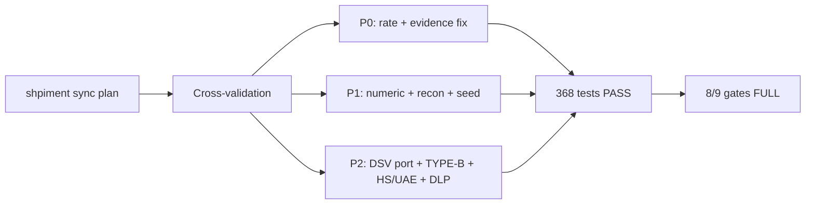

# shpiment 원본 동기화 계획

> **Status (2026-06-13)**: SESS-005 완료. Cross-validation 완료, P0/P1/P2 13갭 해결.
> Track 1 9게이트 중 8게이트 FULL 정합. 잔여 1건: Harness/RTM (P3, CI 의존).

## Phase 1: Business Review

### 1.1 문제 정의

현재 상태: `SCT_ONTOLOGY-main/scripts/shpt_v3_harness`에는 `shpiment` 원본 로직이 일부 복사되어 있지만 4개 파일이 원본과 다르다.

목표 상태: 실행 호환성을 해치지 않는 범위에서 원본과 동일하게 맞출 파일을 확정하고, 차이가 필요한 파일은 의도된 SCT адаптация로 남긴다.

영향 범위:
- 비교 대상 파일: 4개
- 실제 로직 차이: 3개
- 줄바꿈만 다른 파일: 1개
- 단독 harness 검증 영향: 있음

### 1.2 제안 옵션

| 옵션 | 설명 | 공수(일) | 리스크 | 비용(AED) |
|------|------|---------|--------|----------|
| A | 4개 파일 모두 `shpiment` 원본과 동일하게 덮어쓴다. | 0.25 | SCT 컬럼명 허용, 평평한 harness 경로 호환성 손실 가능 | 0 |
| B | `dlp_scan.py`와 `TYPE_B_Rules_v3.1_PRO.csv`만 원본과 동일하게 맞추고, `harness_validate_package.py`, `workbook_output_validate.py`는 SCT 호환 변경으로 유지한다. | 0.25 | 원본과 100% 동일 상태는 아님 | 0 |
| C | 파일은 수정하지 않고 차이 사유 문서만 남긴다. | 0.1 | 이후 재검증 때 계속 불일치로 표시됨 | 0 |

### 1.3 추천 & 근거

추천: 옵션 B.

원본과 동일하게 맞출 파일:
- `scripts/shpt_v3_harness/dlp_scan.py`
- `scripts/shpt_v3_harness/rules/TYPE_B_Rules_v3.1_PRO.csv`

유지할 파일:
- `scripts/shpt_v3_harness/harness_validate_package.py`: SCT의 평평한 폴더 구조 실행을 위해 경로 fallback이 필요하다.
- `scripts/shpt_v3_harness/workbook_output_validate.py`: SCT workbook 컬럼명과 PDF source_data 행 수 차이를 허용하기 위해 완화가 필요하다.

롤백 전략: 변경 전 `git diff --no-index` 결과와 Git 상태를 기준으로 두 파일만 되돌린다.

### 1.4 승인 요청

[ ] Phase 1 승인

## SESS-005 Execution Summary (2026-06-13)

## Codex Documentation Update — 2026-06-13T21:10:45.952547+00:00

**Update policy:** existing content above this section is preserved. This section was appended after scanning code, documentation, config, and agent profile files.

**Purpose:** This section defines the next documentation maintenance loop based on verified repository evidence.

### Evidence inventory

**Source/code files sampled:**
- `apps\mcp-server\db\migrate-rate-cards.sql`
- `apps\mcp-server\db\seed-rate-cards.sql`
- `apps\mcp-server\src\__tests__\router.test.ts`
- `apps\mcp-server\src\__tests__\schema-contract.test.ts`
- `apps\mcp-server\src\db.ts`
- `apps\mcp-server\src\main.ts`
- `apps\mcp-server\src\schemas\dlp-guard.ts`
- `apps\mcp-server\src\tools\__tests__\build_validation_explanation.test.ts`
- `apps\mcp-server\src\tools\__tests__\check_contract_validity.test.ts`
- `apps\mcp-server\src\tools\__tests__\check_cost_guard.test.ts`
- `apps\mcp-server\src\tools\__tests__\check_dem_det.test.ts`
- `apps\mcp-server\src\tools\__tests__\check_duplicate_invoice.test.ts`

**Documentation files sampled:**
- `.vercel\README.txt`
- `20260613_cross_validation_report.md`
- `20260613_dsv_waybill_port_plan.md`
- `20260613_job_store_mcp_fix_plan.md`
- `20260613_p2_gap_design.md`
- `README.md`
- `apps\README.md`
- `apps\graphify-out\GRAPH_REPORT.md`
- `apps\graphify-out\converted\sample-invoice_c70e590b.md`
- `apps\web\.vercel\README.txt`
- `apps\worker-py\README.md`
- `apps\worker-py\invoice_audit_parser.egg-info\SOURCES.txt`

**Config/build files sampled:**
- `.claude\settings.local.json`
- `.codex\root-docs-scan.json`
- `.codex\root-docs-write.json`
- `.github\dependabot.yml`
- `.github\workflows\codeql.yml`
- `.github\workflows\fly-worker-deploy.yml`
- `.github\workflows\python-worker-ci.yml`
- `.github\workflows\release-gate.yml`
- `.github\workflows\vercel-preview.yml`
- `.github\workflows\vercel-prod.yml`
- `.github\workflows\web-ci.yml`
- `.vercel\project.json`

**Agent profile files sampled:**
- No agent profile detected; this update records the absence explicitly.

### Mermaid graph

### Verification notes

- Append-only update generated by `root-docs-batch-update`.
- Code/config/doc/agent inventory counts: code=182, docs=108, config=451, agent_profiles=0.
- Follow-up verification should confirm that newly added text matches actual implementation paths listed above.

## Codex Documentation Update — 2026-06-14T09:41:25.480989+00:00

**Update policy:** existing content above this section is preserved. This section was appended after scanning code, documentation, config, and agent profile files.

**Purpose:** This section defines the next documentation maintenance loop based on verified repository evidence.

### Evidence inventory

**Source/code files sampled:**
- `apps\mcp-server\db\migrate-rate-cards.sql`
- `apps\mcp-server\db\seed-rate-cards.sql`
- `apps\mcp-server\src\__tests__\router.test.ts`
- `apps\mcp-server\src\__tests__\schema-contract.test.ts`
- `apps\mcp-server\src\db.ts`
- `apps\mcp-server\src\main.ts`
- `apps\mcp-server\src\schemas\dlp-guard.ts`
- `apps\mcp-server\src\telemetry.ts`
- `apps\mcp-server\src\tools\__tests__\build_validation_explanation.test.ts`
- `apps\mcp-server\src\tools\__tests__\check_contract_validity.test.ts`
- `apps\mcp-server\src\tools\__tests__\check_cost_guard.test.ts`
- `apps\mcp-server\src\tools\__tests__\check_dem_det.test.ts`

**Documentation files sampled:**
- `.hermes\plans\auto-20260614-013800.md`
- `.vercel\README.txt`
- `20260613_cross_validation_report.md`
- `20260613_dsv_waybill_port_plan.md`
- `20260613_job_store_mcp_fix_plan.md`
- `20260613_p2_gap_design.md`
- `20260614_api_inventory_design_audit_v1.md`
- `20260614_db_schema_swarm_scout.md`
- `20260614_documentation_audit_swarm_scout.md`
- `20260614_performance_optimization_plan_v1.md`
- `20260614_phase2_plan.md`
- `20260614_phase3_4_work_log.md`

**Config/build files sampled:**
- `.claude\settings.local.json`
- `.codex\root-docs-scan.json`
- `.codex\root-docs-write.json`
- `.github\dependabot.yml`
- `.github\workflows\_ts-checks.yml`
- `.github\workflows\codeql.yml`
- `.github\workflows\fly-mcp-server-deploy.yml`
- `.github\workflows\fly-worker-deploy.yml`
- `.github\workflows\python-worker-ci.yml`
- `.github\workflows\release-gate.yml`
- `.github\workflows\reliability.yml`
- `.github\workflows\secret-scan.yml`

**Agent profile files sampled:**
- No agent profile detected; this update records the absence explicitly.

### Mermaid graph

### Verification notes

- Append-only update generated by `root-docs-batch-update`.
- Code/config/doc/agent inventory counts: code=259, docs=157, config=520, agent_profiles=0.
- Follow-up verification should confirm that newly added text matches actual implementation paths listed above.
