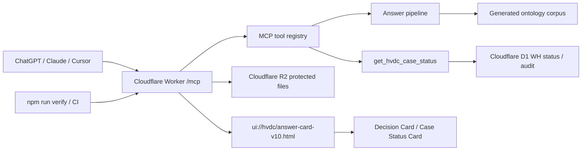
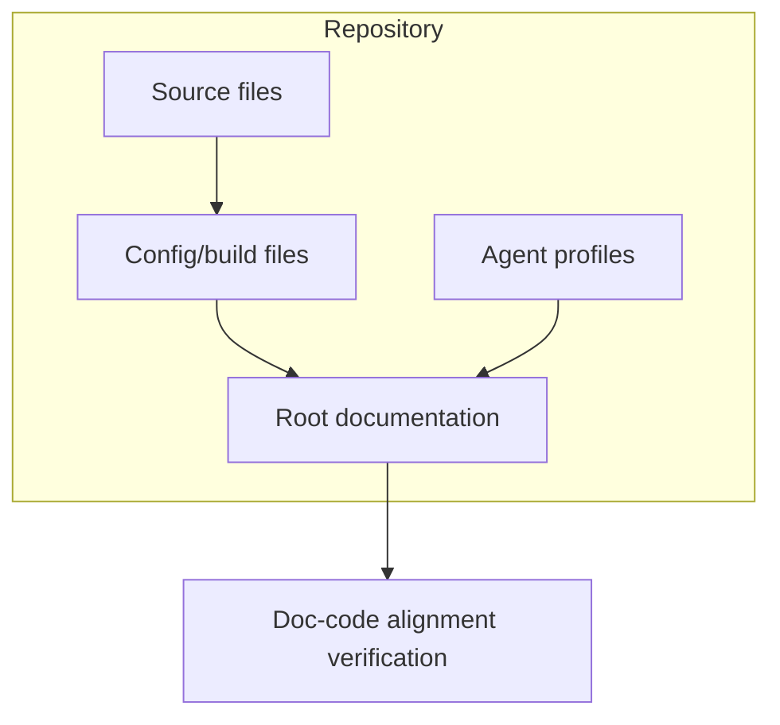
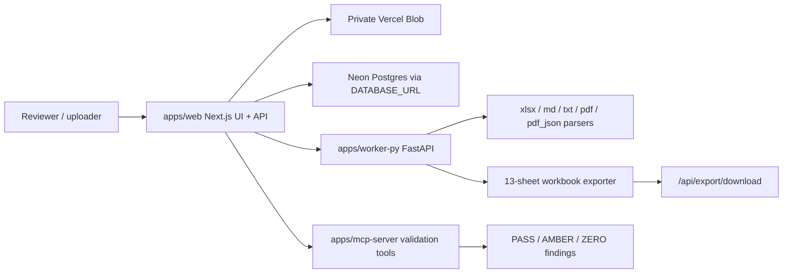
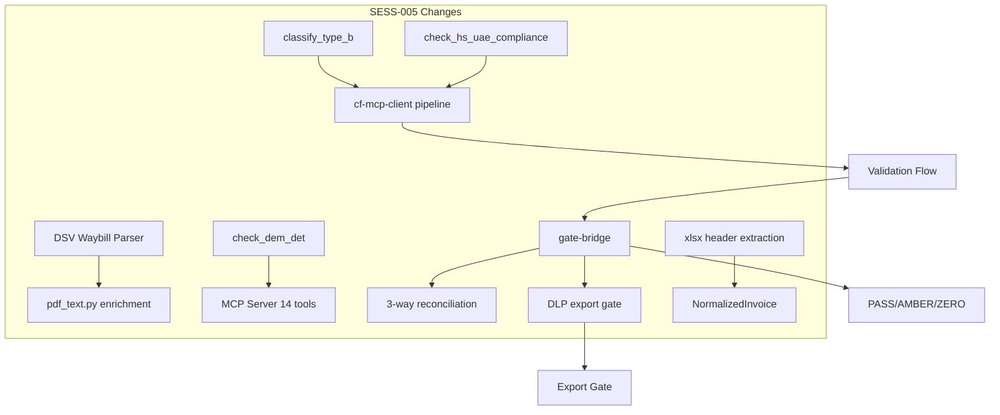

# System Architecture

## System Purpose

This project is the HVDC ontology-grounded ChatGPT App and MCP server. It answers HVDC logistics questions from approved ontology corpus evidence, renders structured Decision Card / Case Status Card UI, and serves the runtime from Cloudflare Workers.

The current public MCP endpoint is `https://hvdc-ontology-chatgpt-app.mscho715.workers.dev/mcp`. The current widget resource is `ui://hvdc/answer-card-v10.html`.

## Components

| Component | Evidence path | Runtime role |
| --- | --- | --- |
| Cloudflare Worker | `server/src/worker.ts`, `wrangler.toml` | Handles `/healthz`, `/mcp`, D1 lookup, R2 protected file boundary, rate limits, and telemetry config. |
| MCP tool registry | `server/src/hvdc-server.ts` | Registers ChatGPT Apps SDK resources and tools including ontology search, validation, Dual-MCP tools, and `get_hvdc_case_status`. |
| Answer pipeline | `server/src/answer.ts`, `server/src/corpus.ts`, `server/src/router.ts` | Routes questions, searches corpus chunks, validates evidence, and returns structured answer payloads. |
| Decision Card contract | `server/src/decision-card.ts`, `server/src/types.ts` | Builds Decision Card v2.1 payloads, rulepack trace fields, human gate state, and security/audit status. |
| Widget UI | `public/hvdc-answer-widget.html`, `server/src/generated/widget-html.ts` | Renders ChatGPT iframe UI, Case Status Card, Decision Card tabs, drawers, tables, and fallback text. |
| Corpus bundle | `data/corpus/`, `scripts/generate_worker_assets.py`, `server/src/generated/corpus-data.ts` | Converts approved ontology documents into Worker-bundled search data. |
| WH status SSOT | `wh status/hvdc_wh_status.xlsx`, `scripts/seed_wh_status_d1.py`, `migrations/0006_wh_status_case_card.sql`, `migrations/0007_case_event_ssot.sql` | Projects Excel case rows into D1 case cards, canonical events, warehouse dwell, and site intake status. |
| Verification | `tests/`, `.github/workflows/ci.yml`, `.github/workflows/hvdc-verify.yml` | Runs typecheck, Vitest, Worker dry-run, coverage, schema drift, and corpus drift gates. |

## Runtime Flow

1. A client calls `/mcp` with a tool request.
2. `server/src/worker.ts` creates the Worker request boundary and runtime bindings.
3. `server/src/hvdc-server.ts` dispatches the selected MCP tool.
4. Ontology answers read generated corpus data; case status answers read D1 Control Tower / WH status projections.
5. The tool returns structured content plus `ui://hvdc/answer-card-v10.html` for ChatGPT rendering.
6. The widget renders cards without mutating business verdict fields.

## External Dependencies

- Cloudflare Workers for runtime hosting.
- Cloudflare D1 binding `MCP_AUDIT_DB` for audit, Control Tower, and warehouse status projections.
- Cloudflare R2 binding `HVDC_FILES` for protected upload/write storage.
- Cloudflare KV binding `HVDC_CACHE` for cache support.
- ChatGPT Apps SDK metadata via MCP resources.

## Current Verification Baseline

- `npm run worker:deploy` executed `npm run verify` before deployment.
- Latest verified test baseline: 22 test files, 302 tests passed.
- Latest deployed Worker URL: `https://hvdc-ontology-chatgpt-app.mscho715.workers.dev`.
- Latest smoke evidence: `/healthz` returned 200 and `get_hvdc_case_status caseNo=207721` returned `WHCASE-207721`, `WARN`, `M100_FINAL_DELIVERED`, `canonicalEvents=6`, and `caseCard=36`.

## Codex Documentation Update — 2026-06-13T18:20:29.442785+00:00

**Update policy:** existing content above this section is preserved. This section was appended after scanning code, documentation, config, and agent profile files.

**Purpose:** This section reflects detected source, config, and agent components as an architecture inventory.

### Evidence inventory

**Source/code files sampled:**
- `apps\mcp-server\src\__tests__\router.test.ts`
- `apps\mcp-server\src\__tests__\schema-contract.test.ts`
- `apps\mcp-server\src\db.ts`
- `apps\mcp-server\src\main.ts`
- `apps\mcp-server\src\schemas\dlp-guard.ts`
- `apps\mcp-server\src\tools\__tests__\build_validation_explanation.test.ts`
- `apps\mcp-server\src\tools\__tests__\check_contract_validity.test.ts`
- `apps\mcp-server\src\tools\__tests__\check_cost_guard.test.ts`
- `apps\mcp-server\src\tools\__tests__\check_duplicate_invoice.test.ts`
- `apps\mcp-server\src\tools\__tests__\check_evidence_required.test.ts`
- `apps\mcp-server\src\tools\__tests__\check_fx_policy.test.ts`
- `apps\mcp-server\src\tools\__tests__\check_rate_card.test.ts`

**Documentation files sampled:**
- `.vercel\README.txt`
- `20260613_job_store_mcp_fix_plan.md`
- `apps\README.md`
- `apps\graphify-out\GRAPH_REPORT.md`
- `apps\graphify-out\converted\sample-invoice_c70e590b.md`
- `apps\web\.vercel\README.txt`
- `apps\worker-py\README.md`
- `apps\worker-py\invoice_audit_parser.egg-info\SOURCES.txt`
- `apps\worker-py\invoice_audit_parser.egg-info\dependency_links.txt`
- `apps\worker-py\invoice_audit_parser.egg-info\requires.txt`
- `apps\worker-py\invoice_audit_parser.egg-info\top_level.txt`
- `docs\# 3-Way 교차검증 보고서 (graph × 개발 현황 보고서 × Invoice Audit Platform v1.00).md`

**Config/build files sampled:**
- `.codex\root-docs-scan.json`
- `.github\dependabot.yml`
- `.github\workflows\codeql.yml`
- `.github\workflows\fly-worker-deploy.yml`
- `.github\workflows\python-worker-ci.yml`
- `.github\workflows\release-gate.yml`
- `.github\workflows\vercel-preview.yml`
- `.github\workflows\vercel-prod.yml`
- `.github\workflows\web-ci.yml`
- `.vercel\project.json`
- `apps\graphify-out\graph.json`
- `apps\mcp-server\package-lock.json`

**Agent profile files sampled:**
- No agent profile detected; this update records the absence explicitly.

### Mermaid graph

### Verification notes

- Append-only update generated by `root-docs-batch-update`.
- Code/config/doc/agent inventory counts: code=171, docs=99, config=264, agent_profiles=0.
- Follow-up verification should confirm that newly added text matches actual implementation paths listed above.

## Invoice Audit Platform Runtime Addendum - 2026-06-13

This addendum records the current invoice audit MVP runtime observed in the repository. It supplements the earlier ontology/Cloudflare architecture notes without deleting historical content.

For invoice-audit work, this addendum is the current-state section. Earlier Cloudflare ontology sections remain as historical context for the SCT ontology app lineage.

### Current Runtime Components

| Component | Evidence path | Runtime role |
| --- | --- | --- |
| Next.js web/API app | `apps/web/` | Upload UI, job pages, audit APIs, approval gate, export/download orchestration, Vercel deployment target. |
| Python parser/export worker | `apps/worker-py/` | FastAPI worker for parsing `xlsx`, `md`, `txt`, `pdf`, and `pdf_json`, plus 13-sheet workbook export. |
| MCP validation server | `apps/mcp-server/` | TypeScript validation tools for invoice normalization, duplicate, shipment, rate, contract, evidence, VAT, FX, cost guard, and explanations. |
| Shared schemas and helpers | `packages/contracts/`, `packages/shared/` | Shared validation/export schemas, hashing, and redaction helpers. |
| Postgres persistence | `migrations/`, `DATABASE_URL` | Neon/Postgres-backed job store and audit persistence. Only the environment variable name is documented here, not its value. |
| Private Blob storage | `BLOB_READ_WRITE_TOKEN` | Private Vercel Blob store for invoice/evidence files. Parser access should use signed download URLs, not public P2 object URLs. |

Local development has fallback behavior. If `DATABASE_URL` is unset, the web job store can run in memory for local testing. If Blob credentials are absent or configured for a development stub, the web app can use local `.dev-blob` storage. Production must use Neon/Postgres and private Blob storage.

### Invoice Audit Runtime Flow

### Web/API Boundary

The current web API surface is implemented under `apps/web/src/app/api/`.

- `POST /api/files/ingest` handles standard uploads.
- `POST /api/files/ingest/large` handles the large upload path.
- `POST /api/invoice-audit/run` runs parser and validation orchestration for a job.
- `GET /api/audit/status?job_id=...` returns job status and last trace step.
- `GET /api/audit/trace?job_id=...` returns audit trace records.
- `GET /api/audit/result?job_id=...` returns audit result payload.
- `POST /api/audit/approve` records approval gate actions.
- `POST /api/audit/export` builds an export artifact.
- `GET /api/export/download` downloads the exported workbook.

The current UI routes are implemented under `apps/web/src/app/`.

- `/invoice-audit`
- `/invoice-audit/upload`
- `/invoice-audit/jobs/[jobId]`
- `/fx-policies`

### Worker Boundary

The parser/export worker is implemented in `apps/worker-py/app/`.

- `POST /parse` parses uploaded input by file type.
- `POST /v1/export` builds the final audit workbook.
- `GET /health/ready` checks readiness for DB, Blob storage, parser, and memory dependencies.
- `GET /health/live` checks liveness.

The worker supports Excel, Markdown, text, PDF text, and OpenDataLoader PDF JSON flows. Parser outputs must preserve source/evidence metadata without exposing raw P2 content in logs or docs.

### MCP Validation Boundary

The validation server is implemented in `apps/mcp-server/src/`.

Current tool files include:

- `route_question`
- `normalize_invoice_lines`
- `check_duplicate_invoice`
- `match_shipment_reference`
- `check_rate_card`
- `check_contract_validity`
- `check_evidence_required`
- `check_tax_vat`
- `check_fx_policy`
- `check_cost_guard`
- `build_validation_explanation`

These tools support the invoice audit gate model. ZERO findings block final approved export, and AMBER findings require reviewer approval according to project rules.

### Security and DLP Boundary

- Document environment variable names only. Do not document actual values.
- Keep invoice/evidence files in private Blob storage.
- Use signed download URLs when the worker fetches private Blob objects.
- Do not paste original invoice text, signed URLs, Blob object keys, TRN, BOE, BL, container numbers, raw rates, emails, phone numbers, approval text, or tokens into docs.
- Treat workbook exports as controlled audit artifacts. Keep the 13-sheet contract intact.

## SESS-005 Cross-Validation Update — 2026-06-13

This section reflects the SESS-005 cross-validation and P0/P1/P2 gap-patching changes. Earlier sections remain as historical context.

### Updated MCP Tools (14)

Expanded from 11 to 14 tools. New tools:

| Tool | Purpose | Track 1 Gate |
|------|---------|-------------|
| `classify_type_b` | 8-class priority TYPE-B classification | Ontology/Type-B Matrix |
| `check_hs_uae_compliance` | BOE presence + HS code validation | Gate 6: HS/UAE |
| `check_dem_det` | DEM/DET evidence requirement check | Gate 7: DEM/DET |

### Updated Gate Bridge

- `buildGateResult` now accepts `evidenceFindings` (doc_guardian → ZERO/AMBER escalation)
- `checkReconciliation()` enforces 3-way tie-out: Final Subtotal = Line_Audit = TYPE-B (±0.01)
- `checkDlpExport()` blocks export on DLP violations (16 P2 categories)

### Updated Parsers

- DSV Waybill parser (`dsv_waybill.py`): 8 core functions ported from Track 1 v1.4.1, 28 tests
- xlsx parser: InvoiceHeader extraction (invoice_no, vendor, issue_date) + 4 new columns (shipment_ref, job_number, rate_basis, for_charge_component)

### Verification Baseline (2026-06-13)

- Worker-PY: 95 tests PASS
- MCP Server: 186 tests PASS (16 test files, 14 tools)
- Web: 107 tests PASS, typecheck 0 errors
- Cross-validation: Track 1 9 gates → 8 FULL, 1 P3

## Codex Documentation Update — 2026-06-13T21:10:45.952547+00:00

**Update policy:** existing content above this section is preserved. This section was appended after scanning code, documentation, config, and agent profile files.

**Purpose:** This section reflects detected source, config, and agent components as an architecture inventory.

### Evidence inventory

**Source/code files sampled:**
- `apps\mcp-server\db\migrate-rate-cards.sql`
- `apps\mcp-server\db\seed-rate-cards.sql`
- `apps\mcp-server\src\__tests__\router.test.ts`
- `apps\mcp-server\src\__tests__\schema-contract.test.ts`
- `apps\mcp-server\src\db.ts`
- `apps\mcp-server\src\main.ts`
- `apps\mcp-server\src\schemas\dlp-guard.ts`
- `apps\mcp-server\src\tools\__tests__\build_validation_explanation.test.ts`
- `apps\mcp-server\src\tools\__tests__\check_contract_validity.test.ts`
- `apps\mcp-server\src\tools\__tests__\check_cost_guard.test.ts`
- `apps\mcp-server\src\tools\__tests__\check_dem_det.test.ts`
- `apps\mcp-server\src\tools\__tests__\check_duplicate_invoice.test.ts`

**Documentation files sampled:**
- `.vercel\README.txt`
- `20260613_cross_validation_report.md`
- `20260613_dsv_waybill_port_plan.md`
- `20260613_job_store_mcp_fix_plan.md`
- `20260613_p2_gap_design.md`
- `README.md`
- `apps\README.md`
- `apps\graphify-out\GRAPH_REPORT.md`
- `apps\graphify-out\converted\sample-invoice_c70e590b.md`
- `apps\web\.vercel\README.txt`
- `apps\worker-py\README.md`
- `apps\worker-py\invoice_audit_parser.egg-info\SOURCES.txt`

**Config/build files sampled:**
- `.claude\settings.local.json`
- `.codex\root-docs-scan.json`
- `.codex\root-docs-write.json`
- `.github\dependabot.yml`
- `.github\workflows\codeql.yml`
- `.github\workflows\fly-worker-deploy.yml`
- `.github\workflows\python-worker-ci.yml`
- `.github\workflows\release-gate.yml`
- `.github\workflows\vercel-preview.yml`
- `.github\workflows\vercel-prod.yml`
- `.github\workflows\web-ci.yml`
- `.vercel\project.json`

**Agent profile files sampled:**
- No agent profile detected; this update records the absence explicitly.

### Mermaid graph

### Verification notes

- Append-only update generated by `root-docs-batch-update`.
- Code/config/doc/agent inventory counts: code=182, docs=108, config=451, agent_profiles=0.
- Follow-up verification should confirm that newly added text matches actual implementation paths listed above.
