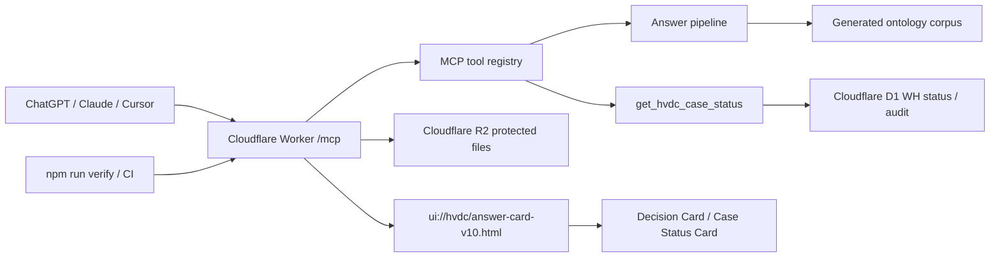

# System Architecture

## System Purpose

This project is the HVDC ontology-grounded ChatGPT App and MCP server. It answers HVDC logistics questions from approved ontology corpus evidence, renders structured Decision Card / Case Status Card UI, and serves the runtime from Cloudflare Workers.

The current public MCP endpoint is `https://hvdc-ontology-chatgpt-app.mscho715.workers.dev/mcp`. The current widget resource is `ui://hvdc/answer-card-v10.html`.

## Components

| Component | Evidence path | Runtime role |
| --- | --- | --- |
| Cloudflare Worker | `server/src/worker.ts`, `wrangler.toml` | Handles `/healthz`, `/mcp`, D1 lookup, R2 protected file boundary, rate limits, and telemetry config. |
| MCP tool registry | `server/src/hvdc-server.ts` | Registers ChatGPT Apps SDK resources and tools including ontology search, validation, Dual-MCP tools, and `get_hvdc_case_status`. |
| Answer pipeline | `server/src/answer.ts`, `server/src/corpus.ts`, `server/src/router.ts` | Routes questions, searches corpus chunks, validates evidence, and returns structured answer payloads. |
| Decision Card contract | `server/src/decision-card.ts`, `server/src/types.ts` | Builds Decision Card v2.1 payloads, rulepack trace fields, human gate state, and security/audit status. |
| Widget UI | `public/hvdc-answer-widget.html`, `server/src/generated/widget-html.ts` | Renders ChatGPT iframe UI, Case Status Card, Decision Card tabs, drawers, tables, and fallback text. |
| Corpus bundle | `data/corpus/`, `scripts/generate_worker_assets.py`, `server/src/generated/corpus-data.ts` | Converts approved ontology documents into Worker-bundled search data. |
| WH status SSOT | `wh status/hvdc_wh_status.xlsx`, `scripts/seed_wh_status_d1.py`, `migrations/0006_wh_status_case_card.sql`, `migrations/0007_case_event_ssot.sql` | Projects Excel case rows into D1 case cards, canonical events, warehouse dwell, and site intake status. |
| Verification | `tests/`, `.github/workflows/ci.yml`, `.github/workflows/hvdc-verify.yml` | Runs typecheck, Vitest, Worker dry-run, coverage, schema drift, and corpus drift gates. |

## Runtime Flow

1. A client calls `/mcp` with a tool request.
2. `server/src/worker.ts` creates the Worker request boundary and runtime bindings.
3. `server/src/hvdc-server.ts` dispatches the selected MCP tool.
4. Ontology answers read generated corpus data; case status answers read D1 Control Tower / WH status projections.
5. The tool returns structured content plus `ui://hvdc/answer-card-v10.html` for ChatGPT rendering.
6. The widget renders cards without mutating business verdict fields.

## External Dependencies

- Cloudflare Workers for runtime hosting.
- Cloudflare D1 binding `MCP_AUDIT_DB` for audit, Control Tower, and warehouse status projections.
- Cloudflare R2 binding `HVDC_FILES` for protected upload/write storage.
- Cloudflare KV binding `HVDC_CACHE` for cache support.
- ChatGPT Apps SDK metadata via MCP resources.

## Current Verification Baseline

- `npm run worker:deploy` executed `npm run verify` before deployment.
- Latest verified test baseline: 22 test files, 302 tests passed.
- Latest deployed Worker URL: `https://hvdc-ontology-chatgpt-app.mscho715.workers.dev`.
- Latest smoke evidence: `/healthz` returned 200 and `get_hvdc_case_status caseNo=207721` returned `WHCASE-207721`, `WARN`, `M100_FINAL_DELIVERED`, `canonicalEvents=6`, and `caseCard=36`.
