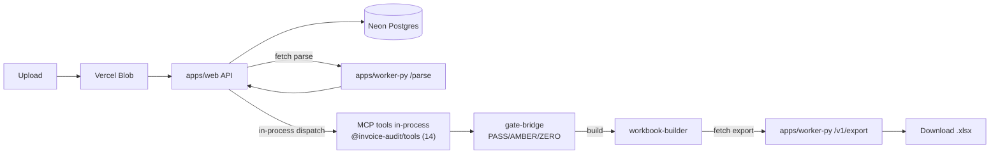
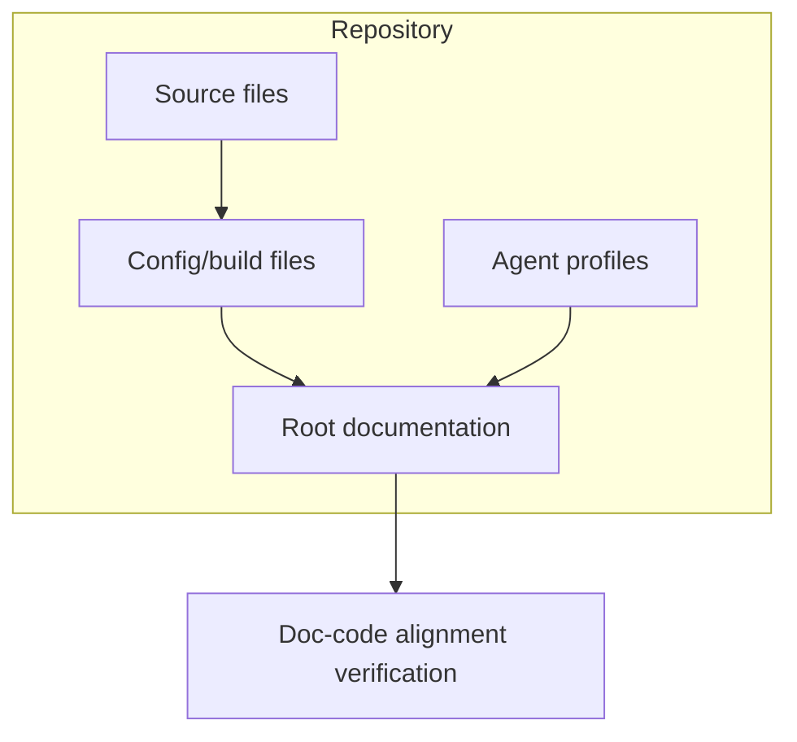

# System Architecture

## Overview

SCT Invoice Audit Platform — 3-app architecture for HVDC invoice processing, cost guard validation, and approval-gate workflows in the Samsung C&T Abu Dhabi HVDC project.

## Components

| Component | Runtime | Host | Role |
|---|---|---|---|
| **apps/web** | Next.js 15 (App Router) | Vercel | Invoice upload UI, audit workspace, API orchestration, approval gates, workbook export dispatch |
| **apps/worker-py** | FastAPI (Python) | Fly.io | File parsing (xlsx/md/txt/pdf/pdf_json), 13-sheet audit workbook export |
| **apps/mcp-server** | Hono (TypeScript) | Fly.io | Standalone MCP JSON-RPC validation server — 14 audit tools for external clients (ChatGPT, Claude Desktop) |
| **packages/tools** | TypeScript (ESM) | — | **14 MCP validation tools — single source of truth**, shared by `apps/web` and `apps/mcp-server` (no code duplication) |
| **packages/database** | TypeScript (ESM) | — | Postgres pool singleton (Neon) — shared by `apps/web` and `apps/mcp-server` |
| **packages/contracts** | TypeScript | — | Shared invoice, validation, and export Zod schemas |
| **packages/shared** | TypeScript | — | Hashing, redaction, and DLP helpers |

## Data Flow



**Key routing decisions:**
- MCP validation for the web audit flow runs **in-process** inside `apps/web/src/lib/mcp/tools.ts` — a logic-identical port of the 6 tools the validate() flow calls. No network hop to `apps/mcp-server` during audit.
- `apps/mcp-server` is the **standalone** MCP server for external clients (ChatGPT, Claude Desktop, Cursor) via JSON-RPC at `/mcp`.
- Parser and export are always fetched from the Python worker.

## Database

| Store | Engine | Purpose | Binding |
|---|---|---|---|
| **Primary** | Neon Postgres | Job store, gate results, invoice lines, audit traces, rate cards | `DATABASE_URL` |
| **Secondary** | Cloudflare D1 | Legacy ontology data, WH status projections (not active for invoice audit) | `MCP_AUDIT_DB` |
| **Blob** | Vercel Blob (private) | Invoice/evidence file storage, export artifacts | `BLOB_READ_WRITE_TOKEN` |

## Web/API Surface

### Routes (apps/web/src/app/)

| Path | Purpose |
|---|---|
| `/` | App entry page |
| `/invoice-audit` | Audit workspace |
| `/invoice-audit/upload` | Upload invoice + evidence |
| `/invoice-audit/jobs/[jobId]` | Job detail + review |
| `/fx-policies` | FX policy reference |

### API Routes (apps/web/src/app/api/)

| Endpoint | Method | Purpose |
|---|---|---|
| `/api/files/ingest` | POST | Standard file upload |
| `/api/files/ingest/large` | POST | Large file upload path |
| `/api/invoice-audit/run` | POST | Run parser + validation pipeline |
| `/api/audit/status` | GET | Job status + last trace step |
| `/api/audit/trace` | GET | Audit trace records |
| `/api/audit/result` | GET | Audit result payload |
| `/api/audit/approve` | POST | Approval gate action |
| `/api/audit/export` | POST | Build export artifact |
| `/api/export/download` | GET | Download exported workbook |
| `/api/fx-policy` | POST | FX policy check |
| `/mcp` | POST | In-process MCP tools endpoint |

## Worker Boundary (apps/worker-py)

| Endpoint | Method | Purpose |
|---|---|---|
| `/parse` | POST | Parse uploaded file (xlsx/md/txt/pdf/pdf_json) |
| `/v1/export` | POST | Build 13-sheet audit workbook |
| `/health/ready` | GET | Readiness check (DB, blob, parser, memory) |
| `/health/live` | GET | Liveness check |

## MCP Validation Tools

**Single source of truth:** `packages/tools/src/` (14 tools). Imported by both `apps/web` (in-process) and `apps/mcp-server` (JSON-RPC). No code duplication.

14 tools:
`route_question`, `normalize_invoice_lines`, `check_duplicate_invoice`, `match_shipment_reference`, `check_rate_card` (+ `check_rate_card_batch` for N-line queries in 1 round-trip), `check_contract_validity`, `check_evidence_required`, `check_tax_vat`, `check_fx_policy`, `check_cost_guard`, `build_validation_explanation`, `classify_type_b`, `check_hs_uae_compliance`, `check_dem_det`

**Batch validation** (Phase 4 performance plan v1): `check_rate_card_batch({checks: [{charge_code, lane, rate}, ...]})` collapses N per-line calls into a single batched query — significant latency reduction for high-volume invoices.

## Approval Gate Model

```
PASS  — All gates clear, ready for export
AMBER — Warning findings, reviewer approval required
ZERO  — Blocking findings, export disabled until resolved
FAILED — Fatal error (parser failure, missing data)
```

`gate-bridge.ts` enforces 3-way reconciliation (Final Subtotal = Line_Audit = TYPE-B, tolerance ±0.01) and DLP export gate (16 P2 categories).

## Deployment

| App | Host | Workflow |
|---|---|---|
| apps/web | Vercel | `.github/workflows/vercel-prod.yml` |
| apps/worker-py | Fly.io | `.github/workflows/fly-worker-deploy.yml` |
| apps/mcp-server | Fly.io | `.github/workflows/fly-mcp-server-deploy.yml` |

CI workflows: `web-ci.yml`, `python-worker-ci.yml`, `release-gate.yml`, `vercel-preview.yml`, `codeql.yml`

## 13-Sheet Workbook Contract

`00_Decision` → `01_Action_Items` → `02_Final_Recon` → `03_Header_Check` → `04_Line_View` → `05_Duplicate_Check` → `06_Rate_Check` → `07_Tax_FX_Check` → `08_Shipment_Match` → `90_Source_Data` → `91_Audit_Detail` → `92_Evidence_Issues` → `99_Manifest`

## Security & DLP

- All invoice/evidence files → Private Vercel Blob only. Signed download URLs for worker access.
- P2 categories: TRN, BOE, BL, container numbers, raw rates, emails, phone numbers, tokens — never committed, never in logs/docs.
- Raw P2 content never sent to LLM prompts.
- Workbook exports are controlled audit artifacts.
- `.gitignore` includes `**/private/**`, `**/DSV_SHIPMENT_FULL_PACKAGE_*/**`, and PII template patterns.
- **Content-Security-Policy** header set in `apps/web/next.config.js`: `default-src 'self'; script-src 'self' 'unsafe-inline'; style-src 'self' 'unsafe-inline'; connect-src 'self' https://*.vercel-storage.com https://*.neon.tech; img-src 'self' data: blob: https:; frame-ancestors 'none'; font-src 'self'` — restricts XSS, framing, and outbound connections to Vercel Blob + Neon only.

## Verification Baseline (2026-06-14)

| Component | Tests | Typecheck |
|---|---|---|
| apps/web | 107 PASS | 0 errors |
| apps/worker-py | 95 PASS | py_compile OK |
| apps/mcp-server | 186 PASS | 0 errors |
| **Total** | **388** | **0 errors** |

## Historical (Archived 2026-06-14)

The project originally ran as a single Cloudflare Worker (`server/src/worker.ts`) serving the SCT ontology ChatGPT App with D1-backed MCP tools, corpus search, and Decision Card widgets. That runtime was decommissioned when the invoice audit platform replaced it.

### Legacy Components (all deleted)

| Component | Former Path | Fate |
|---|---|---|
| Cloudflare Worker | `server/src/worker.ts` | Deleted. Replaced by `apps/web` + `apps/worker-py` |
| MCP tool registry | `server/src/hvdc-server.ts` | Deleted. Replaced by `apps/mcp-server` |
| Answer pipeline | `server/src/answer.ts`, `corpus.ts`, `router.ts` | Deleted |
| Decision Card | `server/src/decision-card.ts` | Deleted |
| Widget UI | `public/hvdc-answer-widget.html` | Deleted |
| Corpus bundle | `data/corpus/` | Deleted |
| WH status SSOT | `wh status/` | Deleted |
| D1 migrations | `migrations/0001-0007_*.sql` | Superseded by Postgres migrations `0008-0010` |
| Generated assets | `server/src/generated/` | Deleted |

### Legacy Deployment

- Former Worker URL: `https://hvdc-ontology-chatgpt-app.mscho715.workers.dev` (offline)
- Former MCP endpoint: `/mcp` on the Worker
- Former widget resource: `ui://hvdc/answer-card-v10.html` (retired)
- Former bindings: `MCP_AUDIT_DB` (D1), `HVDC_FILES` (R2), `HVDC_CACHE` (KV)
- Former verify: `npm run verify` → typecheck + Vitest + Worker dry-run (302 tests)
- Former deploy: `npm run worker:deploy`

### Archival Notes

The Cloudflare ontology MCP runtime served its purpose as a proof-of-concept for ChatGPT integration. The invoice audit platform now handles production workflows. Legacy `migrations/0001-0007` (D1 schemas) remain in the repo for reference but are not used by the current runtime. Current migrations `0008-0010` target Neon Postgres.


## Codex Documentation Update — 2026-06-14T09:41:25.480989+00:00

**Update policy:** existing content above this section is preserved. This section was appended after scanning code, documentation, config, and agent profile files.

**Purpose:** This section reflects detected source, config, and agent components as an architecture inventory.

### Evidence inventory

**Source/code files sampled:**
- `apps\mcp-server\db\migrate-rate-cards.sql`
- `apps\mcp-server\db\seed-rate-cards.sql`
- `apps\mcp-server\src\__tests__\router.test.ts`
- `apps\mcp-server\src\__tests__\schema-contract.test.ts`
- `apps\mcp-server\src\db.ts`
- `apps\mcp-server\src\main.ts`
- `apps\mcp-server\src\schemas\dlp-guard.ts`
- `apps\mcp-server\src\telemetry.ts`
- `apps\mcp-server\src\tools\__tests__\build_validation_explanation.test.ts`
- `apps\mcp-server\src\tools\__tests__\check_contract_validity.test.ts`
- `apps\mcp-server\src\tools\__tests__\check_cost_guard.test.ts`
- `apps\mcp-server\src\tools\__tests__\check_dem_det.test.ts`

**Documentation files sampled:**
- `.hermes\plans\auto-20260614-013800.md`
- `.vercel\README.txt`
- `20260613_cross_validation_report.md`
- `20260613_dsv_waybill_port_plan.md`
- `20260613_job_store_mcp_fix_plan.md`
- `20260613_p2_gap_design.md`
- `20260614_api_inventory_design_audit_v1.md`
- `20260614_db_schema_swarm_scout.md`
- `20260614_documentation_audit_swarm_scout.md`
- `20260614_performance_optimization_plan_v1.md`
- `20260614_phase2_plan.md`
- `20260614_phase3_4_work_log.md`

**Config/build files sampled:**
- `.claude\settings.local.json`
- `.codex\root-docs-scan.json`
- `.codex\root-docs-write.json`
- `.github\dependabot.yml`
- `.github\workflows\_ts-checks.yml`
- `.github\workflows\codeql.yml`
- `.github\workflows\fly-mcp-server-deploy.yml`
- `.github\workflows\fly-worker-deploy.yml`
- `.github\workflows\python-worker-ci.yml`
- `.github\workflows\release-gate.yml`
- `.github\workflows\reliability.yml`
- `.github\workflows\secret-scan.yml`

**Agent profile files sampled:**
- No agent profile detected; this update records the absence explicitly.

### Mermaid graph



### Verification notes

- Append-only update generated by `root-docs-batch-update`.
- Code/config/doc/agent inventory counts: code=259, docs=157, config=520, agent_profiles=0.
- Follow-up verification should confirm that newly added text matches actual implementation paths listed above.
