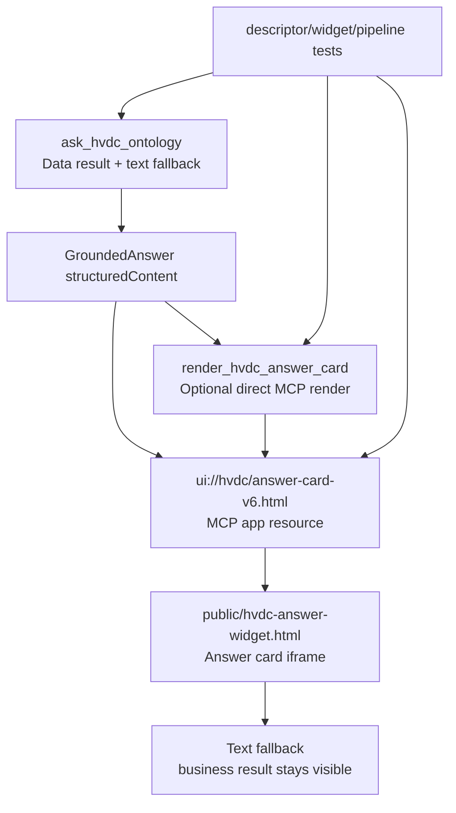

# Patch2 Apps SDK Template Resource Plan

## Phase 1: Business Review

### 1.1 문제 정의

현재 상태: 실제 ChatGPT SCT_ONTOLOGY 리소스에는 `render_hvdc_answer_card`가 노출되지 않았으므로, `ask_hvdc_ontology`가 version-bumped `ui://hvdc/answer-card-v6.html` resource와 `openai/outputTemplate`를 직접 소유합니다. `render_hvdc_answer_card`는 직접 MCP 호출이 가능한 클라이언트를 위한 보조 렌더 tool로 유지합니다.

목표 상태: ChatGPT 화면에서 카드 template fetch 실패가 다시 발생하지 않도록, resource URI, MIME, descriptor, fallback 책임을 공식 Apps SDK 구조에 맞게 검증하거나 필요한 경우 version bump합니다.

영향 범위:

- MCP tool descriptor 2개: `ask_hvdc_ontology`, `render_hvdc_answer_card`
- MCP resource 1개: `ui://hvdc/answer-card-v6.html`
- widget HTML 1개: `public/hvdc-answer-widget.html`
- descriptor/schema/widget 테스트
- production ChatGPT 화면 확인

### 1.2 제안 옵션

| 옵션 | 설명 | 공수(일) | 리스크 | 비용(AED) |
|------|------|---------:|--------|----------:|
| A | 현재 구조 유지. `render_hvdc_answer_card`가 카드 UI를 소유하고, ChatGPT 화면에서 v5 resource가 정상 로드되는지 먼저 검증합니다. 실패가 재현될 때만 v6로 URI를 올립니다. | 0.5 | 실제 ChatGPT tool list가 render tool을 노출하지 않아 폐기했습니다. | 0 |
| B | `patch2.md` 문구대로 `ask_hvdc_ontology`에 `_meta.ui.resourceUri`와 `openai/outputTemplate`를 다시 붙입니다. | 0.5 | 낮음. 실제 노출 tool 5개 구조와 맞습니다. | 0 |
| C | `ask_hvdc_ontology`와 `render_hvdc_answer_card` 양쪽에 같은 template URI를 둡니다. | 1.0 | 높음. 두 tool이 같은 UI 책임을 가져 ChatGPT 호출 경로와 테스트 기대값이 흔들릴 수 있습니다. | 0 |

### 1.3 추천 & 근거

추천: 옵션 B.

이유:

- 현재 ChatGPT 앱에 노출된 tool list에서 `render_hvdc_answer_card`가 빠져 있어, exposed answer tool인 `ask_hvdc_ontology`가 UI resource를 직접 가리켜야 합니다.
- `ask_hvdc_ontology`에 output template를 다시 붙여도 `structuredContent`와 text fallback은 유지하므로 결과 데이터는 계속 primary입니다.
- 실제 문제가 캐시라면 코드 재배선보다 `answer-card-v6.html` version bump가 더 좁고 안전합니다.

롤백 전략: 새 URI 적용 후 문제가 생기면 `f3a9f00`으로 되돌리고, ChatGPT 화면은 텍스트 fallback 기준으로 운영합니다.

### 1.4 승인 요청

- [x] Phase 1 승인

승인됨: 2026-05-10.

## Phase 2: Engineering Review

### 2.1 Mermaid 다이어그램

### 2.2 파일 변경 목록

옵션 A는 먼저 검증을 실행하는 계획입니다. 즉시 코드 변경은 없습니다.

| 파일 | 변경 유형 | 설명 |
|------|----------|------|
| `plan.md` | modify | Phase 1 승인과 Phase 2 실행 계획을 기록합니다. |
| `server/src/index.ts` | modify | `ask_hvdc_ontology`와 `render_hvdc_answer_card` descriptor가 같은 v6 resource를 가리키도록 합니다. |
| `server/src/ui.ts` | modify | `WIDGET_URI`를 `ui://hvdc/answer-card-v6.html`로 올려 ChatGPT template cache key를 끊습니다. |
| `public/hvdc-answer-widget.html` | inspect | widget이 `window.openai.toolOutput` 기반으로 결과를 표시하고 fallback을 유지하는지 확인합니다. |
| `tests/descriptor.test.ts` | inspect/run | ask tool은 template 없음, render tool은 template 있음이라는 contract를 검증합니다. |
| `tests/widget.test.ts` | inspect/run | widget fallback 문자열과 bridge 접근 경로를 검증합니다. |
| `tests/pipeline.test.ts` | inspect/run | fallback 상태가 business result를 바꾸지 않는지 검증합니다. |

조건부 변경 파일:

| 파일 | 변경 유형 | 조건 | 설명 |
|------|----------|------|------|
| `server/src/ui.ts` | modify | 적용됨 | `WIDGET_URI`를 `ui://hvdc/answer-card-v6.html`로 올렸습니다. |
| `server/src/index.ts` | modify | v6 bump 필요 시 | resource descriptor와 `contents[].uri`가 v6를 쓰는지 확인합니다. |
| `tests/descriptor.test.ts` | modify | v6 bump 필요 시 | 기대 URI를 v6로 갱신합니다. |
| `tests/widget.test.ts` | modify | v6 bump 필요 시 | template version 표시 또는 URI 관련 기대값을 갱신합니다. |
| `README.md`, `docs/SPEC.md` | modify | v6 bump 필요 시 | 운영 문서의 template URI와 fallback 설명을 갱신합니다. |

### 2.3 의존성 & 순서

1. 현재 production MCP smoke를 다시 실행합니다.
2. ChatGPT 화면에서 `ask_hvdc_ontology`와 `render_hvdc_answer_card` 흐름을 확인합니다.
3. 카드가 정상 로드되면 코드 변경 없이 계획을 종료합니다.
4. `failed to fetch template`가 재현되면 v6 URI bump 패치를 적용합니다.
5. v6 패치 후 `npm run verify`를 3회 병렬 실행합니다.
6. production 재배포 후 MCP smoke와 ChatGPT 화면을 다시 확인합니다.

병렬 가능 경로:

- 로컬 테스트 3회 병렬 실행
- production root/MCP/resource smoke 병렬 확인
- 문서 URI 검색과 descriptor 테스트 확인 병렬 수행

공유 모듈:

- `server/src/ui.ts`의 `WIDGET_URI`는 resource URI의 단일 기준입니다.
- `server/src/index.ts`의 descriptor와 resource registration은 같은 URI를 사용해야 합니다.

### 2.4 테스트 전략

단위 테스트:

- `tests/descriptor.test.ts`: `ask_hvdc_ontology`와 `render_hvdc_answer_card` 모두 `ui://hvdc/answer-card-v6.html`를 가리키는지 확인합니다.
- `tests/widget.test.ts`: widget이 `toolOutput`을 읽고 fallback 문자열을 포함하는지 확인합니다.
- `tests/pipeline.test.ts`: `FALLBACK_RENDERED` 상태에서도 business result 필드가 보존되는지 확인합니다.

통합 테스트:

- local MCP smoke: in-memory MCP client로 tool list, resource fetch, ask call, render call을 확인합니다.
- production MCP smoke: Railway production `/mcp`에 Streamable HTTP client로 접속해 같은 흐름을 확인합니다.

기존 테스트 중 깨질 가능성이 있는 범위:

- URI를 v6로 올리면 descriptor/widget/docs 테스트의 v5 기대값이 깨질 수 있습니다.
- `ask_hvdc_ontology`에 template를 다시 붙이면 `tests/descriptor.test.ts`의 분리 contract가 깨질 수 있습니다.

### 2.5 리스크 & 완화

성능 리스크:

- production smoke는 네트워크 상태에 따라 실패할 수 있습니다.
- 완화: 실패 시 root URL, MCP handshake, resource fetch를 분리해서 재시도합니다.

호환성 리스크:

- ChatGPT 클라이언트 캐시가 v5 URI를 계속 잡을 수 있습니다.
- 완화: 실패가 재현되면 v6 URI로 cache key를 바꿉니다.

보안 리스크:

- widget CSP나 external domain을 넓게 열면 불필요한 노출이 생길 수 있습니다.
- 완화: 현재 inline widget과 `RESOURCE_MIME_TYPE` 구조를 유지하고, 외부 domain 추가는 실제 필요가 있을 때만 합니다.

운영 리스크:

- `ask_hvdc_ontology`에 template를 다시 붙이면 데이터 결과와 UI 렌더 책임이 섞일 수 있습니다.
- 완화: 옵션 A에서는 render tool만 UI owner로 유지합니다.

### 2.6 승인된 실행 기준

승인된 경로는 옵션 B입니다.

실행 기준:

- v6 URI bump를 적용했습니다.
- `ask_hvdc_ontology`에 `openai/outputTemplate`와 `_meta.ui.resourceUri`를 다시 붙였습니다.
- 적용 후 검증합니다.
