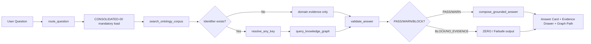

# HVDC Ontology Grounded ChatGPT App — Implementation Plan

**목적:** HVDC 온톨로지 문서와 KG를 먼저 조회한 뒤, ChatGPT 안에서 근거 기반 업무 답변을 생성하는 `Ontology-grounded Answer App`을 실제 구현 가능한 MVP→확장 단계로 정의한다.

| 항목 | 값 |
|---|---|
| 문서명 | HVDC Ontology Grounded ChatGPT App Implementation Plan |
| 문서 버전 | v1.00-draft |
| 작성일 | 2026-05-10 |
| 기준 시간대 | Asia/Dubai |
| 기준 문서 | `../../uiux/HVDC_Ontology_Grounded_ChatGPT_App_UIUX_Spec_2026-05-10.docx` |
| 제품명 | HVDC Ontology Answer App for ChatGPT |
| 1차 구현 방식 | Corpus-only RAG MVP |
| 후속 확장 방식 | Hybrid RAG + SPARQL KG |
| 핵심 원칙 | Evidence-first / Schema-first / Human-gate / ZERO fail-safe |

---

## 1. Overview

### 1.1 관찰한 사실

| No | 관찰 항목 | 내용 |
|---:|---|---|
| 1.00 | 제품 정체성 | 일반 챗봇이 아니라 `HVDC Ontology Answer Layer`로 정의되어 있다. |
| 2.00 | 답변 방식 | 사용자 질문 → 온톨로지 문서/KG 조회 → 업무 도메인 해석 → 검증된 답변 → 증빙/다음 액션 반환 흐름이다. |
| 3.00 | 기술 기준 | OpenAI Apps SDK + MCP Server + Codex Agent Skills + Ontology RAG/KG 구조를 기준으로 한다. |
| 4.00 | 운영 원칙 | factual 업무 답변은 retrieval 없이 생성하지 않는다. |
| 5.00 | 검증 원칙 | EvidenceSnippet, SHACL/SPARQL/RAG freshness, Human-gate를 답변 전 검증 gate로 사용한다. |
| 6.00 | 초기 추천 | MVP는 `Corpus-only RAG`로 시작하고 동일한 MCP tool contract를 유지한 채 `Hybrid RAG + SPARQL KG`로 확장한다. |

### 1.2 사용자 요구사항

| No | 요구사항 | Plan 반영 |
|---:|---|---|
| 1.00 | 온톨로지 프로젝트 문서를 바탕으로 답변하는 ChatGPT App 필요 | `CONSOLIDATED-00` 우선 조회 + target extension 조회를 핵심 흐름으로 정의 |
| 2.00 | 다른 사용자도 동일 업무 기준으로 답변받을 수 있어야 함 | corpus/version/hash/evidence 기반 SSOT 답변 구조 반영 |
| 3.00 | Codex를 통해 실제 구현 가능한 수준이어야 함 | Codex Skill Pack, repo task, MVP sprint deliverable 포함 |
| 4.00 | 근거 없는 답변 방지 | `NO_EVIDENCE`, `BLOCK`, `STALE_SOURCE`, `Human-gate` 포함 |
| 5.00 | 업무 적용 범위는 HVDC Project Logistics | Port/Customs/WH/MOSB/Site/Invoice/Document/Communication/Operations로 제한 |

### 1.3 Target Product Definition

이 앱은 ChatGPT 대화 안에서 사용자가 자연어로 업무 질문을 입력하면, MCP tools가 HVDC 온톨로지 corpus와 KG를 조회하고, UI component가 답변·근거·그래프 경로·검증 상태·Human-gate를 함께 표시하는 업무 답변 계층이다.



---

## 2. Goals

| No | Goal | KPI / Acceptance Target |
|---:|---|---|
| 1.00 | 온톨로지 기반 업무 답변 표준화 | Answer Grounding Coverage = 100.00% for core claims |
| 2.00 | 근거 추적성 확보 | Source Traceability ≥ 95.00% |
| 3.00 | Any-key 기반 업무 객체 연결 | Any-key Resolution ≥ 95.00% |
| 4.00 | 검증 가능한 답변 UI 제공 | Evidence Drawer에 doc/version/section/hash/confidence 표시 |
| 5.00 | 환각 답변 차단 | EvidenceSnippet 없는 factual claim은 `NO_EVIDENCE` |
| 6.00 | 개인정보/NDA 리스크 차단 | 전화번호/이메일 PII Leakage = 0.00건 |
| 7.00 | 검증 지연 통제 | Corpus-only MVP validation p95 < 5.00s |
| 8.00 | 무단 실행 방지 | write/action은 Human-gate + AuditRecord 없으면 실행 금지 |

---

## 3. Scope

### 3.1 In Scope

| No | In Scope | 설명 |
|---:|---|---|
| 1.00 | Corpus-only RAG MVP | `CONSOLIDATED-00~09`, Team/Person docs, Palantir Semantic Digital Twin PDF를 대상으로 section/chunk/evidence 검색 |
| 2.00 | MCP Server scaffold | ChatGPT App과 연결되는 MCP tools 정의 및 outputSchema 작성 |
| 3.00 | Core MCP Tools | `route_question`, `search_ontology_corpus`, `resolve_any_key`, `query_knowledge_graph`, `validate_answer`, `compose_grounded_answer`, `create_action_request`, `export_answer_report` |
| 4.00 | Answer Contract | `GroundedAnswer`, `EvidenceSnippet`, `ValidationFinding`, `ActionRecommendation`, `ToolCallAudit` 구조 정의 |
| 5.00 | Core UI Components | Ask Workspace, Domain Route Banner, Grounded Answer Card, Evidence Drawer, Validation Gate Panel |
| 6.00 | MVP Graph Path | MVP에서는 mock 또는 corpus-derived path로 제한. Live KG path는 Build phase로 분리 |
| 7.00 | ZERO / Failsafe UX | `NO_EVIDENCE`, `STALE_SOURCE`, `SEMANTIC_BLOCK`, `Human-gate required`, `PII detected` 처리 |
| 8.00 | Codex Skill Pack | corpus indexer, MCP tool contract, answer grounding, validation gate, UI component, privacy redactor, submission readiness |
| 9.00 | QA / Golden Prompt Set | WH/Port/Material/Cost/MOSB/Role 도메인 기준 20.00개 test prompt |
| 10.00 | Privacy Redaction | phone/e-mail masking, role-only display option, audit log masking |

### 3.2 Out of Scope

| No | Out of Scope | 제외 이유 |
|---:|---|---|
| 1.00 | Live ERP/WMS/ATLP production write-back | MVP는 corpus-only RAG 기준이다. 운영 시스템 write-back은 Human-gate와 권한 설계 후 별도 적용 |
| 2.00 | Foundry-native Actions 운영 반영 | Scale phase에서 검토. MVP 확정 범위 아님 |
| 3.00 | WhatsApp/TG/Email 자동 발송 | 외부 영향 행동이므로 사용자 승인 없는 자동 실행 금지 |
| 4.00 | 법적/규제 최종 판단 | MOIAT/FANR/DCD/ADNOC/CICPA 관련 답변은 evidence completeness만 표시. 승인권자 판단 대체 금지 |
| 5.00 | 실시간 ShipmentUnit 상태 확정 답변 | live KG/ERP/WMS 연결 전에는 `corpus-based` 또는 `source-limited`로 표시 |
| 6.00 | Raw phone/e-mail 노출 | PII/NDA 리스크로 마스킹 필수 |
| 7.00 | Flow Code를 route classification으로 사용 | Flow Code는 WHP-only로 제한 |
| 8.00 | Cost approval 자동화 | Invoice >100,000.00 AED 또는 HIGH/CRITICAL은 Human-gate 필수 |
| 9.00 | 전체 enterprise 배포 | MVP/Pilot 종료 후 보안·권한·release review 필요 |
| 10.00 | OpenAI Apps SDK 사양 변경 대응 자동 보장 | release 전 공식 문서 재확인 필요 |

---

## 4. Constraints

| No | Constraint | Rule | Failure State |
|---:|---|---|---|
| 1.00 | Master spine mandatory | 모든 ontology/operation 질문은 `CONSOLIDATED-00`을 먼저 조회 | `BLOCK` |
| 2.00 | Evidence required | factual 업무 답변은 최소 1.00개 EvidenceSnippet 필요 | `NO_EVIDENCE` |
| 3.00 | Schema-first | UI/MCP/answer composer는 동일 object contract 사용 | schema test fail |
| 4.00 | Flow Code boundary | Flow Code는 WHP-only. route/customs/invoice KPI bucket 사용 금지 | `SEMANTIC_BLOCK` |
| 5.00 | Human-gate | write/action/report/send/export 중 외부 영향 행동은 승인 필요 | `Action paused` |
| 6.00 | Cost threshold | Invoice >100,000.00 AED 또는 HIGH/CRITICAL CostGuard는 Finance approval gate 필요 | `Finance approval gate` |
| 7.00 | PII/NDA | 전화번호/이메일은 UI/log/report/test fixture에서 마스킹 | `PII detected` |
| 8.00 | Currentness | 법/요율/SOP/current authority 답변은 approved current source 필요 | `STALE_SOURCE` |
| 9.00 | Evidence vs Truth | OCR/문서/통신/port/cost record는 evidence. transaction truth owner와 분리 | `WARN/BLOCK` |
| 10.00 | Codex role boundary | Codex Skills는 개발 workflow용. runtime answer engine이 아님 | architecture review fail |
| 11.00 | Prompt injection | 검색된 문서 텍스트가 validation/tool policy를 우회하도록 지시해도 무시 | server-side validation |
| 12.00 | Audit | tool call input/output hash, userRole, timestamp, piiMasked 기록 | release block |

---

## 5. Phases

### 5.1 Phase Summary

| Phase | 기간 | 목적 | 주요 산출물 | Exit Criteria |
|---|---:|---|---|---|
| Phase 0. Plan Lock | 0.50주 | Plan 승인 및 범위 고정 | approved PLAN.md | In/Out Scope 승인 |
| Phase 1. Prepare | 1.00주 | corpus inventory, doc role map, schema/tool contract 확정 | source_map, answer_contract, tool_schema | Source map coverage ≥ 95.00% |
| Phase 2. Pilot / MVP | 2.00주 | Corpus-only RAG MVP 구현 | MCP server, Answer Card, Evidence Drawer, ZERO states | Grounding coverage = 100.00%, PII leakage = 0.00 |
| Phase 3. Build | 4.00주 | Any-key, SPARQL templates, Validation Gate, Graph Path 강화 | resolver, templates, validation panel | Any-key precision ≥ 95.00%, p95 < 5.00s |
| Phase 4. Operate | 6.00주 | Action Composer, Human-gate, report export, role answers 적용 | action audit, report export | Audit trail = 100.00% for blocked actions |
| Phase 5. Scale | 8.00~12.00주 | Foundry/GraphDB live KG 및 admin governance 확장 | live KG adapter, admin console | adoption ≥ 80.00%, repeat issue reduction ≥ 30.00% |

### 5.2 Phase 0 — Plan Lock

| Task | Input | Output | Acceptance |
|---|---|---|---|
| Scope review | UI/UX Spec, user confirmation | approved scope | In Scope/Out of Scope 변경 이력 기록 |
| Risk review | constraints, compliance notes | risk register | BLOCK risk owner 지정 |
| MVP route selection | Option A recommendation | `Corpus-only RAG MVP` lock | Live KG는 Build phase로 분리 |

### 5.3 Phase 1 — Prepare

| Task | Input | Output | Acceptance |
|---|---|---|---|
| Corpus inventory | CONSOLIDATED-00~09, Team docs, PDF | `corpus_inventory.csv` | docId/version/sourceOwner/sectionPath 필드 포함 |
| Source role map | domain mapping | `source_role_map.json` | `CONSOLIDATED-00` rank 1.00 |
| Answer object schema | UI/UX Spec object model | `answer_contract.json` | GroundedAnswer/EvidenceSnippet/ValidationFinding 포함 |
| MCP tool schema | tool contract list | `mcp_tool_schema.json` | input/output schema + UI mapping 포함 |
| AGENTS.md | repo rules | `AGENTS.md` | evidence-first, PII, Flow Code, Human-gate 규칙 포함 |
| Skill pack skeleton | Codex Skills list | `.agents/skills/*/SKILL.md` | name/description/workflow/output 포함 |

### 5.4 Phase 2 — Pilot / MVP

| Day | Task | Deliverable | Acceptance |
|---:|---|---|---|
| D1 | OpenAI Apps SDK project scaffold + MCP server | server/web skeleton | local run 가능 |
| D2 | Corpus ingestion for 00~09 + Team Matrix | `corpus_index.json` | section/hash/confidence metadata 포함 |
| D3 | `route_question` + `search_ontology_corpus` tools | tool tests | requiredDocs에 `CONSOLIDATED-00` 포함 |
| D4 | Answer Card + Evidence Drawer UI | iframe UI | answer/evidence 표시 가능 |
| D5 | Answer contract + ZERO states | validation fixtures | `NO_EVIDENCE` test pass |
| D6 | Any-key mock resolver | BL/BOE/DO/HVDC_CODE demo | multiple candidate state 표시 |
| D7 | Domain prompt set | golden prompt set | WH/Port/Material/Cost/MOSB/Role 포함 |
| D8 | Privacy redaction + audit log | PII test pass | phone/e-mail leakage 0.00 |
| D9 | QA: latency/source/hallucination block | QA report | p95 < 5.00s target 측정 |
| D10 | Demo package + screenshots + rollout note | MVP release pack | demo 시나리오 5.00개 이상 |

### 5.5 Phase 3 — Build

| Task | Input | Output | Acceptance |
|---|---|---|---|
| Any-key resolver upgrade | corpus identifiers, KG candidates | resolver module | confidence ≥ 0.95 또는 human review |
| SPARQL template pack | Any-key, ETA, CostGuard, AGI/DAS gate | `/sparql/*.rq` | template test pass |
| Validation Gate Panel | SHACL/SPARQL/RAG/Human-gate results | UI panel | PASS/WARN/BLOCK 표시 |
| Graph Path Viewer | resolved object + graph path | graph component | Identifier→ShipmentUnit→Milestone path 표시 |
| CostGuard flow | invoice/rate question | CostGuard verdict | HIGH/CRITICAL approval gate |
| Currentness gate | regulation/rate/SOP question | `STALE_SOURCE` handling | approved source 없으면 답변 중단 |

### 5.6 Phase 4 — Operate

| Task | Input | Output | Acceptance |
|---|---|---|---|
| Action Composer | ActionRecommendation | approval/request/export UI | Human-gate 없는 write 실행 금지 |
| Audit trail | ToolCallAudit | audit log | blocked action 100.00% 기록 |
| Role answer flow | Team/Person docs | role-level answer | phone/e-mail masked |
| Report export | GroundedAnswer + evidence pack | Markdown/PDF/JSON report | source hash 포함 |
| Operations monitoring | QA metrics | dashboard snapshot | failure state 추적 가능 |

### 5.7 Phase 5 — Scale

| Task | Input | Output | Acceptance |
|---|---|---|---|
| GraphDB/Foundry adapter | live KG/Foundry functions | query adapter | read-only live facts 조회 |
| Foundry Object/Action alignment | ShipmentUnit/Document/Invoice/MilestoneEvent | object mapping | transaction action은 gated |
| Admin governance | corpus status/version drift | Corpus Admin | stale source badge |
| Skill distribution | Codex Skill Pack | release checklist | tool/schema/PII tests 자동화 |
| Enterprise readiness | privacy/security/submission checklist | release package | app submission readiness review pass |

---

## 6. Tasks

### 6.1 Work Breakdown Structure

| WBS | Task | Owner Role | Output | Dependency |
|---|---|---|---|---|
| 1.00 | Plan 승인 및 scope lock | Product Owner | approved PLAN.md | UI/UX Spec |
| 2.00 | corpus inventory 작성 | Data/Ontology Owner | `corpus_inventory.csv` | source docs |
| 3.00 | section/hash indexer 작성 | Codex + Dev | `corpus_index.json` | WBS 2.00 |
| 4.00 | answer contract 작성 | Dev + Ontology Owner | `answer_contract.json` | WBS 2.00 |
| 5.00 | MCP tools scaffold | Dev | MCP server | WBS 4.00 |
| 6.00 | retrieval tool 구현 | Dev | `search_ontology_corpus` | WBS 3.00 |
| 7.00 | routing tool 구현 | Dev | `route_question` | WBS 4.00 |
| 8.00 | Answer Card UI 구현 | Frontend Dev | UI component | WBS 5.00 |
| 9.00 | Evidence Drawer UI 구현 | Frontend Dev | UI component | WBS 6.00 |
| 10.00 | ZERO state 구현 | Dev | fail-safe output | WBS 4.00 |
| 11.00 | PII redactor 구현 | Dev/Security | redaction middleware | WBS 3.00 |
| 12.00 | audit log 구현 | Dev/Security | ToolCallAudit log | WBS 5.00 |
| 13.00 | golden prompt 작성 | Product/Ops | `golden_prompts.json` | WBS 2.00 |
| 14.00 | test suite 작성 | Dev/QA | test report | WBS 5.00~13.00 |
| 15.00 | Codex Skill Pack 작성 | Codex + Dev | `.agents/skills/*` | WBS 1.00 |
| 16.00 | MVP demo package | Dev/Product | screenshots + rollout note | WBS 14.00 |

### 6.2 MVP Repository Deliverable Layout

가정: 구현 repo는 TypeScript/React 기반 Apps SDK + MCP Server 구조를 사용한다.

```text
hvdc-ontology-chatgpt-app/
  AGENTS.md
  README.md
  docs/
    PLAN.md
    SPEC.md
    SECURITY_PRIVACY.md
    QA_REPORT.md
  server/
    tools/
      route_question.ts
      search_ontology_corpus.ts
      resolve_any_key.ts
      query_knowledge_graph.ts
      validate_answer.ts
      compose_grounded_answer.ts
      create_action_request.ts
      export_answer_report.ts
    schemas/
      answer_contract.ts
      evidence_schema.ts
      validation_schema.ts
    middleware/
      privacy_redactor.ts
      audit_log.ts
  web/
    components/
      AskWorkspace.tsx
      DomainRouteBanner.tsx
      GroundedAnswerCard.tsx
      EvidenceDrawer.tsx
      ValidationGatePanel.tsx
      OntologyPathViewer.tsx
  data/
    corpus/
      CONSOLIDATED-00-master-ontology.md
      CONSOLIDATED-01-core-framework-infra.md
      CONSOLIDATED-02-warehouse-flow.md
      CONSOLIDATED-03-document-ocr.md
      CONSOLIDATED-04-barge-bulk-cargo.md
      CONSOLIDATED-05-invoice-cost.md
      CONSOLIDATED-06-material-chain.md
      CONSOLIDATED-07-port-operations.md
      CONSOLIDATED-08-communication.md
      CONSOLIDATED-09-operations.md
    index/
      corpus_inventory.csv
      corpus_index.json
      source_role_map.json
  tests/
    golden_prompts.json
    validation_fixtures.json
    pii_redaction.test.ts
    no_evidence.test.ts
    tool_schema.test.ts
  .agents/
    skills/
      ontology-corpus-indexer/
      mcp-tool-contract/
      answer-grounding/
      sparql-template/
      uiux-component/
      validation-gate/
      privacy-redactor/
      submission-readiness/
```

---

## 7. Risks

| No | Risk | Impact | Likelihood | Mitigation | Owner |
|---:|---|---|---|---|---|
| 1.00 | `CONSOLIDATED-00` 미조회 상태에서 답변 | 비표준 답변/업무 혼선 | Medium | `A-ROUTE-001` BLOCK | Dev |
| 2.00 | EvidenceSnippet 없는 factual claim | hallucination risk | High | `NO_EVIDENCE` fail closed | Dev/QA |
| 3.00 | Live status처럼 보이는 corpus-only 답변 | 현장 오판 | Medium | `corpus-based` badge 및 live claim 제한 | Product |
| 4.00 | Flow Code route 오용 | 온톨로지 semantic 오류 | Medium | WHP-only validation rule | Ontology Owner |
| 5.00 | PII 노출 | NDA/privacy breach | High | phone/e-mail masking + test fixture | Security |
| 6.00 | Current regulation/rate stale source | 규정/요율 오답 | High | `STALE_SOURCE` + owner review | Compliance |
| 7.00 | Human-gate 누락 | 무단 action/write | High | ActionRecommendation gate + AuditRecord | Dev/Security |
| 8.00 | Apps SDK/MCP spec 변경 | release 지연 | Medium | release 전 official docs 재확인 | Dev |
| 9.00 | KG/Foundry 연결 지연 | Build phase 지연 | Medium | MVP를 corpus-only로 유지 | Product |
| 10.00 | p95 latency > 5.00s | UX 저하 | Medium | topK 제한, lexical+metadata ranking, cache | Dev |
| 11.00 | Codex Skill과 runtime tool 혼동 | architecture 오류 | Medium | AGENTS.md에 역할 분리 명시 | Dev |
| 12.00 | cost approval 자동화 오해 | 재무 리스크 | High | >100,000.00 AED 또는 HIGH/CRITICAL은 Finance approval gate | Finance/Ops |

---

## 8. Review Criteria

### 8.1 Functional Review

| No | Criteria | Target |
|---:|---|---|
| 1.00 | User question triggers `route_question` | PASS |
| 2.00 | Ontology/operation question includes `CONSOLIDATED-00` | PASS |
| 3.00 | `search_ontology_corpus` returns EvidenceSnippet with docId/version/sectionPath/docHash | PASS |
| 4.00 | Answer Card shows verdict/summary/business impact/next action | PASS |
| 5.00 | Evidence Drawer opens from answer evidence badge | PASS |
| 6.00 | No evidence case returns ZERO/Failsafe instead of answer | PASS |
| 7.00 | Multiple Any-key candidates trigger human review state | PASS |
| 8.00 | Current regulation/rate answer without approved source returns `STALE_SOURCE` | PASS |
| 9.00 | Write/action request requires Human-gate | PASS |
| 10.00 | Export report includes evidence pack and audit hash | PASS |

### 8.2 Quality / Security Review

| No | Criteria | Target |
|---:|---|---|
| 1.00 | Answer Grounding Coverage | 100.00% for core factual claims |
| 2.00 | Source Traceability | ≥ 95.00% |
| 3.00 | Any-key Resolution | ≥ 95.00% |
| 4.00 | Validation p95 | < 5.00s |
| 5.00 | PII Leakage | 0.00건 |
| 6.00 | Flow Code route misuse | 0.00건 |
| 7.00 | Human-gate enforcement | 100.00% for write/action |
| 8.00 | Tool schema tests | PASS |
| 9.00 | Answer grounding tests | PASS |
| 10.00 | PII redaction tests | PASS |
| 11.00 | No-evidence tests | PASS |
| 12.00 | Prompt injection tests | PASS |

### 8.3 Demo Acceptance Scenarios

| No | Scenario | Expected Result |
|---:|---|---|
| 1.00 | “AGI M130 닫아도 돼?” | M115/M116/M117 evidence 없으면 BLOCK |
| 2.00 | “BOE 123 지연 원인?” | M90/M91/M92/M100 chronology + evidence 표시 |
| 3.00 | “이 invoice 과청구야?” | InvoiceLine/RateRef/TariffRef evidence + CostGuard verdict |
| 4.00 | “Flow Code 어디에 써?” | WHP-only 설명, route classification 금지 |
| 5.00 | “누가 담당?” | role-level answer, phone/e-mail masked |
| 6.00 | “월간 보고서 만들어줘” | ReportArtifact 초안 + source hash + mapping version |

---

## 9. Deliverables

### 9.1 Document Deliverables

| No | Deliverable | Format | Required |
|---:|---|---|---|
| 1.00 | PLAN.md | Markdown | Yes |
| 2.00 | SPEC.md | Markdown | Yes |
| 3.00 | SECURITY_PRIVACY.md | Markdown | Yes |
| 4.00 | QA_REPORT.md | Markdown | Yes |
| 5.00 | RELEASE_CHECKLIST.md | Markdown | Yes |
| 6.00 | corpus_inventory.csv | CSV | Yes |
| 7.00 | source_role_map.json | JSON | Yes |
| 8.00 | answer_contract.json | JSON | Yes |
| 9.00 | validation_fixtures.json | JSON | Yes |
| 10.00 | golden_prompts.json | JSON | Yes |

### 9.2 Code / App Deliverables

| No | Deliverable | Description |
|---:|---|---|
| 1.00 | MCP server skeleton | ChatGPT App tools/auth/data/UI bundle 연결 기반 |
| 2.00 | Core tools | route/search/resolve/query/validate/compose/action/export |
| 3.00 | Answer Card | verdict, summary, business impact, next action 표시 |
| 4.00 | Evidence Drawer | source/version/section/snippet/hash/confidence 표시 |
| 5.00 | Domain Route Banner | Master + extension docs + confidence/freshness 표시 |
| 6.00 | Validation Gate Panel | SHACL/SPARQL/RAG/Human-gate 결과 표시 |
| 7.00 | Privacy Redactor | phone/e-mail masking |
| 8.00 | Audit Logger | toolName/inputHash/outputHash/userRole/timestamp/piiMasked 기록 |
| 9.00 | Test suite | schema, grounding, PII, no-evidence, prompt injection |
| 10.00 | Demo package | screenshots, 5.00개 demo scenarios, rollout note |

### 9.3 Codex Skill Deliverables

| No | Skill | Output |
|---:|---|---|
| 1.00 | ontology-corpus-indexer | corpus_index.json, source_role_map.json |
| 2.00 | mcp-tool-contract | tool schema, server tool module, tests |
| 3.00 | answer-grounding | answer_contract.json, validation tests, failure cases |
| 4.00 | sparql-template | Any-key/ETA/CostGuard/AGI-DAS templates |
| 5.00 | uiux-component | Answer Card/Evidence Drawer/Graph Viewer scaffold |
| 6.00 | validation-gate | SHACL/SPARQL/Human-gate tests, ZERO states |
| 7.00 | privacy-redactor | masking middleware, PII tests |
| 8.00 | submission-readiness | app submission/release checklist |

---

## 10. ZERO / Failsafe Log Template

| 단계 | 이유 | 위험 | 요청데이터 | 다음조치 |
|---|---|---|---|---|
| Answer paused | `CONSOLIDATED-00` not retrieved | 비표준 답변 | master source hit | reroute query |
| Answer paused | EvidenceSnippet 없음 | hallucination | doc section or KG fact | deeper search 또는 key 요청 |
| Action paused | Human-gate required | 무단 transaction | approver/action reason | approval request 생성 |
| Compliance paused | current SOP/rule not refreshed | 규정 오류 | latest approved SOP/source | RAG refresh + owner review |
| Report paused | PII detected | NDA/privacy leak | masked extract | redact and revalidate |

---

## 11. Assumptions

| No | 가정 | 영향 | 대응 |
|---:|---|---|---|
| 1.00 | 초기 MVP는 live ERP/WMS 없이 ontology corpus만 조회한다. | 실시간 상태 답변 제한 | `corpus-based` badge 표시 |
| 2.00 | 문서 section line/page metadata는 색인 시 생성 가능하다. | 근거 추적 품질 좌우 | docHash + sectionPath + chunk offset 저장 |
| 3.00 | 팀원 이름은 업무상 표시 가능하나 전화번호/이메일은 PII다. | privacy risk | phone/e-mail mask, role-only output |
| 4.00 | OpenAI Apps SDK/MCP 사양은 변경 가능하다. | release drift | release 전 official docs 재확인 |
| 5.00 | 법/요율/authority SOP는 온톨로지 문서만으로 최신 보장 불가하다. | 규정 오답 위험 | approved current source + owner review |
| 6.00 | Codex Skills는 runtime answer engine이 아니라 개발 workflow다. | 구조 혼동 | AGENTS.md와 README에 분리 명시 |
| 7.00 | MVP에서 Graph Path는 live KG가 아닌 corpus-derived 또는 mock path로 시작한다. | KG 정확도 제한 | Build phase에서 SPARQL/Foundry adapter 적용 |
| 8.00 | 비용은 내부 리소스 사용 기준이며 외부 SaaS/API 비용은 별도 산정한다. | 예산 오차 | 별도 Cost Plan 필요 |

---

## 12. Immediate Next Actions

| No | Action | Output | Owner |
|---:|---|---|---|
| 1.00 | 본 Plan의 In Scope / Out of Scope 승인 | approved PLAN.md | Product Owner |
| 2.00 | `CONSOLIDATED-00~09` 최신 파일 확정 | source folder | Ontology Owner |
| 3.00 | MVP repo 생성 및 `AGENTS.md` 작성 | repo skeleton | Dev/Codex |
| 4.00 | corpus inventory + source role map 작성 | CSV/JSON | Data Owner |
| 5.00 | MCP tool schema 1차 작성 | `mcp_tool_schema.json` | Dev |
| 6.00 | 20.00개 golden prompt 작성 | `golden_prompts.json` | Ops/Product |
| 7.00 | PII redaction test fixture 작성 | `pii_redaction.test.ts` | Security/Dev |
| 8.00 | D1~D10 MVP sprint 착수 | MVP release pack | Dev/Product |

---

## 13. Command Recommendations

```text
/switch_mode LATTICE + /logi-master report --deep --KRsummary
/logi-master ontology-query --source CONSOLIDATED-00 --deep
/logi-master invoice-audit --AEDonly --evidence-first
```

---

## 14. Plan Status

| Item | Status |
|---|---|
| Scope clarity | AMBER — source doc 기준으로 정리했으나 사용자 승인 필요 |
| MVP feasibility | PASS — Corpus-only RAG MVP 기준 |
| Live KG feasibility | AMBER — GraphDB/Foundry 권한 및 데이터 연결 확인 필요 |
| Compliance readiness | AMBER — current SOP/rule source refresh 필요 |
| Automation safety | PASS — Human-gate 및 ZERO fail-safe 포함 |
