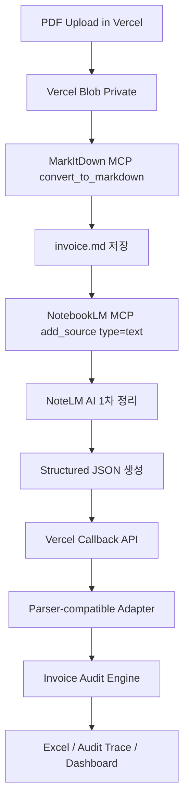

판정: **예 — 구조 가능합니다. 다만 첨부 파서 로직은 “PDF 직접 파서”라서, `NoteLM AI 1차 정리 결과`를 Vercel로 다시 보낼 때는 반드시 `parser-compatible JSON`으로 변환해야 합니다.**
근거: 첨부 파서는 `pdfplumber` 기반 PDF text/table extraction, DSV Waybill 감지, shipment/document/date/amount 추출, DSV lane/timeline/confidence/flags 산출 구조입니다. 
다음행동: **`MD → NoteLM 1차정리 → parser_schema.json → Vercel callback` 구조로 설계하십시오.**

---

## 1. 사용자가 말한 최종 구조 해석

요청하신 구조는 아래입니다.

```text
PDF 업로드
→ MarkItDown MCP
→ MD 파일 생성
→ NoteLM / NotebookLM MCP에 MD source 저장
→ NoteLM AI가 1차 정리
→ Vercel 앱으로 정리 결과 callback
→ 기존 파서/검증 로직 기준으로 invoice audit 수행
```

이 구조는 가능합니다.

단, 중요한 점은 **첨부된 `pdf_processor_v1_2_dsv_patched.py`는 PDF 파일을 직접 읽는 파서**입니다. 즉, `Path(pdf)`를 넣으면 `pdfplumber`로 text/table을 뽑고, DSV Waybill 여부를 판단한 뒤, shipment ID, document no, dates, amounts, lane, timeline, confidence, flags를 산출합니다.

따라서 NoteLM AI가 정리한 결과는 자유 문장 요약이 아니라, **이 파서가 기대하는 필드 구조와 동일한 JSON**으로 내려와야 합니다.

---

## 2. 첨부 파서 로직 기준 핵심 필드

| No | Parser Logic          | 현재 기능                                                                            | NoteLM 1차정리 출력 필요값                        | Risk                            |
| -: | --------------------- | -------------------------------------------------------------------------------- | ----------------------------------------- | ------------------------------- |
|  1 | PDF text extraction   | PDF 본문 추출, page text, cache                                                      | `source_text` 또는 `markdown_text`          | MD 변환 시 표 구조 손실 가능              |
|  2 | Table extraction      | PDF table 추출                                                                     | `tables[]` 또는 `consignment_table`         | NoteLM 요약만 있으면 table row 복구 어려움 |
|  3 | DSV Waybill detection | `dsv`, `delivery note/waybill`, `road freight/consignment/routing` 기준            | `doc_kind = DSV_WAYBILL`                  | NoteLM이 문서 종류를 오판할 수 있음         |
|  4 | Consignment table     | `order_no`, `job_no`, `po_no`, `loading_point`, `loading_country`, `description` | 동일 필드 필수                                  | header misparse 방지 필요           |
|  5 | Lane extraction       | origin/destination, norm, method                                                 | `lane.origin_raw`, `lane.destination_raw` | carrier/equipment 값 혼입 위험       |
|  6 | Timeline              | loading/offloading date/time                                                     | `timeline.*_dt`                           | 날짜 형식 통일 필요                     |
|  7 | Evidence matching     | HVDC/SCT/HE/SIM/MOSB/MIR/SHU refs, BOE/DO/DN                                     | `shipment_ids[]`, `document_numbers[]`    | BL/BOE/DO 누락 시 검증 약화            |
|  8 | Confidence/flags      | `LOW_CONFIDENCE`, `LANE_INCOMPLETE`, `ORIGIN_INVALID` 등                          | `confidence`, `flags[]`                   | NoteLM 판단값과 파서 판단값 충돌 가능        |

---

## 3. 권장 데이터 플로우



---

## 4. NoteLM AI 1차정리 출력 스키마

NoteLM에는 아래 프롬프트로 **요약문 금지, JSON만 반환**시키는 구조가 맞습니다.

```json
{
  "job_id": "INV-20260614-001",
  "source_type": "notebooklm_markdown",
  "doc_kind": "DSV_WAYBILL",
  "fields": {
    "waybill_no": null,
    "printed_date": null,
    "do_no": null,
    "do_validity": null,
    "cust_ref": null,
    "bol_no": null,
    "order_no": null,
    "job_no": null,
    "po_no": null,
    "req_truck_type": null,
    "head_plate": null,
    "trailer_plate": null,
    "trailer_type": null,
    "driver_name": null,
    "employee_id": null,
    "trip_no": null,
    "loading_address": null,
    "destination": null
  },
  "consignment_table": {
    "order_no": null,
    "job_no": null,
    "po_no": null,
    "loading_point": null,
    "loading_country": null,
    "description": null
  },
  "lane": {
    "origin_raw": null,
    "destination_raw": null,
    "origin_norm": null,
    "destination_norm": null,
    "extraction_method": "notebooklm_ai"
  },
  "timeline": {
    "arrive_loading_dt": null,
    "loading_started_dt": null,
    "loading_finish_dt": null,
    "asset_release_loading_dt": null,
    "arrive_offloading_dt": null,
    "offloading_started_dt": null,
    "offloading_ended_dt": null,
    "asset_release_offloading_dt": null
  },
  "shipment_ids": [],
  "document_numbers": [],
  "dates": [],
  "amounts": [],
  "confidence": 0.0,
  "flags": [],
  "evidence": [
    {
      "field": "order_no",
      "value": null,
      "source": "invoice.md",
      "quote": null
    }
  ]
}
```

---

## 5. Vercel callback API 구조

### API

```text
POST /api/notebooklm/ingest-summary
```

### Payload

```json
{
  "job_id": "INV-20260614-001",
  "notebook_id": "HVDC_INVOICE_AUDIT",
  "source_id": "notebooklm_source_xxx",
  "source_hash": "sha256:...",
  "summary_json": {
    "doc_kind": "DSV_WAYBILL",
    "fields": {},
    "lane": {},
    "timeline": {},
    "shipment_ids": [],
    "document_numbers": [],
    "confidence": 0.0,
    "flags": []
  }
}
```

### Vercel 처리

```text
1. job_id 존재 확인
2. source_hash 일치 확인
3. summary_json schema validation
4. Parser-compatible adapter 실행
5. 기존 invoice audit engine에 전달
6. audit_trace에 NoteLM result 저장
7. dashboard 상태 업데이트
```

---

## 6. Parser-compatible Adapter

첨부 파서가 기존에 PDF에서 직접 산출하는 구조는 대략 아래 형태입니다.

```json
{
  "doc_kind": "DSV_WAYBILL",
  "success": true,
  "fields": {},
  "lane": {},
  "timeline": {},
  "confidence": 0.0,
  "flags": [],
  "consignment_table": {}
}
```

따라서 NoteLM 결과를 아래 함수처럼 맞추면 됩니다.

```ts
function adaptNotebookLmToParserResult(input: NotebookLmSummary) {
  return {
    doc_kind: input.doc_kind ?? "UNKNOWN",
    success: true,
    error: null,
    fields: input.fields ?? {},
    lane: input.lane ?? {},
    timeline: input.timeline ?? {},
    confidence: input.confidence ?? 0,
    flags: input.flags ?? [],
    consignment_table: input.consignment_table ?? {},
    extracted_info: {
      shipment_ids: input.shipment_ids ?? [],
      document_numbers: input.document_numbers ?? [],
      dates: input.dates ?? [],
      amounts: input.amounts ?? [],
      success: true,
      source: "notebooklm_ai"
    }
  };
}
```

---

## 7. 중요 설계 포인트

### 7.1 NoteLM AI 결과는 “1차 정리”만

NoteLM 결과를 최종 검증값으로 쓰면 안 됩니다.

권장 판정:

```text
NoteLM AI = 1차 구조화 / 보조 추출
Vercel parser = 정규화 / 규칙 검증
Invoice audit engine = 최종 판정
```

### 7.2 동일 문서를 2개 경로로 검증

가장 안정적인 구조는 아래처럼 **dual extraction**입니다.

```text
A. PDF 직접 파서 결과
B. MarkItDown → NoteLM AI 정리 결과
C. A/B 비교
D. mismatch 있으면 NEEDS_REVIEW
```

예시:

| Field         | PDF Parser        | NoteLM AI         | Decision         |
| ------------- | ----------------- | ----------------- | ---------------- |
| order_no      | 0126-04466AUH     | 0126-04466AUH     | PASS             |
| loading_point | DSV Mussafah Yard | DSV Mussafah Yard | PASS             |
| destination   | MIRFA SITE        | Mirfa             | PASS_NORMALIZED  |
| amount        | 2,500.00 AED      | 25,000.00 AED     | **NEEDS_REVIEW** |

---

## 8. 상태값 설계

```text
UPLOADED
MARKDOWN_CONVERTED
NOTEBOOKLM_SOURCE_ADDED
NOTEBOOKLM_SUMMARY_REQUESTED
NOTEBOOKLM_SUMMARY_RECEIVED
PARSER_ADAPTED
AUDIT_RUNNING
AUDIT_COMPLETE
NEEDS_REVIEW
FAILED
```

---

## 9. Codex 실행 프롬프트

```text
Task: Implement NotebookLM AI first-pass extraction callback in invoice_sct.

Context:
A user uploads a PDF invoice. The Vercel app sends it to MarkItDown MCP to convert it into Markdown. The generated Markdown is then sent to NotebookLM MCP as a text source. NotebookLM AI should perform a first-pass structured extraction. The result must be sent back to Vercel and adapted to the existing parser-compatible result shape.

Attached parser logic:
- pdf_processor_v1_2_dsv_patched.py
- It extracts PDF text/tables using pdfplumber.
- It detects DSV Waybill documents.
- It extracts fields, consignment_table, lane, timeline, shipment_ids, document_numbers, dates, amounts, confidence, and flags.
- Keep compatibility with that output shape.

Goal:
Create a pipeline:
PDF Upload → MarkItDown MCP → invoice.md → NotebookLM MCP add_source(type=text) → NotebookLM structured extraction → Vercel callback → parser-compatible adapter → invoice audit engine.

Required changes:
1. Add TypeScript schemas:
   - NotebookLmSummarySchema
   - ParserCompatibleResultSchema
   - NotebookLmCallbackPayloadSchema
2. Add API route:
   POST /api/notebooklm/ingest-summary
3. Add adapter:
   adaptNotebookLmToParserResult(summary)
4. Add audit trace fields:
   - notebooklm_source_id
   - notebooklm_summary_received_at
   - notebooklm_confidence
   - notebooklm_flags
   - dual_extraction_mismatches
5. Add comparison logic:
   - compare PDF parser result vs NotebookLM result
   - if high-impact fields mismatch, set status NEEDS_REVIEW
6. High-impact fields:
   - invoice_no
   - waybill_no
   - order_no
   - job_no
   - po_no
   - do_no
   - bol_no
   - trip_no
   - origin_norm
   - destination_norm
   - amount
   - currency
7. NotebookLM extraction prompt must require JSON only.
8. Do not treat NotebookLM as source of truth.
9. If NotebookLM fails, continue with existing PDF parser path.
10. If parser fails but NotebookLM succeeds, mark result as AMBER and require manual review.

Validation:
- Test callback with valid NotebookLmSummary JSON.
- Test missing job_id.
- Test schema invalid summary.
- Test mismatch detection.
- Test NotebookLM failure does not block audit.
- Test audit_trace stores hashes/status only, not raw markdown body.

Output:
- Changed files
- API contract
- Adapter code
- Test results
- Remaining risks
```

---

## 10. 최종 권장 구조

```text
PDF 원본 = Vercel Blob
MD 변환 = MarkItDown MCP
1차 정리 = NotebookLM AI
정규화/검증 = Vercel parser-compatible adapter
최종 판정 = Invoice Audit Engine
결과 저장 = Neon + audit_trace + Excel export
```

최종 설계상 **NoteLM은 “AI 1차 정리 엔진”**, Vercel은 **“검증·정규화·최종 판정 엔진”**입니다.
이렇게 분리하면 MD 기반 지식화와 기존 DSV 파서 로직을 동시에 사용할 수 있습니다.
