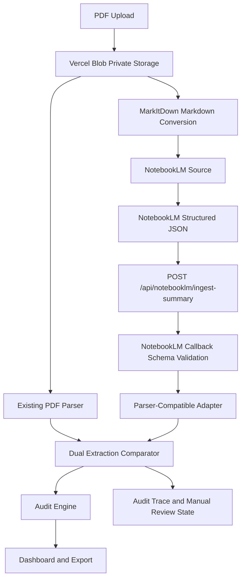

# NotebookLM PDF First-Pass Extraction Plan

## Phase 1: Business Review

### 1.1 Problem Definition

현재 상태: 기존 감사 파이프라인은 PDF 원본을 직접 파싱하는 경로를 중심으로 동작한다.

목표 상태: PDF를 MarkItDown으로 Markdown화하고 NotebookLM이 1차 구조화를 수행하되, Vercel의 기존 파서 호환 JSON과 검증 규칙이 최종 판정을 유지한다.

영향 범위:

- 신규 callback API 1개가 필요하다.
- 신규 schema/adapter 계층 1개가 필요하다.
- 기존 PDF parser, audit engine, job status, audit trace에 연결 영향이 있다.
- 최소 테스트 범위는 schema, adapter, callback, 실패 fallback, dual extraction mismatch이다.

### 1.2 Options

| 옵션 | 설명 | 공수(일) | 리스크 | 비용(AED) |
|------|------|---------:|--------|----------:|
| A | NotebookLM callback과 parser-compatible adapter만 추가한다. 기존 PDF parser와 병렬 비교는 나중에 한다. | 2-3 | 빠르지만 AI 결과 품질을 체계적으로 비교하지 못한다. | 0-300 |
| B | callback, schema, adapter, dual extraction comparison, manual review 상태까지 함께 설계한다. | 4-6 | 변경 범위는 넓지만 기존 파서 신뢰도를 유지한다. | 0-600 |
| C | MarkItDown MCP 호출부터 NotebookLM source 등록, callback, dashboard까지 end-to-end 자동화한다. | 7-10 | 외부 MCP/NotebookLM 실패와 인증/비동기 상태 관리 리스크가 크다. | 0-1200 |

### 1.3 Recommendation

추천: Option B.

이유: NotebookLM은 1차 구조화 도구로 쓰고, 기존 Vercel parser와 audit engine을 최종 검증 기준으로 유지할 수 있다.
Option A는 빠르지만 검증력이 약하고, Option C는 한 번에 외부 의존성을 너무 많이 늘린다.
Option B는 `pdf.md`의 핵심 요구인 `MD -> NoteLM 1차정리 -> parser_schema.json -> Vercel callback`을 안전하게 구현하는 중간 범위다.

Rollback: NotebookLM callback ingest를 feature flag로 끄고 기존 PDF parser 단독 경로로 되돌린다.

### 1.4 Approval Request

[x] Phase 1 승인

승인 완료: 2026-06-14, 사용자 메시지 "Phase 1 승인".

## Coordinator Input Packet

objective: NotebookLM/MarkItDown 기반 1차 추출 경로를 추가하되, 기존 PDF parser와 audit engine의 최종 판정 권한을 유지한다.

non-negotiables:

- NotebookLM 출력은 자유 요약이 아니라 parser-compatible JSON이어야 한다.
- `job_id`와 `source_hash` 검증 전에는 callback payload를 수락하지 않는다.
- NotebookLM 실패는 기존 PDF parser 감사를 막으면 안 된다.
- NotebookLM 성공, parser 실패 조합은 자동 PASS가 아니라 AMBER/manual review로 처리한다.

acceptance criteria:

- `POST /api/notebooklm/ingest-summary` 설계가 확정된다.
- `NotebookLmSummarySchema`, `NotebookLmCallbackPayloadSchema`, `ParserCompatibleResultSchema` 범위가 확정된다.
- `adaptNotebookLmToParserResult(summary)`의 입력/출력 계약이 확정된다.
- dual extraction mismatch가 audit trace와 dashboard 상태에 남는다.

option set:

- Option A: callback plus adapter only.
- Option B: callback plus adapter plus dual extraction comparison.
- Option C: full MarkItDown and NotebookLM orchestration.

required evidence:

- 변경 파일 목록.
- schema/adapter 단위 테스트.
- callback API 테스트.
- NotebookLM 실패 시 기존 parser path 유지 테스트.
- mismatch/manual review 상태 증거.

test expectations:

- 단위 테스트는 schema validation과 adapter mapping을 커버한다.
- API 테스트는 valid callback, invalid summary, source_hash mismatch, duplicate callback을 커버한다.
- 통합 테스트는 PDF parser 결과와 NotebookLM 결과 비교 상태를 커버한다.
- 기존 export/download 테스트가 깨지지 않아야 한다.

## Phase 2: Engineering Review

### 2.1 Mermaid Diagram

### 2.2 File Change List

| 파일 | 변경 유형 | 설명 |
|------|----------|------|
| `apps/web/src/lib/notebooklm-schema.ts` | create | `NotebookLmSummarySchema`, `NotebookLmCallbackPayloadSchema`, `ParserCompatibleResultSchema`를 정의한다. |
| `apps/web/src/lib/notebooklm-adapter.ts` | create | NotebookLM summary를 기존 parser-compatible result shape로 변환한다. |
| `apps/web/src/lib/dual-extraction-compare.ts` | create | 기존 PDF parser 결과와 NotebookLM adapter 결과를 비교하고 mismatch/manual review 사유를 만든다. |
| `apps/web/src/app/api/notebooklm/ingest-summary/route.ts` | create | callback payload를 검증하고 adapter/comparator를 실행하는 API route를 추가한다. |
| `apps/web/src/lib/job-store.ts` | modify | `notebooklm_source_id`, `notebooklm_summary_received_at`, `notebooklm_confidence`, `notebooklm_flags`, `manual_review_reason` 상태 저장 필드를 추가한다. |
| `apps/web/src/lib/audit-trace.ts` | modify | NotebookLM source hash, callback validation result, dual extraction comparison 결과를 trace에 남긴다. |
| `apps/web/tests/notebooklm-schema.test.ts` | create | schema validation 성공/실패를 검증한다. |
| `apps/web/tests/notebooklm-adapter.test.ts` | create | adapter가 parser-compatible result를 만드는지 검증한다. |
| `apps/web/tests/dual-extraction-compare.test.ts` | create | parser/NotebookLM match, mismatch, parser fail + NotebookLM success 케이스를 검증한다. |
| `apps/web/tests/api-notebooklm-ingest-summary.test.ts` | create | callback API의 valid, invalid, source_hash mismatch, duplicate callback을 검증한다. |

생성 파일 이름은 현재 작업 트리에서 충돌하지 않는 새 이름이다. 구현 전 `rg --files`로 한 번 더 확인한다.

### 2.3 Dependencies And Order

1. Schema를 먼저 만든다.
2. Adapter를 schema 위에 만든다.
3. Comparator를 기존 parser result와 adapter result의 공통 필드 기준으로 만든다.
4. Callback API route를 만든다.
5. Job status와 audit trace 저장을 연결한다.
6. Dashboard/export 반영은 마지막에 한다.

병렬 가능 경로:

- Schema와 adapter 테스트는 한 경로로 병렬 작성 가능하다.
- Comparator 테스트는 parser-compatible result fixture만 있으면 API route와 병렬 작성 가능하다.
- Dashboard/export 반영은 저장 필드가 확정된 뒤에만 진행한다.

공유 모듈 승인 지점:

- `job-store.ts`와 `audit-trace.ts`는 기존 export/download 흐름에 영향을 줄 수 있으므로 구현 전 변경 범위를 재확인한다.
- 기존 PDF parser의 반환 shape는 직접 변경하지 않는다.

### 2.4 Test Strategy

단위 테스트:

- `NotebookLmSummarySchema`가 필수 필드, nullable 필드, `flags[]`, `evidence[]`를 검증하는지 확인한다.
- `adaptNotebookLmToParserResult(summary)`가 `doc_kind`, `fields`, `lane`, `timeline`, `confidence`, `flags`, `extracted_info`를 안정적으로 채우는지 확인한다.
- `compareDualExtraction(pdfResult, notebookLmResult)`가 match/mismatch/manual review 상태를 반환하는지 확인한다.

통합 테스트:

- `POST /api/notebooklm/ingest-summary`가 유효 payload를 수락하고 audit trace를 남기는지 확인한다.
- `source_hash`가 맞지 않으면 409 또는 명시적 validation error를 반환하는지 확인한다.
- NotebookLM callback이 실패하거나 늦어져도 기존 PDF parser audit path가 계속 실행되는지 확인한다.

깨질 가능성이 있는 기존 테스트:

- `apps/web/tests/api-audit-export.test.ts`
- `apps/web/tests/api-export-download.test.ts`
- `apps/web/tests/approval-gate.test.ts`

이 세 테스트는 현재 작업 트리에 이미 수정 흔적이 있으므로, 구현자는 기존 사용자 변경을 덮어쓰지 말고 현재 diff를 먼저 읽어야 한다.

### 2.5 Risks And Mitigation

성능 리스크:

- NotebookLM callback은 비동기 지연이 생길 수 있다.
- 완화: 기존 PDF parser 결과를 먼저 저장하고 NotebookLM 결과는 보조 trace로 병합한다.

호환성 리스크:

- NotebookLM이 JSON 대신 요약문을 반환하면 adapter가 실패한다.
- 완화: JSON-only prompt, schema validation, invalid callback rejection을 둔다.

보안 리스크:

- callback endpoint가 임의 payload를 받을 수 있다.
- 완화: `job_id`, `source_hash`, optional shared secret/signature를 검증한다.

감사 품질 리스크:

- NotebookLM과 PDF parser 결과가 충돌할 수 있다.
- 완화: 충돌 시 자동 PASS가 아니라 AMBER/manual review 상태로 남긴다.

### 2.6 Implementation Gate

[ ] Phase 2 승인

Phase 2 승인 후에만 구현을 시작한다.
