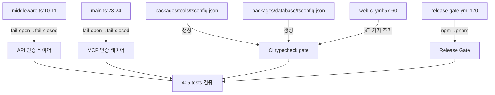

# P0 Fix — SWARM QA 종합 수정 계획

**작성일:** 2026-06-14 | **상태:** Phase 1+2 일괄 작성 (승인 대기)

---

## Phase 1: Business Review

### 1.1 문제 정의

**현재 상태:** SWARM 36-agent 진단 결과, Phase 2 안정화 작업에서 6건의 P0 갭이 발견되었다. 인증 게이트 2곳이 fail-open 상태이며, 신규 패키지 2곳에 tsconfig가 없어 CI typecheck 게이트가 깨지고, release-gate.yml이 npm과 pnpm을 혼용하며, web-ci.yml 매트릭스가 신규 패키지 3곳을 누락했다.

**목표 상태:** 6건 모두 수정. 인증은 fail-closed, 패키지는 독립 typecheck 가능, CI는 pnpm 통일 + 전 패키지 커버.

**영향 범위:** 6개 파일 (수정 4건, 생성 2건). CI/CD 2개 workflow. 기존 405 tests 유지.

### 1.2 제안 옵션

| 옵션 | 설명 | 공수(분) | 리스크 | 비용 |
|------|------|---------|--------|------|
| A | 6건 모두 즉시 수정 | 45 | LOW — 단순 조건 반전 + 파일 생성 | 0 |
| B | 인증만 먼저 수정, 나머지는 Phase 2.5로 연기 | 15 | MED — CI가 중간에 깨진 상태 유지 | 0 |

### 1.3 추천 & 근거

**추천: 옵션 A.** 6건 모두 독립적이고 변경 범위가 작다. 지연할 이유가 없다.

**롤백:** `git revert` 1커밋. 각 수정은 단일 파일 독립 변경.

### 1.4 승인 요청

- [ ] Phase 1 승인

---

## Phase 2: Engineering Review

### 2.1 Mermaid 다이어그램



### 2.2 파일 변경 목록

| 파일 | 변경 유형 | 설명 |
|------|----------|------|
| `apps/web/src/middleware.ts` | modify | L10-16: API_SECRET_KEY unset 시 500 fail-closed |
| `apps/mcp-server/src/main.ts` | modify | L22-26: MCP_API_KEY unset 시 500 fail-closed |
| `packages/tools/tsconfig.json` | **create** | extends tsconfig.base.json, outDir dist |
| `packages/tools/package.json` | modify | scripts.typecheck, scripts.build, devDependencies 추가 |
| `packages/database/tsconfig.json` | **create** | extends tsconfig.base.json, outDir dist |
| `packages/database/package.json` | modify | scripts.typecheck, scripts.build, devDependencies 추가, @types/pg→devDeps |
| `.github/workflows/release-gate.yml` | modify | L166-180: npm ci→pnpm, npm→pnpm |
| `.github/workflows/web-ci.yml` | modify | L57-60: matrix에 shared/tools/database 추가 |

### 2.3 의존성 & 순서

```
독립 병렬 (5분):
  ├── F1: middleware.ts       ← 타 파일 의존성 없음
  ├── F2: main.ts             ← 타 파일 의존성 없음
  ├── F3+F4: 2개 tsconfig     ← 타 파일 의존성 없음
  ├── F5: release-gate.yml    ← 타 파일 의존성 없음
  └── F6: web-ci.yml          ← matrix 항목만 추가, tsconfig 생성과 무관
```

모든 작업이 완전 독립. 5개를 동시에 수행 가능.

### 2.4 테스트 전략

| 레벨 | 대상 | 방법 |
|------|------|------|
| 단위 | middleware.ts:10-14 | API_SECRET_KEY unset → 500, set + 올바른 token → 200, set + 잘못된 token → 401 |
| 단위 | main.ts:22-26 | MCP_API_KEY unset → 500, set + 올바른 token → 200 |
| 빌드 | packages/tools | `npx tsc --noEmit` 통과 확인 |
| 빌드 | packages/database | `npx tsc --noEmit` 통과 확인 |
| 통합 | 405 tests | `pnpm test` 전체 PASS 확인 |
| CI | release-gate.yml | YAML syntax valid, pnpm 명령어 정상 |
| CI | web-ci.yml | YAML syntax valid, matrix 항목 추가 확인 |

**깨질 가능성:** 기존 E2E test가 Authorization header 없이 API 호출 → 401. E2E test에 `Authorization` header 추가 필요 (별도 P1).

### 2.5 리스크 & 완화

| 리스크 | 유형 | 완화 |
|--------|------|------|
| middleware fail-closed가 dev 환경에서 모든 API 호출 차단 | 호환성 | `.env.local`에 `API_SECRET_KEY=dev-key` 추가 안내 |
| MCP server fail-closed가 localhost 테스트 차단 | 호환성 | `.env`에 `MCP_API_KEY=test-key` 추가 안내 |
| packages/tools tsconfig noEmit 실패 (기존 타입 에러) | 호환성 | errors 발견 시 개별 수정 |
| E2E test가 auth middleware에 막힘 | 호환성 | test setup에 `Authorization` header 주입 (별도 follow-up) |

---

## 실행

```
F1: middleware.ts — L10 `if (apiKey)` → `if (!apiKey) return 500`, auth 항상 실행
F2: main.ts — L23 `if (expected && ...)` → `if (!expected) return 500`, auth 항상 실행
F3: packages/tools/tsconfig.json 생성 (contracts 패턴 복제)
F4: packages/database/tsconfig.json 생성 (contracts 패턴 복제)
F5: release-gate.yml L170 `npm ci` → `pnpm install --frozen-lockfile` (L174 `npm run` → `pnpm` 동일)
F6: web-ci.yml L57-60 matrix에 `packages/shared`, `packages/tools`, `packages/database` 추가
```

## 검증

```bash
cd apps/web && npx tsc --noEmit              # 0 errors
cd apps/mcp-server && npx tsc --noEmit         # 0 errors
cd packages/tools && npx tsc --noEmit          # 신규
cd packages/database && npx tsc --noEmit       # 신규
cd apps/web && npx vitest run                  # 124 PASS
cd apps/mcp-server && npx vitest run           # 186 PASS
cd apps/worker-py && python -m pytest          # 95 PASS
```
