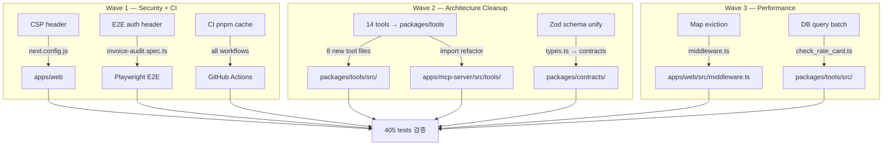

# Phase 3 — SWARM QA 발견 P1/P2 잔여 과제 계획

**작성일:** 2026-06-14 | **기준:** SWARM Phase 4 REVIEW + Phase 5 QA 14-agent 보고서 | **전제:** Phase 2 P0 완료, 405 tests PASS

---

## Phase 1: Business Review

### 1.1 문제 정의

**현재 상태:** SWARM 진단 완료. P0 6건 해소, 405 tests 통과. P1 7건, P2 3건이 잔여 — 보안헤더 누락, 코드 중복 미해소, 인증이 E2E 차단, CI 캐시 미흡, 메모리 누수, Zod 스키마 이중화, DB 쿼리 N+1.

**목표 상태:** CSP 헤더 추가. mcp-server 14 tools 완전 단일소스화. E2E test 인증 통합. CI 캐시 최적화. Rate limiter 메모리 누수 방지. Zod schema 중복 제거. DB 쿼리 배치 처리.

**영향 범위:** 10개 파일 수정, 14개 mcp-server tools 이전, 2개 신규 파일, E2E 5건 안정화. 기존 405 tests 유지.

### 1.2 제안 옵션

| 옵션 | 설명 | 공수(일) | 리스크 | 비용(AED) |
|------|------|---------|--------|----------|
| A | P1+P2 모두 즉시 실행 (3 wave) | 1.5 | MED — tools 이전 시 mcp-server 테스트 깨짐 가능 | 0 |
| B | P1만 먼저, P2는 Phase 4로 연기 | 1.0 | LOW — P2는 운영 영향 낮음 | 0 |
| C | CSP + E2E auth만 최소 실행 | 0.5 | LOW | 0 |

### 1.3 추천 & 근거

**추천: 옵션 A.** Tools 이전은 아키텍처 정합성에 필수적. P2 3건은 각 15-30분 소규모 작업. 한 번에 처리하는 것이 효율적.

**롤백:** `git revert` 1커밋. 각 wave는 독립적이므로 개별 revert 가능.

### 1.4 승인 요청

- [ ] Phase 1 승인 → Phase 2 작성 진행

---

## Phase 2: Engineering Review

### 2.1 Mermaid 다이어그램



### 2.2 파일 변경 목록

| 파일 | 변경 유형 | 설명 |
|------|----------|------|
| **Wave 1** | | |
| `apps/web/next.config.js` | modify | CSP header 추가, XXP 제거 |
| `apps/web/e2e/invoice-audit.spec.ts` | modify | 모든 API 호출에 `Authorization` header 추가 + ZERO verdict assertion 수정 |
| `.github/workflows/_ts-checks.yml` | modify | pnpm cache step 추가 |
| **Wave 2** | | |
| `packages/tools/src/normalize_invoice_lines.ts` | **create** | 8개 신규 tool 파일, mcp-server 로직 이식 |
| `packages/tools/src/check_duplicate_invoice.ts` | **create** | |
| `packages/tools/src/match_shipment_reference.ts` | **create** | |
| `packages/tools/src/check_contract_validity.ts` | **create** | |
| `packages/tools/src/check_tax_vat.ts` | **create** | |
| `packages/tools/src/check_fx_policy.ts` | **create** | |
| `packages/tools/src/build_validation_explanation.ts` | **create** | |
| `packages/tools/src/check_dem_det.ts` | **create** | |
| `packages/tools/src/index.ts` | modify | 신규 8 tools 등록 + MCP_TOOL_NAMES 14종 확장 |
| `apps/mcp-server/src/tools/*.ts` | modify | 기존 14 tools → `@invoice-audit/tools` re-export |
| `apps/web/src/lib/types.ts` | modify | InvoiceLineSchema → contracts에서 re-export |
| `packages/contracts/invoice.schema.ts` | modify | types.ts에서 누락된 필드 추가 (evidence_status 등) |
| **Wave 3** | | |
| `apps/web/src/middleware.ts` | modify | Map eviction (100req마다 sweep) |
| `packages/tools/src/check_rate_card.ts` | modify | 단일 쿼리 → `ANY($1)` 배치 쿼리 |

### 2.3 의존성 & 순서

```
Wave 1 (병렬, 독립):
  ├── W1A: CSP header          ← 타 작업 의존성 없음
  ├── W1B: E2E auth header     ← middleware.ts 의존 (이미 완료)
  └── W1C: CI pnpm cache       ← 타 작업 의존성 없음

Wave 2 (Wave 1 완료 후, 2 agent 병렬):
  ├── W2A: 8 tools 이전        ← packages/tools 디렉토리 존재 확인 (이미 완료)
  └── W2B: Zod schema unify    ← types.ts + contracts 동시 수정

Wave 3 (Wave 2 완료 후, 병렬):
  ├── W3A: Map eviction        ← middleware.ts 의존
  └── W3B: DB query batch      ← check_rate_card.ts 의존 (W2A 완료 후)
```

### 2.4 테스트 전략

| 레벨 | 대상 | 내용 |
|------|------|------|
| 단위 | CSP header | `curl -I`로 헤더 존재 확인 |
| 단위 | 8개 신규 tools | mcp-server 테스트를 packages/tools로 이식 |
| 단위 | Zod schema | types.test.ts 재검증 |
| 단위 | Map eviction | middleware 동작 검증 (기존 middleware 없음 — 수동 확인) |
| 통합 | E2E | `npx playwright test` — 8 tests 전체 통과 |
| 통합 | mcp-server | 186 tests 유지 (re-export 후에도 동일 동작) |
| 회귀 | 전체 | 405 tests PASS 유지 |
| **깨질 가능성** | E2E | test.skip() 제거 후 실제 API 호출로 전환 시 CI 환경에서 실패 가능 |
| **깨질 가능성** | mcp-server tools | re-export 패턴 변경 시 router.test.ts 6건 깨짐 |

### 2.5 리스크 & 완화

| 리스크 | 유형 | 완화 |
|--------|------|------|
| CSP inline-script가 Next.js RSC 하이드레이션 차단 | 호환성 | `'unsafe-inline'` 임시 허용 → nonce 기반으로 단계적 전환 |
| 8 tools 이전 시 Zod schema import 경로 불일치 | 호환성 | tools 단위 테스트를 packages/tools로 먼저 복사 후 검증 |
| E2E auth header 누락으로 전체 E2E suite 실패 | 호환성 | E2E test setup에 `API_SECRET_KEY` + `Authorization` 기본 주입 |
| Zod unify 시 기존 types.ts 사용처에서 import 경로 깨짐 | 호환성 | types.ts에서 contracts re-export 패턴 유지 |
| Map eviction이 Vercel Edge에서 `setInterval` 미작동 | 성능 | `setInterval` 대신 per-request amortized sweep (100req마다 1회) |

---

## 실행 요약

| Wave | Tasks | Agent 수 | 예상 시간 |
|------|-------|---------|----------|
| Wave 1 | CSP + E2E auth + CI cache | 3 (병렬) | 30m |
| Wave 2 | 8 tools 이전 + Zod unify | 2 (병렬) | 2h |
| Wave 3 | Map eviction + DB batch | 2 (병렬) | 30m |
| 검증 | 405 tests + typecheck + E2E | 1 | 20m |
| **총합** | **9 tasks** | **8 agents** | **~3h** |
