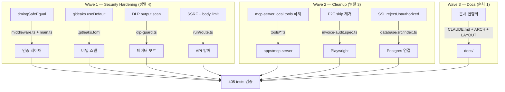

# Phase 4 — SWARM REVIEW/QA 잔여 과제 심화 계획

**작성일:** 2026-06-14 | **기준:** Phase 4 REVIEW 6-agent + Phase 5 QA 8-agent 보고서 | **전제:** Phase 2+3 완료, 405 tests PASS

---

## Phase 1: Business Review

### 1.1 문제 정의

**현재 상태:** Phase 2+3에서 P0/P1 10건 해소. SWARM REVIEW에서 발견된 보안 심화 항목(타이밍 공격, gitleaks 누락, DLP output 스캔 부재, SSRF, SSL 취약)과 QA에서 발견된 구조적 잔여(mcp-server 로컬 tool 파일 중복, E2E skip test 5건, 문서 미반영)가 미해결.

**목표 상태:** 타이밍 안전한 인증, gitleaks 내장 규칙 활성화, DLP output 스캔, SSRF 방어, SSL 검증 강화, mcp-server tool 파일 정리, E2E skip 제거, 문서 현행화.

**영향 범위:** 8개 파일 수정, 1개 파일 삭제(mcp-server local tools), 3개 문서 갱신. 기존 405 tests 유지.

### 1.2 제안 옵션

| 옵션 | 설명 | 공수(일) | 리스크 | 비용(AED) |
|------|------|---------|--------|----------|
| A | 보안 심화 + 구조 정리 + 문서 전량 | 1.5 | MED — SSL 변경 시 DB 연결 실패 가능 | 0 |
| B | 보안 심화만 (구조/문서 연기) | 1.0 | LOW | 0 |
| C | 구조 정리 + 문서만 (보안 연기) | 0.5 | LOW — 보안 리스크 잔존 | 0 |

### 1.3 추천 & 근거

**추천: 옵션 A.** 보안 항목은 프로덕션 배포 전 필수. 구조 정리는 중복 코드 제거. 문서는 Phase 3 변경 반영. 한 번에 처리.

**롤백:** `git revert` 1커밋. SSL 변경만 staging에서 사전 검증.

### 1.4 승인 요청

- [ ] Phase 1 승인

---

## Phase 2: Engineering Review

### 2.1 Mermaid 다이어그램



### 2.2 파일 변경 목록

| 파일 | 변경 유형 | 설명 |
|------|----------|------|
| **Wave 1** | | |
| `apps/web/src/middleware.ts` | modify | `token !== apiKey` → `timingSafeEqual` |
| `apps/mcp-server/src/main.ts` | modify | `auth !== Bearer ${expected}` → `timingSafeEqual` |
| `.gitleaks.toml` | modify | `[extend] useDefault = true` 추가 |
| `apps/mcp-server/src/schemas/dlp-guard.ts` | modify | `guardDlpOutput()` 추가 — tool 결과 JSON 스캔 |
| `apps/web/src/app/api/invoice-audit/run/route.ts` | modify | SSRF 방어 (worker URL 검증) + body size limit |
| **Wave 2** | | |
| `apps/mcp-server/src/tools/*.ts` (14 files) | **delete** | 로컬 구현 파일 삭제 (이미 @invoice-audit/tools에서 re-export) |
| `apps/web/e2e/invoice-audit.spec.ts` | modify | `test.skip()` 5건 제거, 조건부 skip → 실제 테스트 |
| `packages/database/src/index.ts` | modify | `rejectUnauthorized: false` → `true` (Neon CA bundle 사용) |
| **Wave 3** | | |
| `CLAUDE.md` | modify | Phase 3 변경 반영 (14 tools, CSP, batch query) |
| `docs/SYSTEM_ARCHITECTURE.md` | modify | packages/tools 14 tools 반영 |
| `docs/LAYOUT.md` | modify | 신규 파일/디렉토리 반영 |

### 2.3 의존성 & 순서

```
Wave 1 (병렬 4 agents, 독립):
  ├── W1A: timingSafeEqual      ← middleware.ts + main.ts
  ├── W1B: gitleaks useDefault  ← .gitleaks.toml
  ├── W1C: DLP output scan      ← dlp-guard.ts
  └── W1D: SSRF + body limit    ← run/route.ts

Wave 2 (Wave 1 완료 후, 병렬 3 agents):
  ├── W2A: mcp-server tools 삭제 ← Phase 3에서 re-export 완료 확인 후
  ├── W2B: E2E skip 제거         ← auth header 이미 추가됨
  └── W2C: SSL true 전환         ← staging DB 연결 사전 확인

Wave 3 (Wave 2 완료 후, 순차 1 agent):
  └── W3A: 문서 3건 현행화
```

### 2.4 테스트 전략

| 레벨 | 대상 | 내용 |
|------|------|------|
| 단위 | timingSafeEqual | 잘못된 길이 token → 401, 올바른 token → 통과 |
| 단위 | DLP output | tool 결과에 TRN/이메일 포함 시 차단 |
| 단위 | SSRF 방어 | 내부 호스트가 아닌 URL → 500 |
| 통합 | E2E full | 8 tests 모두 실행 (skip 없이) |
| 통합 | DB 연결 | Neon Postgres SSL 연결 성공 확인 |
| 회귀 | 전체 | 405 tests PASS 유지 |
| **깨질 가능성** | DB 연결 | `rejectUnauthorized: true` 시 Neon CA 미인증이면 연결 실패 |
| **깨질 가능성** | E2E skip 제거 | CI 환경에서 backend 미구동 시 5건 실패 |
| **깨질 가능성** | tools 삭제 | mcp-server에서 re-export 경로 잘못되면 186 tests 실패 |

### 2.5 리스크 & 완화

| 리스크 | 유형 | 완화 |
|--------|------|------|
| Neon Postgres SSL 인증 실패 | 호환성 | staging에서 먼저 `rejectUnauthorized: true` 테스트. 실패 시 `ca` 옵션으로 Neon CA 번들 지정 |
| E2E skip 제거 후 CI 실패 | 호환성 | `beforeAll`에서 backend health check, 미구동 시 `test.skip()` 유지 |
| timingSafeEqual 길이 불일치 | 보안 | `Buffer.from()`으로 통일, 길이 다르면 즉시 401 (short-circuit 안전) |
| DLP output 스캔 성능 저하 | 성능 | tool 결과 JSON stringify 후 regex scan — 1KB 미만 응답은 <1ms |
| mcp-server tools 삭제 후 import 깨짐 | 호환성 | 삭제 전 `rg "from.*tools/"` 로 모든 import 경로 확인 |

---

## 실행 요약

| Wave | Tasks | Agent 수 | 예상 시간 |
|------|-------|---------|----------|
| Wave 1 | timingSafeEqual + gitleaks + DLP output + SSRF | 4 (병렬) | 45m |
| Wave 2 | tools 삭제 + E2E skip + SSL | 3 (병렬) | 30m |
| Wave 3 | 문서 3건 현행화 | 1 | 20m |
| 검증 | 405 tests + typecheck + E2E | 1 | 20m |
| **총합** | **11 tasks** | **9 agents** | **~2h** |
