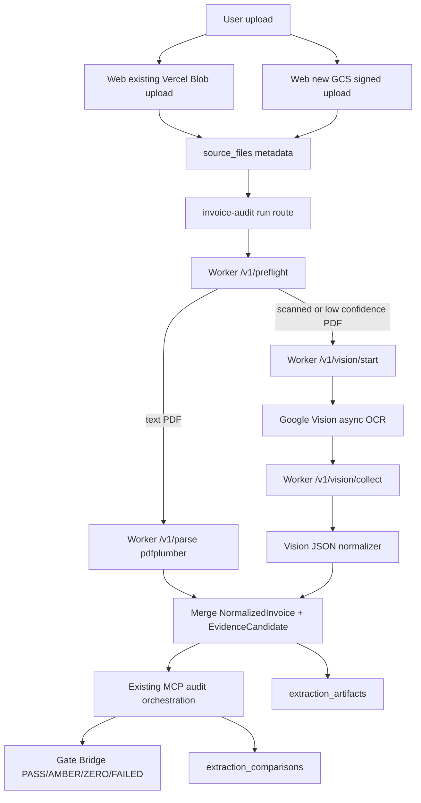

# Google Vision 시스템 이식 Phase 2 구현 계획

작성일: 2026-06-15
대상 경로: `C:\Users\jichu\OneDrive\문서\invoice\SCT_ONTOLOGY-main`
기준 문서:

- `20260615_MarkItDownMCP_GoogleVision_통합_WORKFLOW_PROCESS_상세설계서_v1.md`
- `plan-20260615-google-vision-port.md`

상태: Engineering Review / 구현 승인 대기

## 2.1 Mermaid 다이어그램



## 2.2 파일 변경 목록

| 파일 | 변경 유형 | 설명 |
|---|---|---|
| `apps/worker-py/pyproject.toml` | modify | `google-cloud-vision`, `google-cloud-storage`, `google-auth` 의존성 추가 |
| `apps/worker-py/app/schemas.py` | modify | `Preflight*`, `Vision*`, `VisionArtifactRef` Pydantic 모델 추가 |
| `apps/worker-py/app/routes/vision.py` | create | `/v1/preflight`, `/v1/vision/start`, `/v1/vision/collect` route 추가 |
| `apps/worker-py/app/vision/client.py` | create | Google Vision/GCS client wrapper. 테스트에서는 mock 가능해야 함 |
| `apps/worker-py/app/vision/normalizer.py` | create | Vision JSON을 `EvidenceCandidate`와 `SourceDataRow`로 변환 |
| `apps/worker-py/app/main.py` | modify | vision router include |
| `apps/web/src/lib/parser-client.ts` | modify | preflight/start/collect 호출 함수 추가 |
| `apps/web/src/app/api/invoice-audit/run/route.ts` | modify | `VISION_ENABLED` flag 뒤에서 scanned/low-confidence PDF만 Vision 경로 호출 |
| `apps/web/src/lib/types.ts` | modify | trace step 또는 status enum에 Vision 관련 step 추가 |
| `migrations/0012_extraction_artifacts.sql` | create | `extraction_artifacts`, `extraction_comparisons` 테이블 추가 |
| `.env.example` | modify | Vision/GCS 관련 env와 기본 OFF flag 문서화 |
| `apps/worker-py/tests/test_vision_preflight.py` | create | preflight 판정 단위 테스트 |
| `apps/worker-py/tests/test_vision_routes.py` | create | route schema, flag OFF, stable error 테스트 |
| `apps/worker-py/tests/test_vision_normalizer.py` | create | Vision JSON 변환 테스트 |
| `apps/web/tests/parser-client.test.ts` | modify | Vision client 함수 테스트 추가 |
| `apps/web/tests/api-invoice-audit-run.test.ts` | modify | flag OFF 미호출, flag ON 호출 격리 테스트 추가 |

충돌 확인:

- `apps/worker-py/app/routes/vision.py`는 현재 없음. 새 파일명 사용 가능.
- `apps/worker-py/app/vision/` 디렉터리는 현재 없음. 새 패키지로 생성 가능.
- `migrations/0012_extraction_artifacts.sql`은 현재 없음. 새 migration 번호 사용 가능.
- `plan-20260615-google-vision-phase2.md`는 현재 없음. 이 문서명 사용 가능.

## 2.3 의존성 & 구현 순서

### 순서 A: 공유 contract 먼저

1. `apps/worker-py/app/schemas.py`에 Vision 관련 request/response 모델 추가.
2. `migrations/0012_extraction_artifacts.sql` 추가.
3. `.env.example`에 기본 OFF flag와 GCS/Vision env 추가.

승인 지점:

- schema와 migration 이름을 확정한 뒤 route 구현으로 넘어간다.

### 순서 B: Worker Vision 경로

1. `apps/worker-py/app/vision/client.py` 추가.
2. `apps/worker-py/app/vision/normalizer.py` 추가.
3. `apps/worker-py/app/routes/vision.py` 추가.
4. `apps/worker-py/app/main.py`에 router 등록.

핵심 규칙:

- `VISION_ENABLED` 미설정 또는 `false`이면 외부 Google Vision 호출 금지.
- `/v1/preflight`는 외부 호출 없이 PDF 특성만 판정.
- `/v1/vision/start`는 `gcs://` URI만 허용.
- raw OCR text는 로그에 남기지 않는다.

### 순서 C: Web orchestration

1. `parser-client.ts`에 `preflightInvoiceFile`, `startVisionOcr`, `collectVisionOcr` 추가.
2. `run/route.ts`에서 PDF invoice인 경우에만 preflight 호출.
3. scanned/low-confidence이고 `VISION_ENABLED=true`일 때만 Vision start/collect 경로 호출.
4. Vision 실패는 기존 verdict를 깨지 않고 AMBER/HGT action 또는 trace로 격리.

### 병렬 가능 작업

| Lane | 독립 작업 |
|---|---|
| Worker Lane | schema, vision route, normalizer, pytest |
| Web Lane | parser-client 함수, run route flag test |
| DB Lane | migration SQL, job-store extension plan |

공유 모듈:

- `apps/worker-py/app/schemas.py`
- `apps/web/src/lib/types.ts`
- `migrations/0012_extraction_artifacts.sql`

공유 모듈은 한 lane에서 먼저 확정한 뒤 다른 lane이 맞춰야 한다.

## 2.4 테스트 전략

### Worker 단위 테스트

| 테스트 | 커버 |
|---|---|
| `test_vision_preflight.py` | text PDF, scanned PDF, encrypted PDF, unsupported file |
| `test_vision_routes.py` | flag OFF, gcs URI 필수, Vision auth failure, operation failure |
| `test_vision_normalizer.py` | page, text hash, confidence, matched_reference, doc_kind 변환 |

### Web 단위 테스트

| 테스트 | 커버 |
|---|---|
| `parser-client.test.ts` | `/v1/preflight`, `/v1/vision/start`, `/v1/vision/collect` 요청 body와 timeout |
| `api-invoice-audit-run.test.ts` | `VISION_ENABLED` unset/false일 때 호출 없음 |
| `api-invoice-audit-run.test.ts` | `VISION_ENABLED=true` + scanned PDF일 때만 Vision 호출 |
| `api-invoice-audit-run.test.ts` | Vision 실패가 primary verdict를 깨지 않음 |

### 회귀 테스트

```powershell
pnpm --dir apps/web typecheck
pnpm --dir apps/web test
cd apps/worker-py
python -m pytest
```

Focused 검증:

```powershell
python -m pytest apps/worker-py/tests/test_vision_preflight.py
python -m pytest apps/worker-py/tests/test_vision_routes.py
python -m pytest apps/worker-py/tests/test_vision_normalizer.py
pnpm --dir apps/web test -- parser-client.test.ts
pnpm --dir apps/web test -- api-invoice-audit-run.test.ts
```

완료 기준:

```text
feature flag OFF: 기존 테스트 전부 통과, 외부 Vision 호출 0회
feature flag ON + mock: scanned PDF route에서 Vision start/collect 호출
Vision 실패: 기존 parser/MCP verdict 유지
P2 로그: raw OCR text / invoice raw text 미노출
```

## 2.5 리스크 & 완화

| 리스크 | 영향 | 완화 |
|---|---|---|
| 외부 OCR 비용 발생 | 운영 비용 증가 | `VISION_ENABLED=false` 기본값, `VISION_POLICY=AUTO` |
| P2 원문 로그 노출 | 보안 사고 | raw text 로그 금지, hash/ref만 저장 |
| Vercel Blob과 GCS 경로 혼재 | 해시 불일치 및 parser 실패 | Blob→GCS 복사 시 sha256 재검증 |
| Google Vision async 지연 | run route timeout | start/collect 분리, worker 중심 처리 |
| schema drift | web/worker contract 불일치 | Pydantic + parser-client test 동시 추가 |
| 기존 NotebookLM 경로와 충돌 | 외부 전송 정책 혼선 | `VISION_ENABLED`, `MARKITDOWN_ENABLED`, `NOTEBOOKLM_ENABLED` 분리 |

## 승인 요청

- [ ] Phase 2 승인: 위 파일 변경 목록과 순서로 구현을 시작한다.
- [ ] 보안 승인: Vision/GCS raw text 로그 금지와 기본 OFF flag를 유지한다.
- [ ] 비용 승인: `VISION_POLICY=AUTO`로 scanned/low-confidence PDF에만 OCR을 적용한다.

