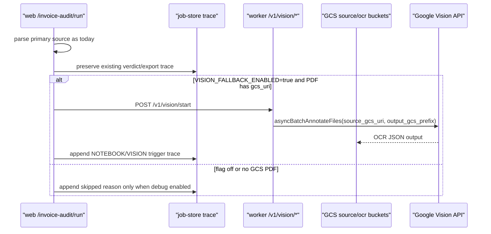

# web /invoice-audit/run Vision fallback orchestration 구현 계획

작성일: 2026-06-15

대상 문서:

```text
docs/20260615_MarkItDownMCP_GoogleVision_통합_WORKFLOW_PROCESS_상세설계서_v1.md
```

## Phase 1: Business Review

### 1.1 문제 정의

현재 상태: Google Vision/GCS worker route와 GCS signed upload 경로는 구현 및 live smoke 완료됐지만, web `/invoice-audit/run`은 아직 PDF-only 또는 low-confidence PDF에서 Vision fallback을 자동 호출하지 않는다.

목표 상태: 기존 verdict/export 흐름을 깨지 않고, feature flag가 켜진 경우에만 web run route가 PDF evidence를 worker Vision route로 넘겨 OCR/DSV parser 결과를 trace와 job state에 기록한다.

영향 범위:

```text
primary route: apps/web/src/app/api/invoice-audit/run/route.ts
worker route: /v1/preflight, /v1/vision/start, /v1/vision/collect
storage: gs://dsv-invoice-source, gs://dsv-invoice-ocr
tests: web route tests + parser-client tests
```

### 1.2 외부 문서 확인 결과

공식 문서 기준 확인:

- Google Vision PDF/TIFF OCR은 `files:asyncBatchAnnotate` 기반 비동기 요청이며, 입력과 출력은 Cloud Storage URI를 사용한다.
- Vision PDF/TIFF 결과는 지정한 Cloud Storage bucket에 JSON으로 기록된다.
- Cloud Storage signed URL은 특정 object에 제한시간 접근을 부여한다.
- V4 signed URL은 service account credentials로 생성 가능하다.
- ADC는 local/prod 환경에서 Google client library가 credential을 자동 탐색하게 한다.
- Next.js Route Handler는 `app` 디렉터리에서 Web Request/Response API를 사용하며, Node.js runtime을 지정할 수 있다.

참조:

```text
https://docs.cloud.google.com/vision/docs/pdf
https://docs.cloud.google.com/vision/docs/batch
https://docs.cloud.google.com/storage/docs/access-control/signed-urls
https://docs.cloud.google.com/storage/docs/access-control/signing-urls-with-helpers
https://docs.cloud.google.com/docs/authentication/provide-credentials-adc
https://nextjs.org/docs/app/api-reference/file-conventions/route
```

### 1.3 제안 옵션

| 옵션 | 설명 | 공수(일) | 리스크 | 비용(AED) |
|---|---|---:|---|---:|
| A | web run route 안에서 Vision start/collect를 동기 polling한다 | 1 | Vercel timeout 위험, run route 지연 | 낮음 |
| B | web run route에서 Vision start만 fire-and-forget하고 기존 verdict는 유지한다 | 1 | collect 결과가 즉시 audit에 반영되지 않음 | 낮음 |
| C | 별도 worker callback/job queue를 둬 Vision 결과를 비동기로 ingest한다 | 2-4 | 구현 범위 큼, DB/job state 변경 필요 | 낮음~중간 |

### 1.4 추천 & 근거

추천: 옵션 B.

이유:

- 기존 `/invoice-audit/run` verdict와 13-sheet export 흐름을 깨지 않는다.
- Google Vision은 이미 worker route live smoke가 끝났으므로, web은 안전하게 trigger/trace만 연결하면 된다.
- Vercel timeout과 장시간 polling 위험을 피한다.

롤백 전략:

```text
VISION_FALLBACK_ENABLED=false 로 두면 기존 run route 동작으로 즉시 복귀한다.
```

### 1.5 승인 요청

```text
[ ] Phase 1 승인
```

승인 전까지 아래 Phase 2는 실행 계획으로만 둔다.

## Phase 2: Engineering Review

### 2.1 Mermaid 다이어그램



### 2.2 파일 변경 목록

| 파일 | 변경 유형 | 설명 |
|---|---|---|
| `apps/web/src/lib/parser-client.ts` | modify | `startVisionOcr()`와 선택적 `collectVisionOcr()` client 추가 |
| `apps/web/src/app/api/invoice-audit/run/route.ts` | modify | feature flag 뒤에 PDF/GCS 대상 Vision fallback trigger 삽입 |
| `apps/web/tests/parser-client.test.ts` | modify | Vision start client request schema/timeout 테스트 |
| `apps/web/tests/api-invoice-audit-run.test.ts` | modify | flag off 미호출, flag on trigger, trigger 실패 격리 테스트 |
| `docs/20260615_MarkItDownMCP_GoogleVision_통합_WORKFLOW_PROCESS_상세설계서_v1.md` | modify | 구현 완료 후 orchestration 상태 반영 |

새 파일은 현재 필요하지 않다.

### 2.3 의존성 & 순서

1. `parser-client.ts`에 worker `/v1/vision/start` 호출 함수 추가.
2. `run/route.ts`에서 source_files 중 `file_type === "pdf"`이고 `blob_ref` 또는 `gcs_uri`가 `gs://`인 파일만 후보로 선택.
3. `VISION_FALLBACK_ENABLED === "true"`일 때만 fire-and-forget 호출.
4. 실패는 `.catch()`로 격리하고 기존 verdict를 바꾸지 않는다.
5. trace에는 `VISION_FALLBACK_TRIGGERED`, `VISION_FALLBACK_SKIPPED`, `VISION_FALLBACK_FAILED` 중 하나를 기록한다.
6. 테스트 추가 후 web typecheck와 Vitest 실행.

### 2.4 요청/응답 계약

Worker start request:

```json
{
  "job_id": "job_x",
  "file_id": "file_pdf",
  "source_gcs_uri": "gs://dsv-invoice-source/source/job_x/file_pdf/input.pdf",
  "output_gcs_prefix": "gs://dsv-invoice-ocr/jobs/job_x/file_pdf/"
}
```

Worker start response:

```json
{
  "job_id": "job_x",
  "file_id": "file_pdf",
  "operation_name": "operations/...",
  "output_gcs_prefix": "gs://dsv-invoice-ocr/jobs/job_x/file_pdf/",
  "status": "STARTED"
}
```

### 2.5 Feature flags

```text
VISION_FALLBACK_ENABLED=false
GCS_OCR_BUCKET=dsv-invoice-ocr
PARSER_BASE_URL=<worker base url>
API_SECRET_KEY=<worker api secret if required by deployment>
```

기본값은 OFF다.

### 2.6 테스트 전략

단위/route 테스트:

- `parser-client.test.ts`
  - `/v1/vision/start` POST body 검증
  - worker disabled 응답 처리
  - timeout은 trigger accepted로 격리할지 실패로 둘지 명시

- `api-invoice-audit-run.test.ts`
  - flag off: 기존 fetch mock 수 유지, Vision 미호출
  - flag on + GCS PDF present: Vision start 호출됨
  - Vision start 실패: route verdict/export 응답은 기존과 동일
  - non-GCS blob PDF: skip

검증 명령:

```powershell
pnpm --dir apps/web typecheck
pnpm --dir apps/web test -- --run tests/parser-client.test.ts tests/api-invoice-audit-run.test.ts
pnpm --dir apps/web test -- --run
```

통합 smoke:

```powershell
VISION_FALLBACK_ENABLED=true
GCS_OCR_BUCKET=dsv-invoice-ocr
```

로컬 또는 staging에서 GCS 업로드된 PDF job으로 `/api/invoice-audit/run` 실행 후 trace에 Vision trigger 기록 확인.

### 2.7 리스크 & 완화

| 리스크 | 영향 | 완화 |
|---|---|---|
| Vercel function timeout | run route 지연 | start만 fire-and-forget, collect는 다음 phase |
| source가 Vercel Blob only | Vision은 GCS URI 필요 | GCS URI가 없으면 skip하고 trace에 이유 기록 |
| 비용 증가 | Vision/GCS 비용 발생 | flag 기본 OFF, PDF 1건부터 제한 |
| verdict 오염 | OCR 결과가 기존 판정을 바꿀 수 있음 | Phase 1에서는 verdict 불변, evidence trace만 추가 |
| raw OCR 노출 | 민감 원문 노출 | trace에는 URI/hash/status만 기록 |

### 2.8 Acceptance Criteria

```text
[ ] VISION_FALLBACK_ENABLED 미설정 시 기존 tests/api-invoice-audit-run.test.ts fetch mock 수가 깨지지 않는다.
[ ] flag ON + GCS PDF source면 worker /v1/vision/start가 호출된다.
[ ] Vision trigger 실패가 /invoice-audit/run verdict를 바꾸지 않는다.
[ ] trace에는 raw OCR/PDF text가 남지 않는다.
[ ] web typecheck 통과.
[ ] web full vitest 통과.
```

