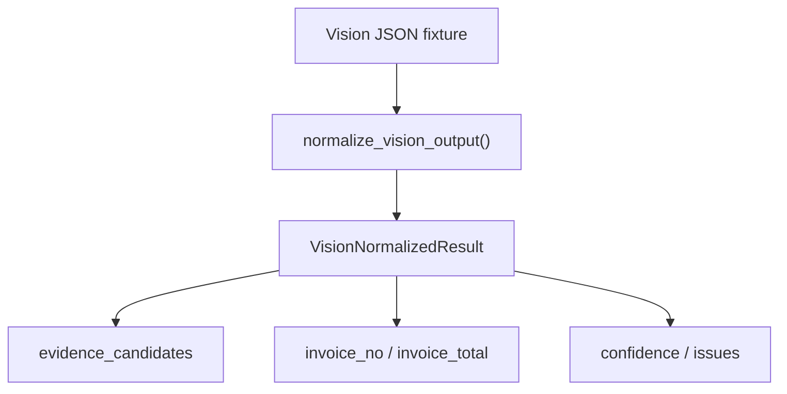

# Vision Normalizer 직접 검증 테스트 추가 계획

작성일: 2026-06-15
대상 경로: `C:\Users\jichu\OneDrive\문서\invoice\SCT_ONTOLOGY-main`
사용 스킬: `mstack-plan`
상태: 구현 승인 대기

## Phase 1: Business Review

### 1.1 문제 정의

현재 `apps/worker-py/app/services/vision_normalizer.py`는 `python -m pytest` 전체 통과에는 포함되지만 coverage가 0%다.

목표 상태는 `normalize_vision_output()`의 핵심 변환 규칙을 `test_vision_normalizer.py`에서 직접 검증하는 것이다.

영향 범위:

| 범위 | 영향 |
|---|---|
| Worker tests | 신규 pytest 파일 1개 추가 |
| Vision normalizer | 코드 수정 없이 현재 동작을 고정 |
| Google Vision API | 실제 외부 호출 없음. fixture dict만 사용 |
| P2/DLP | raw text 저장 대신 hash/ref 검증 중심 |

### 1.2 제안 옵션

| 옵션 | 설명 | 공수(일) | 리스크 | 비용(AED) |
|---|---|---:|---|---:|
| A | 정상 path 1개만 추가 | 0.1 | coverage는 오르지만 edge case 방어가 약함 | 0 |
| B | 정상/빈 OCR/평균 confidence/필드 추출 4개 테스트 추가 | 0.2 | 범위가 작고 현재 함수 계약을 충분히 고정 | 0 |
| C | route + normalizer 통합 테스트까지 추가 | 0.5 | route stub 정책까지 같이 흔들 수 있음 | 0 |

### 1.3 추천 & 근거

추천은 옵션 B다.

이유:

1. 외부 Google Vision 호출 없이 순수 함수만 검증한다.
2. 현재 coverage 0%인 파일의 핵심 동작을 직접 고정한다.
3. route나 client stub 정책을 건드리지 않아 회귀 위험이 낮다.

롤백 전략:

테스트가 현재 구현과 다른 의도를 드러내면 테스트 파일만 제거하거나 expectation을 설계서 §21.6 규칙에 맞춰 조정한다.

### 1.4 승인 요청

- [ ] Phase 1 승인: 옵션 B 방식으로 `test_vision_normalizer.py`를 추가한다.

## Phase 2: Engineering Review

### 2.1 Mermaid 다이어그램



### 2.2 파일 변경 목록

| 파일 | 변경 유형 | 설명 |
|---|---|---|
| `apps/worker-py/tests/test_vision_normalizer.py` | create | Vision JSON fixture 기반 direct unit tests 추가 |

충돌 확인:

`apps/worker-py/tests/test_vision_normalizer.py`는 현재 존재하지 않는다.

### 2.3 의존성 & 순서

1. `normalize_vision_output`과 `VisionNormalizedResult`를 import한다.
2. Google Vision 형태의 `responses[].fullTextAnnotation.text` fixture를 만든다.
3. text, confidence, reference extraction, invoice field extraction을 검증한다.
4. 빈 OCR 결과와 heuristic confidence fallback을 별도 테스트한다.
5. focused pytest 후 worker 전체 pytest를 실행한다.

### 2.4 테스트 전략

추가할 테스트:

| 테스트명 | 검증 내용 |
|---|---|
| `test_normalizes_full_text_annotation_with_references` | `full_text`, `page_count`, `evidence_candidates`, `doc_kind`, `matched_reference`, `text_span_hash` |
| `test_extracts_invoice_number_and_total` | `invoice_no`, `invoice_total` regex 추출 |
| `test_averages_word_confidence` | nested word confidence 평균 계산 |
| `test_empty_ocr_output_reports_low_confidence_and_scanned_issue` | 빈 OCR 결과에서 `VISION_LOW_CONFIDENCE`, `SCANNED_PAGE_DETECTED` |
| `test_uses_text_length_confidence_fallback` | confidence가 없고 text가 있을 때 length heuristic 적용 |

검증 명령:

```powershell
python -m pytest apps/worker-py/tests/test_vision_normalizer.py
python -m pytest
```

실행 위치:

```text
C:\Users\jichu\OneDrive\문서\invoice\SCT_ONTOLOGY-main\apps\worker-py
```

### 2.5 리스크 & 완화

| 리스크 | 영향 | 완화 |
|---|---|---|
| 정규식이 과도하게 넓은 match를 반환 | 테스트가 현재 버그를 드러낼 수 있음 | 설계서 §21.6 기준으로 expectation을 명시 |
| raw text 직접 assertion이 P2 정책과 충돌 | 테스트 fixture에 실제 고객 문서 사용 금지 | synthetic text만 사용 |
| confidence 계산 정책 변경 | 테스트가 brittle해질 수 있음 | 평균과 fallback의 핵심 수치만 `pytest.approx`로 검증 |

## Coordinator Input Packet

objective:

`vision_normalizer.py`의 `normalize_vision_output()` 변환 로직을 외부 API 없이 직접 검증한다.

non-negotiables:

- Google Vision API를 호출하지 않는다.
- 실제 고객/운영 OCR text를 fixture로 쓰지 않는다.
- production code는 수정하지 않는다.
- 테스트는 `apps/worker-py/tests/test_vision_normalizer.py` 하나만 추가한다.

acceptance criteria:

- focused test가 통과한다.
- worker 전체 `python -m pytest`가 통과한다.
- `vision_normalizer.py` coverage가 0%에서 상승한다.

required evidence:

- 생성 파일 경로
- focused pytest 결과
- 전체 pytest 결과
- coverage에서 `app\services\vision_normalizer.py`가 더 이상 0%가 아님

test expectations:

- 최소 5개 테스트
- 정상 OCR, 빈 OCR, confidence 평균, confidence fallback, invoice field extraction 포함

