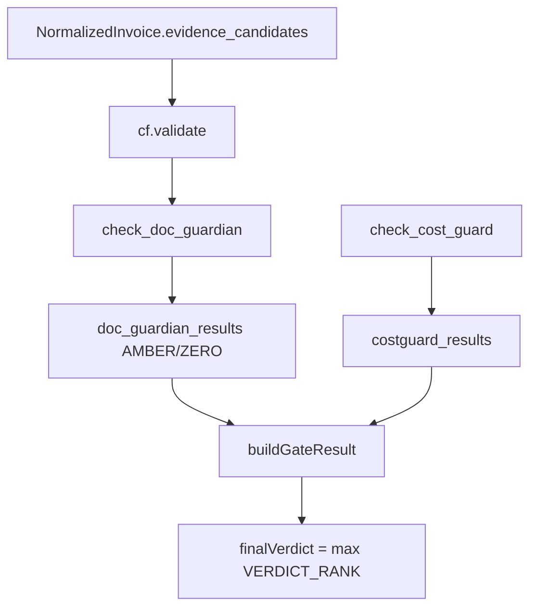

# Plan: Doc-Guardian / Evidence 결과를 최종 게이트에 병합

> 작성일: 2026-06-13 · 출처: graphify 추적 (evidence_candidates 소비 경로)
> 대상: `apps/web` 인보이스 감사 오케스트레이터
> 관련 추적: `parse_pdf_text_bytes()` → `NormalizedInvoice.evidence_candidates` → `cf.validate()` → `check_doc_guardian`

## Phase 1: Business Review

### 1.1 문제 정의

현재 상태: 원격 CF Worker MCP가 `check_doc_guardian`으로 evidence를 검증해 `doc_guardian_results`(AMBER/ZERO severity)를 정상 반환하지만, 웹 오케스트레이터([apps/web/src/app/api/invoice-audit/run/route.ts:101](apps/web/src/app/api/invoice-audit/run/route.ts))의 `buildGateResult`는 **`costguard_results`만** 입력받는다. 그 결과 evidence(및 rate/tax) 위반이 계산되고도 최종 PASS/AMBER/ZERO 판정에 반영되지 않는다.

목표 상태: 최종 verdict가 COST-GUARD 밴드뿐 아니라 **doc_guardian evidence 결과**(최소한)를 함께 반영한다. ZERO evidence finding이 있으면 최종 verdict가 ZERO 이상으로 승격된다.

영향 범위:
- 직접 변경 후보: `apps/web/src/lib/gate-bridge.ts`(`buildGateResult` 시그니처 확장), `apps/web/src/app/api/invoice-audit/run/route.ts`(호출부).
- 간접: `gate-bridge.test.ts`, `api-invoice-audit-run.test.ts` 기대값 갱신 가능.
- 검증 명령: `cd apps/web && npm test -- tests/gate-bridge.test.ts`, 이후 `npm test -- tests/api-invoice-audit-run.test.ts`, `npm run typecheck`.

근거 (코드):
- `doc_guardian_results: { line_id, code, severity: 'AMBER'|'ZERO' }[]` — [cf-mcp-client.ts:196](apps/web/src/lib/cf-mcp-client.ts)
- `buildGateResult(jobId, lines: CostGuardLine[])` — [gate-bridge.ts:24](apps/web/src/lib/gate-bridge.ts), `VERDICT_RANK { PASS:0, AMBER:1, ZERO:2, FAILED:3 }`
- 현재 호출: `buildGateResult(body.job_id, sct.costguard_results.map(...))` — costguard만 — [run/route.ts:101](apps/web/src/app/api/invoice-audit/run/route.ts)

### 1.2 제안 옵션

| 옵션 | 설명 | 공수(일) | 리스크 | 비용(AED) |
|------|------|---------:|--------|----------:|
| A | `buildGateResult`에 선택적 두 번째 입력 `evidenceFindings: EvidenceFinding[]`를 추가. evidence finding을 line_results에 병합하고 동일한 `VERDICT_RANK` reduce로 최종 verdict 산출. action_items에도 evidence 이슈 추가. | 0.5 | 낮음. 기존 costguard 경로 무변경(파라미터 미전달 시 동일 동작). | 0 |
| B | 오케스트레이터에서 doc_guardian severity를 직접 검사해 `finalVerdict`를 별도 보정(게이트 함수 미변경). | 0.25 | 중간. 판정 로직이 라우트에 분산되어 SSOT 깨짐. 테스트 분산. | 0 |
| C | 전체 검증(rate/tax/fx 포함)을 한 번에 게이트에 통합하는 일반화 `mergeVerdicts()` 신설. | 1.5 | 높음. 범위 과대. 이번 갭(evidence) 대비 과함. | 0 |

### 1.3 추천 & 근거

추천: **옵션 A**.

이유:
- 판정 로직을 `gate-bridge.ts` 한 곳(SSOT)에 유지한다.
- `evidenceFindings` 파라미터를 optional로 두면 기존 호출/테스트가 깨지지 않는다(점진 도입).
- `VERDICT_RANK` reduce 패턴을 그대로 재사용 → 구현 단순.
- rate/tax/fx 병합은 동일 패턴으로 후속 확장 가능(이번 범위에서 제외, 발견만 기록).

롤백 전략: `buildGateResult`의 evidence 병합 분기와 라우트의 인자 추가만 되돌리면 costguard-only 동작으로 복귀.

### 1.4 승인 요청

- [ ] Phase 1 승인

## Phase 2: Engineering Review

### 2.1 데이터 흐름 (변경 후)

### 2.2 파일 변경 목록

| 파일 | 변경 유형 | 설명 |
|------|----------|------|
| `apps/web/src/lib/gate-bridge.ts` | modify | `EvidenceFinding` 타입 추가. `buildGateResult(jobId, lines, evidenceFindings: EvidenceFinding[] = [])`로 시그니처 확장. evidence finding을 line_results에 매핑(reason_code `EVIDENCE_{code}`), 최종 verdict reduce에 포함, action_items 생성(severity 그대로). |
| `apps/web/src/app/api/invoice-audit/run/route.ts` | modify | `buildGateResult(body.job_id, costguard.map(...), sct.doc_guardian_results.map(...))` 형태로 evidence finding 전달. `isPdfLowConf` override는 유지. |
| `apps/web/tests/gate-bridge.test.ts` | modify | evidence ZERO → 최종 ZERO 승격, AMBER → AMBER, evidence 빈 배열 → 기존 동작 유지 케이스 추가. |
| `apps/web/tests/api-invoice-audit-run.test.ts` | verify/modify | doc_guardian ZERO 시 verdict 변화 회귀 확인. |

### 2.3 의존성 & 순서

1. `gate-bridge.ts`에 `EvidenceFinding` 타입 + optional 파라미터 추가 (기존 호출 무변경 보장).
2. RED: `gate-bridge.test.ts`에 evidence 승격 테스트 추가 → 실패 확인.
3. GREEN: 병합 로직 구현 → 통과.
4. 라우트 호출부에 `sct.doc_guardian_results` 전달.
5. `api-invoice-audit-run.test.ts` 회귀 확인 → 필요 시 기대값 갱신.
6. `npm run typecheck` → `npm test`(대상 + 회귀).

### 2.4 테스트 전략 (TDD + Red-Green)

- 단위: `npm test -- tests/gate-bridge.test.ts`
  - evidence `[]` → verdict는 costguard만으로 결정(기존과 동일) — 회귀 가드
  - costguard PASS + evidence ZERO → 최종 **ZERO**
  - costguard WARN(AMBER) + evidence AMBER → 최종 **AMBER**
  - Red-Green: 병합 로직 revert 시 ZERO 승격 테스트가 FAIL 하는지 확인
- 통합: `npm test -- tests/api-invoice-audit-run.test.ts`
- 전체: `npm run typecheck`, 이후 `npm test`

### 2.5 리스크 & 완화

- 호환성: 기존 `buildGateResult` 2-인자 호출 다수 존재 가능 → 3번째 인자 optional(`= []`)로 무영향.
- 판정 강화로 기존 PASS 케이스가 AMBER/ZERO로 바뀔 수 있음(의도된 동작) → 변경 케이스를 테스트로 명시하고 CHANGELOG에 기록.
- doc_guardian의 `line_id`가 null인 finding(헤더 레벨) 처리 → line_id 없으면 invoice 레벨 action_item으로 집계.
- 범위 제한: rate/tax/fx 병합은 본 plan 제외(후속). 추적에서 확인된 추가 갭(`check_cost_guard` `evidenceIds: []` 하드코딩, 로컬 `apps/mcp-server/check_evidence_required` stub 미사용)은 별도 이슈로 기록.

### 2.6 후속 기록 (범위 외, 추적 발견)

- `check_cost_guard` 호출 시 `evidenceIds: []` 하드코딩 — [cf-mcp-client.ts:142](apps/web/src/lib/cf-mcp-client.ts)
- 로컬 `apps/mcp-server/src/tools/check_evidence_required.ts`는 `present_evidence=[]` stub이며 웹 흐름에서 미호출(dead path). 실제 evidence 검사는 원격 `check_doc_guardian`.
- PDF 경로 `invoice_lines=[]`(P3A) — line 기반 numeric/costguard 검증 부재. P3B/P3C 로드맵 확인 필요.
