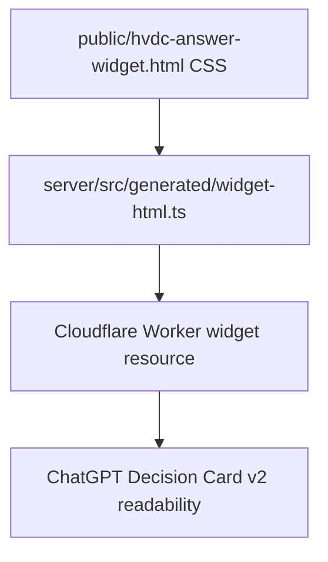

# Decision Card v2 Contrast Patch Plan

## Phase 1: Business Review

### 1.1 Problem

Current state: Decision Card v2 renders correctly, but dark host contexts can make internal table, panel, trace, and hash text too low contrast.

Target state: Decision Card v2 remains a light, readable surface inside ChatGPT while preserving existing data rendering and layout.

### 1.2 Options

| Option | Description | Effort (days) | Risk | Cost (AED) |
|---|---|---:|---|---:|
| A | Patch CSS contrast only and regenerate worker asset. | 0.1 | Low | 0 |
| B | Patch CSS plus add visual regression tests. | 0.3 | Low | 0 |
| C | Run full design-upgrade-loop benchmark and scorecard pipeline. | 1.0 | Medium | 0 |

### 1.3 Recommendation

Use Option A.

The issue is visible and localized to Decision Card v2 text contrast. A small CSS patch is lower risk than changing renderer structure.

Rollback strategy: revert the CSS patch and regenerated widget asset.

### 1.4 Approval

[x] Phase 1 approved by direct user instruction to apply the CSS patch.

## Phase 2: Engineering Review

### 2.1 Diagram

### 2.2 File changes

| File | Change type | Description |
|---|---|---|
| `public/hvdc-answer-widget.html` | modify | Add explicit Decision Card v2 foreground colors, table contrast, and trace hash wrapping. |
| `server/src/generated/widget-html.ts` | generate | Refresh embedded worker widget HTML after CSS patch. |

### 2.3 Order

1. Patch Decision Card v2 CSS.
2. Regenerate worker assets.
3. Report changed files and remaining deploy step.

### 2.4 Test strategy

No automated test is required for this CSS-only contrast patch.

Manual visual verification in ChatGPT or the in-app browser is the relevant acceptance check.

### 2.5 Risks

Compatibility risk: low, because the patch only affects `.decision-card-v2`.

Accessibility risk: reduced, because explicit foreground colors increase text contrast.
