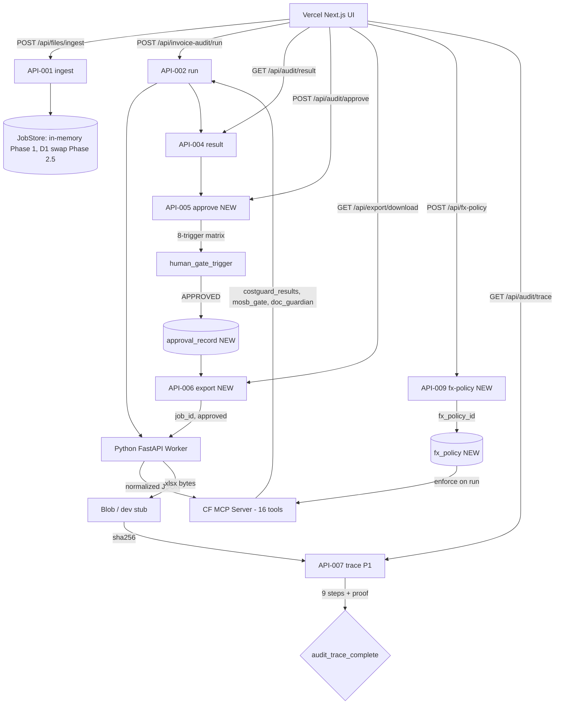
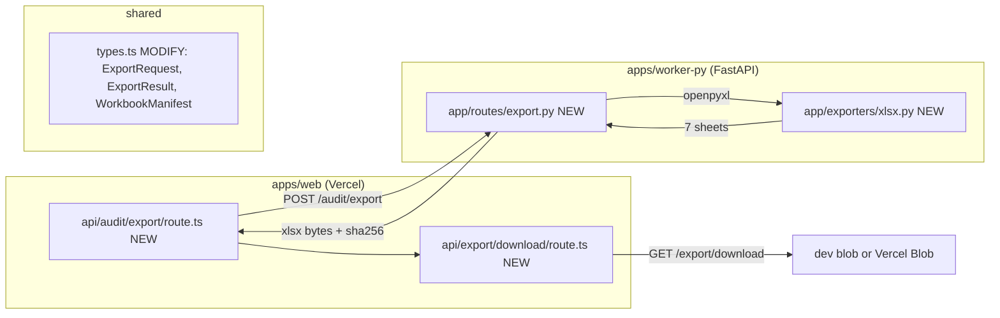
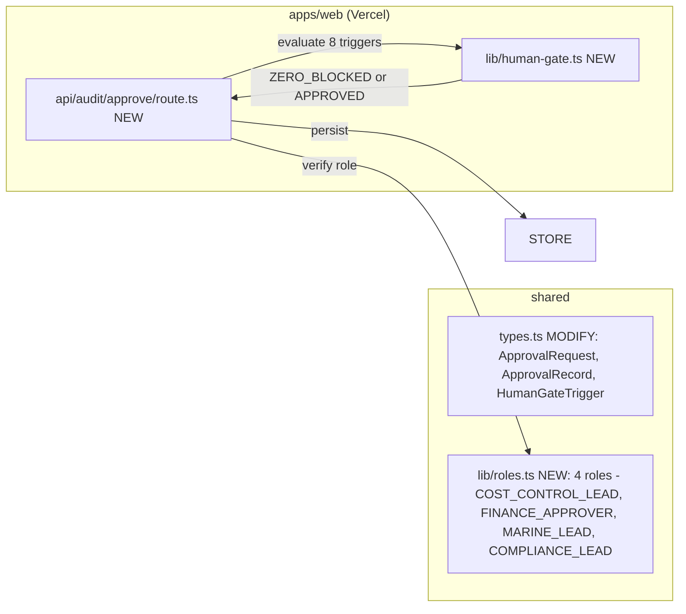
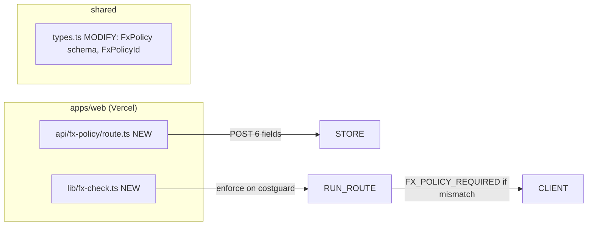

# Phase 2 Implementation Plan — Invoice Audit Platform

> **Skill**: mstack-plan (planning only, NO implementation)
> **Date**: 2026-06-09 12:00 (UTC+4)
> **Owner**: SCT Logistics / Invoice Audit Product Owner
> **Spec basis**: `SCT_ONTOLOGY_Invoice_Audit_Platform_SPEC_v0.2.0.md` §13 (P2-T1~T5) + §5.7 (7-sheet), §5.8 (error codes), §5.9 (8-trigger), §5.10 (CostGuard math)
> **Plan-of-plans**: 3 sub-plans (P2A export / P2B approval / P2C FxPolicy)

---

## 1. Problem Definition

### Current State (after Phase 1)
- 350/350 unit tests pass + typecheck + wrangler dry-run green
- Job lifecycle: `upload → parse → validate → result` (verdict ZERO, 4 line_results, 2 action_items)
- 7-sheet xlsx export **not implemented** → users cannot download Audit Pack
- Approval gate **not implemented** → no human review, no FINANCE_APPROVER, no high-value gate
- FxPolicy flow **not implemented** → cross-currency would silently fail or pass
- 8-trigger human-gate matrix **not enforced** → high-value invoices export without Finance approval

### Target State (after Phase 2)
- Approved 7-sheet xlsx export works (API-006)
- Approval gate enforces 8-trigger matrix (API-005) with role checks
- FxPolicy creation + enforcement (API-009)
- xlsx determinism: same input + version → same `sha256`
- New error codes (`HUMAN_GATE_REQUIRED`, `FX_POLICY_REQUIRED`, `ZERO_BLOCKED`, `EXPORT_REPLAY_DETECTED`, etc.) wired
- All Phase 1 tests remain green (350/350 baseline preserved)

### Scope
- **In**: P2-T1 (workbook schema) + P2-T2 (Python export) + P2-T3 (approval gate) + P2-T4 (FxPolicy) + P2-T5 (regression test)
- **Out**: Phase 3 PDF text, Phase 4 OCR, Phase 5 Drive, OpenTelemetry, i18n, R2 swap

### Measurable Outcome
- 7 sheets generated with `prism_kernel_proof_ref` + `costguard_band_summary`
- `POST /api/audit/approve` returns 200 with `prism_kernel_proof_ref` for valid approvals
- `POST /api/audit/approve` returns 403 `HUMAN_GATE_REQUIRED` for high-value without FINANCE_APPROVER role
- `GET /api/export/download?job_id=X` returns xlsx bytes for APPROVED jobs
- `GET /api/export/download?job_id=X` returns 403 `ZERO_BLOCKED` for ZERO verdict jobs
- Same input + same `parser_version` + same `rule_version` → same xlsx `sha256`
- New tests pass; baseline 350/350 preserved

---

## 2. Approach Comparison (mstack-plan §2)

| Option | Summary | Effort | Risk | Notes |
|---|---|---|---|---|
| A | **Monolithic** — 1 plan, all 5 tasks, sequential | 24-30h | **HIGH** | single failure breaks all; spec drift likely; no review gate between tasks |
| **B** (selected) | **Phased — 3 sub-plans** | 22-28h | **MED** | P2A (export+regression) → P2B (approval gate) → P2C (FxPolicy); each sub-plan is independently reviewable |
| C | TDD-first — 5 sub-plans, RED first | 26-32h | LOW quality / HIGH time | matches mstack-plan rigor; over-zealous for a 5-task scope |

**Selected: B** — 3 sub-plans aligned with spec §13 sub-phases. Each sub-plan ends with user review gate (sub-plan doc + completion report).

### Rollback / Fallback
- P2A alone (export + regression) is a standalone deliverable — usable even without approval gate (admin pre-approval flag)
- P2B failure does not invalidate P2A (job-store schema is forward-compatible: `approval_record` is a new entity, not mutation of existing `Job`)
- P2C failure does not invalidate P2A/P2B (FxPolicy is an optional reference on costguard_results)

### User approval needed before phase 2? 
**Yes** — sub-plan 1 (P2A) start, sub-plan 2 (P2B) start, sub-plan 3 (P2C) start = 3 explicit review gates.

---

## 3. Engineering Diagram (Mermaid)

### 3.1 High-level data flow (post Phase 2)



### 3.2 P2A sub-plan (Export) — module boundaries



### 3.3 P2B sub-plan (Approval) — module boundaries



### 3.4 P2C sub-plan (FxPolicy) — module boundaries



---

## 4. Sub-Plan P2A — Export + Regression (P2-T1 + T2 + T5)

### 4.1 File Changes

| # | Action | Path | Reason |
|---|---|---|---|
| 1 | **create** | `apps/web/src/lib/types.ts` (MODIFY: add `ExportRequest`, `ExportResult`, `WorkbookManifest`, `SheetManifest`) | Type contracts |
| 2 | **create** | `apps/web/src/lib/workbook-builder.ts` (NEW) | Client-side 7-sheet column spec from §5.7 |
| 3 | **create** | `apps/web/src/app/api/audit/export/route.ts` (NEW — API-006 POST) | Triggers export |
| 4 | **create** | `apps/web/src/app/api/export/download/route.ts` (NEW — API-006 GET) | Serves xlsx |
| 5 | **create** | `apps/web/src/lib/error-codes.ts` (MODIFY: add `APPROVAL_REQUIRED`, `EXPORT_FAILED`, `EXPORT_REPLAY_DETECTED`, `RERUN_FORBIDDEN`) | §5.8 |
| 6 | **create** | `apps/web/tests/api-audit-export.test.ts` (NEW — 4 it) | Route test |
| 7 | **create** | `apps/web/tests/api-export-download.test.ts` (NEW — 3 it) | Route test |
| 8 | **create** | `apps/worker-py/app/exporters/__init__.py` (NEW) | Python package |
| 9 | **create** | `apps/worker-py/app/exporters/xlsx.py` (NEW — 7 sheets builder) | openpyxl workbook |
| 10 | **create** | `apps/worker-py/app/routes/export.py` (NEW — POST /v1/export) | FastAPI endpoint |
| 11 | **create** | `apps/worker-py/app/schemas.py` (MODIFY: add `ExportRequest`, `WorkbookManifest`) | Pydantic v2 |
| 12 | **create** | `apps/worker-py/tests/test_xlsx_export.py` (NEW — 5 it) | Workbook test |
| 13 | **create** | `apps/worker-py/tests/test_export_route.py` (NEW — 3 it) | Endpoint test |
| 14 | **create** | `apps/worker-py/tests/fixtures/sample_approved_job.json` (NEW) | Determinism fixture |
| 15 | **create** | `apps/web/src/app/invoice-audit/jobs/[jobId]/export/page.tsx` (NEW — UI) | Download button |
| 16 | **create** | `apps/worker-py/requirements.txt` (MODIFY: add `openpyxl>=3.1.0`) | Dependency |
| 17 | **modify** | `apps/web/src/app/api/files/ingest/route.ts` (no functional change; ensure `parser_version` propagates) | Determinism input |

### 4.2 7-Sheet Schema (from spec §5.7 — verbatim, no invention)

| # | Sheet | Key columns (subset) |
|---|---|---|
| 1 | `00_Decision` | `job_id, verdict, approved_by, approved_at, rule_version, parser_version, final_recon_status, zero_count, amber_count, prism_kernel_proof_ref, costguard_band_summary, watermark` |
| 2 | `01_Action_Items` | `action_id, severity, shipment_ref, line_id, issue_type, required_action, owner_role, status, prism_kernel_proof_ref` |
| 3 | `02_Final_Recon` | `currency, shipment_ref, invoice_total, reviewed_total, variance, variance_pct, recon_status, evidence_ref` |
| 4 | `04_Line_View` | `line_id, shipment_ref, description, for_charge_component, type_b, amount, currency, rate_source, rate_status, validity_status, evidence_status, gate_status, band, delta_pct, numeric_integrity_status, difference` |
| 5 | `90_Source_Data` | `file_id, source_ref, original_text, normalized_value, confidence, routing_pattern` |
| 6 | `91_Audit_Detail` | `line_id, rule_id, reason_code, sct_trace_id, cf_mcp_tool, cf_mcp_latency_ms, confidence, decision_input, fx_override, fx_policy_id` |
| 7 | `92_Evidence_Issues` | `line_id, required_evidence, matched_evidence, gap_type, severity, action_item_id, human_gate_trigger_id` |

### 4.3 Dependencies & Sequencing

**Sequential (strict)**:
1. Types + openpyxl dep (T1, T-pre)
2. Python exporter (T2.a) — independent
3. Workbook builder types (T1.b)
4. Export route POST (T2.b)
5. Export route GET (T2.c)
6. UI page (T5)
7. Tests (T5)

**Parallel-safe** (if 2 agents):
- Agent A: Python exporter (steps 1, 8-14)
- Agent B: TS routes + UI (steps 2-7, 15-17)
- Rejoin for E2E + determinism test

### 4.4 Determinism Strategy
- All export inputs immutable: `job_id`, `parser_version`, `rule_version`, `costguard_results[]`, `approval_record`, `human_gate_triggers[]`
- `openpyxl` writes cells in **fixed iteration order** (sort by `line_id`)
- **No timestamps in cell content** (only in `00_Decision.generated_at`)
- **Sha256 test**: same `sample_approved_job.json` → call exporter twice → expect equal sha256

### 4.5 Exit Criteria (P2A)
- 7 sheets exist with correct column names (15+ columns per sheet)
- `prism_kernel_proof_ref` populated on 3+ sheets
- `costguard_band_summary` (JSON or string) on `00_Decision`
- xlsx `< 1MB` for fixture (typical invoice ~50 lines)
- Determinism test passes (sha256 equality)
- New tests + Phase 1 350/350 baseline preserved

---

## 5. Sub-Plan P2B — Approval Gate (P2-T3)

### 5.1 File Changes

| # | Action | Path | Reason |
|---|---|---|---|
| 1 | **modify** | `apps/web/src/lib/types.ts` | Add `ApprovalRequest`, `ApprovalRecord`, `HumanGateTrigger`, `ApprovalScope` enum |
| 2 | **create** | `apps/web/src/lib/roles.ts` (NEW) | 4 roles + role→trigger mapping |
| 3 | **create** | `apps/web/src/lib/human-gate.ts` (NEW) | 8-trigger evaluator |
| 4 | **create** | `apps/web/src/lib/approval-record.ts` (NEW) | Persist approval_record |
| 5 | **create** | `apps/web/src/app/api/audit/approve/route.ts` (NEW — API-005) | Approval endpoint |
| 6 | **modify** | `apps/web/src/lib/error-codes.ts` | Add `HUMAN_GATE_REQUIRED`, `ZERO_BLOCKED`, `APPROVAL_REQUIRED_FIELDS`, `UNAUTHORIZED_APPROVAL` |
| 7 | **create** | `apps/web/tests/roles.test.ts` (NEW — 4 it) | Role mapping |
| 8 | **create** | `apps/web/tests/human-gate.test.ts` (NEW — 8 it, one per trigger) | Trigger matrix |
| 9 | **create** | `apps/web/tests/approval-record.test.ts` (NEW — 3 it) | Persistence |
| 10 | **create** | `apps/web/tests/api-audit-approve.test.ts` (NEW — 5 it) | Route test |
| 11 | **create** | `apps/web/src/app/invoice-audit/jobs/[jobId]/approve/page.tsx` (NEW — UI) | Approval panel |

### 5.2 8-Trigger Human-Gate Matrix (from spec §5.9 — verbatim)

| # | Trigger | Source field | Required role | Default severity |
|---|---|---|---|---|
| 1 | `invoiceTotal ≥ 100,000.00 AED` | `audit_job.invoice_total` | `FINANCE_APPROVER` | ZERO |
| 2 | CostGuard band ∈ {HIGH, CRITICAL} | `invoice_line.band` | `COST_CONTROL_LEAD` + `FINANCE_APPROVER` | ZERO |
| 3 | Rate reference missing | `invoice_line.rate_status = UNKNOWN` | `COST_CONTROL_LEAD` | AMBER |
| 4 | FX override requested | `approval_request.fx_policy_ref != null` | `FINANCE_APPROVER` | ZERO |
| 5 | AGI/DAS marine charge w/o M115/M116/M117 | `mosb_gate_results.status = BLOCK` | `MARINE_LEAD` | ZERO |
| 6 | WH charge w/o WHP/WH event | `evidence_status = MISSING` + `for_charge_component ∈ {WAREHOUSE_HANDLING, WAREHOUSE_STORAGE}` | `WAREHOUSE_MANAGER` | AMBER |
| 7 | Compliance evidence missing | `evidence_requirements[].status = MISSING` | `COMPLIANCE_LEAD` | ZERO |
| 8 | OCR/parser confidence < 0.95 | `parser_confidence < 0.95` (Phase 4 only; in Phase 2 = always false) | `DOCUMENT_CONTROLLER` | AMBER |

### 5.3 Approval Flow

```
[1] User POSTs to /api/audit/approve with:
    {job_id, approval_scope, acknowledgement_reason?, human_gate_triggers[]}
[2] Server:
    a) Check job state == DECIDED
    b) Get invoice_total, line_results, mosb_gate, evidence from job
    c) Evaluate 8 triggers → list of {trigger_id, severity, required_role}
    d) If ZERO trigger unresolved → return 403 HUMAN_GATE_REQUIRED
    e) Check user.role ∈ required_roles for each trigger
    f) If role missing → return 403 UNAUTHORIZED_APPROVAL
    g) If approval_scope == AMBER_ACK → require acknowledgement_reason
    h) Persist approval_record with prism_kernel_proof_ref
    i) Return 200 {approval_id, status: APPROVED, prism_kernel_proof_ref}
```

### 5.4 Exit Criteria (P2B)
- All 8 triggers evaluated (T3, T6, T8 = Phase 4 stubs but evaluator still returns correct result for current data)
- ZERO verdict + missing trigger → 403 `HUMAN_GATE_REQUIRED`
- AMBER verdict + no `acknowledgement_reason` → 400
- High-value (≥100k AED) + non-FINANCE_APPROVER role → 403
- Approval persisted with `prism_kernel_proof_ref`
- New tests + Phase 1 350/350 baseline preserved

---

## 6. Sub-Plan P2C — FxPolicy (P2-T4)

### 6.1 File Changes

| # | Action | Path | Reason |
|---|---|---|---|
| 1 | **modify** | `apps/web/src/lib/types.ts` | Add `FxPolicy`, `FxPolicyId` |
| 2 | **create** | `apps/web/src/lib/fx-check.ts` (NEW) | Cross-currency enforcement |
| 3 | **create** | `apps/web/src/app/api/fx-policy/route.ts` (NEW — API-009) | FxPolicy CRUD |
| 4 | **modify** | `apps/web/src/lib/cf-mcp-client.ts` | Add FxPolicy lookup in `check_cost_guard` flow |
| 5 | **modify** | `apps/web/src/lib/error-codes.ts` | Add `FX_POLICY_REQUIRED`, `FX_POLICY_VALIDATION_FAILED` |
| 6 | **create** | `apps/web/tests/fx-check.test.ts` (NEW — 4 it) | FxPolicy enforcement |
| 7 | **create** | `apps/web/tests/api-fx-policy.test.ts` (NEW — 3 it) | Route test |
| 8 | **create** | `apps/web/src/app/fx-policies/page.tsx` (NEW — UI) | FxPolicy submit form |

### 6.2 FxPolicy Contract (from spec §3.4 + §5.4)

| Field | Type | Required |
|---|---|---|
| `fx_policy_id` | string | yes |
| `from_currency` | enum (AED/USD/...) | yes |
| `to_currency` | enum | yes |
| `fx_rate` | decimal | yes |
| `rate_date` | date | yes |
| `valid_from` | date | yes |
| `valid_to` | date | yes |
| `approved_by` | string (FINANCE_APPROVER) | yes |
| `proof_hash` | sha256 | yes |

### 6.3 FxPolicy Enforcement (in `check_cost_guard` flow)

```
[1] costguard call: invoice.currency ≠ rate_ref.currency?
[2] YES: query fx_policy where from=A, to=B, valid_from ≤ rate_date ≤ valid_to
[3] If found: convert and continue
[4] If not found: return 403 FX_POLICY_REQUIRED
```

### 6.4 Exit Criteria (P2C)
- POST /api/fx-policy creates record with 9 fields
- Cross-currency line without FxPolicy → 403 `FX_POLICY_REQUIRED`
- Cross-currency line with FxPolicy → costguard computes delta_pct using fx_rate
- FxPolicy validity expired (rate_date < valid_from || > valid_to) → 403
- New tests + Phase 1 350/350 baseline preserved

---

## 7. Validation (mstack-plan §5)

### 7.1 Unit Tests (vitest + pytest)

| Sub-plan | New it() (vitest) | New it() (pytest) | Cumulative |
|---|---:|---:|---:|
| P2A | 7 (export + download route) | 8 (xlsx + export route) | 365 |
| P2B | 20 (roles, human-gate, approval-record, approve route) | 0 | 385 |
| P2C | 7 (fx-check, fx-policy route) | 0 | 392 |
| **Total new** | 34 | 8 | **+42** |

### 7.2 Integration Tests (E2E, HTTP-level)

| Test ID | Sub-plan | Scenario | Expected |
|---|---|---|---|
| E2E-P2A-1 | P2A | approve job, POST /audit/export, GET /export/download | xlsx bytes, sha256, 7 sheets |
| E2E-P2A-2 | P2A | export without approval | 403 APPROVAL_REQUIRED |
| E2E-P2A-3 | P2A | export with ZERO verdict | 403 ZERO_BLOCKED |
| E2E-P2A-4 | P2A | re-export (same job, same version) | 200, same sha256 |
| E2E-P2B-1 | P2B | approve with FINANCE_APPROVER role on high-value | 200 |
| E2E-P2B-2 | P2B | approve with COST_CONTROL_LEAD role on high-value | 403 HUMAN_GATE_REQUIRED |
| E2E-P2B-3 | P2B | AMBER ack without acknowledgement_reason | 400 |
| E2E-P2C-1 | P2C | AED invoice + USD rate, no FxPolicy | 403 FX_POLICY_REQUIRED |
| E2E-P2C-2 | P2C | AED invoice + USD rate + valid FxPolicy | 200, fx_rate applied |

### 7.3 Smoke + Build

```bash
# repo root
npm run verify           # 350/350 → 392/392, typecheck, wrangler dry-run

# Python worker
cd apps/worker-py
.\.venv\Scripts\python.exe -m pytest -q   # 20/20 → 28/28

# E2E (full stack)
cd apps/web
.\node_modules\.bin\next.cmd dev &         # port 3000
cd ../worker-py
.\.venv\Scripts\python.exe -m uvicorn app.main:app --port 8000 &
# then E2E-P2A-1..4, E2E-P2B-1..3, E2E-P2C-1..2
```

### 7.4 Known Gaps (pre-implementation)

- **User identity provider (Q-012)**: spec says `approved_by` = "user/account". Phase 2 uses header `X-User-Role` + `X-User-Id` (dev stub). Production identity is Q-012 open question — out of Phase 2 scope.
- **OCR confidence gate (T8)**: spec marks Phase 4. Phase 2 evaluator returns AMBER severity if `parser_confidence < 0.95` (the rule is in place; data is from parser).
- **WH charge evidence (T6)**: spec requires WHP/WH event evidence. Phase 2 evaluator checks the rule; the data comes from a future evidence corpus — currently will trigger AMBER for any WH charge without `evidence_requirements` (correct per spec).
- **Export idempotency (Q-014)**: `EXPORT_REPLAY_DETECTED` info code implemented. Single export per `(job_id, parser_version, rule_version)`.

---

## 8. Risks & Mitigations (mstack-plan §6)

| # | Risk | Likelihood | Impact | Mitigation |
|---|---|---|---|---|
| R1 | 8-trigger matrix incomplete (missing triggers 6, 7) | Med | High | 8 explicit unit tests, one per trigger; FMEA at start of P2B |
| R2 | xlsx not deterministic (timestamp drift) | Med | High | NO timestamps in cell content; `generated_at` only on `00_Decision`; sha256 regression test |
| R3 | FxPolicy not validated on read | Med | Med | Read path enforces `valid_from ≤ rate_date ≤ valid_to`; expired policy = 403 |
| R4 | Approval persistence breaks job-store forward compat | Low | Med | `approval_record` is a new entity, not mutation; `globalThis.__invoice_audit_store` extended with `addApproval` method |
| R5 | openpyxl import fails on Vercel | Low | High | `openpyxl` is in `apps/worker-py` (Python), not Vercel. xlsx generation is in Python Worker, not Next.js |
| R6 | CostGuard 4-band → 3-state bridge breaks (Phase 1 already correct) | Low | Med | Existing `gate-bridge.ts` unchanged; only triggered in P2B |
| R7 | spec drift (JobStatus 12 vs spec 9 etc.) recurring | Med | Med | Apply v0.2.1 patch note corrections to Phase 2 code; re-check spec/plan/code alignment at end of each sub-plan |
| R8 | Cross-currency `fx_rate` precision (decimal vs float) | Med | Med | Pydantic `Decimal` type, not `float`; costguard compares with `Decimal` precision |
| R9 | Blob URL lifecycle (xlsx stored in same blob as source) | Low | Med | Separate blob dir `/exports/{job_id}/`; sha256 includes `parser_version` + `rule_version` for replay detection |
| R10 | 8-trigger requires future data (WH events, compliance corpus) | High | Med | Evaluator is **complete in code**; data dependencies are Phase 3+. Phase 2 ships evaluator + 8 tests, not full data corpus |
| R11 | User identity missing (Q-012) | High | Med | Dev stub `X-User-Role` header; production identity Q-012 open; gated with `if (!isDevStub())` |
| R12 | Approval race (two reviewers approve simultaneously) | Low | Med | `approval_record` keyed by `(job_id, approval_scope)`; second approval returns 409 |

---

## 9. Approval Points

| Gate | Owner | Decision |
|---|---|---|
| **G0** (this plan) | User | Approve mstack-plan + 3 sub-plans split? |
| **G1** (start P2A) | User | Approve P2A file list + 7-sheet schema? |
| **G2** (P2A complete) | User | Accept 365/365 + xlsx smoke + sha256 regression? |
| **G3** (start P2B) | User | Approve P2B 8-trigger matrix + role set? |
| **G4** (P2B complete) | User | Accept 385/385 + 8 trigger tests + E2E approve? |
| **G5** (start P2C) | User | Approve P2C FxPolicy contract + enforcement? |
| **G6** (P2C complete) | User | Accept 392/392 + E2E FxPolicy? |
| **G7** (Phase 2 done) | User | Sign off Phase 2 → ready for Phase 3 planning? |

---

## 10. Deliverables & Stop Conditions

### Deliverables (per sub-plan)
- Sub-plan doc: `docs/superpowers/plans/2026-06-09-invoice-audit-phase2{N}-impl.md`
- Completion summary: `docs/superpowers/plans/Phase 2{N} 완료.MD` (Korean, mirrors Phase 1 summary)
- Test report: `npm run verify` output + pytest output
- (If any) Spec v0.2.1.x patch note updates

### Stop Conditions
- Sub-plan review pending → halt
- Any test fails after fix → halt + report
- Spec drift detected mid-sub-plan → halt + propose v0.2.1.x patch
- 3 sub-plans rejected → re-evaluate Option A vs C

---

## 11. References

- **Spec**: `SCT_ONTOLOGY_Invoice_Audit_Platform_SPEC_v0.2.0.md` §13 (P2-T1~T5), §5.7, §5.8, §5.9, §5.10
- **Spec patch**: `SCT_ONTOLOGY_Invoice_Audit_Platform_SPEC-v0.2.1-PATCH-NOTE.md`
- **Phase 1 plan**: `docs/superpowers/plans/2026-06-09-invoice-audit-phase1-mvp.md` (DONE)
- **Phase 1 summary**: `docs/superpowers/plans/Phase 1 MVP 구현 완료.MD`
- **Phase 1 test-fix docs**: `docs/superpowers/specs/2026-06-09-unit-test-fix-*.md`
- **Cloudflare MCP**: 16 tools, deployed at `hvdc-ontology-chatgpt-app.mscho715.workers.dev/mcp` (existing, not modified)
- **Phase 1 entry points**: `apps/web/src/app/api/audit/{status,result}/route.ts` (existing)

---

**End of plan.** Next action: User approval (G0) → create P2A sub-plan doc.
