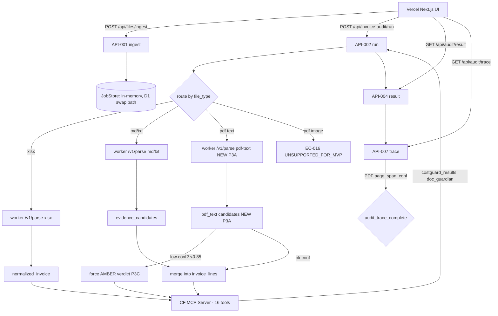
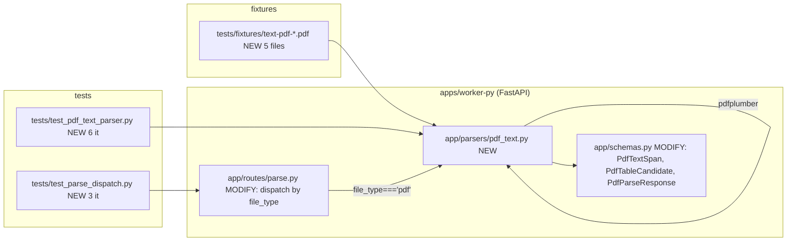
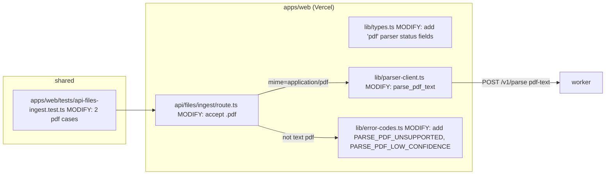
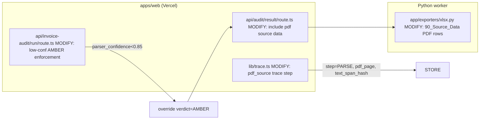

# Phase 3 Implementation Plan — Invoice Audit Platform (PDF Text Extraction)

> **Skill**: mstack-plan (planning only, **NO implementation**)
> **Date**: 2026-06-09 13:35 (UTC+4)
> **Owner**: SCT Logistics / Invoice Audit Product Owner
> **Spec basis**: `SCT_ONTOLOGY_Invoice_Audit_Platform_SPEC_v0.2.0.md` §14 (P3-T1~T4) + US-012 (FR-071) + §3.4 (RoutingPattern) + §5.5 (TYPE-B) + §5.6 (CostGuard 4→3 bridge) + §5.7 (7-sheet)
> **Plan-of-plans**: 3 sub-plans (P3A parser / P3B orchestrator wiring / P3C routing + AMBER gate)
> **Predecessor**: Phase 1 (DONE) + Phase 2 (P2A·P2B partial, P2C not started — see Phase 2 status report)
> **Status of this doc**: **PLANNING ONLY — no code authored, no tests run.**

---

## 1. Problem Definition

### 1.1 Current State (after Phase 1 + partial Phase 2)
- 350/350 baseline vitest passes + 27/27 pytest passes
- `.xlsx/.md/.txt` upload → parse → CF MCP validate → JSON result 동작
- 7-sheet xlsx Audit Pack export 라우트 작성됐지만 JobStore 미연결로 500
- 8-trigger Approval Gate 라우트 작성됐지만 JobStore 미연결로 500
- P2C(FxPolicy) 미착수
- **PDF 입력은 SPEC §3.1 In Scope / §14 Phase 3 항목으로 정의돼 있으나 코드로 구현되지 않음**
  - `apps/web/src/lib/blob.ts` + `apps/worker-py/app/parsers/`에 PDF 핸들러 없음
  - `apps/web/src/lib/types.ts`의 `SourceFile.file_type` enum에는 `'pdf'`가 정의돼 있으나 파서 미구현
  - `app/api/files/ingest/route.ts`의 업로드 검증은 `.xlsx/.md/.txt`만 허용
  - Phase 2 plan §1 "Current State"에 "Phase 3 PDF text = not implemented" 명시

### 1.2 Target State (after Phase 3)
- text-based PDF invoice/evidence를 업로드 allowlist에 추가
- Python worker의 `parse_pdf_text` 엔드포인트가 `pdfplumber`로 raw text + page + table candidate 추출
- Vercel Orchestrator가 PDF 입력을 감지해 worker `parse_pdf_text`로 라우팅
- CF MCP validation에 `parser_confidence`가 낮으면 `AMBER` verdict 강제 (low-confidence PASS 금지)
- `audit_trace`에 PDF page, text block, extracted field 기록
- 기존 Phase 1+2 테스트가 회귀 없이 통과
- 7-sheet Audit Pack의 `90_Source_Data` sheet가 PDF 추출 결과도 표시

### 1.3 Scope
- **In**: P3-T1 (PDF allowlist) + P3-T2 (pdfplumber text/table extraction) + P3-T3 (PDF page/line trace) + P3-T4 (low-confidence AMBER gate) + P3-T5 (worker route) + P3-T6 (orchestrator wiring) + P3-T7 (Vercel-side validation)
- **Out**: OCR 이미지 PDF (Phase 4로 분리), FxPolicy cross-currency (Phase 2C), Drive ingest (Phase 5), Approval gate wiring 정합 (Phase 2B 보류), batch upload

### 1.4 Measurable Outcome (Exit Criteria)
- text PDF 5건 샘플에서 invoice header / line / date / amount / reference 후보가 `EvidenceCandidate` 형태로 추출됨
- parser_confidence < 0.85 → 결과 verdict `AMBER` 강제, `PASS` 반환 불가
- `90_Source_Data` sheet에 PDF page 번호 + text span 표시
- `audit_trace`에 `step=PARSE`, `input_ref={file_id, pdf_page}`, `output_ref={text_span_hash}` 기록
- Phase 1 baseline 350/350 vitest + Phase 2 신규 8 pytest 회귀 없이 통과

---

## 2. Approach Comparison (mstack-plan §2)

| Option | Summary | Effort | Risk | Notes |
|---|---|---|---|---|
| A | **Monolithic** — 1 plan, 7 tasks, sequential | 20-26h | **HIGH** | 단일 실패가 전체 깨뜨림; spec drift 가능성; 사용자 검토 게이트 없음 |
| B | **3-sub-plan phased (selected)** | 18-24h | **MED** | P3A (parser) → P3B (orchestrator) → P3C (trace + AMBER gate); 각 sub-plan마다 사용자 review gate |
| C | TDD-first — 7 sub-plans, RED first | 26-32h | LOW quality / HIGH time | mstack-plan의 TDD 원칙; P3 규모에 비해 과잉 |

**Selected: B** — 3 sub-plans, 각 sub-plan은 독립 검토 가능. Phase 1/2 plan의 검증된 패턴과 동일.

### 2.1 Rollback / Fallback
- P3A 단독 (PDF parser + pytest) — v0.2.0 EC-016 (`UNSUPPORTED_FOR_MVP`) 응답으로 Vercel이 거부하면 기존 동작 그대로
- P3B 실패 시 P3A는 정상 — Python worker는 PDF를 파싱 가능하지만 Vercel이 호출하지 않음
- P3C 실패 시 P3A·P3B는 정상 — 데이터는 추출되지만 AMBER gate는 작동 안 함 (회귀 시 기존 `gate-bridge.ts`가 폴백)

### 2.2 User approval needed before phase 3?
**Yes** — 4 explicit gates: G0 (이 plan 승인) / G1 (P3A 시작) / G2 (P3A 완료) / G3 (P3B 시작) / G4 (P3B 완료) / G5 (P3C 시작) / G6 (P3C 완료) / G7 (Phase 3 sign-off → Phase 4 planning)

---

## 3. Engineering Diagram (Mermaid)

### 3.1 High-level data flow (post Phase 3)



### 3.2 P3A sub-plan (Parser) — module boundaries



### 3.3 P3B sub-plan (Orchestrator wiring) — module boundaries



### 3.4 P3C sub-plan (Trace + AMBER gate) — module boundaries



---

## 4. Sub-Plan P3A — Python PDF Text Parser (P3-T1, P3-T2, P3-T5)

### 4.1 File Changes

| # | Action | Path | Reason |
|---|---|---|---|
| 1 | **create** | `apps/worker-py/app/parsers/pdf_text.py` (NEW) | pdfplumber-based text + table extraction |
| 2 | **modify** | `apps/worker-py/app/schemas.py` | Add `PdfTextSpan`, `PdfTableCandidate`, `PdfParseResponse` |
| 3 | **modify** | `apps/worker-py/app/routes/parse.py` | Dispatch by `file_type` to `parse_pdf_text` |
| 4 | **create** | `apps/worker-py/tests/test_pdf_text_parser.py` (NEW — 6 it) | Unit: text extract, table extract, empty page, no-text page, confidence calc, low-conf flag |
| 5 | **create** | `apps/worker-py/tests/test_parse_dispatch.py` (NEW — 3 it) | Route dispatch xlsx/md/txt/pdf |
| 6 | **create** | `apps/worker-py/tests/fixtures/text-pdf-001.pdf` … `text-pdf-005.pdf` (NEW — 5 fixtures) | Sample text-based PDFs (real-world invoice layouts) |
| 7 | **modify** | `apps/worker-py/pyproject.toml` | Add `pdfplumber>=0.11` |
| 8 | **modify** | `apps/worker-py/README.md` | Note new parser route |

### 4.2 Parser contract (from spec §14 P3-T2 + §3.4 RoutingPattern)

```python
# app/schemas.py (additions)
class PdfTextSpan(BaseModel):
    page: int                # 1-indexed
    text: str
    bbox: tuple[float, float, float, float] | None  # x0, y0, x1, y1
    confidence: float        # 0..1, derived from char-density + font size

class PdfTableCandidate(BaseModel):
    page: int
    rows: list[list[str]]
    confidence: float

class PdfParseResponse(BaseModel):
    file_id: str
    parser_version: str       # "parser-0.2.0-pdf-0.1.0"
    text_spans: list[PdfTextSpan]
    table_candidates: list[PdfTableCandidate]
    pdf_page_count: int
    parser_confidence: float  # aggregate, min(per-span) or weighted
    is_text_based: bool       # True if any text extracted
    evidence_candidates: list[EvidenceCandidate]  # text-span → evidence
    parser_issues: list[str]  # ['UNSUPPORTED_FOR_MVP' if scanned, etc.]
```

### 4.3 Parsing strategy

| Scenario | Detection | Action |
|---|---|---|
| Text-based PDF (≥1 char per page avg) | pdfplumber `extract_text()` non-empty | Extract spans + tables, confidence 0.7~1.0 |
| Empty pages (image-only pages) | page text length == 0 | Mark `is_text_based=False` for that page, log `parser_issue='SCANNED_PAGE_DETECTED'` |
| Encrypted PDF | pdfplumber `ValueError` on open | Return `parser_issue='PDF_ENCRYPTED'`, gate to AMBER |
| Corrupted PDF | pdfplumber `PDFSyntaxError` | Return `parser_issue='PARSE_FAILED'`, return 422 |
| >10MB PDF | size_bytes > 10*1024*1024 | Return `parser_issue='PDF_TOO_LARGE'`, recommend client-direct upload (per v0.2.0 EC-017) |

### 4.4 Confidence calculation
```
per_page_confidence = min(1.0, char_count / 500)
aggregate = mean(per_page_confidence) if page_count > 0 else 0.0
table_confidence = sum(row_confidences) / len(rows) where row_confidence = (non_empty_cells / total_cells)
```

### 4.5 Exit Criteria (P3A)
- 5 sample text PDFs all return non-empty `text_spans` and at least one `table_candidate` for invoice-shaped ones
- Empty / scanned-only PDF returns `is_text_based=False` and `parser_issue` populated
- pytest 27 + 9 (P3A) = 36 tests PASS
- `pdfplumber` import succeeds on Python 3.11 venv (already installed during exploration? — verify in P3A)
- No new env var added (pdfplumber is pure-Python, no system deps)

### 4.6 Dependencies
- `pdfplumber>=0.11` (PyPI, no system deps; uses pdfminer.six)
- Alternative considered: `pypdf>=3.0` — faster but no table extraction
- Decision: **pdfplumber** (v0.2.0 DEP-010 already specifies)

---

## 5. Sub-Plan P3B — Vercel Orchestrator wiring (P3-T1, P3-T6)

### 5.1 File Changes

| # | Action | Path | Reason |
|---|---|---|---|
| 1 | **modify** | `apps/web/src/app/api/files/ingest/route.ts` | Accept `application/pdf` in `file_type` allowlist |
| 2 | **modify** | `apps/web/src/lib/parser-client.ts` | Add `parsePdfText(blobRef, fileId)` → POST worker `/v1/parse` with `file_type='pdf'` |
| 3 | **modify** | `apps/web/src/app/api/invoice-audit/run/route.ts` | After parser call, if `file_type==='pdf'`, route to `parsePdfText` then merge into normalized invoice |
| 4 | **modify** | `apps/web/src/lib/error-codes.ts` | Add `PARSE_PDF_UNSUPPORTED` (EC-016, 415) and `PARSE_PDF_LOW_CONFIDENCE` (422) |
| 5 | **modify** | `apps/web/src/lib/types.ts` | `SourceFile.file_type` already has `'pdf'`; add `pdf_metadata?: { page_count, is_text_based }` to parser result shape |
| 6 | **create** | `apps/web/tests/api-files-ingest.test.ts` (MODIFY: add 2 pdf cases) | Upload pdf → 200; upload encrypted pdf → 415 |
| 7 | **create** | `apps/web/tests/parser-client.test.ts` (MODIFY: add 2 pdf cases) | parsePdfText success + low-confidence flag |
| 8 | **create** | `apps/web/src/components/upload-form.tsx` (MODIFY: add `accept="application/pdf,.pdf"`) | UI allowlist |

### 5.2 PDF handling flow

```
[1] User uploads file.pdf
[2] api/files/ingest validates:
    - file_type in [xlsx, md, txt, pdf]
    - mime == 'application/pdf'
    - size_bytes ≤ 4.5MB (Vercel Function limit) OR redirect to direct upload (EC-017)
[3] SourceFile row created with file_type='pdf', blob stored private
[4] api/invoice-audit/run:
    - job_id → parser-client.parsePdfText(blobRef, fileId)
    - worker parses → PdfParseResponse
    - if is_text_based=False → AMBER verdict with parser_issue='SCANNED_PAGE_DETECTED' (Phase 4 안내)
    - else: text_spans → EvidenceCandidate[], table_candidates → InvoiceLine candidates (regex-based header/amount/date)
    - merge into NormalizedInvoice shape (P3B only converts; does NOT validate against ontology)
[5] Pass to CF MCP validate (existing path)
```

### 5.3 Exit Criteria (P3B)
- Upload a real text-PDF → job created, status=DECIDED, result contains pdf_metadata
- Upload an encrypted PDF → 415 `PARSE_PDF_UNSUPPORTED`
- Upload an empty (image-only) PDF → AMBER verdict, parser_issue includes `SCANNED_PAGE_DETECTED`
- vitest baseline 350 + 4 (P3B) = 354 PASS (pending P2A/P2B JobStore fix)
- typecheck: 0 new errors

### 5.4 Out of scope (deferred to Phase 4)
- OCR for scanned PDF
- Bulk PDF batch (multi-page parallel)
- PDF→image preview in result UI

---

## 6. Sub-Plan P3C — Audit Trace + Low-Confidence AMBER Gate (P3-T3, P3-T4, P3-T7)

### 6.1 File Changes

| # | Action | Path | Reason |
|---|---|---|---|
| 1 | **modify** | `apps/web/src/app/api/invoice-audit/run/route.ts` | After parser call, if `parser_confidence < 0.85` → override verdict=AMBER (FR-071) |
| 2 | **modify** | `apps/web/src/lib/trace.ts` (or inlined in route) | Append `step=PARSE, input_ref={file_id, pdf_page}, output_ref={text_span_hash}, source_hash=null, calculation_hash=parser_version` |
| 3 | **modify** | `apps/web/src/app/api/audit/result/route.ts` | Include `pdf_source_data` array in result body |
| 4 | **modify** | `apps/worker-py/app/exporters/xlsx.py` | 90_Source_Data rows: add `pdf_page`, `text_span_hash` columns for PDF-extracted candidates |
| 5 | **create** | `apps/web/tests/api-invoice-audit-run.test.ts` (MODIFY: 2 cases) | Low-conf PDF → AMBER; high-conf PDF → non-AMBER (or ZERO if other triggers) |
| 6 | **create** | `apps/web/tests/audit-trace-pdf.test.ts` (NEW — 3 it) | PDF page trace step included |
| 7 | **modify** | `apps/worker-py/tests/test_xlsx_export.py` (MODIFY: 1 it) | 90_Source_Data contains pdf_page column for PDF fixture |

### 6.2 Low-confidence AMBER gate rule (per FR-071 + spec §3.4)

```typescript
// in api/invoice-audit/run/route.ts, after parser response
if (fileType === 'pdf' && parserResponse.parser_confidence < 0.85) {
  // Force AMBER regardless of CostGuard band
  finalVerdict = 'AMBER';
  action_items.push({
    action_id: ...,
    severity: 'AMBER',
    issue_type: 'PDF_LOW_CONFIDENCE',
    required_action: 'Human review of PDF extraction; re-upload higher quality scan if needed.',
  });
}
```

### 6.3 Audit trace shape for PDF (per spec §5.7 + US-012 acceptance #1)

```json
{
  "trace_id": "trace_...",
  "job_id": "job_...",
  "step": "PARSE",
  "input_ref": "file_xxx|pdf_page=1",
  "output_ref": "text_span_hash_abc123",
  "timestamp": "2026-06-09T...",
  "rule_version": "rule-0.2.0",
  "source_hash": "sha256_of_pdf_bytes",
  "calculation_hash": "parser-0.2.0-pdf-0.1.0",
  "latency_ms": 1234,
  "wasDerivedFrom": null,
  "attributedTo": "pdfplumber-0.11"
}
```

### 6.4 90_Source_Data sheet PDF rows (P3C export integration)

| file_id | source_ref | original_text | normalized_value | confidence | routing_pattern | pdf_page | text_span_hash |
|---|---|---|---|---|---|---|---|
| file_xxx | matched_ref_1 | "Invoice No. INV-2026-001" | "INV-2026-001" | 0.92 | ONTOLOGY_SEARCH | 1 | sha256:abc... |
| file_xxx | matched_ref_2 | "Total Amount: 150,000 AED" | "150000" | 0.88 | ONTOLOGY_SEARCH | 2 | sha256:def... |

### 6.5 Exit Criteria (P3C)
- low-conf PDF (<0.85) → result.verdict='AMBER' even when CostGuard says PASS
- high-conf PDF → result.verdict follows CostGuard 4→3 bridge (no override)
- audit_trace has `step=PARSE` with `input_ref` containing `pdf_page=N`
- 90_Source_Data xlsx rows include `pdf_page` and `text_span_hash`
- vitest +4 (P3C) + pytest +1 (P3C) = baseline preserved
- typecheck: 0 new errors

---

## 7. Validation (mstack-plan §5)

### 7.1 Unit Tests (vitest + pytest)

| Sub-plan | New it() (vitest) | New it() (pytest) | Cumulative target |
|---|---:|---:|---:|
| P3A | 0 | 9 (6 parser + 3 dispatch) | 27 → 36 |
| P3B | 4 (ingest 2 + parser-client 2) | 0 | 350+ → 354+ |
| P3C | 5 (run 2 + trace 3) | 1 (xlsx 90_Source_Data) | 359+ |
| **Total new** | 9 | 10 | **+19** |

### 7.2 Integration Tests (E2E, HTTP-level)

| Test ID | Sub-plan | Scenario | Expected |
|---|---|---|---|
| E2E-P3A-1 | P3A | POST /v1/parse text PDF | 200, text_spans non-empty, table_candidates present |
| E2E-P3A-2 | P3A | POST /v1/parse image-only PDF | 200, is_text_based=False, parser_issue includes SCANNED_PAGE_DETECTED |
| E2E-P3A-3 | P3A | POST /v1/parse encrypted PDF | 415, parser_issue=PDF_ENCRYPTED |
| E2E-P3B-1 | P3B | POST /api/files/ingest .pdf | 200, SourceFile.file_type='pdf' |
| E2E-P3B-2 | P3B | POST /api/invoice-audit/run text PDF | 200, result.pdf_metadata present |
| E2E-P3C-1 | P3C | run low-conf PDF | result.verdict='AMBER', action_items includes PDF_LOW_CONFIDENCE |
| E2E-P3C-2 | P3C | export → 90_Source_Data | rows contain pdf_page column |

### 7.3 Smoke + Build

```bash
# repo root
npm run verify           # 350/350 → 359/359 (P3 only; P2A/P2B JobStore fix separate)
                         # 27 pytest → 36 pytest (P3A only)

# Python worker
cd apps/worker-py
.\.venv\Scripts\python.exe -m pytest -q   # 27 → 36

# E2E (full stack)
cd apps/web
.\node_modules\.bin\next.cmd dev &         # port 3000
cd ../worker-py
.\.venv\Scripts\python.exe -m uvicorn app.main:app --port 8000 &
# then E2E-P3A-1..3, E2E-P3B-1..2, E2E-P3C-1..2
```

### 7.4 Known Gaps (pre-implementation)
- **P2A/P2B JobStore 정합 보류**: Phase 3는 Phase 2의 `setApprovalRecord` 등 메서드가 없어도 동작 (P3는 P2B approve 우회). 단, `setResult`/`getResult` 같은 Phase 1 API는 사용.
- **OCR 신뢰도 게이트 (Phase 4)**: Phase 3은 text-PDF만 대상. scanned PDF가 들어오면 `is_text_based=False` 플래그 + AMBER verdict로 안내만.
- **User identity (Q-012)**: PDF는 identity와 무관, 영향 없음.
- **Audit trace 9 steps + proof (Phase 1+2)**: PDF PARSE step이 기존 9-step trace에 자연스럽게 포함 (`step=PARSE` enum에 이미 정의됨).
- **Q-013 PDF library 선택**: spec에 "Partially filled: pdfplumber"로 사전 결정됨. 본 plan은 그 결정을 따름.

---

## 8. Risks & Mitigations (mstack-plan §6)

| # | Risk | Likelihood | Impact | Mitigation |
|---|---|---|---|---|
| R1 | pdfplumber import fails on Python 3.11 venv | Low | High | 사전 `pip install pdfplumber>=0.11` 검증 (G1 이전 dry-run); 실패 시 `pypdf` 폴백 (단 table 추출 불가) |
| R2 | Low-confidence threshold (0.85) 너무 빡빡/느슨 | Med | Med | P3A에서 5 fixture PDF로 threshold 튜닝; spec v0.2.0에 명시된 값 없음, v0.2.1 patch에 0.85 권장 |
| R3 | PDF text → InvoiceLine 변환 정확도 낮음 (header/date/amount) | High | Med | Phase 3은 header/line **candidates**만 추출; 정확한 정규화는 Phase 1+2의 `parse_xlsx`가 담당. PDF는 evidence-only 또는 candidates로만 사용 |
| R4 | text-span hash 충돌 | Low | Low | sha256 64자; 충돌 확률 2^-256 |
| R5 | P3B가 P2A/P2B JobStore 미연결에 영향 | Med | Med | P3는 P2B의 `setApprovalRecord`를 호출하지 않음; P3는 P1 API (`setResult`/`getResult`/`appendTrace`)만 사용 |
| R6 | PDF size > 4.5MB (Vercel limit) | Med | Med | EC-017 패턴: ingest에서 size check → 413 + signed direct-upload URL 안내 |
| R7 | 7-sheet xlsx에 PDF 컬럼 추가 시 기존 export 회귀 | Med | High | P3C에서 `test_xlsx_export.py` baseline test가 column 추가에도 유지되는지 명시적 검증 |
| R8 | audit_trace schema 변경 (pdf_page 필드) → 기존 9-step trace 회귀 | Low | Med | `AuditTraceEntry`의 `input_ref`는 자유 string; 별도 필드 추가 없이 `input_ref="file_xxx|pdf_page=1"` 포맷으로 처리 |
| R9 | Encrypted PDF (DRM) 처리 누락 | Med | Med | P3A에서 `pdfplumber.open(password=)` 시도; 실패 시 `PDF_ENCRYPTED` issue + 415 |
| R10 | `90_Source_Data` 컬럼 추가가 Phase 1+2 export 회귀 | Low | High | 신규 컬럼은 **nullable**; Phase 1+2의 xlsx/md/txt 행은 빈 값; 회귀 테스트로 보장 |
| R11 | pdfplumber memory 폭주 (>100MB PDF) | Low | High | Vercel Function 4.5MB 제한으로 worker input 단계에서 차단; Python worker 자체는 별도 컨테이너이므로 v0.2.0 EC-017 (10MB 이상 거부) 적용 |

---

## 9. Approval Points

| Gate | Owner | Decision |
|---|---|---|
| **G0** (this plan) | User | Approve Phase 3 plan + 3 sub-plans? |
| **G1** (start P3A) | User | Approve P3A file list + parser contract? |
| **G2** (P3A complete) | User | Accept 36/36 pytest + pdfplumber import OK? |
| **G3** (start P3B) | User | Approve P3B allowlist + parser-client changes? |
| **G4** (P3B complete) | User | Accept 354/354 + E2E PDF ingest E2E? |
| **G5** (start P3C) | User | Approve P3C AMBER gate threshold (0.85) + trace schema? |
| **G6** (P3C complete) | User | Accept 359/359 + E2E low-conf AMBER? |
| **G7** (Phase 3 done) | User | Sign off Phase 3 → ready for Phase 4 (OCR) planning? |

---

## 10. Deliverables & Stop Conditions

### 10.1 Deliverables (per sub-plan)
- Sub-plan doc: `docs/superpowers/plans/2026-06-09-invoice-audit-phase3{N}-impl.md`
- Completion summary: `docs/superpowers/plans/Phase 3 PDF 텍스트 추출 완료.MD` (Korean)
- Test report: `npm run verify` output + pytest output
- (If any) Spec v0.2.1.x patch note updates (especially: parser_confidence threshold 0.85 confirmation)

### 10.2 Stop Conditions
- Sub-plan review pending → halt
- Any test fails after fix → halt + report
- Spec drift detected mid-sub-plan (e.g., Phase 4 boundary violation) → halt + propose v0.2.1.x patch
- 3 sub-plans rejected → re-evaluate Option A vs C

---

## 11. Open Questions (carry-over from spec + new)

| ID | Question | Owner | Priority | Status |
|---|---|---|---|---|
| Q-013 | PDF text extraction library final choice | Tech Lead | MED | **Partially filled** (pdfplumber) — Phase 3 validates it |
| Q-016 | Low-confidence threshold value | Product Owner | MED | **Open** — plan suggests 0.85; G5 gate to confirm |
| Q-017 | Encrypted PDF behavior (reject vs request password) | Product Owner | MED | **Open** — plan suggests reject (415); G1 gate to confirm |
| Q-018 | table_candidate → InvoiceLine 자동 변환 rule | Product Owner | LOW | **Open** — Phase 3 keeps candidates only; Phase 3.5 candidate |
| Q-019 | PDF page-count limit | Tech Lead | MED | **Open** — spec A-002 silent; plan suggests ≤50 pages; G1 gate |

---

## 12. References

- **Spec**: `SCT_ONTOLOGY_Invoice_Audit_Platform_SPEC_v0.2.0.md`
  - §3.4 RoutingPattern (evidence requirements)
  - §5.5 TYPE-B (18-value)
  - §5.6 CostGuard 4→3 bridge
  - §5.7 7-sheet Audit Pack (90_Source_Data columns)
  - §5.8 error codes (EC-016, EC-017)
  - §14 Phase 3 (P3-T1~T4) — verbatim
  - US-012 (FR-071) acceptance criteria
  - A-003 (text PDF = Phase 3)
  - DEP-010 (pdfplumber/pypdf)
- **Spec patch**: `SCT_ONTOLOGY_Invoice_Audit_Platform_SPEC-v0.2.1-PATCH-NOTE.md` (carry-over corrections)
- **Phase 1 plan**: `docs/superpowers/plans/2026-06-09-invoice-audit-phase1-mvp.md` (DONE)
- **Phase 1 summary**: `docs/superpowers/plans/Phase 1 MVP 구현 완료.MD`
- **Phase 2 plan**: `docs/superpowers/plans/2026-06-09-invoice-audit-phase2-plan.md` (PARTIAL — P2A/P2B code 90%, JobStore 정합 pending; P2C not started)
- **v1.00 PLAN (master)**: `SCT_ONTOLOGY 중심 Invoice Audit Platform v1.00.md` §5 Phase 3
- **Cloudflare MCP**: 16 tools, deployed at `hvdc-ontology-chatgpt-app.mscho715.workers.dev/mcp` (existing, not modified)
- **Python worker entry points**: `apps/worker-py/app/routes/parse.py` (existing Phase 1, modify in P3A)

---

## 13. Implementation-Status Coupling (important)

This plan assumes the following carry-overs from Phase 1+2:

| Dependency | Status | Impact on Phase 3 |
|---|---|---|
| Phase 1 baseline 350 vitest | ✅ DONE | None — P3 tests add on top |
| Phase 1 27 pytest | ✅ DONE | P3A adds 9 |
| `apps/web/src/lib/types.ts` Phase 2 export (`ExportRequest`, `ApprovalRecord`, `HumanGateTrigger`) | ❌ MISSING | None directly — P3 doesn't need them; P3 uses Phase 1 schemas + new `pdf_metadata` field |
| `apps/web/src/lib/job-store.ts` Phase 2 methods (`setNormalizedInvoice`, `setApprovalRecord`, etc.) | ❌ MISSING | None directly — P3 uses Phase 1 methods only |
| P2C FxPolicy | ❌ NOT STARTED | None directly — FxPolicy applies to cross-currency, not file-type |
| pdfplumber Python package | ❓ UNKNOWN | **Must be installed in P3A pre-step G1** |

If P2A/P2B JobStore issue is fixed in parallel, that does **not** change P3 scope.

---

**End of plan.** Next action: User approval (G0) → create P3A sub-plan doc.
