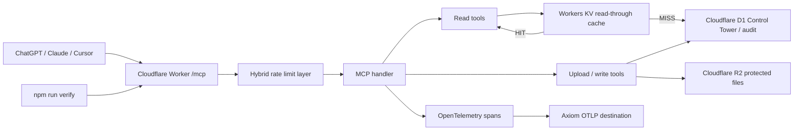

# Design Specification: HVDC MCP Observability, Rate Limit, and KV Cache

Feature ID: `observability-rate-limit-kv-cache`
Created: 2026-05-15
Status: Approved for implementation planning
Owner: HVDC Ontology / MCP maintainer
Input Plan: `20260515_plan-doc.md`
Scope Option: C - spec document only, no implementation in this step

## Summary

### Problem

The HVDC Ontology MCP Worker is already deployed on Cloudflare and exposes the current 15-tool surface. It also has D1-backed Control Tower reads, R2-backed protected file flows, and OpenTelemetry span attributes in code.

The next operating gap is not the tool schema. The gap is production hardening around:

- observability export to an external backend,
- predictable request throttling for `/mcp`,
- read-through caching for repeated D1 Control Tower lookups.

### Current Verified Baseline

- Git branch: `main`
- Current pushed HEAD observed before this spec: `117a2b8`
- Canonical widget resource: `ui://hvdc/answer-card-v8.html`
- Current Worker endpoint: `https://hvdc-ontology-chatgpt-app.mscho715.workers.dev/mcp`
- Current tool surface: 15 MCP tools
- Current test baseline from the latest local verification: 16 test files, 210 tests passed
- Current `wrangler.toml`: `OTEL_ENABLED = "true"`
- Current Worker env type already includes:
  - `OTEL_EXPORTER_OTLP_ENDPOINT`
  - `OTEL_EXPORTER_OTLP_HEADERS`
- Current code does not yet define:
  - `HVDC_CACHE`
  - `RATE_LIMITER`
  - `RATE_LIMITER_IP`
  - `RATE_LIMITER_TOOL`

### Corrections To The Input Plan

The input plan is directionally useful, but the implementation must adjust these points:

1. The test baseline is currently 210 tests, not 209.
2. `ask_hvdc_ontology` should not be described as an internal LLM spend driver unless a direct model/API call is found in code. The verified cost and abuse drivers are D1 reads, Worker CPU, repeated MCP calls, and downstream telemetry/storage.
3. The Worker already uses generic OTLP env names. Prefer keeping `OTEL_EXPORTER_OTLP_ENDPOINT` and `OTEL_EXPORTER_OTLP_HEADERS` instead of adding Axiom-only runtime variables into application code.
4. Axiom setup should be expressed as configuration for the generic OTLP endpoint/header path:
   - endpoint: `https://api.axiom.co/v1/traces`
   - headers: `Authorization=Bearer <token>,X-Axiom-Dataset=<dataset>`
5. Cloudflare API plugin access was not verified in this Codex session because the Cloudflare MCP tool required auth. Resource creation must therefore be done through Wrangler CLI or a logged-in Cloudflare dashboard session.

### Approved Decision

Approved on 2026-05-15:

```text
Application code uses only generic OTLP env names.
Axiom values are injected only through Cloudflare secrets or an observability destination.
Release order is traces-only canary -> rate limit high-threshold canary -> single-read-path KV cache.
```

Implementation implications:

1. Keep `OTEL_EXPORTER_OTLP_ENDPOINT` and `OTEL_EXPORTER_OTLP_HEADERS` as the application runtime contract.
2. Do not add `AXIOM_TOKEN` or `AXIOM_DATASET` to application runtime types.
3. Keep Axiom-specific token and dataset values outside source code.
4. Start with traces export only. Do not enable logs export until redaction and log content are reviewed.
5. Roll out rate limiting with high initial thresholds and fail-open behavior for missing bindings.
6. Start KV caching with one read path, preferably `resolve_any_key`, before extending to MOSB/action reads.

## Goals

- G1: Export existing MCP OTel spans to Axiom or any OTLP-compatible backend without changing MCP tool schemas.
- G2: Add hybrid rate limiting to protect `/mcp` from runaway clients and repeated expensive reads.
- G3: Add a KV read-through cache for selected D1-backed read paths.
- G4: Preserve current ChatGPT Apps widget behavior, especially the v8 answer-card template URI.
- G5: Keep operational failures graceful: telemetry, cache, or rate-limit binding gaps must not break normal reads unless a real limit is exceeded.
- G6: Preserve security boundaries: no raw bearer token, PII, or full user payload in cache keys, span attributes, or logs.

## Non-Goals

- NG1: Do not change the public MCP tool names or schemas.
- NG2: Do not change `ui://hvdc/answer-card-v8.html` in this feature.
- NG3: Do not redesign OAuth, upload, or write approval flows.
- NG4: Do not replace D1 as the source of truth with KV.
- NG5: Do not create Cloudflare resources through unauthenticated API calls.
- NG6: Do not implement the feature in this spec step.

## User Scenarios

### Scenario 1: Operator Sees BLOCK Spikes

An operations lead wants to see when `hvdc.verdict=BLOCK` increases.

Acceptance:

1. Given `OTEL_ENABLED=true` and OTLP secrets are configured, when an MCP tool returns a verdict, then the exported span includes `hvdc.verdict`.
2. Given validation status exists, then the exported span includes `hvdc.validation_status`.
3. Given OTLP is not configured, then the Worker still serves MCP responses and records a clear warning only.

### Scenario 2: Repeated Read Is Throttled

A client or retry loop repeatedly calls `/mcp`.

Acceptance:

1. Given a bearer token is available, rate-limit keys are derived from a token hash, not the raw token.
2. Given no bearer token is available, rate-limit keys fall back to a Cloudflare-provided IP signal.
3. Given a limit is exceeded, the Worker returns a clear rate-limit response with `Retry-After`.
4. Given the rate-limit binding is missing in a local test environment, the Worker fails open and emits a warning.

### Scenario 3: Shipment Lookup Uses KV Cache

A user repeatedly resolves shipment identifiers such as `SCT0001`, `SIM5-2A`, `HE68-1`, or `SEI17-03`.

Acceptance:

1. Given a cache hit, the read path returns cached data without calling D1.
2. Given a cache miss, the read path queries D1 and writes the serialized result to KV with the correct TTL.
3. Given KV fails, the read path falls back to D1 and still returns the answer.
4. Given data is potentially stale, the response contract remains unchanged and cache metadata is exposed only in spans or logs.

## Architecture



## Design Decisions

### D1: Preserve Generic OTLP Configuration

Use the existing generic env names:

- `OTEL_EXPORTER_OTLP_ENDPOINT`
- `OTEL_EXPORTER_OTLP_HEADERS`

Reason: this keeps the Worker portable across Axiom and other OTLP backends.

Axiom-specific values are deployment configuration, not application types.

### D2: Rate-Limit Safely

Use a three-level policy, but implement it in a way that does not consume the MCP request body before the MCP handler needs it.

Recommended order:

1. Apply token/IP limit at the Worker request layer.
2. Apply tool-specific limit inside the MCP tool path where the tool name is already known, or parse only from a cloned request.
3. Never store raw bearer tokens. Use SHA-256 token hash prefixes for keys.

### D3: Cache Only Read-Only Control Tower Paths

Initial cache candidates:

- `resolve_any_key` D1 shipment candidate/report reads
- `check_mosb_gate` D1 milestone/destination reads
- `get_team_actions` D1 action queue reads

Do not cache protected write/upload/dry-run commit flows.

### D4: D1 Remains Source Of Truth

KV is an optimization layer only.

Cache miss path:

```text
KV get -> null
D1 query -> result
KV put(result, ttl)
return result
```

KV failure path:

```text
KV get throws
D1 query -> result
return result
```

## Proposed Interfaces

### Worker Env Additions

```ts
type Env = {
  HVDC_CACHE?: KVNamespace;
  RATE_LIMITER?: RateLimitBinding;
  RATE_LIMITER_IP?: RateLimitBinding;
  RATE_LIMITER_TOOL?: RateLimitBinding;
  RATE_LIMIT_ENABLED?: string;
  CACHE_ENABLED?: string;
};
```

### Cache TTLs

```ts
export const CACHE_TTL = {
  SHIPMENT_REPORT: 1800,
  MILESTONE_EVENTS: 3600,
  ACTION_QUEUE: 1800,
  DESTINATION_REQUIREMENTS: 3600,
  RESOLVED_KEY: 3600,
  REFERENCE_DATA: 604800
} as const;
```

### Cache Helper

```ts
async function cachedD1Query<T>(input: {
  cache?: KVNamespace;
  cacheEnabled: boolean;
  key: string;
  ttl: number;
  load: () => Promise<T>;
  onMetrics?: (result: { hit: boolean; error?: string }) => void;
}): Promise<T>
```

Requirements:

- The helper must accept a loader function rather than raw SQL.
- Cache keys must be canonicalized and must not contain raw tokens or unbounded user text.
- Cache data must be JSON-serializable.
- Cache failure must never block D1 fallback.

### Rate-Limit Helper

```ts
async function enforceRateLimit(input: {
  request: Request;
  env: Env;
  toolName?: string;
}): Promise<Response | null>
```

Requirements:

- Return `null` when the request may continue.
- Return a rate-limit `Response` only when a configured binding denies the request.
- Use a cloned request if body inspection is required.
- Include `Retry-After` where possible.

## OpenAI Apps Compatibility

The MCP app contract must remain stable:

- Keep `_meta.ui.resourceUri` pointing to `ui://hvdc/answer-card-v8.html`.
- Keep `_meta["openai/outputTemplate"]` as the compatibility alias.
- Do not change output templates in this feature.
- Do not add cache/rate-limit internals to user-visible structured output unless a future product spec explicitly requires it.

This follows the Apps SDK guidance that template URIs act as cache keys and should be versioned only when the widget bundle changes.

## Cloudflare Configuration Plan

### Observability

Use Cloudflare Workers OpenTelemetry destination configuration for Axiom where available.

Expected Axiom destination:

- Trace endpoint: `https://api.axiom.co/v1/traces`
- Headers:
  - `Authorization: Bearer <token>`
  - `X-Axiom-Dataset: <dataset>`

If app-level OTLP env secrets are used instead of dashboard destinations, they must map to:

- `OTEL_EXPORTER_OTLP_ENDPOINT`
- `OTEL_EXPORTER_OTLP_HEADERS`

### KV

Add one namespace binding:

```toml
[[kv_namespaces]]
binding = "HVDC_CACHE"
id = "<namespace-id>"
```

The namespace ID must come from Wrangler or the Cloudflare dashboard.

### Rate Limiting

Add Workers Rate Limiting bindings only after confirming the exact Wrangler binding syntax for the installed Wrangler version.

Binding names:

- `RATE_LIMITER`
- `RATE_LIMITER_IP`
- `RATE_LIMITER_TOOL`

The implementation must include local-test bypass behavior for missing bindings.

## Test Plan

### Required Local Tests

- `npm run verify`
- focused rate-limit tests for allow, deny, missing binding, and disabled flag
- focused cache tests for hit, miss, KV get failure, KV put failure, and disabled flag
- telemetry tests proving expected span attributes are still attached

### Required Production Smoke Tests

- `/healthz` returns Worker/D1/R2/controlTower OK.
- ChatGPT connector still lists 15 tools.
- `resolve_any_key` still returns `controlTowerReports`.
- Axiom receives at least one span containing:
  - `mcp.tool.name`
  - `hvdc.verdict` when available
  - `hvdc.validation_status` when available
- A repeated burst receives 429 only after the configured threshold.

## Verification Gates

- VG1: No MCP tool name or schema regression.
- VG2: No widget URI regression from `ui://hvdc/answer-card-v8.html`.
- VG3: Full `npm run verify` passes and test count is not reduced from 210 unless explicitly justified.
- VG4: Cache failure falls back to D1.
- VG5: Rate-limit binding failure in local/dev fails open, not closed.
- VG6: No raw bearer token appears in logs, span attributes, or cache keys.
- VG7: Cloudflare deploy is not attempted until KV namespace and rate-limit bindings are created or feature flags are set to safe values.

## Risks

| Risk | Impact | Mitigation |
| --- | --- | --- |
| Incorrect rate-limit key | Normal user blocked or attacker bypasses limits | Hash bearer token and fallback to Cloudflare IP only |
| Request body consumed before MCP handler | MCP handler fails | Use cloned request or tool-level limit after parsing |
| Stale KV data | Shipment report shows old operational state | Short TTLs for shipment/action data and D1 source-of-truth policy |
| Missing Cloudflare binding | Runtime exception | Optional env bindings and fail-open behavior |
| OTLP secret misconfiguration | Spans not exported | Keep normal MCP response path independent from telemetry export |
| Provider lock-in | Harder to change Axiom later | Keep generic OTLP env/config in code |

## Implementation Slices

### Slice 1: Observability Configuration

Files likely changed:

- `wrangler.toml`
- `server/src/worker.ts`
- `tests/telemetry.test.ts`
- `docs/observability-runbook.md`

Do not proceed until OTLP endpoint/header strategy is confirmed.

### Slice 2: Rate Limit Layer

Files likely changed:

- `server/src/worker.ts`
- `server/src/rate-limit.ts`
- `tests/worker-rate-limit.test.ts`

Do not proceed until exact Wrangler rate-limit binding syntax is verified against the installed Cloudflare/Wrangler docs.

### Slice 3: KV Cache Layer

Files likely changed:

- `server/src/cache.ts`
- `server/src/worker.ts`
- `tests/kv-cache.test.ts`
- `wrangler.toml`

Start with `resolve_any_key` only. Extend to MOSB/action reads after the first cache path is verified.

## Approval Record

The approval question is resolved.

```text
Use generic OTLP env names already present in the Worker
instead of adding Axiom-specific application env names.
```

Decision: yes.
