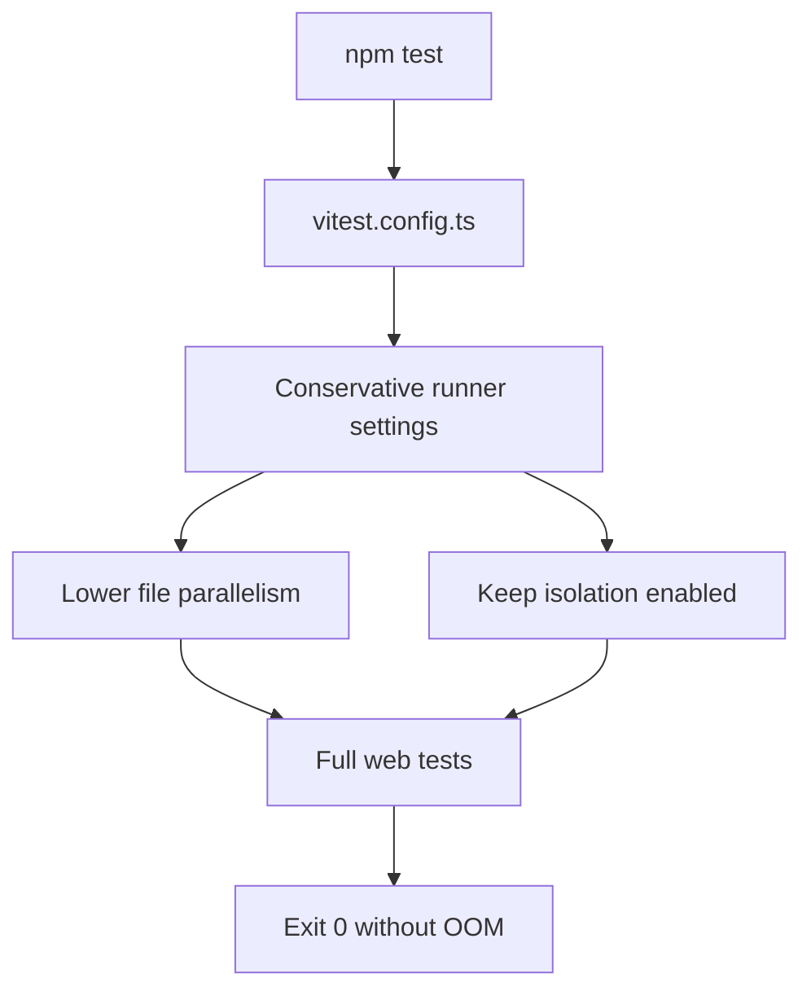

# Vitest OOM Conservative Runner Fix Design

## Context

`apps/web` no longer has assertion failures in `tests/job-store-mcp.test.ts`.

Current result:

- `npm test -- tests/job-store-mcp.test.ts tests/job-store.test.ts`: pass.
- `npm run typecheck`: pass.
- `npm test`: all 90 reported tests pass, but Vitest exits 1 because a worker process hits Node heap OOM.
- `npx vitest run --pool=forks --poolOptions.forks.singleFork`: not acceptable. It changes test isolation enough to make `tests/fx-check.test.ts` fail with shared state.

The remaining problem is therefore runner memory behavior, not the original job-store MCP assertion failure.

## Goal

Make the full `apps/web` Vitest run exit cleanly without weakening test isolation enough to create cross-file state bugs.

## Non-Goals

- Do not change business logic to hide test runner memory pressure.
- Do not disable or skip tests.
- Do not set `isolate: false`.
- Do not merge unrelated test cleanup into this fix.

## Chosen Approach

Use conservative Vitest runner controls in `apps/web/vitest.config.ts`.

Recommended first patch:

- Keep `environment: 'node'`.
- Keep test isolation enabled.
- Set `fileParallelism: false` to reduce simultaneous file loading.
- Set worker count to a small value if supported by the installed Vitest version.
- Avoid `singleFork` / `isolate: false` because that already caused `fx-check` state bleed.

Context7 confirmed Vitest supports memory and parallelism controls such as `fileParallelism`, `pool`, `maxWorkers`, and isolation controls. Because this project uses Vitest 2.1.x, implementation must verify the exact supported option names locally before finalizing.

## Design

## Files

| File | Change |
|------|--------|
| `apps/web/vitest.config.ts` | Add conservative runner settings for memory control. |
| `apps/web/package.json` | Only change if Vitest 2.1.x requires CLI flags instead of config fields. |

## Acceptance Criteria

- `npm run typecheck` exits 0.
- `npm test -- tests/job-store-mcp.test.ts tests/job-store.test.ts` exits 0.
- `npm test` exits 0.
- `tests/fx-check.test.ts` remains passing in the full run.
- No test is skipped.

## Risks

- Some Vitest v4 options from current docs may not exist in Vitest 2.1.x.
  - Mitigation: apply one option at a time and verify with `npm test`.
- Lower parallelism may increase runtime.
  - Mitigation: accept slower runtime if it makes release-gate behavior deterministic.
- Disabling isolation could mask or create state bugs.
  - Mitigation: do not disable isolation in the first patch.

## Review Notes

This design intentionally does not start with `isolate: false` or single fork mode.

Reason: single fork mode already produced a real test failure in `tests/fx-check.test.ts`, so it is not a safe first fix.

## Validation Result

- `npm run typecheck`: PASS.
- `npm test -- tests/job-store-mcp.test.ts tests/job-store.test.ts tests/fx-check.test.ts`: PASS, 3 files and 13 tests passed.
- `npm test`: FAIL, 23 of 24 files and 90 of 99 tests reported as passed, then Vitest exited 1.
- OOM status: still observed. The failing full run ended with `JavaScript heap out of memory` and `Worker exited unexpectedly`.

## Root Cause Patch Validation Result

- Root cause: `scanForDlpViolations()` used `RegExp.exec()` in a loop with patterns that did not always include the global flag, so matching inputs could repeat forever.
- Patch: `src/lib/dlp-scanner.ts` now ensures each scan regex has the global flag before the exec loop and guards against zero-length matches.
- `npm run typecheck`: PASS.
- `npm test -- tests/job-store-mcp.test.ts tests/job-store.test.ts tests/fx-check.test.ts tests/dlp-scanner.test.ts`: PASS, 4 files and 22 tests passed.
- `npm test`: PASS, 24 files and 99 tests passed.
- OOM status: not observed after the root-cause patch.
