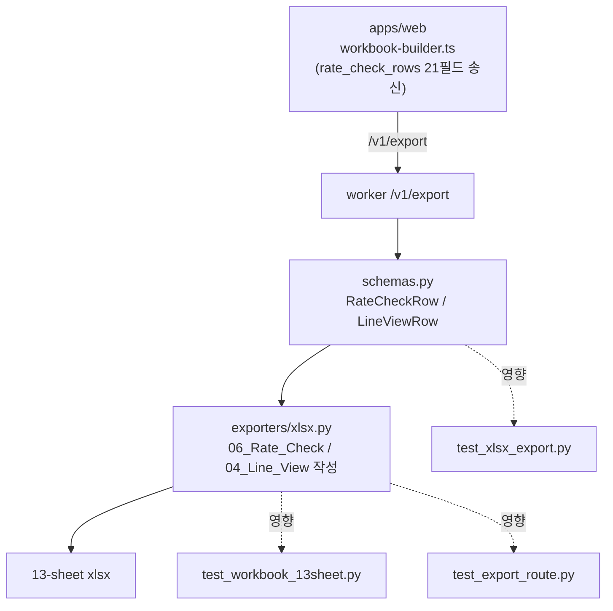

# Plan — 미해결 2건 (2026-06-16)

> 파이프라인: **[plan]** → review → ship → qa → retro
> Scope: ① TASK-006 Wizard 4파일 커밋  ② rate_match 컬럼 워커 익스포터(`xlsx.py`) 노출

---

## Phase 1 — CEO Review (비즈니스)

### 1.1 문제 정의
- **① Wizard 미커밋**: 검증 완료(typecheck 0, 315 tests)된 2단계 업로드 UI가 working tree에만 있음 → opencode가 PR 3.2 마이그레이션을 시작할 베이스가 불안정. 목표: 검증된 작업을 커밋해 베이스 고정.
- **② rate_match 컬럼 미노출**: 웹은 rate_match 검증 결과(rate_type, ai_rate_status, variance 등)를 계산해 워커로 보내지만, 워커 익스포터가 **셀에 안 적음** → 최종 Excel의 `06_Rate_Check`/`04_Line_View`가 구(舊) 컬럼만 표시. `feat/04-06` 브랜치의 본래 목적(rate_match_logic.md 정렬)이 **사용자에게 안 보임**. 영향: 인보이스 감사자가 요율 판정 근거(미스매치/분산/AI 판정)를 Excel에서 못 봄.

### 1.2 제안 옵션

| 옵션 | 설명 | 공수 | 리스크 | 비용 |
|------|------|------|--------|------|
| **A (추천)** | ①즉시 커밋 + ②워커 스키마에 신규 필드 추가 + 익스포터 컬럼 append + 테스트 갱신 + 재배포 | 0.5일 | 낮음(컬럼 append, 기존 위치 불변) | ~0 |
| B | ①커밋만, ②는 보류 | 0.1일 | rate_match 가치 미실현 지속 | 0 |
| C | ②를 웹 직접-워크북 경로로 이관(워커 export 제거) | 3~5일 | 높음(아키텍처 변경, 회귀 위험) | 高 |

### 1.3 추천 & 근거
- **옵션 A.** ②는 이미 데이터가 워커까지 도달(현재 `extra='ignore'`로 수용만)하므로, 스키마 필드 추가 + 컬럼 append만 하면 완성 — 최소 변경으로 feature 가치 실현.
- 기존 컬럼 위치를 바꾸지 않고 **뒤에 append**하여 13-sheet 계약·기존 테스트 영향 최소화.
- **롤백**: 워커 rev 0001N → 직전 rev로 `update-traffic` 1줄 즉시 롤백.

### 1.4 승인 요청
`[ ] Phase 1 승인` — 승인 시 Phase 2 실행. (옵션 A 기준)

---

## Phase 2 — Engineering Review (기술)

### 2.1 아키텍처

### 2.2 파일 변경 목록

| 파일 | 유형 | 설명 |
|------|------|------|
| (git) `upload-form.tsx`, `upload-validation.ts`, `upload-validation.test.ts`, `globals.css` | commit | **①** `feat(upload): 2-step wizard (invoice → evidence)` 커밋 |
| `apps/worker-py/app/schemas.py` | modify | **②** `RateCheckRow`에 신규 10필드 추가(`contract_row_id, unit, scope, type_b, match_eligible, rate_type, ai_rate_status, variance_amount, variance_pct, evidence_status`), 모두 `Optional=None`. `LineViewRow`에 `risk, action: Optional[str]=None`. (`extra='ignore'`는 유지 또는 명시 필드로 전환) |
| `apps/worker-py/app/exporters/xlsx.py` | modify | **②** `06_Rate_Check` `rate_cols`에 신규 10컬럼 **append**(기존 11컬럼 위치 불변) + `row.append([...])` 대응. `04_Line_View` `line_cols`에 `risk, action` append + 대응 |
| `apps/worker-py/tests/test_xlsx_export.py` | modify | 신규 컬럼 헤더/값 단위 테스트 추가·갱신 |
| `apps/worker-py/tests/test_workbook_13sheet.py` | modify | 컬럼 수/헤더 assertion 갱신(13-sheet 순서·이름은 불변) |
| `apps/worker-py/tests/test_export_route.py` | verify | 신규 필드 포함 요청이 200 반환하는지 |

> **충돌 체크**: 모든 대상은 기존 파일 `modify` — 신규 파일 생성 없음. 파일명 충돌 없음.

### 2.3 컬럼 매핑 (06_Rate_Check, append 방식)
기존(불변): `line_id, charge_code, lane, contract_rate, invoiced_rate, rate_basis, effective_from, effective_to, rate_status, delta_pct, severity`
**추가(뒤에)**: `contract_row_id, unit, scope, type_b, match_eligible, rate_type, ai_rate_status, variance_amount, variance_pct, evidence_status`
04_Line_View 추가: 기존 끝에 `risk, action`

### 2.4 의존성 & 순서
1. **① 커밋** (독립, 즉시 가능 — 이미 검증됨)
2. **② schemas.py** 필드 추가 → 3. **xlsx.py** 컬럼 → 4. **테스트 갱신** → 5. `pytest -q` green → 6. **워커 재배포**(`deploy-cloudrun.sh`, rev↑) → 7. prod 종단 재검증(export에 신규 컬럼 확인)
- ②는 `main`에서 새 브랜치(`feat/rate-match-export-columns`) 권장 → 별도 PR.

### 2.5 테스트 전략
- **단위**: `test_xlsx_export.py` — 신규 컬럼 헤더 존재 + 값 매핑(예: `ai_rate_status='MISSING_RATE_NO_AUTO_PASS'`가 해당 셀에).
- **계약**: `test_workbook_13sheet.py` — 시트 13개·순서·이름 불변 확인(컬럼만 증가).
- **통합**: `test_export_route.py` — 21필드 rate_check_row 요청 → 200.
- **회귀 위험**: 컬럼 수를 하드코딩한 assertion이 있으면 깨짐 → 해당 테스트 갱신. 기존 컬럼 위치 불변이라 인덱스 기반 테스트는 안전.
- **prod 검증**: ingest→run→export 후 `06_Rate_Check` 헤더에 신규 컬럼 + ZERO 케이스 값 확인.

### 2.6 리스크 & 완화
- **호환성**: 웹이 보내는 필드명 = 추가하는 스키마 필드명 정확히 일치해야 함 → 본 plan의 필드 목록을 single source로 사용. (웹 `workbook-builder.ts` 415~435 기준)
- **배포**: 재배포 시 `--allow-unauthenticated` 유지(스크립트 이미 수정됨, PR #54 머지). IAM allUsers 확인.
- **롤백**: 직전 워커 rev로 traffic 1줄 롤백. 스키마는 Optional이라 구 익스포터와도 호환.

---

## 파이프라인 연결
승인 시: `①`은 즉시 커밋, `②`는 `/review` 체크리스트 준비 후 구현 → `/qa` → `/ship`(재배포).
